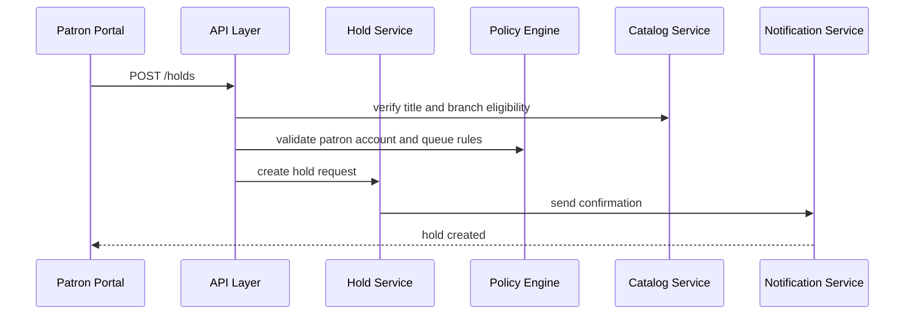
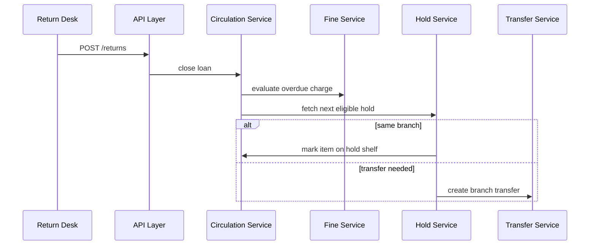

# Sequence Diagram - Library Management System

```mermaid
sequenceDiagram
    participant Patron as Patron Portal
    participant API as API Layer
    participant Holds as Hold Service
    participant Policy as Policy Engine
    participant Catalog as Catalog Service
    participant Notify as Notification Service

    Patron->>API: POST /holds
    API->>Catalog: verify title and branch eligibility
    API->>Policy: validate patron account and queue rules
    API->>Holds: create hold request
    Holds->>Notify: send confirmation
    Notify-->>Patron: hold created
```

## Return to Hold Shelf Sequence

```mermaid
sequenceDiagram
    participant Desk as Return Desk
    participant API as API Layer
    participant Circ as Circulation Service
    participant Fine as Fine Service
    participant Holds as Hold Service
    participant Transfer as Transfer Service

    Desk->>API: POST /returns
    API->>Circ: close loan
    Circ->>Fine: evaluate overdue charge
    Circ->>Holds: fetch next eligible hold
    alt same branch
        Holds->>Circ: mark item on hold shelf
    else transfer needed
        Holds->>Transfer: create branch transfer
    end
```
