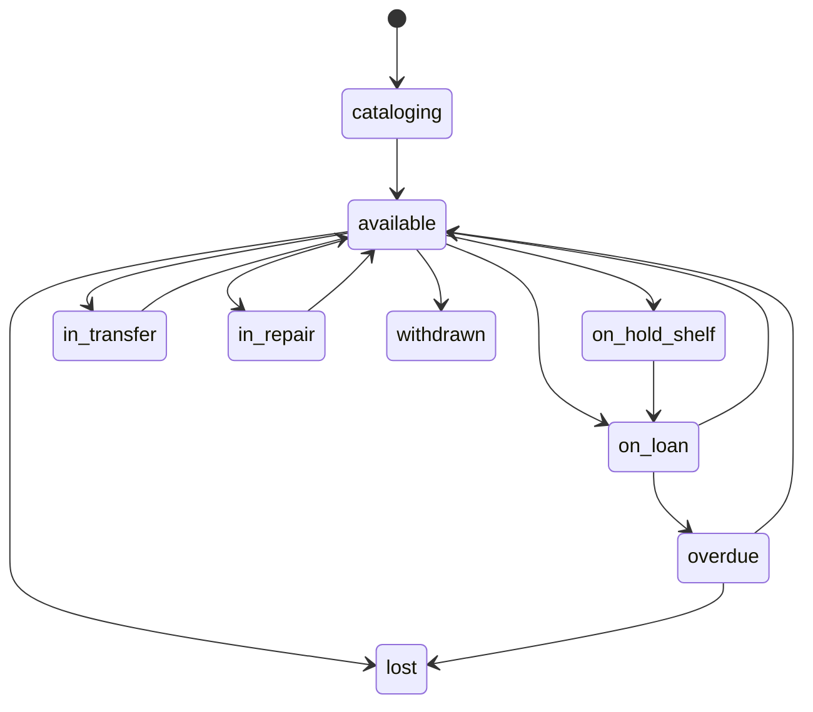
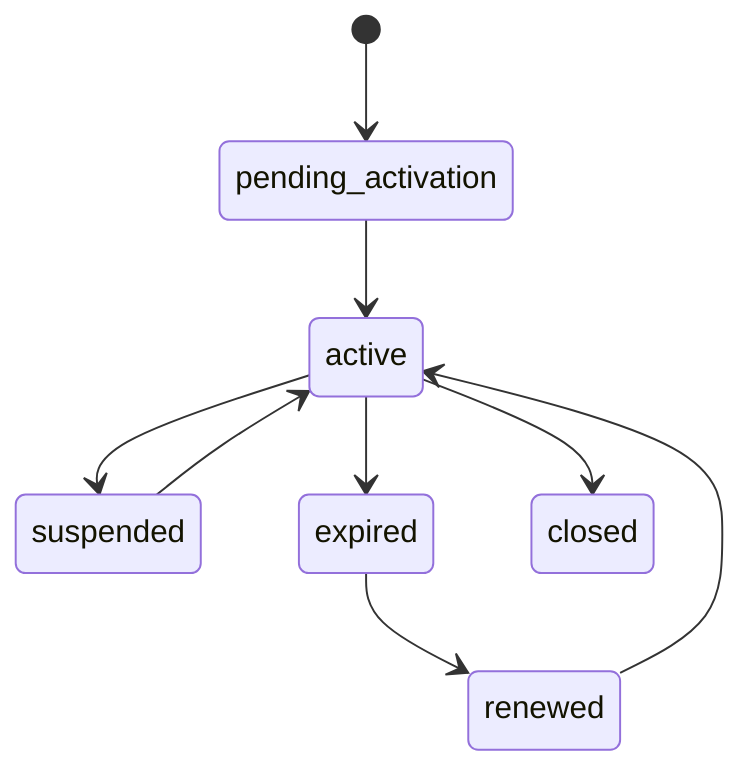

# State Machine Diagram - Library Management System

## Item Copy Lifecycle

```mermaid
stateDiagram-v2
    [*] --> cataloging
    cataloging --> available
    available --> on_loan
    available --> on_hold_shelf
    available --> in_transfer
    available --> in_repair
    on_loan --> overdue
    on_loan --> available
    overdue --> available
    on_hold_shelf --> on_loan
    in_transfer --> available
    in_repair --> available
    available --> lost
    overdue --> lost
    available --> withdrawn
```

## Patron Membership Lifecycle

```mermaid
stateDiagram-v2
    [*] --> pending_activation
    pending_activation --> active
    active --> suspended
    active --> expired
    suspended --> active
    expired --> renewed
    renewed --> active
    active --> closed
```
