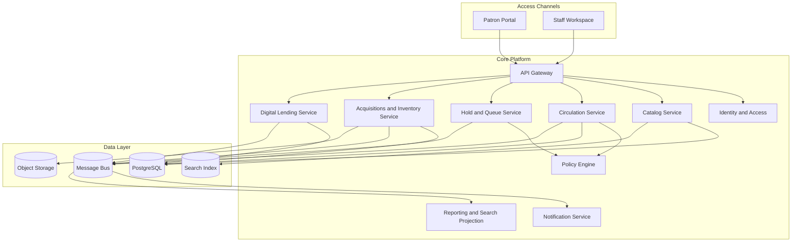

# Architecture Diagram - Library Management System

## Responsibilities

| Component | Responsibility |
|-----------|----------------|
| Catalog Service | Bibliographic records, subjects, copies/items, metadata quality |
| Circulation Service | Issue, return, renew, due dates, status changes |
| Hold and Queue Service | Reservations, pickup windows, waitlists, branch fulfillment |
| Policy Engine | Borrowing rules, holidays, fines, patron eligibility, blocks |
| Acquisitions and Inventory Service | Vendors, orders, receiving, transfers, audits, repairs |
| Digital Lending Service | Licensed digital access and entitlement tracking |
| Reporting and Search Projection | Discovery index, dashboards, trend reporting |
