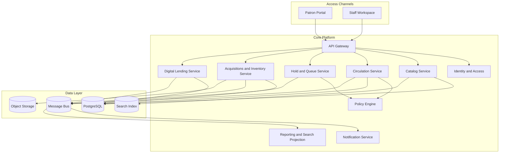

# Architecture Diagram - Library Management System

## Responsibilities

| Component | Responsibility |
|-----------|----------------|
| Catalog Service | Bibliographic records, subjects, copies/items, metadata quality |
| Circulation Service | Issue, return, renew, due dates, status changes |
| Hold and Queue Service | Reservations, pickup windows, waitlists, branch fulfillment |
| Policy Engine | Borrowing rules, holidays, fines, patron eligibility, blocks |
| Acquisitions and Inventory Service | Vendors, orders, receiving, transfers, audits, repairs |
| Digital Lending Service | Licensed digital access and entitlement tracking |
| Reporting and Search Projection | Discovery index, dashboards, trend reporting |

## Borrowing & Reservation Lifecycle, Consistency, Penalties, and Exception Patterns

### Artifact focus: Architecture-level service decomposition

This section is intentionally tailored for this specific document so implementation teams can convert architecture and analysis into build-ready tasks.

### Implementation directives for this artifact
- Map bounded contexts to deployable services and identify data ownership boundaries.
- Document synchronous call chains that are on critical latency path.
- Define async integration patterns for non-critical side effects and analytics.

### Lifecycle controls that must be reflected here
- Borrowing must always enforce policy pre-checks, deterministic copy selection, and atomic loan/copy updates.
- Reservation behavior must define queue ordering, allocation eligibility re-checks, and pickup expiry/no-show outcomes.
- Fine and penalty flows must define accrual formula, cap behavior, and lost/damage adjudication paths.
- Exception handling must define idempotency, conflict semantics, outbox reliability, and operator recovery procedures.

### Traceability requirements
- Every major rule in this document should map to at least one API contract, domain event, or database constraint.
- Include policy decision codes and audit expectations wherever staff override or monetary adjustment is possible.

### Definition of done for this artifact
- Content is specific to this artifact type and not a generic duplicate.
- Rules are testable (unit/integration/contract) and reference concrete data/events/errors.
- Diagram semantics (if present) are consistent with textual constraints and lifecycle behavior.
