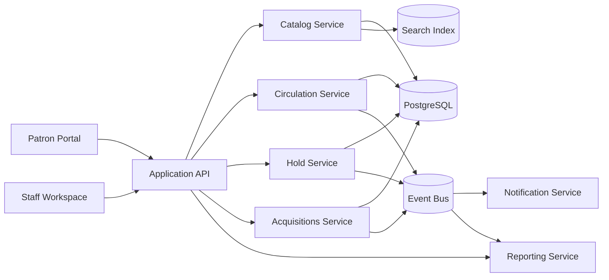

# Data Flow Diagram - Library Management System

## Data Flow Notes

1. Catalog metadata feeds the search index used by the patron portal and staff workspace.
2. Circulation, hold, acquisition, and inventory events feed notifications and reporting asynchronously.
3. Loan and availability states remain authoritative in the transactional store while the search layer provides fast discovery reads.

## Borrowing & Reservation Lifecycle, Consistency, Penalties, and Exception Patterns

### Artifact focus: Data movement and consistency model

This section is intentionally tailored for this specific document so implementation teams can convert architecture and analysis into build-ready tasks.

### Implementation directives for this artifact
- Identify authoritative write stores, derived read models, and replication cadence.
- Define PII and payment-data flow with masking and tokenization points.
- Capture reconciliation loops where asynchronous projections may drift.

### Lifecycle controls that must be reflected here
- Borrowing must always enforce policy pre-checks, deterministic copy selection, and atomic loan/copy updates.
- Reservation behavior must define queue ordering, allocation eligibility re-checks, and pickup expiry/no-show outcomes.
- Fine and penalty flows must define accrual formula, cap behavior, and lost/damage adjudication paths.
- Exception handling must define idempotency, conflict semantics, outbox reliability, and operator recovery procedures.

### Traceability requirements
- Every major rule in this document should map to at least one API contract, domain event, or database constraint.
- Include policy decision codes and audit expectations wherever staff override or monetary adjustment is possible.

### Definition of done for this artifact
- Content is specific to this artifact type and not a generic duplicate.
- Rules are testable (unit/integration/contract) and reference concrete data/events/errors.
- Diagram semantics (if present) are consistent with textual constraints and lifecycle behavior.
