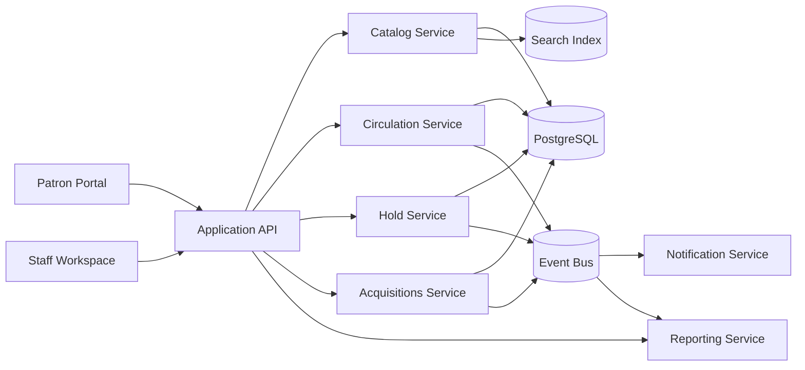

# Data Flow Diagram - Library Management System

## Data Flow Notes

1. Catalog metadata feeds the search index used by the patron portal and staff workspace.
2. Circulation, hold, acquisition, and inventory events feed notifications and reporting asynchronously.
3. Loan and availability states remain authoritative in the transactional store while the search layer provides fast discovery reads.
