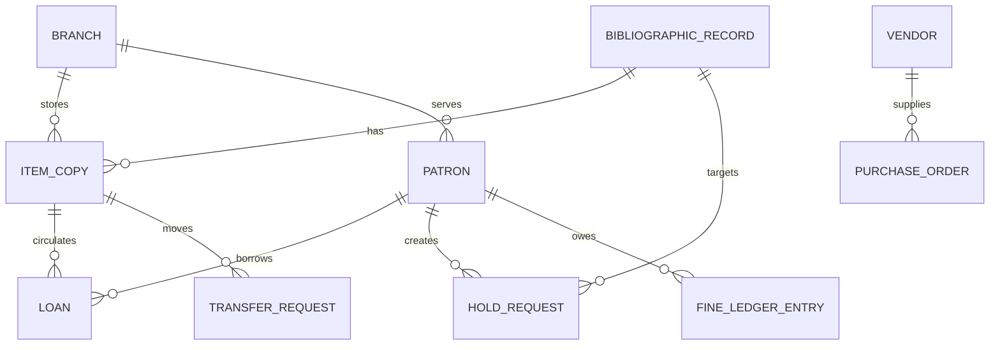

# Domain Model - Library Management System

## Core Domain Areas

| Domain Area | Key Concepts |
|-------------|--------------|
| Identity and Membership | Patron, StaffUser, PatronCategory, Branch |
| Catalog and Inventory | BibliographicRecord, ItemCopy, Subject, Classification, ShelfLocation |
| Circulation | Loan, Renewal, FineLedgerEntry, CirculationPolicy |
| Reservation and Transfer | HoldRequest, PickupWindow, TransferRequest |
| Acquisitions | Vendor, PurchaseOrder, ReceivingRecord, Accession |
| Digital Access | DigitalLicense, DigitalLoan, ProviderAccount |
| Operations | Notification, AuditLog, InventoryAudit |

## Relationship Summary
- A **bibliographic record** may own many item copies and optional digital licenses.
- A **patron** may have many loans, holds, and financial ledger entries.
- Each **item copy** belongs to a branch and moves through circulation, transfer, repair, or audit states.
- **Policies** govern eligibility, fines, queue behavior, and holiday-aware due dates.

## Borrowing & Reservation Lifecycle, Consistency, Penalties, and Exception Patterns

### Artifact focus: Domain boundaries and ubiquitous language

This section is intentionally tailored for this specific document so implementation teams can convert architecture and analysis into build-ready tasks.

### Implementation directives for this artifact
- Define aggregates, entities, value objects, and domain services with invariants.
- Clarify cross-domain references and eventual consistency expectations.
- Provide glossary mappings to eliminate terminology mismatch across teams.

### Lifecycle controls that must be reflected here
- Borrowing must always enforce policy pre-checks, deterministic copy selection, and atomic loan/copy updates.
- Reservation behavior must define queue ordering, allocation eligibility re-checks, and pickup expiry/no-show outcomes.
- Fine and penalty flows must define accrual formula, cap behavior, and lost/damage adjudication paths.
- Exception handling must define idempotency, conflict semantics, outbox reliability, and operator recovery procedures.

### Traceability requirements
- Every major rule in this document should map to at least one API contract, domain event, or database constraint.
- Include policy decision codes and audit expectations wherever staff override or monetary adjustment is possible.

### Definition of done for this artifact
- Content is specific to this artifact type and not a generic duplicate.
- Rules are testable (unit/integration/contract) and reference concrete data/events/errors.
- Diagram semantics (if present) are consistent with textual constraints and lifecycle behavior.
