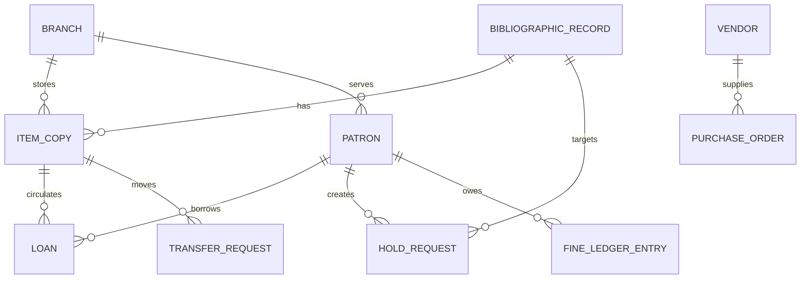

# Domain Model - Library Management System

## Core Domain Areas

| Domain Area | Key Concepts |
|-------------|--------------|
| Identity and Membership | Patron, StaffUser, PatronCategory, Branch |
| Catalog and Inventory | BibliographicRecord, ItemCopy, Subject, Classification, ShelfLocation |
| Circulation | Loan, Renewal, FineLedgerEntry, CirculationPolicy |
| Reservation and Transfer | HoldRequest, PickupWindow, TransferRequest |
| Acquisitions | Vendor, PurchaseOrder, ReceivingRecord, Accession |
| Digital Access | DigitalLicense, DigitalLoan, ProviderAccount |
| Operations | Notification, AuditLog, InventoryAudit |

## Relationship Summary
- A **bibliographic record** may own many item copies and optional digital licenses.
- A **patron** may have many loans, holds, and financial ledger entries.
- Each **item copy** belongs to a branch and moves through circulation, transfer, repair, or audit states.
- **Policies** govern eligibility, fines, queue behavior, and holiday-aware due dates.

