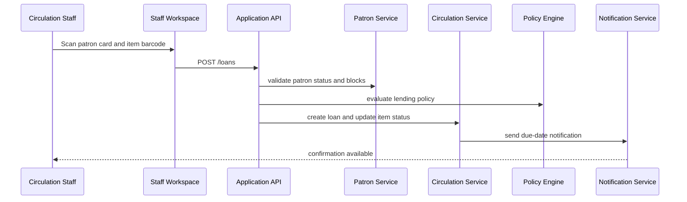
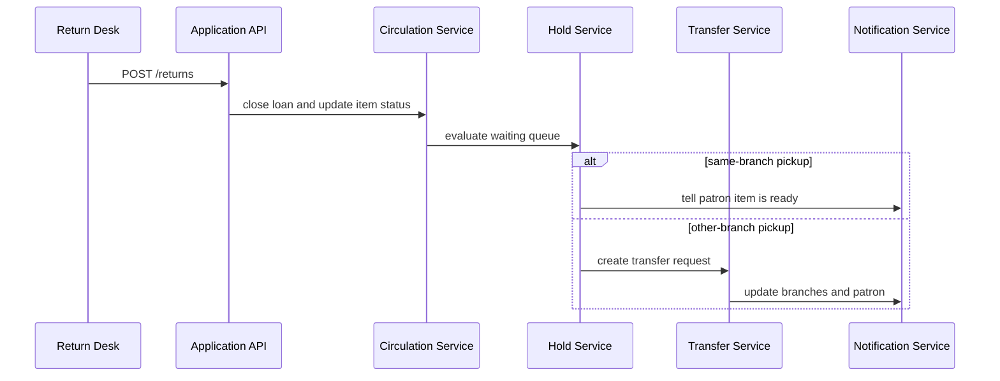

# System Sequence Diagram - Library Management System

## Checkout Flow

```mermaid
sequenceDiagram
    participant Staff as Circulation Staff
    participant UI as Staff Workspace
    participant API as Application API
    participant Patron as Patron Service
    participant Circ as Circulation Service
    participant Policy as Policy Engine
    participant Notify as Notification Service

    Staff->>UI: Scan patron card and item barcode
    UI->>API: POST /loans
    API->>Patron: validate patron status and blocks
    API->>Policy: evaluate lending policy
    API->>Circ: create loan and update item status
    Circ->>Notify: send due-date notification
    Notify-->>Staff: confirmation available
```

## Hold Fulfillment Flow

```mermaid
sequenceDiagram
    participant ReturnDesk as Return Desk
    participant API as Application API
    participant Circ as Circulation Service
    participant Hold as Hold Service
    participant Transfer as Transfer Service
    participant Notify as Notification Service

    ReturnDesk->>API: POST /returns
    API->>Circ: close loan and update item status
    Circ->>Hold: evaluate waiting queue
    alt same-branch pickup
        Hold->>Notify: tell patron item is ready
    else other-branch pickup
        Hold->>Transfer: create transfer request
        Transfer->>Notify: update branches and patron
    end
```
