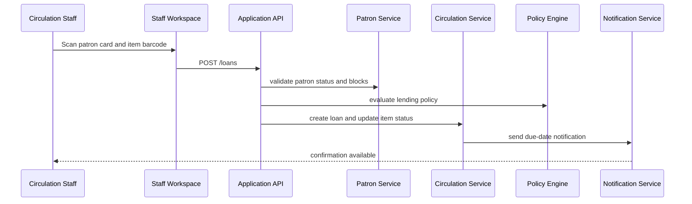
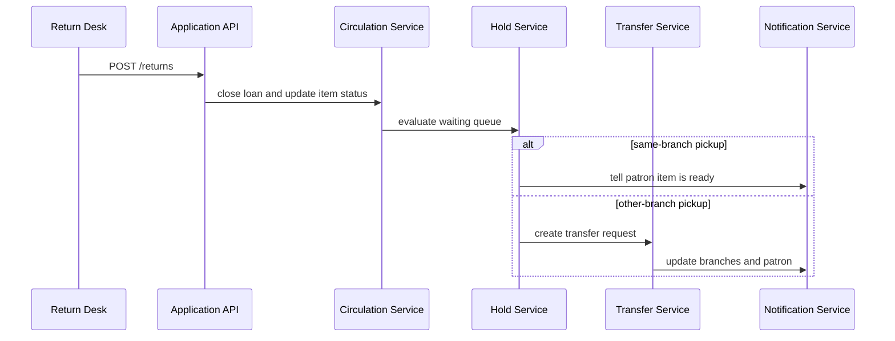
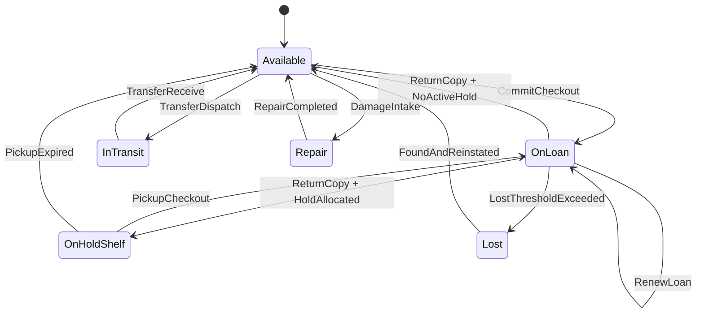

# System Sequence Diagram - Library Management System

## Checkout Flow



## Hold Fulfillment Flow



## Borrowing & Reservation Lifecycle, Consistency, Penalties, and Exception Patterns

### 1) Implementation-Ready Domain Lifecycle

#### 1.1 Borrowing lifecycle with hard gates
| Stage | Command | Required checks (fail-fast) | Atomic writes | Events |
|---|---|---|---|---|
| Discover | `SearchCatalog` | Tenant scope, branch visibility, suppressed record filtering | none | `SearchExecuted` (optional analytics) |
| Loan intent | `BeginCheckout` | Account active, max-loans, unpaid balance threshold, item circulation policy, embargo/recall | checkout session token | `CheckoutStarted` |
| Commit checkout | `CommitCheckout` | copy version unchanged, hold ownership valid, no active conflicting loan | loan row, copy state `OnLoan`, due-policy snapshot, ledger seed | `LoanCreated`, `CopyStateChanged` |
| Mid-loan | `RenewLoan` | renewal limit, hold queue empty or borrower is next hold owner, not recalled | due date revision + policy snapshot delta | `LoanRenewed` |
| Return | `ReturnCopy` | active loan exists and matches copy barcode | loan close, copy state transition, fine recompute, condition assessment | `LoanClosed`, `FineAssessed?`, `CopyStateChanged` |
| Fulfillment | `AllocateHold` | queue non-empty, requester still eligible, pickup branch open-window | hold allocation + pickup expiry + shelf location | `HoldAllocated`, `PickupDeadlineAssigned` |

#### 1.2 Reservation lifecycle (title-level and copy-level)
1. **Place hold** (`PlaceHold`): validate duplicate hold policy + patron eligibility + branch delivery constraints.
2. **Queue rank**: deterministic ordering uses `(priority_lane, created_at, hold_id)` to avoid tie ambiguity.
3. **Eligibility re-check**: at allocation time, rerun account/fine limits and suspension rules.
4. **Pickup phase**: move to `AwaitingPickup`, set `pickup_by`, send notice batch with retry/backoff.
5. **Expiry/no-show**: on expiry, apply no-show strike policy, release copy, trigger next allocation.
6. **Idempotent cancel**: repeated cancel requests return success without duplicate side effects.

### 2) Inventory Consistency Constraints (source-of-truth rules)

#### 2.1 Relational invariants (must be enforceable in DB + service)
- **Exclusive copy state**: each copy has exactly one lifecycle state at any instant.
- **Loan-to-copy cardinality**: `copy.state='OnLoan'` iff exactly one open `loan` exists.
- **Hold allocation uniqueness**: one copy can back only one active pickup allocation.
- **Transfer conservation**: `InTransit` decrement at source must equal increment at destination upon receipt.
- **Soft-delete safety**: withdrawn/lost copies cannot be allocated, renewed, or transferred.

#### 2.2 Suggested persistence constraints
- Unique partial index for open loans: `(copy_id) WHERE closed_at IS NULL`.
- Unique partial index for active hold allocation: `(copy_id) WHERE allocation_status IN ('Allocated','AwaitingPickup')`.
- Check constraint for due dates: `due_at > checked_out_at`.
- Foreign-key + `ON UPDATE RESTRICT` for policy snapshots to preserve historical billing logic.

#### 2.3 Concurrency control
- Use optimistic locking (`row_version`) on `copy`, `loan`, and `hold`.
- Treat version mismatch as retryable conflict (`409 COPY_STATE_CHANGED`).
- Wrap checkout/return/allocation in SERIALIZABLE or explicit `SELECT ... FOR UPDATE` critical sections.

### 3) Fine/Fee/Penalty Computation Rules

#### 3.1 Fine engine contract
```text
fine = min(policy.max_cap,
           max(0, overdue_units - grace_units) * unit_rate)
```
- `overdue_units` must be timezone-aware and calendar-policy aware.
- Closed-day carry rules must be policy-configurable (pause accrual vs continue accrual).
- Fine policy snapshot is immutable per-loan to avoid retroactive disputes.

#### 3.2 Lost/damaged material handling
- **Presumed lost** after `lost_after_days` threshold: post replacement + processing fees.
- **Found after billed**: automatically generate reversing credits according to refund window policy.
- **Damage tiers** (`Minor`, `Moderate`, `Severe`, `Unusable`) map to fixed or bounded fee ranges.

#### 3.3 Patron sanctions
- Restrict checkout when `outstanding_balance >= borrow_block_threshold`.
- Restrict renewals when item is recalled or hold queue length > 0.
- Apply temporary suspension for repeated no-show pickups, waived only with authorized override.

### 4) Exception Handling and Reliability Patterns

#### 4.1 Error taxonomy (machine-readable)
| Code | HTTP | Retry | Meaning |
|---|---:|---|---|
| `COPY_STATE_CHANGED` | 409 | Yes | Copy version changed during command processing |
| `HOLD_NOT_ELIGIBLE` | 422 | No | Patron no longer satisfies hold policy |
| `BORROWING_BLOCKED_BALANCE` | 403 | No | Patron balance exceeds threshold |
| `OUTBOX_PUBLISH_TIMEOUT` | 503 | Yes | Domain write succeeded; event publish pending retry |
| `PAYMENT_PROVIDER_UNAVAILABLE` | 503 | Yes | Fee payment failed due to external outage |

#### 4.2 Transaction + outbox pattern
1. Commit domain state and outbox record in one transaction.
2. Background publisher delivers outbox events with at-least-once guarantees.
3. Consumers enforce idempotency using `event_id` dedupe store.
4. Dead-letter queue receives poison messages after retry budget exhaustion.

#### 4.3 Compensations
- If notification fails after successful allocation, keep allocation state and retry notice (no rollback).
- If payment capture fails during replacement fee flow, mark fee as `PendingPayment` and keep sanctions active.
- Manual overrides require privileged role + mandatory reason code + immutable audit entry.

### 5) API/Workflow Contract Details (implementation checklist)
- Every mutating endpoint must accept `Idempotency-Key` and return prior result on replay.
- Response payloads must include `policy_decision_code` and `policy_snapshot_id` for support traceability.
- Commands must emit correlation IDs propagated to logs, metrics, and event envelopes.
- Retryable errors must include `retry_after_ms` guidance when backoff is appropriate.
- Pagination for holds/loans must be cursor-based (stable ordering by `created_at, id`).

### 6) Operational Readiness Requirements
- **SLOs**: checkout p95 < 300ms, return p95 < 350ms, hold allocation lag < 60s.
- **Reconciliation jobs**: hourly invariant scan for copy-state/loan mismatch and hold-allocation drift.
- **Audit coverage**: all policy overrides, fee waivers, and force-state actions must be tamper-evident.
- **Observability**: metrics for conflict rates, failed compensations, DLQ depth, and fine disputes.
- **Runbooks**: include procedures for replaying outbox events, clearing DLQ, and reversing mistaken fees.

### 7) Security, Compliance, and Privacy Controls
- Enforce least-privilege RBAC for circulation actions and financial adjustments.
- Encrypt patron PII at rest and in transit; tokenize payment references.
- Retain audit events per regulatory schedule; redact PII from long-term analytics streams.
- Record consent and legal basis for notification channels (email/SMS/push).

### 8) Mermaid Lifecycle Reference (for implementers)


### 9) Definition of Done for this documentation area
- Lifecycle states, commands, and transitions are unambiguous and testable.
- Invariants are enforceable in both DB schema and service logic.
- Penalty calculations are deterministic with snapshot-based traceability.
- Failure modes map to explicit error codes, retry semantics, and operator runbooks.
- Mermaid diagrams and textual rules are consistent with each other and with API contracts.

