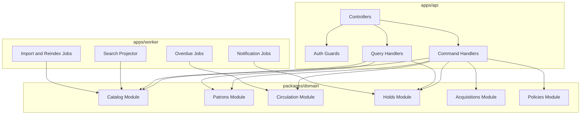

# C4 Code Diagram - Library Management System

```mermaid
flowchart TB
    subgraph api[apps/api]
        controllers[Controllers]
        guards[Auth Guards]
        commands[Command Handlers]
        queries[Query Handlers]
    end

    subgraph domain[packages/domain]
        catalog[Catalog Module]
        patrons[Patrons Module]
        circulation[Circulation Module]
        holds[Holds Module]
        acquisitions[Acquisitions Module]
        policies[Policies Module]
    end

    subgraph worker[apps/worker]
        overdue[Overdue Jobs]
        notifications[Notification Jobs]
        searchProjector[Search Projector]
        imports[Import and Reindex Jobs]
    end

    controllers --> guards
    controllers --> commands
    controllers --> queries
    commands --> catalog
    commands --> patrons
    commands --> circulation
    commands --> holds
    commands --> acquisitions
    commands --> policies
    queries --> catalog
    queries --> patrons
    queries --> holds
    overdue --> circulation
    notifications --> holds
    searchProjector --> catalog
    imports --> catalog
```
