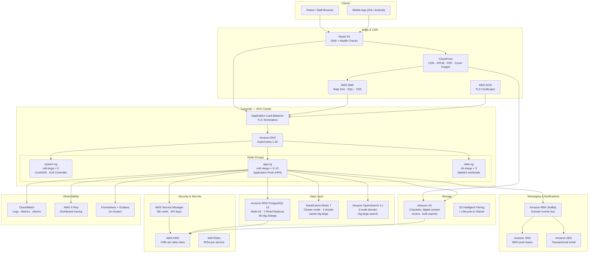

# Cloud Architecture — Library Management System

This document describes the AWS cloud architecture for the Library Management System,
covering all services, their configurations, high-availability design, cost optimisation
strategy, and disaster recovery targets.

---

## Architecture Overview Diagram



---

## AWS Services Reference

| AWS Service               | Purpose                                          | Configuration                                       | HA Strategy                                      |
|---------------------------|--------------------------------------------------|-----------------------------------------------------|--------------------------------------------------|
| Amazon EKS                | Kubernetes control plane + worker nodes          | v1.29, 3 node groups, IRSA enabled                  | Multi-AZ node groups, control plane managed      |
| Amazon RDS PostgreSQL     | Primary transactional database                   | PostgreSQL 15, db.r6g.2xlarge, 500 GiB gp3          | Multi-AZ + 2 read replicas across AZs            |
| Amazon ElastiCache Redis  | Session cache, reservation locks, rate limiting  | Redis 7, cluster mode, 3 shards × 1 replica         | Multi-AZ replica groups, auto-failover           |
| Amazon OpenSearch         | Full-text catalog and member search              | OpenSearch 2.x, 3 nodes, r6g.large.search           | Multi-AZ domain, dedicated master nodes          |
| Amazon S3                 | Digital content, cover images, bulk exports      | Versioning on, SSE-KMS, 3 purpose-specific buckets  | 99.999999999% durability, Cross-region replication |
| Amazon CloudFront         | CDN for EPUB, PDF, cover images                  | 24h default TTL, Origin Access Control, WAF attached| Global edge network, 450+ PoPs                  |
| Amazon MSK (Kafka)        | Domain event bus for async microservice comms    | Kafka 3.5, 3 brokers, MSK Serverless option         | Multi-AZ brokers, replication factor 3           |
| Amazon SES                | Transactional email (checkout, reservation, due) | Production access, DKIM + SPF + DMARC configured    | Dual-endpoint, sending rate 14/s default         |
| Amazon SNS                | SMS notifications for due-date and holds         | Standard topic per notification type                | Multi-AZ managed service                        |
| AWS ALB                   | Ingress for EKS, TLS termination                 | Access logs to S3, connection draining 60s          | Multi-AZ, managed by AWS Load Balancer Controller|
| AWS WAF                   | OWASP protection, rate limiting                  | Attached to ALB + CloudFront, Managed Rule Groups   | Globally distributed, no single point of failure |
| AWS ACM                   | TLS certificate lifecycle management             | Wildcard cert `*.library.example.com`, auto-renew   | Managed renewal, integrated with ALB/CloudFront  |
| AWS Route 53              | DNS, health checks, failover routing             | Alias records, latency routing, failover policy     | Global Anycast DNS, 100% SLA                    |
| AWS KMS                   | Envelope encryption for data at rest             | 1 CMK per data class (DB, S3, Secrets)              | Multi-region key replication available           |
| AWS Secrets Manager       | Store and rotate DB credentials and API keys     | Automatic rotation every 30 days for RDS            | Multi-AZ, encrypted with KMS CMK                |
| AWS CloudWatch            | Logs, metrics, alarms, dashboards                | Log retention 90 days prod / 30 days non-prod       | Managed, regional service                       |
| AWS X-Ray                 | Distributed request tracing                      | Sampling at 5% base, 100% on errors                 | Managed service, integrates with EKS pods        |

---

## EKS Node Groups

| Node Group  | Instance Type   | Min | Max | Use Case                                  | Taints / Labels                          |
|-------------|----------------|-----|-----|-------------------------------------------|------------------------------------------|
| system-ng   | m6i.large       | 2   | 2   | CoreDNS, ALB Ingress Controller, monitoring | `node-role=system`                      |
| app-ng      | m6i.xlarge      | 3   | 10  | All application Deployments               | `node-role=app`                          |
| data-ng     | r6i.xlarge      | 3   | 3   | Memory-optimised stateful workloads       | `node-role=data`, `NoSchedule` on non-data |

---

## Amazon RDS PostgreSQL Configuration

```
Engine:           PostgreSQL 15.4
Instance class:   db.r6g.2xlarge (8 vCPU, 64 GiB RAM)
Storage:          500 GiB gp3, autoscaling to 2 TiB
Multi-AZ:         Enabled (synchronous standby in AZ-b)
Read replicas:    2 × db.r6g.xlarge (catalog reads, report queries)
Backup retention: 7 days automated, final snapshot on deletion
Encryption:       AES-256 via KMS CMK
Parameter group:  max_connections=500, shared_buffers=16GB, work_mem=64MB
Maintenance:      Sunday 03:00–04:00 UTC
```

---

## ElastiCache Redis Cluster Configuration

```
Engine:           Redis 7.2 (ElastiCache)
Cluster mode:     Enabled — 3 shards
Node type:        cache.r6g.large per shard
Replicas:         1 replica per shard (6 total nodes)
Multi-AZ:         Enabled, auto-failover on
Encryption:       In-transit (TLS) + at-rest (KMS)
Eviction policy:  allkeys-lru
Max memory:       13 GiB per node
Use cases:        Session tokens, reservation distributed locks, catalog read cache
```

---

## Amazon S3 Bucket Strategy

| Bucket Name                         | Purpose                              | Lifecycle Policy                          | Encryption      |
|-------------------------------------|--------------------------------------|-------------------------------------------|-----------------|
| library-digital-content-prod        | EPUB, PDF, audio files from OverDrive| Intelligent-Tiering after 30 days         | SSE-KMS (CMK)   |
| library-cover-images-prod           | Book cover images served via CDN     | Standard, no expiry                       | SSE-S3          |
| library-bulk-exports-prod           | CSV/Excel reports, member data export| Expire after 7 days (GDPR compliance)     | SSE-KMS (CMK)   |

All buckets have:
- **Public access block** enabled on all four settings.
- **Versioning** enabled (digital-content and bulk-exports).
- **Object Lock** on digital-content in compliance mode for DRM audit trail.
- **Access logging** to a separate `library-s3-access-logs` bucket.
- **Cross-region replication** to us-west-2 for digital-content bucket (DR).

---

## CloudFront Distribution

```
Origins:
  - S3 (digital-content)  → /ebooks/*, /audio/*   — OAC, signed URLs required
  - S3 (cover-images)     → /covers/*              — OAC, public read cache

Cache behaviours:
  - /ebooks/*    TTL 0 (signed URL per session, no caching at edge)
  - /audio/*     TTL 0 (same as above)
  - /covers/*    TTL 86400 (24 hours, high cache hit ratio)

Security:
  - WAF Web ACL attached
  - HTTPS-only, TLS 1.2 minimum (TLSv1.2_2021 policy)
  - HSTS: max-age=31536000; includeSubDomains

Geographic restrictions: none (global patron access)
Price class: PriceClass_100 (North America + Europe)
```

---

## High Availability Design

### Multi-AZ Coverage

Every stateful component has a standby or replica in a separate AZ:

- **RDS**: Synchronous standby in AZ-b. Automatic failover in < 60 seconds.
- **ElastiCache**: One replica per shard in the alternate AZ. Automatic failover in < 30 seconds.
- **OpenSearch**: 3 nodes spread across 2 AZs, dedicated master node for quorum stability.
- **EKS nodes**: Spread across 2 AZs via `topologySpreadConstraints` on all Deployments.
- **ALB**: Multi-AZ by default; traffic only sent to healthy targets.
- **NAT Gateway**: One per AZ to prevent cross-AZ traffic and eliminate single-AZ dependency.

### Health Checks

- Route 53 health checks poll `https://api.library.example.com/health` every 30 seconds.
- ALB target group health checks poll `/health/ready` on port 8080 every 10 seconds.
- Kubernetes liveness and readiness probes on every pod (see deployment-diagram.md).

---

## Disaster Recovery

| Metric | Target | Mechanism                                                      |
|--------|--------|----------------------------------------------------------------|
| RTO    | 1 hour | RDS Multi-AZ automatic failover + EKS cluster restore from IaC |
| RPO    | 15 minutes | RDS automated backups every 5 min (transaction logs), S3 cross-region replication |

### DR Runbook Summary

1. **Database failure**: RDS promotes standby automatically. Application reconnects via same DNS endpoint. Verify within 5 minutes.
2. **AZ failure**: EKS scheduler reschedules pods to healthy AZ. ALB stops routing to unhealthy targets. ElastiCache and RDS fail over. Expected recovery < 10 minutes.
3. **Region failure**: Route 53 health check fails → failover record activates secondary ALB in us-west-2. S3 cross-region replication ensures digital content is available. RDS must be promoted from read replica in DR region. Expected recovery < 1 hour.
4. **Data corruption**: Restore RDS from automated snapshot (RPO: 5 minutes via PITR). Replay Kafka events to reconstruct state if needed.

---

## Cost Optimisation

| Strategy                               | Estimated Saving | Notes                                                        |
|----------------------------------------|-----------------|--------------------------------------------------------------|
| Reserved Instances (1-year) for RDS    | ~35%            | Cover steady-state db.r6g.2xlarge Primary and replicas       |
| Reserved Instances for ElastiCache     | ~35%            | cache.r6g.large nodes are predictable workload               |
| Compute Savings Plans for EKS nodes    | ~30%            | Applies to m6i, r6i EC2 instances in all node groups         |
| S3 Intelligent-Tiering                 | ~40% on storage | Digital content access pattern is irregular; auto-tiering wins |
| S3 Lifecycle to Glacier for old exports| ~70% on exports | Bulk exports moved to Glacier Instant Retrieval after 7 days |
| CloudFront caching for cover images    | Reduces origin S3 GET cost by ~90% | High cache hit ratio for cover images |
| EKS HPA scale-down during off-peak     | ~25% on compute | Scale app-ng from 10 to 3 nodes during 10pm–6am             |
| MSK Serverless for Kafka               | ~60% vs provisioned | Suitable for variable event throughput in early stages    |
| OpenSearch instance reservations       | ~30%            | 3 × r6g.large.search are steady-state workloads              |

---

## Security Posture

- **Encryption at rest**: All RDS, ElastiCache, S3, and OpenSearch data encrypted with KMS CMKs.
- **Encryption in transit**: TLS 1.2+ everywhere; mTLS between internal services (service mesh).
- **Least privilege IAM**: IRSA (IAM Roles for Service Accounts) per microservice — no shared credentials.
- **Secrets rotation**: AWS Secrets Manager rotates RDS passwords every 30 days automatically.
- **Audit logging**: CloudTrail enabled for all API calls; S3 access logs and ALB access logs stored 90 days.
- **Container image scanning**: Amazon ECR image scanning on push (Critical/High → block deployment in CI).
- **Pod security**: All pods run as non-root with `readOnlyRootFilesystem: true`.
