# Deployment Diagram — Library Management System

This document describes the Kubernetes deployment topology for the Library Management System,
including all workloads, networking, storage, and autoscaling resources.

---

## Kubernetes Resource Overview

```mermaid
flowchart TB
    subgraph Internet["External Traffic"]
        Browser["Patron / Staff Browser"]
        MobileApp["Mobile App"]
    end

    subgraph AWS["AWS Cloud"]
        ALB["AWS ALB\n(TLS Termination)"]

        subgraph EKS["EKS Cluster — library-prod"]

            subgraph IngressNS["Namespace: ingress-nginx"]
                Ingress["Ingress Controller\nnginx"]
            end

            subgraph AppNS["Namespace: library-app"]
                subgraph Services["ClusterIP Services"]
                    SVC_CAT["catalog-svc\n:8080"]
                    SVC_CIR["circulation-svc\n:8080"]
                    SVC_DIG["digital-lending-svc\n:8080"]
                    SVC_RES["reservation-svc\n:8080"]
                    SVC_FIN["fine-svc\n:8080"]
                    SVC_ACQ["acquisition-svc\n:8080"]
                    SVC_NOT["notification-svc\n:8080"]
                    SVC_MEM["member-svc\n:8080"]
                    SVC_RPT["report-svc\n:8080"]
                end

                subgraph Deployments["Deployments"]
                    DEP_CAT["catalog-service\n(3–10 pods)"]
                    DEP_CIR["circulation-service\n(3–10 pods)"]
                    DEP_DIG["digital-lending-service\n(2–6 pods)"]
                    DEP_RES["reservation-service\n(2–8 pods)"]
                    DEP_FIN["fine-service\n(2–6 pods)"]
                    DEP_ACQ["acquisition-service\n(2–4 pods)"]
                    DEP_NOT["notification-service\n(2–6 pods)"]
                    DEP_MEM["member-service\n(3–10 pods)"]
                    DEP_RPT["report-service\n(2–4 pods)"]
                end

                subgraph HPA["HorizontalPodAutoscalers"]
                    HPA_CAT["hpa-catalog"]
                    HPA_CIR["hpa-circulation"]
                    HPA_DIG["hpa-digital-lending"]
                    HPA_RES["hpa-reservation"]
                    HPA_FIN["hpa-fine"]
                    HPA_ACQ["hpa-acquisition"]
                    HPA_NOT["hpa-notification"]
                    HPA_MEM["hpa-member"]
                    HPA_RPT["hpa-report"]
                end

                subgraph Config["ConfigMaps & Secrets"]
                    CM_APP["app-config\nConfigMap"]
                    SEC_DB["db-credentials\nSecret (KMS-encrypted)"]
                    SEC_JWT["jwt-signing-key\nSecret"]
                    SEC_EXT["external-api-keys\nSecret"]
                end
            end

            subgraph DataNS["Namespace: library-data"]
                subgraph StatefulSets["StatefulSets"]
                    SS_PG["postgresql\n(3 pods, primary+replicas)"]
                    SS_RD["redis\n(3 pods, cluster mode)"]
                    SS_ES["elasticsearch\n(3 pods, 1 master + 2 data)"]
                end

                subgraph PVC["PersistentVolumeClaims"]
                    PVC_PG["pvc-postgres-0/1/2\ngp3, 500 Gi each"]
                    PVC_RD["pvc-redis-0/1/2\ngp3, 50 Gi each"]
                    PVC_ES["pvc-es-0/1/2\ngp3, 200 Gi each"]
                end

                subgraph DataSVC["Headless Services"]
                    HSVC_PG["postgresql-headless\n:5432"]
                    HSVC_RD["redis-headless\n:6379"]
                    HSVC_ES["elasticsearch-headless\n:9200"]
                end
            end
        end
    end

    Browser --> ALB
    MobileApp --> ALB
    ALB --> Ingress
    Ingress --> SVC_CAT & SVC_CIR & SVC_DIG & SVC_RES & SVC_FIN & SVC_ACQ & SVC_NOT & SVC_MEM & SVC_RPT
    SVC_CAT --> DEP_CAT
    SVC_CIR --> DEP_CIR
    SVC_DIG --> DEP_DIG
    SVC_RES --> DEP_RES
    SVC_FIN --> DEP_FIN
    SVC_ACQ --> DEP_ACQ
    SVC_NOT --> DEP_NOT
    SVC_MEM --> DEP_MEM
    SVC_RPT --> DEP_RPT
    HPA_CAT -.scales.-> DEP_CAT
    HPA_CIR -.scales.-> DEP_CIR
    HPA_DIG -.scales.-> DEP_DIG
    HPA_RES -.scales.-> DEP_RES
    HPA_FIN -.scales.-> DEP_FIN
    HPA_ACQ -.scales.-> DEP_ACQ
    HPA_NOT -.scales.-> DEP_NOT
    HPA_MEM -.scales.-> DEP_MEM
    HPA_RPT -.scales.-> DEP_RPT
    DEP_CAT & DEP_CIR & DEP_MEM --> HSVC_PG
    DEP_CAT & DEP_RES & DEP_MEM --> HSVC_RD
    DEP_CAT & DEP_RPT --> HSVC_ES
    SS_PG --> PVC_PG
    SS_RD --> PVC_RD
    SS_ES --> PVC_ES
    CM_APP & SEC_DB & SEC_JWT & SEC_EXT -.injected into.-> DEP_CAT & DEP_CIR & DEP_MEM
```



---

## Kubernetes Manifest Snippets

### circulation-service Deployment

```yaml
apiVersion: apps/v1
kind: Deployment
metadata:
  name: circulation-service
  namespace: library-app
  labels:
    app: circulation-service
    version: "1.0.0"
    component: backend
spec:
  replicas: 3
  selector:
    matchLabels:
      app: circulation-service
  strategy:
    type: RollingUpdate
    rollingUpdate:
      maxSurge: 1
      maxUnavailable: 0
  template:
    metadata:
      labels:
        app: circulation-service
        version: "1.0.0"
      annotations:
        prometheus.io/scrape: "true"
        prometheus.io/port: "9090"
        prometheus.io/path: "/metrics"
    spec:
      serviceAccountName: circulation-service-sa
      terminationGracePeriodSeconds: 60
      topologySpreadConstraints:
        - maxSkew: 1
          topologyKey: topology.kubernetes.io/zone
          whenUnsatisfiable: DoNotSchedule
          labelSelector:
            matchLabels:
              app: circulation-service
      containers:
        - name: circulation-service
          image: 123456789.dkr.ecr.us-east-1.amazonaws.com/circulation-service:1.0.0
          imagePullPolicy: Always
          ports:
            - name: http
              containerPort: 8080
            - name: metrics
              containerPort: 9090
          envFrom:
            - configMapRef:
                name: app-config
          env:
            - name: DB_HOST
              valueFrom:
                secretKeyRef:
                  name: db-credentials
                  key: host
            - name: DB_PASSWORD
              valueFrom:
                secretKeyRef:
                  name: db-credentials
                  key: password
            - name: JWT_SECRET
              valueFrom:
                secretKeyRef:
                  name: jwt-signing-key
                  key: secret
          resources:
            requests:
              cpu: "250m"
              memory: "256Mi"
            limits:
              cpu: "1000m"
              memory: "512Mi"
          readinessProbe:
            httpGet:
              path: /health/ready
              port: 8080
            initialDelaySeconds: 10
            periodSeconds: 10
            failureThreshold: 3
          livenessProbe:
            httpGet:
              path: /health/live
              port: 8080
            initialDelaySeconds: 30
            periodSeconds: 20
            failureThreshold: 3
          lifecycle:
            preStop:
              exec:
                command: ["/bin/sh", "-c", "sleep 10"]
          securityContext:
            runAsNonRoot: true
            runAsUser: 1000
            allowPrivilegeEscalation: false
            readOnlyRootFilesystem: true
      affinity:
        podAntiAffinity:
          preferredDuringSchedulingIgnoredDuringExecution:
            - weight: 100
              podAffinityTerm:
                labelSelector:
                  matchLabels:
                    app: circulation-service
                topologyKey: kubernetes.io/hostname
```

---

### circulation-service Service

```yaml
apiVersion: v1
kind: Service
metadata:
  name: circulation-svc
  namespace: library-app
  labels:
    app: circulation-service
spec:
  type: ClusterIP
  selector:
    app: circulation-service
  ports:
    - name: http
      port: 8080
      targetPort: 8080
      protocol: TCP
    - name: metrics
      port: 9090
      targetPort: 9090
      protocol: TCP
```

---

### HorizontalPodAutoscaler — circulation-service

```yaml
apiVersion: autoscaling/v2
kind: HorizontalPodAutoscaler
metadata:
  name: hpa-circulation
  namespace: library-app
spec:
  scaleTargetRef:
    apiVersion: apps/v1
    kind: Deployment
    name: circulation-service
  minReplicas: 3
  maxReplicas: 10
  metrics:
    - type: Resource
      resource:
        name: cpu
        target:
          type: Utilization
          averageUtilization: 65
    - type: Resource
      resource:
        name: memory
        target:
          type: Utilization
          averageUtilization: 75
  behavior:
    scaleUp:
      stabilizationWindowSeconds: 60
      policies:
        - type: Pods
          value: 2
          periodSeconds: 60
    scaleDown:
      stabilizationWindowSeconds: 300
      policies:
        - type: Pods
          value: 1
          periodSeconds: 120
```

---

### PostgreSQL StatefulSet (Simplified)

```yaml
apiVersion: apps/v1
kind: StatefulSet
metadata:
  name: postgresql
  namespace: library-data
spec:
  serviceName: postgresql-headless
  replicas: 3
  selector:
    matchLabels:
      app: postgresql
  template:
    metadata:
      labels:
        app: postgresql
    spec:
      containers:
        - name: postgresql
          image: postgres:15.4
          ports:
            - containerPort: 5432
          env:
            - name: POSTGRES_DB
              value: library_db
            - name: POSTGRES_USER
              valueFrom:
                secretKeyRef:
                  name: db-credentials
                  key: username
            - name: POSTGRES_PASSWORD
              valueFrom:
                secretKeyRef:
                  name: db-credentials
                  key: password
            - name: PGDATA
              value: /var/lib/postgresql/data/pgdata
          resources:
            requests:
              cpu: "500m"
              memory: "1Gi"
            limits:
              cpu: "2000m"
              memory: "4Gi"
          volumeMounts:
            - name: postgres-data
              mountPath: /var/lib/postgresql/data
          readinessProbe:
            exec:
              command: ["pg_isready", "-U", "$(POSTGRES_USER)", "-d", "$(POSTGRES_DB)"]
            initialDelaySeconds: 15
            periodSeconds: 10
  volumeClaimTemplates:
    - metadata:
        name: postgres-data
      spec:
        accessModes: ["ReadWriteOnce"]
        storageClassName: gp3
        resources:
          requests:
            storage: 500Gi
```

---

## Resource Allocation Table

| Service                  | Min Replicas | Max Replicas | CPU Request | CPU Limit | Memory Request | Memory Limit | HPA Min | HPA Max |
|--------------------------|-------------|-------------|-------------|-----------|----------------|--------------|---------|---------|
| catalog-service          | 3           | 10          | 250m        | 1000m     | 256Mi          | 512Mi        | 3       | 10      |
| circulation-service      | 3           | 10          | 250m        | 1000m     | 256Mi          | 512Mi        | 3       | 10      |
| digital-lending-service  | 2           | 6           | 250m        | 1000m     | 256Mi          | 512Mi        | 2       | 6       |
| reservation-service      | 2           | 8           | 200m        | 800m      | 256Mi          | 512Mi        | 2       | 8       |
| fine-service             | 2           | 6           | 200m        | 800m      | 256Mi          | 512Mi        | 2       | 6       |
| acquisition-service      | 2           | 4           | 200m        | 800m      | 256Mi          | 512Mi        | 2       | 4       |
| notification-service     | 2           | 6           | 150m        | 600m      | 128Mi          | 256Mi        | 2       | 6       |
| member-service           | 3           | 10          | 250m        | 1000m     | 256Mi          | 512Mi        | 3       | 10      |
| report-service           | 2           | 4           | 500m        | 2000m     | 512Mi          | 1Gi          | 2       | 4       |
| postgresql (StatefulSet) | 3           | 3           | 500m        | 2000m     | 1Gi            | 4Gi          | N/A     | N/A     |
| redis (StatefulSet)      | 3           | 3           | 100m        | 500m      | 256Mi          | 1Gi          | N/A     | N/A     |
| elasticsearch (SS)       | 3           | 3           | 1000m       | 2000m     | 2Gi            | 4Gi          | N/A     | N/A     |

---

## Namespace Strategy

| Namespace      | Contents                                           | Network Policy          |
|----------------|----------------------------------------------------|-------------------------|
| ingress-nginx  | NGINX Ingress Controller, LoadBalancer Service     | Allow 443 from internet |
| library-app    | All application Deployments, Services, HPAs        | Allow intra-namespace   |
| library-data   | PostgreSQL, Redis, Elasticsearch StatefulSets      | Allow only from app NS  |
| monitoring     | Prometheus, Grafana, AlertManager                  | Allow scrape from all   |

---

## Storage Classes

| Storage Class | Provisioner           | Volume Type | IOPS   | Use Case            |
|---------------|-----------------------|-------------|--------|---------------------|
| gp3           | ebs.csi.aws.com       | gp3 EBS     | 3,000  | PostgreSQL, Redis   |
| gp3-high-iops | ebs.csi.aws.com       | gp3 EBS     | 16,000 | Elasticsearch       |
| efs-sc        | efs.csi.aws.com       | EFS         | Burst  | Shared config files |
