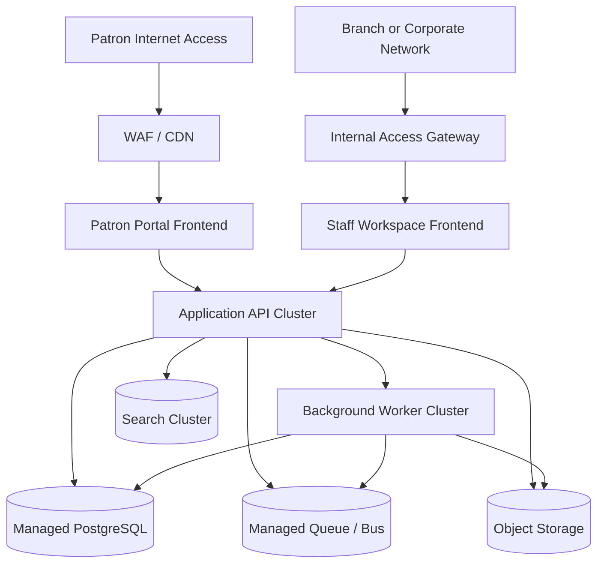

# Deployment Diagram - Library Management System

## Deployment Notes
- Patron and staff interfaces are separated at the edge even when they share backend services.
- Background workers handle notifications, fine assessment jobs, search projection, and batch inventory tasks.
- Search infrastructure should be isolated from primary write workloads to preserve transaction stability.
