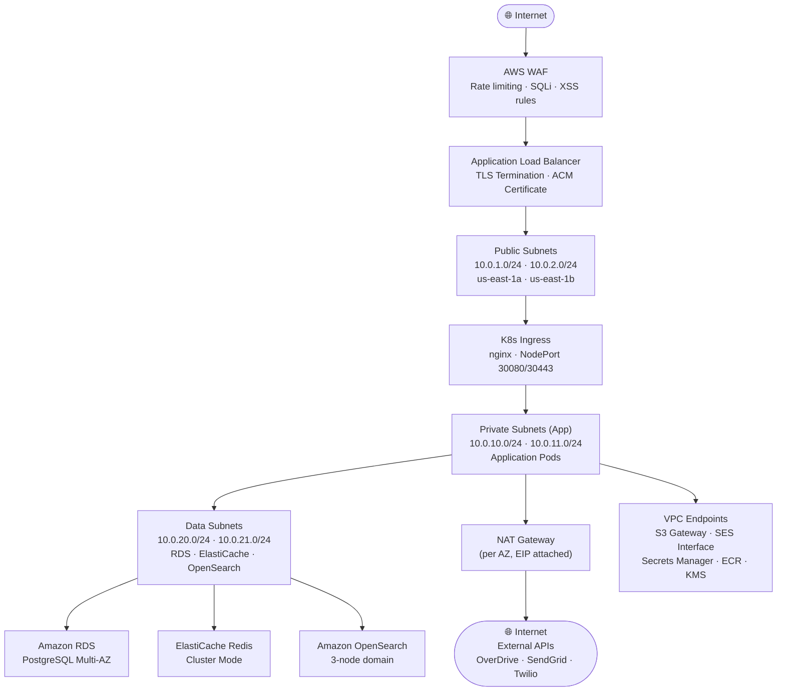

# Network Infrastructure — Library Management System

This document describes the VPC design, subnet layout, security controls, DNS configuration,
and firewall rules for the Library Management System deployed on AWS.

---

## Network Topology Diagram

---

## VPC Design

### CIDR Allocation

| Resource             | CIDR Block         | Notes                                      |
|----------------------|--------------------|--------------------------------------------|
| VPC                  | 10.0.0.0/16        | 65,536 addresses, single region            |
| Public Subnet (AZ-a) | 10.0.1.0/24        | ALB, NAT Gateway, Bastion (if needed)      |
| Public Subnet (AZ-b) | 10.0.2.0/24        | ALB, NAT Gateway (AZ redundancy)           |
| Private App (AZ-a)   | 10.0.10.0/24       | EKS worker nodes — App node group          |
| Private App (AZ-b)   | 10.0.11.0/24       | EKS worker nodes — App node group          |
| Private Data (AZ-a)  | 10.0.20.0/24       | RDS primary, ElastiCache, OpenSearch       |
| Private Data (AZ-b)  | 10.0.21.0/24       | RDS standby, ElastiCache replica           |
| EKS System (AZ-a)    | 10.0.30.0/24       | System node group (CoreDNS, ALB controller)|
| EKS System (AZ-b)    | 10.0.31.0/24       | System node group (AZ redundancy)          |

### Availability Zones

All subnets are distributed across **us-east-1a** and **us-east-1b** to ensure high availability.
A third AZ (**us-east-1c**) is reserved for future scaling.

---

## Subnet Layout and Purpose

### Public Subnets (10.0.1.0/24, 10.0.2.0/24)

- Host AWS Application Load Balancer (ALB) nodes.
- Host NAT Gateways (one per AZ to avoid cross-AZ traffic charges).
- No application pods run in public subnets.
- Auto-assign public IPv4 is **disabled** — only ALB ENIs have public IPs via EIP.

### Private App Subnets (10.0.10.0/24, 10.0.11.0/24)

- Host EKS worker nodes for all application Deployments.
- No direct internet inbound access.
- Outbound internet access through NAT Gateway (for ECR pulls, external API calls).
- VPC Endpoints reduce NAT bandwidth for S3, ECR, Secrets Manager, and KMS.

### Data Subnets (10.0.20.0/24, 10.0.21.0/24)

- Host RDS PostgreSQL (Multi-AZ), ElastiCache Redis, and Amazon OpenSearch.
- No internet route — fully isolated.
- Accessible only from Private App Subnets via Security Group rules.
- Separate subnet group for RDS and ElastiCache to enforce isolation.

---

## Security Groups

### sg-alb — Application Load Balancer

| Direction | Source / Destination | Port | Protocol | Purpose                         |
|-----------|---------------------|------|----------|---------------------------------|
| Inbound   | 0.0.0.0/0           | 443  | TCP      | HTTPS from internet (patrons)   |
| Inbound   | Corporate CIDR      | 443  | TCP      | HTTPS from staff networks       |
| Outbound  | sg-eks-nodes        | 30080–30443 | TCP | Forward to EKS NodePort      |

### sg-eks-nodes — EKS Worker Nodes

| Direction | Source / Destination | Port       | Protocol | Purpose                             |
|-----------|---------------------|------------|----------|-------------------------------------|
| Inbound   | sg-alb              | 30080–30443| TCP      | ALB to NodePort                     |
| Inbound   | sg-eks-nodes        | All        | All      | Intra-cluster pod communication     |
| Inbound   | sg-eks-control-plane| 443        | TCP      | Kubelet to API server               |
| Outbound  | sg-rds              | 5432       | TCP      | App pods to PostgreSQL              |
| Outbound  | sg-elasticache      | 6379       | TCP      | App pods to Redis                   |
| Outbound  | sg-opensearch       | 443        | TCP      | App pods to OpenSearch              |
| Outbound  | 0.0.0.0/0           | 443        | TCP      | ECR pulls, external API via NAT     |

### sg-rds — Amazon RDS PostgreSQL

| Direction | Source / Destination | Port | Protocol | Purpose                         |
|-----------|---------------------|------|----------|---------------------------------|
| Inbound   | sg-eks-nodes        | 5432 | TCP      | Application services            |
| Inbound   | sg-bastion          | 5432 | TCP      | Database administration (break-glass) |
| Outbound  | (none)              | —    | —        | No outbound rules needed        |

### sg-elasticache — ElastiCache Redis

| Direction | Source / Destination | Port | Protocol | Purpose                         |
|-----------|---------------------|------|----------|---------------------------------|
| Inbound   | sg-eks-nodes        | 6379 | TCP      | Application services            |
| Outbound  | (none)              | —    | —        | No outbound rules needed        |

### sg-opensearch — Amazon OpenSearch

| Direction | Source / Destination | Port | Protocol | Purpose                         |
|-----------|---------------------|------|----------|---------------------------------|
| Inbound   | sg-eks-nodes        | 443  | TCP      | Application search queries      |
| Outbound  | (none)              | —    | —        | No outbound rules needed        |

---

## AWS WAF Configuration

The WAF Web ACL is attached to the ALB and applies the following managed and custom rules:

### Managed Rule Groups

| Rule Group                              | Action | Purpose                                         |
|-----------------------------------------|--------|-------------------------------------------------|
| AWSManagedRulesCommonRuleSet            | Block  | OWASP Top 10 (SQLi, XSS, command injection)     |
| AWSManagedRulesKnownBadInputsRuleSet    | Block  | Log4Shell, Spring4Shell, SSRF patterns          |
| AWSManagedRulesSQLiRuleSet             | Block  | SQL injection vectors                           |
| AWSManagedRulesAmazonIpReputationList  | Block  | Tor, bots, and known bad IPs                    |

### Custom Rules

| Rule Name               | Type          | Threshold   | Action | Purpose                                  |
|-------------------------|---------------|-------------|--------|------------------------------------------|
| RateLimitPerIP          | Rate-based    | 2000 / 5min | Block  | Prevent catalogue scraping and brute force |
| RateLimitLoginEndpoint  | Rate-based    | 20 / 5min   | Block  | Protect `/auth/login` from credential stuffing |
| BlockSuspiciousUriPaths | Regex match   | —           | Block  | Block `/etc/passwd`, `../../`, `.git/`   |
| GeoBlockHighRisk        | Geo match     | —           | Block  | Optionally block regions outside service area |

---

## TLS / ACM Configuration

- All external traffic is HTTPS-only; HTTP (port 80) listeners redirect to HTTPS with `301`.
- TLS certificates are managed by **AWS Certificate Manager (ACM)** — auto-renewed.
- TLS policy: **ELBSecurityPolicy-TLS13-1-2-2021-06** (TLS 1.2 minimum, TLS 1.3 preferred).
- Certificate covers: `library.example.com`, `api.library.example.com`, `*.library.example.com`.
- Internal pod-to-pod communication uses mTLS managed by a service mesh (optional: Istio / Linkerd).

---

## Network ACLs (NACLs)

NACLs provide a stateless second layer of defence. They are intentionally permissive within the
tier to avoid interfering with stateful Security Group rules, but block cross-tier access.

### NACL — Public Subnets

| Rule # | Type       | Source          | Port         | Allow/Deny |
|--------|------------|-----------------|--------------|------------|
| 100    | Inbound    | 0.0.0.0/0       | 443          | ALLOW      |
| 110    | Inbound    | 0.0.0.0/0       | 80           | ALLOW      |
| 120    | Inbound    | 0.0.0.0/0       | 1024–65535   | ALLOW (return traffic) |
| 200    | Outbound   | 0.0.0.0/0       | All          | ALLOW      |
| *      | Inbound    | 0.0.0.0/0       | All          | DENY       |

### NACL — Data Subnets

| Rule # | Type       | Source            | Port         | Allow/Deny |
|--------|------------|-------------------|--------------|------------|
| 100    | Inbound    | 10.0.10.0/23      | 5432         | ALLOW (RDS) |
| 110    | Inbound    | 10.0.10.0/23      | 6379         | ALLOW (Redis) |
| 120    | Inbound    | 10.0.10.0/23      | 443          | ALLOW (OpenSearch) |
| 130    | Inbound    | 10.0.10.0/23      | 1024–65535   | ALLOW (return) |
| 200    | Outbound   | 10.0.10.0/23      | 1024–65535   | ALLOW      |
| *      | Inbound    | 0.0.0.0/0         | All          | DENY       |

---

## VPC Endpoints

VPC Endpoints eliminate NAT Gateway costs for AWS-managed services and prevent that traffic
from traversing the internet.

| Endpoint Name              | Type      | Service                        | Subnets          |
|----------------------------|-----------|--------------------------------|------------------|
| vpce-s3                    | Gateway   | com.amazonaws.us-east-1.s3     | Private App      |
| vpce-ecr-api               | Interface | com.amazonaws.us-east-1.ecr.api | Private App     |
| vpce-ecr-dkr               | Interface | com.amazonaws.us-east-1.ecr.dkr | Private App     |
| vpce-secretsmanager        | Interface | com.amazonaws.us-east-1.secretsmanager | Private App |
| vpce-kms                   | Interface | com.amazonaws.us-east-1.kms    | Private App      |
| vpce-ses                   | Interface | com.amazonaws.us-east-1.email-smtp | Private App  |
| vpce-logs                  | Interface | com.amazonaws.us-east-1.logs   | Private App      |

---

## DNS — Route 53

| Record                        | Type  | Target                                    | TTL  |
|-------------------------------|-------|-------------------------------------------|------|
| library.example.com           | A     | ALB DNS name (Alias)                      | 60s  |
| api.library.example.com       | A     | ALB DNS name (Alias)                      | 60s  |
| content.library.example.com   | CNAME | CloudFront distribution domain            | 300s |
| internal.library.local        | A     | Private hosted zone → internal ALB        | 30s  |

- A **private hosted zone** (`library.local`) is attached to the VPC for internal service discovery.
- Health checks are configured on `api.library.example.com` with a 30-second interval and 3-failure threshold.
- **Failover routing policy** is configured for disaster recovery: primary (us-east-1), secondary (us-west-2).

---

## Consolidated Firewall Rules Summary

| Source                  | Destination             | Port      | Protocol | Purpose                              |
|-------------------------|-------------------------|-----------|----------|--------------------------------------|
| Internet (0.0.0.0/0)    | ALB                     | 443       | TCP      | Patron and staff HTTPS access        |
| Internet (0.0.0.0/0)    | ALB                     | 80        | TCP      | HTTP → HTTPS redirect                |
| ALB                     | EKS Nodes               | 30080–30443 | TCP    | NGINX Ingress NodePort               |
| EKS Nodes               | EKS Nodes               | All       | All      | Intra-cluster pod-to-pod             |
| EKS Nodes               | RDS (sg-rds)            | 5432      | TCP      | PostgreSQL queries                   |
| EKS Nodes               | ElastiCache             | 6379      | TCP      | Redis cache access                   |
| EKS Nodes               | OpenSearch              | 443       | TCP      | Full-text search queries             |
| EKS Nodes               | NAT Gateway             | 443       | TCP      | Outbound HTTPS (external APIs)       |
| EKS Nodes               | VPC Endpoint (S3)       | 443       | TCP      | S3 access without NAT                |
| EKS Nodes               | VPC Endpoint (Secrets)  | 443       | TCP      | Secrets Manager without NAT          |
| Bastion (sg-bastion)    | RDS (sg-rds)            | 5432      | TCP      | Break-glass DBA access               |
| NAT Gateway             | Internet                | 443       | TCP      | OverDrive, SendGrid, Twilio          |
