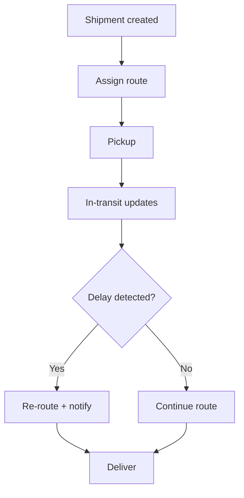

# Activity Diagram

```mermaid
flowchart TD
  A[Shipment created] --> B[Assign route]
  B --> C[Pickup]
  C --> D[In-transit updates]
  D --> E{Delay detected?}
  E -- Yes --> F[Re-route + notify]
  E -- No --> G[Continue route]
  F --> H[Deliver]
  G --> H[Deliver]
```
