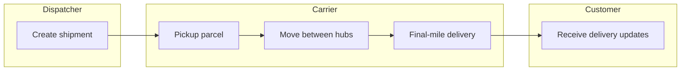

# BPMN Swimlane Diagram

```mermaid
flowchart LR
  subgraph Dispatcher
    A[Create shipment]
  end
  subgraph Carrier
    B[Pickup parcel]
    C[Move between hubs]
    D[Final-mile delivery]
  end
  subgraph Customer
    E[Receive delivery updates]
  end
  A --> B --> C --> D --> E
```
