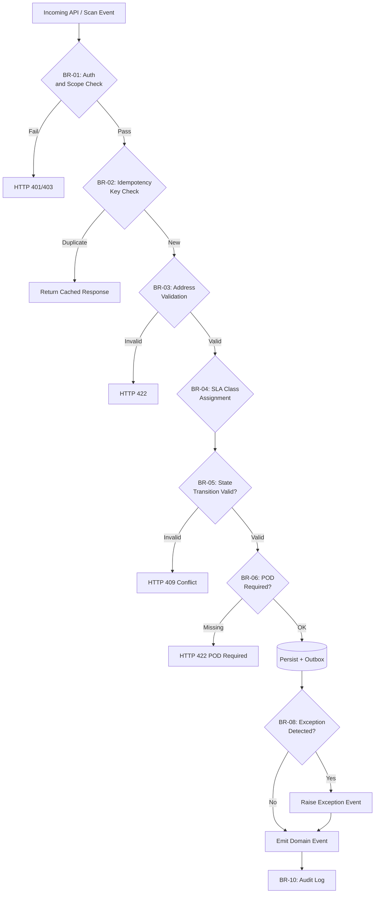

# Business Rules — Logistics Tracking System

**Version:** 1.0  
**Status:** Approved  
**Last Updated:** 2025-01-01  

---

## Table of Contents

1. [Overview](#overview)
2. [Rule Evaluation Pipeline](#rule-evaluation-pipeline)
3. [Enforceable Rules](#enforceable-rules)
4. [Exception and Override Handling](#exception-and-override-handling)
5. [Traceability Table](#traceability-table)

---

## Overview

This document defines the enforceable business rules governing the Logistics Tracking System. Rules are evaluated at ingestion, state-transition, and dispatch stages and are enforced by designated services.

---

## Rule Evaluation Pipeline

---

## Enforceable Rules

### BR-01 — Authentication and Carrier Scope

**Category:** Authentication  
**Enforcer:** API Gateway  

Every scan or shipment API request MUST present a valid carrier API key or platform JWT. Carrier credentials are scoped to their own tenant; a carrier MUST NOT read or mutate shipments belonging to another carrier.

1. Token must be valid and unexpired.
2. Carrier scope must match the target shipment's `carrier_id`.
3. Admin tokens may read all carriers but MUST include audit reason.
4. Partner integration tokens are read-only unless explicitly granted `scan:write`.
5. Rate limit: 1 000 scan events/second per carrier; exceed returns HTTP 429.

---

### BR-02 — Idempotency Key Enforcement

**Category:** Reliability  
**Enforcer:** Shipment Service  

All mutating API calls (create shipment, record scan, update exception) MUST include an `Idempotency-Key` header. The system stores `(carrier_id, route, idempotency_key)` for 48 hours. Duplicate submissions within the window return the original response without re-processing.

---

### BR-03 — Address Validation Before Shipment Confirmation

**Category:** Data Quality  
**Enforcer:** Address Validation Service  

A shipment MUST NOT transition from `Draft` to `Confirmed` until origin and destination addresses pass validation: postal code format, country ISO code, and deliverability score ≥ 0.7. Undeliverable addresses return HTTP 422 with remediation hints.

---

### BR-04 — SLA Class Assignment and Clock

**Category:** Operations  
**Enforcer:** Shipment Service  

Each confirmed shipment MUST have an SLA class (`STANDARD`, `EXPRESS`, `OVERNIGHT`). The SLA clock starts at `Confirmed` state and MUST trigger an alert if the shipment has not reached `OutForDelivery` within 80% of the SLA window without an active exception.

---

### BR-05 — State Transition Guard

**Category:** Lifecycle  
**Enforcer:** State Machine Engine  

Shipment state transitions MUST follow the defined DAG. Invalid transitions (e.g., `Delivered` → `InTransit`) MUST be rejected with HTTP 409. Every valid transition MUST record `actor_id`, `reason`, `occurred_at`, and the resulting state in the `shipment_event` log.

---

### BR-06 — Proof of Delivery (POD) Requirement

**Category:** Operations  
**Enforcer:** Delivery Service  

A shipment MUST NOT transition to `Delivered` without a POD artifact (photo, signature, or OTP confirmation). The POD artifact URL is stored immutably in object storage; the delivery scan API rejects the `Delivered` transition if `pod_artifact_id` is absent.

---

### BR-07 — Missed Pickup Auto-Exception

**Category:** Operations  
**Enforcer:** SLA Monitor  

If a shipment in `PickupScheduled` state has not advanced to `PickedUp` within 2 hours past the scheduled pickup window, the system MUST automatically raise an exception with reason `MISSED_PICKUP` and notify the assigned carrier.

---

### BR-08 — Exception Ownership and SLA

**Category:** Operations  
**Enforcer:** Exception Management Service  

Every open exception MUST have an owner (`carrier_id` or `ops_team_id`) and a resolution ETA. Exceptions without an ETA update for more than 24 hours MUST be escalated. Terminal states (`Delivered`, `ReturnedToSender`, `Cancelled`, `Lost`) MUST resolve all open exceptions before closure.

---

### BR-09 — Chain of Custody Integrity

**Category:** Compliance  
**Enforcer:** Scan Ingestion Service  

Each scan event MUST record `scanner_id`, `location` (GPS or hub code), `timestamp`, and `device_fingerprint`. Custody gaps exceeding 6 hours in `InTransit` state trigger an automated anomaly alert. Chain-of-custody records are immutable once written.

---

### BR-10 — Audit Log Immutability

**Category:** Security & Compliance  
**Enforcer:** Audit Service  

All state transitions, exception events, and administrative overrides MUST be written to the append-only audit log within 2 seconds. Audit records are retained for 7 years and cannot be deleted by application roles.

---

## Exception and Override Handling

Overrides to normal state transitions or SLA rules are permitted only under the following conditions:

- **Authorized override classes:** `CUSTOMER_REQUEST`, `REGULATORY_HOLD`, `FORCE_MAJEURE`, `SYSTEM_CORRECTION`.
- **Override requirements:** approver identity, reason code, expiration timestamp, and reference ticket ID.
- **Dual logging:** every override is written to both the business audit log and the security audit log.
- **Automatic expiry:** override windows expire after 72 hours; expired overrides are flagged for review.
- **Pattern review:** three or more overrides of the same type within 30 days triggers a policy review alert.

---

## Traceability Table

| Rule ID | Rule Name | Related Use Cases | Enforcer Service |
|---------|-----------|-------------------|-----------------|
| BR-01 | Auth and Carrier Scope | UC-001–UC-010 | API Gateway |
| BR-02 | Idempotency Key | UC-003, UC-005 | Shipment Service |
| BR-03 | Address Validation | UC-001 | Address Validation Service |
| BR-04 | SLA Class and Clock | UC-001, UC-006 | Shipment Service, SLA Monitor |
| BR-05 | State Transition Guard | UC-003–UC-007 | State Machine Engine |
| BR-06 | POD Requirement | UC-007 | Delivery Service |
| BR-07 | Missed Pickup Auto-Exception | UC-004 | SLA Monitor |
| BR-08 | Exception Ownership and SLA | UC-008 | Exception Management Service |
| BR-09 | Chain of Custody Integrity | UC-003–UC-007 | Scan Ingestion Service |
| BR-10 | Audit Log Immutability | UC-001–UC-010 | Audit Service |

---

## End-to-End Event Flow (Implementation Ready)
1. **Create and validate shipment**
   - API receives create request with idempotency key.
   - Service validates addresses, SLA class, and regulatory constraints.
   - Transaction writes shipment aggregate + outbox event `shipment.created.v1`.
2. **Plan and pickup**
   - Planning service consumes create event and emits `shipment.pickup_scheduled.v1`.
   - Driver app scan emits `shipment.picked_up.v1` with proof metadata.
3. **Line-haul and hub progression**
   - Every custody scan emits `shipment.location_updated.v1`.
   - Milestone service derives `arrived_at_hub`, `departed_hub`, and ETA recalculation events.
4. **Delivery execution**
   - Route optimizer emits `shipment.out_for_delivery.v1`.
   - Delivery app posts attempt event with POD artifacts.
5. **Exception and recovery**
   - Any failed invariant emits `shipment.exception_detected.v1` with reason code.
   - Resolution workflow emits `shipment.exception_resolved.v1` and resumes normal state path or terminal fallback.
6. **Closure**
   - Terminal events (`delivered`, `returned_to_sender`, `cancelled`, `lost`) trigger settlement, analytics, and archival pipelines.

## Shipment State Machine
| State | Entry Criteria | Allowed Next States | Exit Event | Operational Notes |
|---|---|---|---|---|
| `Draft` | Shipment request created but not committed | `Confirmed`, `Cancelled` | `shipment.confirmed` | No external notifications before confirmation. |
| `Confirmed` | Capacity and address validation passed | `PickupScheduled`, `Cancelled` | `shipment.pickup_scheduled` | SLA clock starts. |
| `PickupScheduled` | Pickup slot assigned | `PickedUp`, `Exception`, `Cancelled` | `shipment.picked_up` | Missed pickup auto-raises exception after threshold. |
| `PickedUp` | Driver/hub scan confirms custody | `InTransit`, `Exception` | `shipment.in_transit` | Chain-of-custody records required. |
| `InTransit` | Shipment moving between hubs/line-haul legs | `OutForDelivery`, `Exception`, `Lost` | `shipment.out_for_delivery` | Telemetry cadence must remain within SLA. |
| `OutForDelivery` | Last-mile run started | `Delivered`, `Exception`, `ReturnedToSender` | `shipment.delivered` | Customer contact window and proof policy enforced. |
| `Exception` | Delay/damage/address/customs issue detected | `InTransit`, `OutForDelivery`, `ReturnedToSender`, `Cancelled`, `Lost` | `shipment.exception_resolved` | Every exception requires owner + ETA to resolution. |
| `Delivered` | Proof of delivery accepted | *(terminal)* | `shipment.closed` | Immutable except audit annotations. |
| `ReturnedToSender` | Return workflow completed | *(terminal)* | `shipment.closed` | Financial settlement rules apply. |
| `Cancelled` | Shipment cancelled prior completion | *(terminal)* | `shipment.closed` | Cancellation reason required for analytics. |
| `Lost` | Investigation concludes unrecoverable loss | *(terminal)* | `shipment.closed` | Claims/compliance path triggered. |

## Integration Retry and Idempotency Specification
- **Publish reliability:** Command-handling transactions persist domain mutations and outbox records atomically; relay workers publish with exponential backoff (`base=500ms`, `factor=2`, `max=5m`) and jitter.
- **Deduping contract:** `event_id` is globally unique; consumers persist `(event_id, consumer_name, processed_at, outcome_hash)` before side-effects.
- **API idempotency:** Mutating endpoints require `Idempotency-Key` and scope keys by `(tenant_id, route, key)`. Duplicate requests return prior status/body.
- **Webhook retries:** 3 fast retries + 8 slow retries with signed payload replay protection; after exhaustion route to DLQ with replay tooling.
- **Replay safety:** Backfills run via replay jobs that mark `replay_batch_id`, disable duplicate notifications/billing, and emit audit events.

## Monitoring, SLOs, and Alerting
### Golden Signals
- Event ingest latency (`scan_received` -> persisted)
- Commit-to-publish latency (outbox record -> broker ack)
- Consumer lag per subscription and partition
- Retry rate, DLQ depth, and redrive success rate
- Shipment state dwell time by state and lane
- Delivery attempt failure ratio and exception aging

### SLO Targets
- P95 scan-to-visibility: **< 60 seconds**
- P95 commit-to-publish: **< 5 seconds**
- P95 exception-detection-to-customer-notification: **< 3 minutes**
- Daily successful redrive from DLQ: **> 99%** within 4 hours

### Alert Policy
- **SEV-1:** publish pipeline stalled > 5 min, broker unavailable, or state transition processor halted.
- **SEV-2:** DLQ growth > threshold for 15 min, ETA model stale > 10 min, webhook failure burst.
- **SEV-3:** schema drift warnings, duplicate event spike, non-critical integration flapping.

### Runbook Minimums
Each alert must link to owning team, dashboard, triage checklist, mitigation steps, replay command, and stakeholder comms template.

## Analysis Acceptance Criteria
- Every business rule is traceable to an event, state transition, or API contract.
- Exceptions include ownership, SLA, and escalation policy.
- Observability requirements are measurable and testable before production release.
