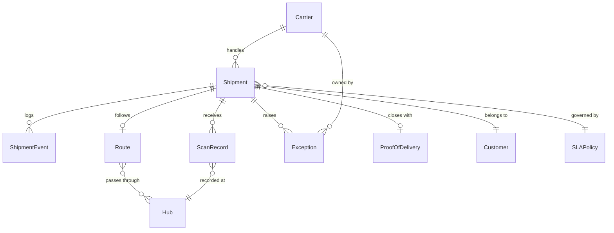

# Data Dictionary — Logistics Tracking System

**Version:** 1.0  
**Status:** Approved  
**Last Updated:** 2025-01-01  

---

## Table of Contents

1. [Core Entities](#1-core-entities)
2. [Canonical Relationship Diagram](#2-canonical-relationship-diagram)
3. [Data Quality Controls](#3-data-quality-controls)
4. [Field Definitions](#4-field-definitions)

---

## Core Entities

| Entity | Description | Primary Key | Owner | Retention |
|--------|-------------|-------------|-------|-----------|
| `Shipment` | Root aggregate for a parcel journey from origin to destination | `shipment_id` UUID | Shipment Team | 7 years |
| `ShipmentEvent` | Immutable state-transition log entry for a shipment | `event_id` UUID | Shipment Team | 7 years |
| `ScanRecord` | Raw carrier/hub scan with location and timestamp | `scan_id` UUID | Scan Ingestion Team | 3 years |
| `Carrier` | Logistics provider performing pickup and delivery | `carrier_id` UUID | Platform Team | Indefinite |
| `Hub` | Physical facility (warehouse, sortation center) on the route | `hub_id` UUID | Network Team | Indefinite |
| `Route` | Planned path of legs between origin and destination | `route_id` UUID | Routing Team | 2 years |
| `Exception` | Anomaly or failure requiring manual or automated intervention | `exception_id` UUID | Operations Team | 5 years |
| `ProofOfDelivery` | Artifact (image, signature, OTP) confirming delivery | `pod_id` UUID | Delivery Team | 7 years |
| `Customer` | Sender or recipient of the shipment | `customer_id` UUID | Customer Team | 5 years |
| `SLAPolicy` | Configurable time-bound targets per shipment class and corridor | `sla_policy_id` UUID | Operations Team | Indefinite |

---

## Canonical Relationship Diagram

---

## Data Quality Controls

| Control | Target Field | Rule | Error Code | Severity |
|---------|-------------|------|------------|----------|
| Postal code format | `Shipment.origin_postal_code`, `destination_postal_code` | Must match country-specific regex | `INVALID_POSTAL_CODE` | Error |
| Deliverability score | `Shipment.destination_address` | Score ≥ 0.7 from address validation API | `ADDRESS_UNDELIVERABLE` | Error |
| Scan timestamp freshness | `ScanRecord.scanned_at` | Must not be more than 5 minutes in the future | `FUTURE_TIMESTAMP` | Warning |
| POD artifact size | `ProofOfDelivery.artifact_url` | Image ≤ 5 MB, must be JPEG or PNG | `INVALID_POD_FORMAT` | Error |
| SLA class completeness | `Shipment.sla_class` | Must be `STANDARD`, `EXPRESS`, or `OVERNIGHT` | `MISSING_SLA_CLASS` | Error |
| Carrier scope | `ScanRecord.carrier_id` | Must match the shipment's assigned carrier | `CARRIER_MISMATCH` | Critical |
| GPS coordinate range | `ScanRecord.latitude`, `ScanRecord.longitude` | Lat ∈ [-90, 90], Lon ∈ [-180, 180] | `INVALID_COORDINATES` | Warning |
| Exception ETA required | `Exception.resolution_eta` | Must be set within 1 hour of exception creation | `MISSING_ETA` | Warning |

---

## 4. Field Definitions

### Shipment

| Field | Type | Constraints | Description |
|-------|------|-------------|-------------|
| `shipment_id` | UUID | PK, not null | Globally unique shipment identifier |
| `tracking_number` | VARCHAR(30) | Unique, not null | Customer-facing tracking code |
| `carrier_id` | UUID | FK → Carrier, not null | Assigned logistics carrier |
| `customer_id` | UUID | FK → Customer, not null | Originating customer |
| `origin_address` | JSONB | not null | Structured origin address |
| `destination_address` | JSONB | not null | Structured destination address |
| `sla_class` | ENUM | `STANDARD`, `EXPRESS`, `OVERNIGHT` | Service level agreement tier |
| `status` | ENUM | see state machine | Current lifecycle state |
| `weight_grams` | INTEGER | > 0 | Parcel weight in grams |
| `dimensions_mm` | JSONB | l/w/h > 0 | Length, width, height in mm |
| `created_at` | TIMESTAMPTZ | not null | Creation timestamp (UTC) |
| `confirmed_at` | TIMESTAMPTZ | nullable | Time when SLA clock starts |
| `delivered_at` | TIMESTAMPTZ | nullable | Terminal delivery timestamp |
| `idempotency_key` | VARCHAR(128) | Unique per carrier | Client-supplied idempotency key |

### ScanRecord

| Field | Type | Constraints | Description |
|-------|------|-------------|-------------|
| `scan_id` | UUID | PK, not null | Unique scan event ID |
| `shipment_id` | UUID | FK → Shipment, not null | Parent shipment |
| `carrier_id` | UUID | FK → Carrier, not null | Carrier performing scan |
| `hub_id` | UUID | FK → Hub, nullable | Hub where scan occurred |
| `latitude` | DECIMAL(9,6) | nullable | GPS latitude |
| `longitude` | DECIMAL(9,6) | nullable | GPS longitude |
| `scan_type` | ENUM | `PICKUP`, `IN_TRANSIT`, `DELIVERY_ATTEMPT`, `DELIVERED`, `EXCEPTION` | Type of scan event |
| `scanned_at` | TIMESTAMPTZ | not null | When the scan occurred |
| `device_fingerprint` | VARCHAR(64) | not null | Scanner device identifier |

---
1. **Create and validate shipment**
   - API receives create request with idempotency key.
   - Service validates addresses, SLA class, and regulatory constraints.
   - Transaction writes shipment aggregate + outbox event `shipment.created.v1`.
2. **Plan and pickup**
   - Planning service consumes create event and emits `shipment.pickup_scheduled.v1`.
   - Driver app scan emits `shipment.picked_up.v1` with proof metadata.
3. **Line-haul and hub progression**
   - Every custody scan emits `shipment.location_updated.v1`.
   - Milestone service derives `arrived_at_hub`, `departed_hub`, and ETA recalculation events.
4. **Delivery execution**
   - Route optimizer emits `shipment.out_for_delivery.v1`.
   - Delivery app posts attempt event with POD artifacts.
5. **Exception and recovery**
   - Any failed invariant emits `shipment.exception_detected.v1` with reason code.
   - Resolution workflow emits `shipment.exception_resolved.v1` and resumes normal state path or terminal fallback.
6. **Closure**
   - Terminal events (`delivered`, `returned_to_sender`, `cancelled`, `lost`) trigger settlement, analytics, and archival pipelines.

## Shipment State Machine
| State | Entry Criteria | Allowed Next States | Exit Event | Operational Notes |
|---|---|---|---|---|
| `Draft` | Shipment request created but not committed | `Confirmed`, `Cancelled` | `shipment.confirmed` | No external notifications before confirmation. |
| `Confirmed` | Capacity and address validation passed | `PickupScheduled`, `Cancelled` | `shipment.pickup_scheduled` | SLA clock starts. |
| `PickupScheduled` | Pickup slot assigned | `PickedUp`, `Exception`, `Cancelled` | `shipment.picked_up` | Missed pickup auto-raises exception after threshold. |
| `PickedUp` | Driver/hub scan confirms custody | `InTransit`, `Exception` | `shipment.in_transit` | Chain-of-custody records required. |
| `InTransit` | Shipment moving between hubs/line-haul legs | `OutForDelivery`, `Exception`, `Lost` | `shipment.out_for_delivery` | Telemetry cadence must remain within SLA. |
| `OutForDelivery` | Last-mile run started | `Delivered`, `Exception`, `ReturnedToSender` | `shipment.delivered` | Customer contact window and proof policy enforced. |
| `Exception` | Delay/damage/address/customs issue detected | `InTransit`, `OutForDelivery`, `ReturnedToSender`, `Cancelled`, `Lost` | `shipment.exception_resolved` | Every exception requires owner + ETA to resolution. |
| `Delivered` | Proof of delivery accepted | *(terminal)* | `shipment.closed` | Immutable except audit annotations. |
| `ReturnedToSender` | Return workflow completed | *(terminal)* | `shipment.closed` | Financial settlement rules apply. |
| `Cancelled` | Shipment cancelled prior completion | *(terminal)* | `shipment.closed` | Cancellation reason required for analytics. |
| `Lost` | Investigation concludes unrecoverable loss | *(terminal)* | `shipment.closed` | Claims/compliance path triggered. |

## Integration Retry and Idempotency Specification
- **Publish reliability:** Command-handling transactions persist domain mutations and outbox records atomically; relay workers publish with exponential backoff (`base=500ms`, `factor=2`, `max=5m`) and jitter.
- **Deduping contract:** `event_id` is globally unique; consumers persist `(event_id, consumer_name, processed_at, outcome_hash)` before side-effects.
- **API idempotency:** Mutating endpoints require `Idempotency-Key` and scope keys by `(tenant_id, route, key)`. Duplicate requests return prior status/body.
- **Webhook retries:** 3 fast retries + 8 slow retries with signed payload replay protection; after exhaustion route to DLQ with replay tooling.
- **Replay safety:** Backfills run via replay jobs that mark `replay_batch_id`, disable duplicate notifications/billing, and emit audit events.

## Monitoring, SLOs, and Alerting
### Golden Signals
- Event ingest latency (`scan_received` -> persisted)
- Commit-to-publish latency (outbox record -> broker ack)
- Consumer lag per subscription and partition
- Retry rate, DLQ depth, and redrive success rate
- Shipment state dwell time by state and lane
- Delivery attempt failure ratio and exception aging

### SLO Targets
- P95 scan-to-visibility: **< 60 seconds**
- P95 commit-to-publish: **< 5 seconds**
- P95 exception-detection-to-customer-notification: **< 3 minutes**
- Daily successful redrive from DLQ: **> 99%** within 4 hours

### Alert Policy
- **SEV-1:** publish pipeline stalled > 5 min, broker unavailable, or state transition processor halted.
- **SEV-2:** DLQ growth > threshold for 15 min, ETA model stale > 10 min, webhook failure burst.
- **SEV-3:** schema drift warnings, duplicate event spike, non-critical integration flapping.

### Runbook Minimums
Each alert must link to owning team, dashboard, triage checklist, mitigation steps, replay command, and stakeholder comms template.

## Analysis Acceptance Criteria
- Every business rule is traceable to an event, state transition, or API contract.
- Exceptions include ownership, SLA, and escalation policy.
- Observability requirements are measurable and testable before production release.
