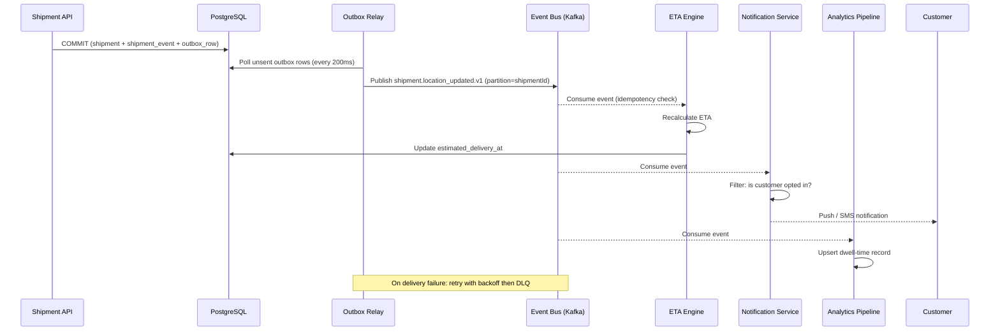

# Event Catalog — Logistics Tracking System

**Version:** 1.0  
**Status:** Approved  
**Last Updated:** 2025-01-01  

---

## Table of Contents

1. [Contract Conventions](#1-contract-conventions)
2. [Domain Events](#2-domain-events)
3. [Publish and Consumption Sequence](#3-publish-and-consumption-sequence)
4. [Operational SLOs](#4-operational-slos)

---

## Contract Conventions

All domain events conform to a standard CloudEvents-inspired envelope:

```json
{
  "eventId": "01JQ3NQKKAY2KXPZZC3V9A2F7S",
  "eventType": "shipment.delivered.v1",
  "eventVersion": 1,
  "carrierId": "carrier-uuid",
  "occurredAt": "2026-03-28T12:40:21Z",
  "traceId": "8f5cfdc0b9db4b23",
  "payload": { "shipmentId": "...", "podId": "..." }
}
```

| Convention | Value |
|------------|-------|
| Topic naming | `logistics.{entity}.{verb}.v{N}` |
| Partitioning key | `shipment_id` (ensures ordered delivery per shipment) |
| Schema registry | Confluent Schema Registry; Avro schemas version-controlled |
| Backward compatibility | All schema changes MUST be backward-compatible for 2 major versions |
| Idempotency | Consumers persist `(event_id, consumer_name)` before side effects |
| DLQ policy | After 5 retries with exponential backoff, route to DLQ with replay metadata |
| Replay mechanism | Replay jobs mark `replay_batch_id`; duplicate notifications disabled |

---

## Domain Events

| Event | Trigger | Key Payload Fields | Consumers | Retention |
|-------|---------|-------------------|-----------|-----------|
| `shipment.created.v1` | Shipment confirmed and SLA clock started | `shipmentId`, `carrierId`, `slaClass`, `confirmedAt` | Route Planner, Notification, Analytics | 7 years |
| `shipment.pickup_scheduled.v1` | Pickup slot assigned to driver | `shipmentId`, `driverId`, `scheduledWindow` | Driver App, Customer Notification | 3 years |
| `shipment.picked_up.v1` | Driver/hub scan confirms pickup custody | `shipmentId`, `scanId`, `hubId`, `scannedAt` | Chain-of-Custody, Analytics | 7 years |
| `shipment.location_updated.v1` | Hub scan or GPS update recorded | `shipmentId`, `scanId`, `location`, `eta` | ETA Engine, Customer Portal, Analytics | 3 years |
| `shipment.out_for_delivery.v1` | Last-mile delivery run started | `shipmentId`, `driverId`, `estimatedDeliveryWindow` | Customer Notification, Driver App | 3 years |
| `shipment.delivered.v1` | POD artifact accepted; delivery confirmed | `shipmentId`, `podId`, `deliveredAt`, `recipientName` | Settlement, Analytics, Customer Notification | 7 years |
| `shipment.exception_detected.v1` | Invariant failure or delay detected | `shipmentId`, `exceptionId`, `reasonCode`, `ownerId` | Exception Management, Ops Dashboard, Notification | 5 years |
| `shipment.exception_resolved.v1` | Exception closed with resolution outcome | `shipmentId`, `exceptionId`, `resolution`, `resolvedAt` | Analytics, Billing Adjustment | 5 years |
| `shipment.returned_to_sender.v1` | Return workflow completed | `shipmentId`, `returnReason`, `completedAt` | Settlement, Analytics | 7 years |
| `shipment.cancelled.v1` | Shipment cancelled before delivery | `shipmentId`, `cancelReason`, `cancelledBy` | Settlement, Analytics | 7 years |
| `shipment.lost.v1` | Investigation concludes unrecoverable loss | `shipmentId`, `investigationId`, `declaredAt` | Claims, Compliance, Settlement | 7 years |
| `sla.breach_warning.v1` | 80% of SLA window elapsed without progress | `shipmentId`, `slaClass`, `elapsedPct`, `deadlineAt` | SLA Monitor, Ops Dashboard | 1 year |

---

## Publish and Consumption Sequence



---

## Operational SLOs

| SLO | Target | Alert Threshold | Owner |
|-----|--------|----------------|-------|
| Scan-to-visibility latency (p95) | < 60 seconds | > 90 seconds for 5 min | Scan Ingestion Team |
| Outbox commit-to-publish latency (p95) | < 5 seconds | > 15 seconds for 2 min | Platform Team |
| Exception-to-customer-notification (p95) | < 3 minutes | > 5 minutes for 5 min | Notification Team |
| DLQ redrive success (daily) | > 99% within 4 hours | < 95% | Platform On-Call |
| Event bus consumer lag (per topic) | < 10 000 messages | > 50 000 for 10 min | Platform Team |
| ETA model staleness | < 10 minutes | > 20 minutes | ETA Team |

### Alert Runbook Minimums

Every alert must include: owning team, dashboard link, triage checklist, mitigation steps, replay command, and stakeholder communication template.

---
1. **Create and validate shipment**
   - API receives create request with idempotency key.
   - Service validates addresses, SLA class, and regulatory constraints.
   - Transaction writes shipment aggregate + outbox event `shipment.created.v1`.
2. **Plan and pickup**
   - Planning service consumes create event and emits `shipment.pickup_scheduled.v1`.
   - Driver app scan emits `shipment.picked_up.v1` with proof metadata.
3. **Line-haul and hub progression**
   - Every custody scan emits `shipment.location_updated.v1`.
   - Milestone service derives `arrived_at_hub`, `departed_hub`, and ETA recalculation events.
4. **Delivery execution**
   - Route optimizer emits `shipment.out_for_delivery.v1`.
   - Delivery app posts attempt event with POD artifacts.
5. **Exception and recovery**
   - Any failed invariant emits `shipment.exception_detected.v1` with reason code.
   - Resolution workflow emits `shipment.exception_resolved.v1` and resumes normal state path or terminal fallback.
6. **Closure**
   - Terminal events (`delivered`, `returned_to_sender`, `cancelled`, `lost`) trigger settlement, analytics, and archival pipelines.

## Shipment State Machine
| State | Entry Criteria | Allowed Next States | Exit Event | Operational Notes |
|---|---|---|---|---|
| `Draft` | Shipment request created but not committed | `Confirmed`, `Cancelled` | `shipment.confirmed` | No external notifications before confirmation. |
| `Confirmed` | Capacity and address validation passed | `PickupScheduled`, `Cancelled` | `shipment.pickup_scheduled` | SLA clock starts. |
| `PickupScheduled` | Pickup slot assigned | `PickedUp`, `Exception`, `Cancelled` | `shipment.picked_up` | Missed pickup auto-raises exception after threshold. |
| `PickedUp` | Driver/hub scan confirms custody | `InTransit`, `Exception` | `shipment.in_transit` | Chain-of-custody records required. |
| `InTransit` | Shipment moving between hubs/line-haul legs | `OutForDelivery`, `Exception`, `Lost` | `shipment.out_for_delivery` | Telemetry cadence must remain within SLA. |
| `OutForDelivery` | Last-mile run started | `Delivered`, `Exception`, `ReturnedToSender` | `shipment.delivered` | Customer contact window and proof policy enforced. |
| `Exception` | Delay/damage/address/customs issue detected | `InTransit`, `OutForDelivery`, `ReturnedToSender`, `Cancelled`, `Lost` | `shipment.exception_resolved` | Every exception requires owner + ETA to resolution. |
| `Delivered` | Proof of delivery accepted | *(terminal)* | `shipment.closed` | Immutable except audit annotations. |
| `ReturnedToSender` | Return workflow completed | *(terminal)* | `shipment.closed` | Financial settlement rules apply. |
| `Cancelled` | Shipment cancelled prior completion | *(terminal)* | `shipment.closed` | Cancellation reason required for analytics. |
| `Lost` | Investigation concludes unrecoverable loss | *(terminal)* | `shipment.closed` | Claims/compliance path triggered. |

## Integration Retry and Idempotency Specification
- **Publish reliability:** Command-handling transactions persist domain mutations and outbox records atomically; relay workers publish with exponential backoff (`base=500ms`, `factor=2`, `max=5m`) and jitter.
- **Deduping contract:** `event_id` is globally unique; consumers persist `(event_id, consumer_name, processed_at, outcome_hash)` before side-effects.
- **API idempotency:** Mutating endpoints require `Idempotency-Key` and scope keys by `(tenant_id, route, key)`. Duplicate requests return prior status/body.
- **Webhook retries:** 3 fast retries + 8 slow retries with signed payload replay protection; after exhaustion route to DLQ with replay tooling.
- **Replay safety:** Backfills run via replay jobs that mark `replay_batch_id`, disable duplicate notifications/billing, and emit audit events.

## Monitoring, SLOs, and Alerting
### Golden Signals
- Event ingest latency (`scan_received` -> persisted)
- Commit-to-publish latency (outbox record -> broker ack)
- Consumer lag per subscription and partition
- Retry rate, DLQ depth, and redrive success rate
- Shipment state dwell time by state and lane
- Delivery attempt failure ratio and exception aging

### SLO Targets
- P95 scan-to-visibility: **< 60 seconds**
- P95 commit-to-publish: **< 5 seconds**
- P95 exception-detection-to-customer-notification: **< 3 minutes**
- Daily successful redrive from DLQ: **> 99%** within 4 hours

### Alert Policy
- **SEV-1:** publish pipeline stalled > 5 min, broker unavailable, or state transition processor halted.
- **SEV-2:** DLQ growth > threshold for 15 min, ETA model stale > 10 min, webhook failure burst.
- **SEV-3:** schema drift warnings, duplicate event spike, non-critical integration flapping.

### Runbook Minimums
Each alert must link to owning team, dashboard, triage checklist, mitigation steps, replay command, and stakeholder comms template.

## Analysis Acceptance Criteria
- Every business rule is traceable to an event, state transition, or API contract.
- Exceptions include ownership, SLA, and escalation policy.
- Observability requirements are measurable and testable before production release.
