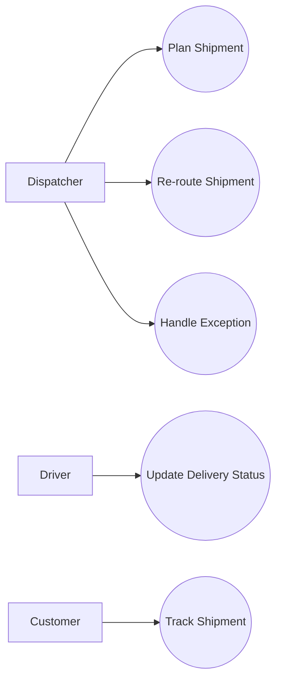

# Use Case Diagram

```mermaid
flowchart LR
  Dispatcher --> U1((Plan Shipment))
  Driver --> U2((Update Delivery Status))
  Customer --> U3((Track Shipment))
  Dispatcher --> U4((Re-route Shipment))
  Dispatcher --> U5((Handle Exception))
```
