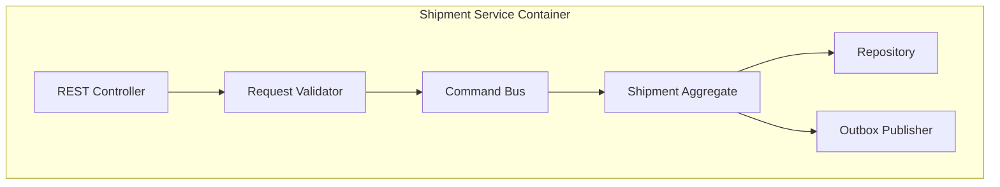

# C4 Component Diagram

## Diagram Implementation Notes
- Mermaid source is the canonical, version-controlled diagram artifact.
- All transitions and interactions assume at-least-once event delivery and idempotent handlers.
- Pair this diagram with API/event contracts in detailed design docs during implementation.

## End-to-End Event Flow (Implementation Ready)
1. **Create and validate shipment**
   - API receives create request with idempotency key.
   - Service validates addresses, SLA class, and regulatory constraints.
   - Transaction writes shipment aggregate + outbox event `shipment.created.v1`.
2. **Plan and pickup**
   - Planning service consumes create event and emits `shipment.pickup_scheduled.v1`.
   - Driver app scan emits `shipment.picked_up.v1` with proof metadata.
3. **Line-haul and hub progression**
   - Every custody scan emits `shipment.location_updated.v1`.
   - Milestone service derives `arrived_at_hub`, `departed_hub`, and ETA recalculation events.
4. **Delivery execution**
   - Route optimizer emits `shipment.out_for_delivery.v1`.
   - Delivery app posts attempt event with POD artifacts.
5. **Exception and recovery**
   - Any failed invariant emits `shipment.exception_detected.v1` with reason code.
   - Resolution workflow emits `shipment.exception_resolved.v1` and resumes normal state path or terminal fallback.
6. **Closure**
   - Terminal events (`delivered`, `returned_to_sender`, `cancelled`, `lost`) trigger settlement, analytics, and archival pipelines.

## Shipment State Machine Semantics
| State | Entry Criteria | Allowed Next States | Exit Event | Operational Notes |
|---|---|---|---|---|
| `Draft` | Shipment request created but not committed | `Confirmed`, `Cancelled` | `shipment.confirmed` | No external notifications before confirmation. |
| `Confirmed` | Capacity and address validation passed | `PickupScheduled`, `Cancelled` | `shipment.pickup_scheduled` | SLA clock starts. |
| `PickupScheduled` | Pickup slot assigned | `PickedUp`, `Exception`, `Cancelled` | `shipment.picked_up` | Missed pickup auto-raises exception after threshold. |
| `PickedUp` | Driver/hub scan confirms custody | `InTransit`, `Exception` | `shipment.in_transit` | Chain-of-custody records required. |
| `InTransit` | Shipment moving between hubs/line-haul legs | `OutForDelivery`, `Exception`, `Lost` | `shipment.out_for_delivery` | Telemetry cadence must remain within SLA. |
| `OutForDelivery` | Last-mile run started | `Delivered`, `Exception`, `ReturnedToSender` | `shipment.delivered` | Customer contact window and proof policy enforced. |
| `Exception` | Delay/damage/address/customs issue detected | `InTransit`, `OutForDelivery`, `ReturnedToSender`, `Cancelled`, `Lost` | `shipment.exception_resolved` | Every exception requires owner + ETA to resolution. |
| `Delivered` | Proof of delivery accepted | *(terminal)* | `shipment.closed` | Immutable except audit annotations. |
| `ReturnedToSender` | Return workflow completed | *(terminal)* | `shipment.closed` | Financial settlement rules apply. |
| `Cancelled` | Shipment cancelled prior completion | *(terminal)* | `shipment.closed` | Cancellation reason required for analytics. |
| `Lost` | Investigation concludes unrecoverable loss | *(terminal)* | `shipment.closed` | Claims/compliance path triggered. |

## Integration Retry and Idempotency Specification
- **Publish reliability:** Command-handling transactions persist domain mutations and outbox records atomically; relay workers publish with exponential backoff (`base=500ms`, `factor=2`, `max=5m`) and jitter.
- **Deduping contract:** `event_id` is globally unique; consumers persist `(event_id, consumer_name, processed_at, outcome_hash)` before side-effects.
- **API idempotency:** Mutating endpoints require `Idempotency-Key` and scope keys by `(tenant_id, route, key)`. Duplicate requests return prior status/body.
- **Webhook retries:** 3 fast retries + 8 slow retries with signed payload replay protection; after exhaustion route to DLQ with replay tooling.
- **Replay safety:** Backfills run via replay jobs that mark `replay_batch_id`, disable duplicate notifications/billing, and emit audit events.

## Monitoring, SLOs, and Alerting
### Golden Signals
- Event ingest latency (`scan_received` -> persisted)
- Commit-to-publish latency (outbox record -> broker ack)
- Consumer lag per subscription and partition
- Retry rate, DLQ depth, and redrive success rate
- Shipment state dwell time by state and lane
- Delivery attempt failure ratio and exception aging

### SLO Targets
- P95 scan-to-visibility: **< 60 seconds**
- P95 commit-to-publish: **< 5 seconds**
- P95 exception-detection-to-customer-notification: **< 3 minutes**
- Daily successful redrive from DLQ: **> 99%** within 4 hours

### Alert Policy
- **SEV-1:** publish pipeline stalled > 5 min, broker unavailable, or state transition processor halted.
- **SEV-2:** DLQ growth > threshold for 15 min, ETA model stale > 10 min, webhook failure burst.
- **SEV-3:** schema drift warnings, duplicate event spike, non-critical integration flapping.

### Runbook Minimums
Each alert must link to owning team, dashboard, triage checklist, mitigation steps, replay command, and stakeholder comms template.

