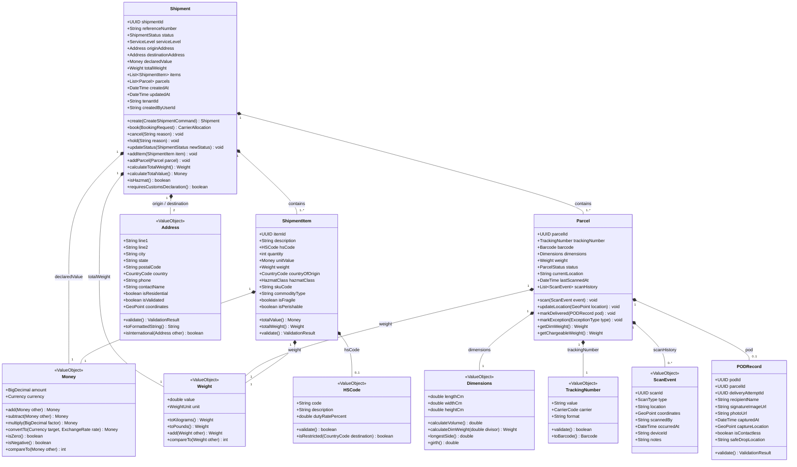
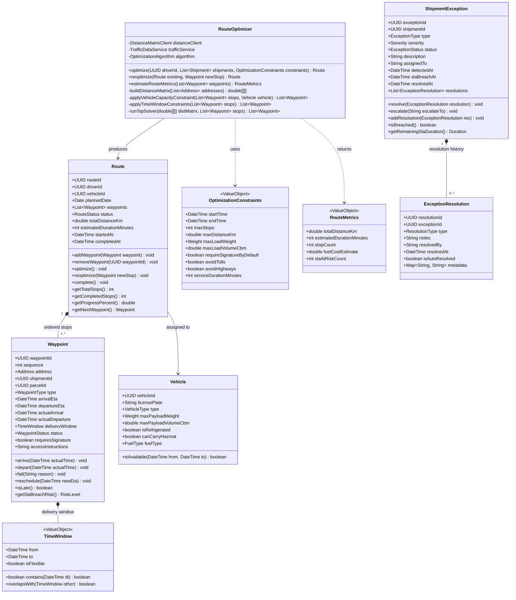

# Class Diagram

This document contains all class diagrams for the Logistics Tracking System, organised by bounded context. Each diagram covers the aggregate roots, entities, value objects, interfaces, and supporting types for its domain. Mermaid source is the canonical, version-controlled artifact; render in any Mermaid-compatible viewer (GitHub, GitLab, Notion, VS Code extension).

---

## 1. Shipment Aggregate Class Diagram

The `Shipment` aggregate is the core domain object. It owns the chain of custody from booking through final delivery, including items, parcels, addresses, and declared value.

### Shipment Aggregate — Key Design Decisions

| Decision | Rationale |
|---|---|
| `Parcel` owns `ScanEvent` history | Scan events belong to the physical parcel, not the logical shipment; enables multi-parcel shipments to track independently |
| `Address` is a value object | Addresses have no identity—equality is structural; copying is preferred over referencing |
| `Money` carries `Currency` | Prevents implicit currency arithmetic; all cross-currency operations must supply an `ExchangeRate` |
| `getDimWeight()` on `Parcel` | Dimensional weight calculation is carrier-specific; the `divisor` param allows FedEx (139), UPS (139), DHL (5000) logic |
| `requiresCustomsDeclaration()` on `Shipment` | Centralises the rule: any item with an `HSCode` and `countryOfOrigin` different from the destination country triggers customs |

---

## 2. Carrier Integration Class Diagram

The carrier integration layer uses the Adapter pattern to present a uniform interface to the rest of the system, regardless of the underlying carrier API protocol (REST, XML/SOAP, proprietary).

```mermaid
classDiagram
    direction TB

    class ICarrierAdapter {
        <<interface>>
        +book(BookingRequest) BookingResponse
        +track(String trackingNumber) TrackingResponse
        +cancel(String awbNumber) CancellationResponse
        +getRates(RateRequest) List~RateQuote~
        +validateAddress(Address address) AddressValidationResult
        +getServiceLevels(CountryCode origin, CountryCode dest) List~ServiceLevel~
    }

    class FedExAdapter {
        -FedExClient httpClient
        -FedExCredentials credentials
        -CircuitBreaker circuitBreaker
        +book(BookingRequest) BookingResponse
        +track(String trackingNumber) TrackingResponse
        +cancel(String awbNumber) CancellationResponse
        +getRates(RateRequest) List~RateQuote~
        +validateAddress(Address address) AddressValidationResult
        +getServiceLevels(CountryCode origin, CountryCode dest) List~ServiceLevel~
        -mapToFedExRequest(BookingRequest) FedExShipRequest
        -mapFromFedExResponse(FedExShipResponse) BookingResponse
        -refreshToken() void
    }

    class UPSAdapter {
        -UPSRestClient httpClient
        -UPSCredentials credentials
        -CircuitBreaker circuitBreaker
        +book(BookingRequest) BookingResponse
        +track(String trackingNumber) TrackingResponse
        +cancel(String awbNumber) CancellationResponse
        +getRates(RateRequest) List~RateQuote~
        +validateAddress(Address address) AddressValidationResult
        +getServiceLevels(CountryCode origin, CountryCode dest) List~ServiceLevel~
        -mapToUPSShipmentRequest(BookingRequest) UPSShipRequest
        -parseUPSTrackingXml(String xml) TrackingResponse
    }

    class DHLAdapter {
        -DHLExpressClient httpClient
        -DHLCredentials credentials
        -CircuitBreaker circuitBreaker
        +book(BookingRequest) BookingResponse
        +track(String trackingNumber) TrackingResponse
        +cancel(String awbNumber) CancellationResponse
        +getRates(RateRequest) List~RateQuote~
        +validateAddress(Address address) AddressValidationResult
        +getServiceLevels(CountryCode origin, CountryCode dest) List~ServiceLevel~
        -mapToDHLShipmentRequest(BookingRequest) DHLShipmentRequest
        -parseDHLWebhookPayload(String json) TrackingEvent
    }

    class USPSAdapter {
        -USPSWebToolsClient httpClient
        -USPSCredentials credentials
        -CircuitBreaker circuitBreaker
        +book(BookingRequest) BookingResponse
        +track(String trackingNumber) TrackingResponse
        +cancel(String awbNumber) CancellationResponse
        +getRates(RateRequest) List~RateQuote~
        +validateAddress(Address address) AddressValidationResult
        +getServiceLevels(CountryCode origin, CountryCode dest) List~ServiceLevel~
        -buildUSPSXmlRequest(BookingRequest) String
        -parseUSPSXmlResponse(String xml) BookingResponse
    }

    class CarrierAdapterFactory {
        -Map~String, ICarrierAdapter~ adapterRegistry
        +getAdapter(String carrierId) ICarrierAdapter
        +registerAdapter(String carrierId, ICarrierAdapter adapter) void
        +getSupportedCarriers() List~String~
    }

    class CarrierAllocation {
        +UUID allocationId
        +UUID shipmentId
        +UUID carrierId
        +String awbNumber
        +String labelUrl
        +String labelFormat
        +AllocationStatus status
        +Money allocatedRate
        +ServiceLevel allocatedService
        +DateTime confirmedAt
        +DateTime expiresAt
        +String cancellationReason
        +allocate(BookingResponse response) void
        +cancel(String reason) void
        +isExpired() boolean
        +regenerateLabel() String
    }

    class BookingRequest {
        <<ValueObject>>
        +UUID shipmentId
        +Address origin
        +Address destination
        +Weight weight
        +Dimensions dimensions
        +ServiceLevel service
        +List~ShipmentItem~ items
        +Money declaredValue
        +boolean isResidentialDelivery
        +boolean requiresSignature
        +String specialInstructions
        +DateTime requestedPickupDate
    }

    class BookingResponse {
        <<ValueObject>>
        +String awbNumber
        +String labelUrl
        +String labelFormat
        +Date estimatedDelivery
        +BigDecimal cost
        +Currency currency
        +String carrierReference
        +List~String~ warnings
        +boolean isSuccess
        +String errorCode
        +String errorMessage
    }

    class RateRequest {
        <<ValueObject>>
        +Address origin
        +Address destination
        +Weight weight
        +Dimensions dimensions
        +DateTime shipDate
        +List~ServiceLevel~ requestedServices
    }

    class RateQuote {
        <<ValueObject>>
        +String carrierId
        +ServiceLevel service
        +Money rate
        +DateTime estimatedDelivery
        +String transitDays
        +List~Surcharge~ surcharges
        +Money totalRate()
    }

    ICarrierAdapter <|.. FedExAdapter : implements
    ICarrierAdapter <|.. UPSAdapter : implements
    ICarrierAdapter <|.. DHLAdapter : implements
    ICarrierAdapter <|.. USPSAdapter : implements
    CarrierAdapterFactory --> ICarrierAdapter : creates
    CarrierAllocation --> BookingResponse : populated from
    FedExAdapter ..> BookingRequest : uses
    FedExAdapter ..> BookingResponse : returns
    UPSAdapter ..> RateRequest : uses
    UPSAdapter ..> RateQuote : returns
```

### Carrier Integration — Key Design Decisions

| Decision | Rationale |
|---|---|
| `ICarrierAdapter` interface with `validateAddress` | Address validation is carrier-specific; FedEx has better US coverage, DHL better for international |
| `CircuitBreaker` per adapter | Carrier API outages should not cascade; each carrier isolates its own failure domain |
| `CarrierAdapterFactory` with registry | Allows dynamic registration of new regional carriers without code changes to the selection service |
| `labelUrl` on `BookingResponse` | Labels are stored in S3; the adapter uploads during booking so the URL is immediately available |
| `RateQuote` includes `surcharges` | Fuel surcharge, residential surcharge, and remote area fees must be itemised for cost transparency |

---

## 3. Route Optimization Class Diagram

The route optimizer manages last-mile delivery routing, taking driver availability, vehicle capacity, time windows, and real-time traffic into account.

### Route Optimization — Key Design Decisions

| Decision | Rationale |
|---|---|
| `reoptimize` on `RouteOptimizer` | During active delivery runs, new urgent stops must be inserted without discarding all prior optimisation |
| `TimeWindow` as value object on `Waypoint` | Customer-promised delivery windows are immutable once confirmed; violations trigger SLA breach logic |
| `getSlaBreachRisk()` on `Waypoint` | Gives dispatchers a real-time risk signal before a breach actually occurs |
| `ExceptionResolution` history | Full audit trail of who attempted what resolution, when, and whether it was automated or manual |
| `Severity` on `ShipmentException` | Drives escalation routing: LOW auto-notifies, MEDIUM alerts supervisor, HIGH/CRITICAL pages on-call |

---

## 4. Enumerations and Supporting Types

```mermaid
classDiagram
    direction LR

    class ShipmentStatus {
        <<enumeration>>
        DRAFT
        CONFIRMED
        PICKUP_SCHEDULED
        PICKED_UP
        IN_TRANSIT
        OUT_FOR_DELIVERY
        DELIVERED
        EXCEPTION
        RETURNED_TO_SENDER
        CANCELLED
        LOST
    }

    class ServiceLevel {
        <<enumeration>>
        ECONOMY
        STANDARD
        EXPRESS
        OVERNIGHT
        SAME_DAY
        FREIGHT
    }

    class ParcelStatus {
        <<enumeration>>
        CREATED
        LABELLED
        PICKED_UP
        IN_TRANSIT
        AT_FACILITY
        OUT_FOR_DELIVERY
        DELIVERED
        EXCEPTION
        RETURNED
    }

    class ExceptionType {
        <<enumeration>>
        DELAY
        DAMAGE
        LOST
        ADDRESS_ISSUE
        CUSTOMS_HOLD
        REFUSED_BY_RECIPIENT
        WEATHER_DELAY
        CARRIER_DELAY
        VEHICLE_BREAKDOWN
    }

    class Severity {
        <<enumeration>>
        LOW
        MEDIUM
        HIGH
        CRITICAL
    }

    class WaypointType {
        <<enumeration>>
        PICKUP
        DELIVERY
        HUB_TRANSFER
        RETURN
    }

    class ResolutionType {
        <<enumeration>>
        REROUTED
        REDELIVERY_SCHEDULED
        RETURNED_TO_SENDER
        ADDRESS_CORRECTED
        CLAIM_FILED
        CARRIER_CONTACTED
        CUSTOMS_CLEARED
        CANCELLED
    }

    class HazmatClass {
        <<enumeration>>
        CLASS_1_EXPLOSIVES
        CLASS_2_GASES
        CLASS_3_FLAMMABLE_LIQUIDS
        CLASS_4_FLAMMABLE_SOLIDS
        CLASS_5_OXIDISING
        CLASS_6_TOXIC
        CLASS_7_RADIOACTIVE
        CLASS_8_CORROSIVE
        CLASS_9_MISC
        NONE
    }
```

---

## Design Principles Applied

1. **Aggregate boundaries enforce invariants** — `Shipment` is the only entry point for modifying items and parcels; direct `ShipmentItem` or `Parcel` mutations are prohibited outside the aggregate root.
2. **Value objects are immutable** — `Address`, `Money`, `Weight`, `Dimensions`, `TimeWindow` have no setters; operations return new instances.
3. **Interfaces decouple carrier implementations** — `ICarrierAdapter` allows swapping, mocking, or adding carriers without changes to the booking service.
4. **Rich domain model** — Business logic (`isHazmat()`, `requiresCustomsDeclaration()`, `getSlaBreachRisk()`) lives in the domain, not in application services.
5. **Explicit exception hierarchy** — `ShipmentException` → `ExceptionResolution` models the full investigation lifecycle with audit trail.

