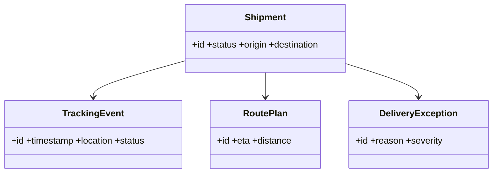

# Class Diagram

```mermaid
classDiagram
  class Shipment {+id +status +origin +destination}
  class TrackingEvent {+id +timestamp +location +status}
  class RoutePlan {+id +eta +distance}
  class DeliveryException {+id +reason +severity}
  Shipment --> TrackingEvent
  Shipment --> RoutePlan
  Shipment --> DeliveryException
```
