# ERD & Database Schema — Logistics Tracking System

## Table of Contents
1. [Schema Overview](#1-schema-overview)
2. [Entity-Relationship Diagram](#2-entity-relationship-diagram)
3. [SQL Table Definitions](#3-sql-table-definitions)
4. [Foreign Key Reference](#4-foreign-key-reference)
5. [Index Definitions](#5-index-definitions)
6. [Partitioning Strategy](#6-partitioning-strategy)

---

## 1. Schema Overview

**Primary database:** PostgreSQL 16 with the `logistics` schema.  
**Time-series extension:** TimescaleDB 2.x for the `gps_breadcrumbs` hypertable.  
**Supporting extensions:**

```sql
CREATE EXTENSION IF NOT EXISTS "pgcrypto";     -- gen_random_uuid()
CREATE EXTENSION IF NOT EXISTS "pg_trgm";      -- trigram text search on addresses
CREATE EXTENSION IF NOT EXISTS "postgis";      -- geometry types for geofences
CREATE EXTENSION IF NOT EXISTS "timescaledb";  -- hypertable for GPS breadcrumbs
CREATE SCHEMA IF NOT EXISTS logistics;
SET search_path TO logistics, public;
```

**Domain groupings:**

| Domain | Tables |
|--------|--------|
| Parties | `shippers`, `consignees` |
| Shipment core | `shipments`, `shipment_items`, `parcels` |
| Tracking | `tracking_events`, `gps_breadcrumbs` |
| Carrier & services | `carriers`, `carrier_services`, `carrier_allocations` |
| Fleet & people | `drivers`, `vehicles` |
| Routing | `routes`, `waypoints` |
| Geography | `geofences`, `geofence_events`, `hubs`, `sorting_facilities` |
| Delivery execution | `delivery_attempts`, `proofs_of_delivery`, `signature_captures`, `photo_captures` |
| Exceptions | `exceptions`, `exception_resolutions` |
| International | `customs_declarations`, `customs_lines`, `hazmat_declarations` |
| Financials | `insurance_plans`, `invoices` |
| Returns | `return_shipments` |
| Operations | `manifest_records` |
| Notifications | `tracking_webhooks` |
| Intelligence | `edd_predictions` |

---

## 2. Entity-Relationship Diagram

```mermaid
erDiagram
    shippers {
        uuid shipper_id PK
        string company_name
        string email
        string account_type
        string status
    }
    consignees {
        uuid consignee_id PK
        string name
        string email
        boolean is_residential
    }
    shipments {
        uuid shipment_id PK
        string reference_number
        uuid shipper_id FK
        uuid consignee_id FK
        uuid carrier_allocation_id FK
        string status
        string service_level
        boolean is_international
        timestamptz created_at
    }
    shipment_items {
        uuid item_id PK
        uuid shipment_id FK
        string hs_code
        integer quantity
        numeric unit_value
        string hazmat_class
    }
    parcels {
        uuid parcel_id PK
        uuid shipment_id FK
        string tracking_number
        string status
    }
    tracking_events {
        uuid event_id PK
        uuid shipment_id FK
        uuid parcel_id FK
        string event_type
        timestamptz occurred_at
        boolean is_milestone
    }
    gps_breadcrumbs {
        uuid breadcrumb_id PK
        uuid vehicle_id FK
        uuid driver_id FK
        decimal geo_lat
        decimal geo_lon
        timestamptz recorded_at
    }
    carriers {
        uuid carrier_id PK
        string name
        string api_type
        boolean supports_tracking
        boolean supports_hazmat
        string status
    }
    carrier_services {
        uuid service_id PK
        uuid carrier_id FK
        string service_code
        string service_type
        integer transit_days_min
        integer transit_days_max
    }
    carrier_allocations {
        uuid allocation_id PK
        uuid shipment_id FK
        uuid carrier_id FK
        uuid service_id FK
        string awb_number
        string status
    }
    drivers {
        uuid driver_id PK
        string employee_id
        uuid vehicle_id FK
        uuid carrier_id FK
        decimal current_geo_lat
        decimal current_geo_lon
        string status
    }
    vehicles {
        uuid vehicle_id PK
        uuid carrier_id FK
        string registration_plate
        string vehicle_type
        string status
    }
    routes {
        uuid route_id PK
        uuid driver_id FK
        uuid vehicle_id FK
        uuid hub_id FK
        date planned_date
        string status
    }
    waypoints {
        uuid waypoint_id PK
        uuid route_id FK
        uuid shipment_id FK
        smallint sequence
        string status
    }
    geofences {
        uuid geofence_id PK
        uuid hub_id FK
        string name
        string geofence_type
        boolean is_active
    }
    geofence_events {
        uuid geofence_event_id PK
        uuid geofence_id FK
        uuid vehicle_id FK
        string event_type
        timestamptz occurred_at
    }
    delivery_attempts {
        uuid attempt_id PK
        uuid shipment_id FK
        uuid driver_id FK
        smallint attempt_number
        string outcome
        timestamptz attempted_at
    }
    proofs_of_delivery {
        uuid pod_id PK
        uuid shipment_id FK
        uuid attempt_id FK
        string delivery_type
        timestamptz delivered_at
        string recipient_name
    }
    signature_captures {
        uuid signature_id PK
        uuid pod_id FK
        string signature_image_url
        boolean is_verified
    }
    photo_captures {
        uuid photo_id PK
        uuid pod_id FK
        string photo_url
        string photo_type
    }
    exceptions {
        uuid exception_id PK
        uuid shipment_id FK
        string exception_type
        string severity
        string status
        boolean sla_breach
    }
    exception_resolutions {
        uuid resolution_id PK
        uuid exception_id FK
        uuid resolved_by FK
        string resolution_type
        timestamptz resolved_at
    }
    customs_declarations {
        uuid declaration_id PK
        uuid shipment_id FK
        string declaration_type
        string customs_status
        numeric declared_value
    }
    customs_lines {
        uuid line_id PK
        uuid declaration_id FK
        string hs_code
        integer quantity
        numeric total_value
    }
    hazmat_declarations {
        uuid hazmat_id PK
        uuid shipment_id FK
        uuid item_id FK
        string un_number
        string hazmat_class
    }
    insurance_plans {
        uuid insurance_id PK
        uuid shipment_id FK
        string policy_number
        numeric coverage_amount
        string status
    }
    return_shipments {
        uuid return_id PK
        uuid original_shipment_id FK
        string rma_code
        string return_status
        string qc_status
    }
    hubs {
        uuid hub_id PK
        string name
        string hub_type
        boolean is_active
    }
    sorting_facilities {
        uuid facility_id PK
        uuid hub_id FK
        string name
        boolean is_operational
    }
    manifest_records {
        uuid manifest_id PK
        uuid carrier_id FK
        uuid hub_id FK
        date manifest_date
        string status
    }
    invoices {
        uuid invoice_id PK
        uuid shipper_id FK
        numeric total_amount
        string status
    }
    tracking_webhooks {
        uuid webhook_id PK
        uuid shipper_id FK
        string endpoint_url
        string status
    }
    edd_predictions {
        uuid edd_id PK
        uuid shipment_id FK
        date predicted_date
        numeric confidence_score
    }

    shippers             ||--o{ shipments              : "ships"
    consignees           ||--o{ shipments              : "receives"
    shipments            ||--o{ shipment_items         : "contains"
    shipments            ||--o{ parcels                : "has"
    shipments            ||--o{ tracking_events        : "generates"
    shipments            ||--o| carrier_allocations    : "booked via"
    shipments            ||--o{ delivery_attempts      : "records"
    shipments            ||--o| proofs_of_delivery     : "proven by"
    shipments            ||--o{ exceptions             : "may have"
    shipments            ||--o| customs_declarations   : "declared in"
    shipments            ||--o| insurance_plans        : "insured by"
    shipments            ||--o| return_shipments       : "returned as"
    shipments            ||--o{ edd_predictions        : "predicted by"
    shipment_items       ||--o{ hazmat_declarations    : "declared as"
    parcels              ||--o{ tracking_events        : "tracked in"
    carrier_allocations  }o--|| carriers               : "uses"
    carrier_allocations  }o--|| carrier_services       : "via"
    carriers             ||--o{ carrier_services       : "offers"
    carriers             ||--o{ drivers                : "employs"
    carriers             ||--o{ vehicles               : "owns"
    carriers             ||--o{ manifest_records       : "files"
    drivers              }o--o| vehicles               : "assigned"
    drivers              ||--o{ gps_breadcrumbs        : "generates"
    vehicles             ||--o{ gps_breadcrumbs        : "emits"
    drivers              ||--o{ delivery_attempts      : "attempts"
    routes               }o--|| drivers                : "assigned to"
    routes               }o--|| vehicles               : "uses"
    routes               }o--|| hubs                   : "dispatched from"
    routes               ||--o{ waypoints              : "contains"
    waypoints            }o--|| shipments              : "delivers"
    hubs                 ||--o{ sorting_facilities     : "contains"
    hubs                 ||--o{ geofences              : "bounded by"
    hubs                 ||--o{ manifest_records       : "processes"
    geofences            ||--o{ geofence_events        : "triggers"
    vehicles             ||--o{ geofence_events        : "causes"
    proofs_of_delivery   ||--o{ signature_captures     : "includes"
    proofs_of_delivery   ||--o{ photo_captures         : "includes"
    proofs_of_delivery   }o--|| delivery_attempts      : "from"
    exceptions           ||--o{ exception_resolutions  : "resolved by"
    customs_declarations ||--o{ customs_lines          : "itemised in"
    shippers             ||--o{ invoices               : "billed via"
    shippers             ||--o{ tracking_webhooks      : "subscribes"
```



---

## 3. SQL Table Definitions

```sql
-- ============================================================
-- EXTENSIONS & SCHEMA
-- ============================================================
CREATE EXTENSION IF NOT EXISTS "pgcrypto";
CREATE EXTENSION IF NOT EXISTS "pg_trgm";
CREATE EXTENSION IF NOT EXISTS "postgis";
CREATE EXTENSION IF NOT EXISTS "timescaledb";
CREATE SCHEMA IF NOT EXISTS logistics;
SET search_path TO logistics, public;

-- ============================================================
-- SHIPPERS
-- Companies or individuals that send shipments.
-- ============================================================
CREATE TABLE shippers (
    shipper_id      UUID          PRIMARY KEY DEFAULT gen_random_uuid(),
    company_name    VARCHAR(255)  NOT NULL,
    contact_name    VARCHAR(200),
    email           VARCHAR(255)  NOT NULL UNIQUE,
    phone           VARCHAR(30),
    address_line1   VARCHAR(255)  NOT NULL,
    address_line2   VARCHAR(255),
    city            VARCHAR(100)  NOT NULL,
    state           VARCHAR(100),
    postal_code     VARCHAR(20)   NOT NULL,
    country_iso2    CHAR(2)       NOT NULL,
    account_type    VARCHAR(30)   NOT NULL DEFAULT 'standard'
                    CHECK (account_type IN ('standard','premium','enterprise','marketplace')),
    credit_limit    NUMERIC(14,2) NOT NULL DEFAULT 0,
    status          VARCHAR(20)   NOT NULL DEFAULT 'active'
                    CHECK (status IN ('active','suspended','closed')),
    created_at      TIMESTAMPTZ   NOT NULL DEFAULT NOW(),
    updated_at      TIMESTAMPTZ   NOT NULL DEFAULT NOW()
);

-- Indexes
CREATE INDEX idx_shippers_email       ON shippers (email);
CREATE INDEX idx_shippers_status      ON shippers (status) WHERE status = 'active';
CREATE INDEX idx_shippers_country     ON shippers (country_iso2);

-- ============================================================
-- CONSIGNEES
-- Recipients of shipments. May be stored per-shipment or
-- reused across shipments for the same end address.
-- ============================================================
CREATE TABLE consignees (
    consignee_id           UUID         PRIMARY KEY DEFAULT gen_random_uuid(),
    name                   VARCHAR(255) NOT NULL,
    company                VARCHAR(255),
    email                  VARCHAR(255),
    phone                  VARCHAR(30),
    address_line1          VARCHAR(255) NOT NULL,
    address_line2          VARCHAR(255),
    city                   VARCHAR(100) NOT NULL,
    state                  VARCHAR(100),
    postal_code            VARCHAR(20)  NOT NULL,
    country_iso2           CHAR(2)      NOT NULL,
    delivery_instructions  TEXT,
    is_residential         BOOLEAN      NOT NULL DEFAULT TRUE,
    created_at             TIMESTAMPTZ  NOT NULL DEFAULT NOW(),
    updated_at             TIMESTAMPTZ  NOT NULL DEFAULT NOW()
);

-- Indexes
CREATE INDEX idx_consignees_email    ON consignees (email) WHERE email IS NOT NULL;
CREATE INDEX idx_consignees_country  ON consignees (country_iso2);

-- ============================================================
-- HUBS
-- Physical sorting and distribution facilities. Defined before
-- shipments so that routing foreign keys resolve.
-- ============================================================
CREATE TABLE hubs (
    hub_id                    UUID         PRIMARY KEY DEFAULT gen_random_uuid(),
    name                      VARCHAR(100) NOT NULL,
    hub_type                  VARCHAR(30)  NOT NULL
                              CHECK (hub_type IN ('gateway','regional_dc','last_mile_depot','cross_dock')),
    address                   JSONB        NOT NULL DEFAULT '{}',
    geo_lat                   DECIMAL(9,6),
    geo_lon                   DECIMAL(9,6),
    operator_carrier_id       UUID,        -- FK to carriers added after carriers table
    capacity_parcels_per_day  INTEGER,
    is_active                 BOOLEAN      NOT NULL DEFAULT TRUE,
    timezone                  VARCHAR(50)  NOT NULL DEFAULT 'UTC',
    created_at                TIMESTAMPTZ  NOT NULL DEFAULT NOW()
);

-- Indexes
CREATE INDEX idx_hubs_active    ON hubs (is_active) WHERE is_active = TRUE;
CREATE INDEX idx_hubs_hub_type  ON hubs (hub_type);

-- ============================================================
-- CARRIERS
-- Logistics providers integrated via API.
-- ============================================================
CREATE TABLE carriers (
    carrier_id             UUID         PRIMARY KEY DEFAULT gen_random_uuid(),
    name                   VARCHAR(100) NOT NULL,
    display_name           VARCHAR(150) NOT NULL,
    iata_code              VARCHAR(3)   UNIQUE,
    scac_code              VARCHAR(4)   UNIQUE,
    api_type               VARCHAR(30)  NOT NULL
                           CHECK (api_type IN ('rest','soap','sftp','edi','proprietary')),
    api_base_url           VARCHAR(500),
    api_version            VARCHAR(10),
    status                 VARCHAR(20)  NOT NULL DEFAULT 'active'
                           CHECK (status IN ('active','inactive','maintenance')),
    supports_tracking      BOOLEAN      NOT NULL DEFAULT TRUE,
    supports_hazmat        BOOLEAN      NOT NULL DEFAULT FALSE,
    supports_international BOOLEAN      NOT NULL DEFAULT FALSE,
    supports_pod           BOOLEAN      NOT NULL DEFAULT TRUE,
    created_at             TIMESTAMPTZ  NOT NULL DEFAULT NOW(),
    updated_at             TIMESTAMPTZ  NOT NULL DEFAULT NOW()
);

-- Add deferred FK from hubs
ALTER TABLE hubs
    ADD CONSTRAINT fk_hubs_operator_carrier
    FOREIGN KEY (operator_carrier_id) REFERENCES carriers(carrier_id);

-- Indexes
CREATE INDEX idx_carriers_status         ON carriers (status);
CREATE INDEX idx_carriers_hazmat         ON carriers (supports_hazmat) WHERE supports_hazmat = TRUE;
CREATE INDEX idx_carriers_international  ON carriers (supports_international) WHERE supports_international = TRUE;

-- ============================================================
-- CARRIER_SERVICES
-- Individual service offerings (e.g., Express 24h, Economy 5d).
-- ============================================================
CREATE TABLE carrier_services (
    service_id           UUID         PRIMARY KEY DEFAULT gen_random_uuid(),
    carrier_id           UUID         NOT NULL REFERENCES carriers(carrier_id) ON DELETE CASCADE,
    service_code         VARCHAR(30)  NOT NULL,
    service_name         VARCHAR(100) NOT NULL,
    service_type         VARCHAR(30)  NOT NULL
                         CHECK (service_type IN ('express','standard','economy','freight','same_day','international')),
    transit_days_min     SMALLINT     NOT NULL,
    transit_days_max     SMALLINT     NOT NULL,
    weight_min_kg        NUMERIC(8,3) NOT NULL DEFAULT 0,
    weight_max_kg        NUMERIC(8,3) NOT NULL,
    domestic_only        BOOLEAN      NOT NULL DEFAULT TRUE,
    requires_hazmat_cert BOOLEAN      NOT NULL DEFAULT FALSE,
    rate_basis           VARCHAR(20)  NOT NULL DEFAULT 'weight'
                         CHECK (rate_basis IN ('weight','dimensional','flat','zone')),
    is_active            BOOLEAN      NOT NULL DEFAULT TRUE,
    created_at           TIMESTAMPTZ  NOT NULL DEFAULT NOW(),
    UNIQUE (carrier_id, service_code)
);

-- Indexes
CREATE INDEX idx_carrier_services_carrier   ON carrier_services (carrier_id);
CREATE INDEX idx_carrier_services_active    ON carrier_services (is_active) WHERE is_active = TRUE;
CREATE INDEX idx_carrier_services_type      ON carrier_services (service_type);

-- ============================================================
-- VEHICLES
-- Fleet vehicles operated by carriers.
-- ============================================================
CREATE TABLE vehicles (
    vehicle_id           UUID         PRIMARY KEY DEFAULT gen_random_uuid(),
    carrier_id           UUID         NOT NULL REFERENCES carriers(carrier_id),
    registration_plate   VARCHAR(20)  NOT NULL UNIQUE,
    vehicle_type         VARCHAR(30)  NOT NULL
                         CHECK (vehicle_type IN ('van','truck','motorcycle','bicycle','cargo_bike','semi')),
    make                 VARCHAR(50),
    model                VARCHAR(50),
    year                 SMALLINT,
    capacity_kg          NUMERIC(8,2),
    capacity_parcels     INTEGER,
    gps_device_id        VARCHAR(100) UNIQUE,
    status               VARCHAR(20)  NOT NULL DEFAULT 'active'
                         CHECK (status IN ('active','maintenance','retired','unassigned')),
    last_maintenance_at  DATE,
    created_at           TIMESTAMPTZ  NOT NULL DEFAULT NOW(),
    updated_at           TIMESTAMPTZ  NOT NULL DEFAULT NOW()
);

-- Indexes
CREATE INDEX idx_vehicles_carrier   ON vehicles (carrier_id);
CREATE INDEX idx_vehicles_status    ON vehicles (status);
CREATE INDEX idx_vehicles_gps       ON vehicles (gps_device_id) WHERE gps_device_id IS NOT NULL;

-- ============================================================
-- DRIVERS
-- Delivery drivers employed by or contracted to carriers.
-- ============================================================
CREATE TABLE drivers (
    driver_id           UUID         PRIMARY KEY DEFAULT gen_random_uuid(),
    employee_id         VARCHAR(50)  NOT NULL UNIQUE,
    first_name          VARCHAR(100) NOT NULL,
    last_name           VARCHAR(100) NOT NULL,
    phone               VARCHAR(20)  NOT NULL,
    email               VARCHAR(255) NOT NULL,
    license_number      VARCHAR(50),
    license_expiry      DATE,
    vehicle_id          UUID         REFERENCES vehicles(vehicle_id),
    carrier_id          UUID         NOT NULL REFERENCES carriers(carrier_id),
    current_geo_lat     DECIMAL(9,6),
    current_geo_lon     DECIMAL(9,6),
    last_location_at    TIMESTAMPTZ,
    status              VARCHAR(20)  NOT NULL DEFAULT 'active'
                        CHECK (status IN ('active','off_duty','on_leave','suspended','terminated')),
    is_hazmat_certified BOOLEAN      NOT NULL DEFAULT FALSE,
    hazmat_cert_expiry  DATE,
    created_at          TIMESTAMPTZ  NOT NULL DEFAULT NOW(),
    updated_at          TIMESTAMPTZ  NOT NULL DEFAULT NOW()
);

-- Indexes
CREATE INDEX idx_drivers_carrier   ON drivers (carrier_id);
CREATE INDEX idx_drivers_status    ON drivers (status);
CREATE INDEX idx_drivers_vehicle   ON drivers (vehicle_id) WHERE vehicle_id IS NOT NULL;
CREATE INDEX idx_drivers_hazmat    ON drivers (is_hazmat_certified) WHERE is_hazmat_certified = TRUE;

-- ============================================================
-- SHIPMENTS
-- Root aggregate for the shipment lifecycle.
-- ============================================================
CREATE TABLE shipments (
    shipment_id              UUID          PRIMARY KEY DEFAULT gen_random_uuid(),
    reference_number         VARCHAR(50)   NOT NULL UNIQUE,
    shipper_id               UUID          NOT NULL REFERENCES shippers(shipper_id),
    consignee_id             UUID          NOT NULL REFERENCES consignees(consignee_id),
    carrier_allocation_id    UUID,         -- FK added after carrier_allocations
    status                   VARCHAR(30)   NOT NULL DEFAULT 'draft'
                             CHECK (status IN ('draft','confirmed','pickup_scheduled','picked_up',
                                               'in_transit','out_for_delivery','delivered',
                                               'exception','returned_to_sender','cancelled','lost')),
    service_level            VARCHAR(30)   NOT NULL,
    origin_address           JSONB         NOT NULL DEFAULT '{}',
    destination_address      JSONB         NOT NULL DEFAULT '{}',
    declared_value           NUMERIC(12,2),
    currency                 CHAR(3)       NOT NULL DEFAULT 'USD',
    total_weight_kg          NUMERIC(8,3),
    total_volume_cm3         NUMERIC(12,3),
    piece_count              INTEGER       NOT NULL DEFAULT 1,
    special_instructions     TEXT,
    is_international         BOOLEAN       NOT NULL DEFAULT FALSE,
    requires_signature       BOOLEAN       NOT NULL DEFAULT FALSE,
    requires_photo           BOOLEAN       NOT NULL DEFAULT FALSE,
    insurance_value          NUMERIC(12,2),
    sla_delivery_date        TIMESTAMPTZ,
    estimated_delivery_date  TIMESTAMPTZ,
    actual_delivery_date     TIMESTAMPTZ,
    created_at               TIMESTAMPTZ   NOT NULL DEFAULT NOW(),
    updated_at               TIMESTAMPTZ   NOT NULL DEFAULT NOW(),
    deleted_at               TIMESTAMPTZ
);

-- Indexes
CREATE INDEX idx_shipments_shipper        ON shipments (shipper_id);
CREATE INDEX idx_shipments_status         ON shipments (status);
CREATE INDEX idx_shipments_created        ON shipments (created_at DESC);
CREATE INDEX idx_shipments_sla_date       ON shipments (sla_delivery_date) WHERE sla_delivery_date IS NOT NULL;
CREATE INDEX idx_shipments_international  ON shipments (is_international) WHERE is_international = TRUE;
CREATE INDEX idx_shipments_deleted        ON shipments (deleted_at) WHERE deleted_at IS NULL;
CREATE INDEX idx_shipments_reference      ON shipments (reference_number);

-- ============================================================
-- SHIPMENT_ITEMS
-- Line-item contents of a shipment (for customs, hazmat, value).
-- ============================================================
CREATE TABLE shipment_items (
    item_id            UUID          PRIMARY KEY DEFAULT gen_random_uuid(),
    shipment_id        UUID          NOT NULL REFERENCES shipments(shipment_id) ON DELETE CASCADE,
    description        VARCHAR(255)  NOT NULL,
    hs_code            VARCHAR(10),
    quantity           INTEGER       NOT NULL DEFAULT 1,
    unit_value         NUMERIC(10,2),
    weight_kg          NUMERIC(8,3),
    country_of_origin  CHAR(2),
    hazmat_class       VARCHAR(10),
    is_restricted      BOOLEAN       NOT NULL DEFAULT FALSE,
    created_at         TIMESTAMPTZ   NOT NULL DEFAULT NOW()
);

-- Indexes
CREATE INDEX idx_shipment_items_shipment  ON shipment_items (shipment_id);
CREATE INDEX idx_shipment_items_hazmat    ON shipment_items (hazmat_class) WHERE hazmat_class IS NOT NULL;
CREATE INDEX idx_shipment_items_hs_code   ON shipment_items (hs_code) WHERE hs_code IS NOT NULL;

-- ============================================================
-- PARCELS
-- Individual physical parcels within a shipment.
-- Each parcel gets its own tracking number and barcode.
-- ============================================================
CREATE TABLE parcels (
    parcel_id           UUID         PRIMARY KEY DEFAULT gen_random_uuid(),
    shipment_id         UUID         NOT NULL REFERENCES shipments(shipment_id) ON DELETE CASCADE,
    tracking_number     VARCHAR(50)  NOT NULL UNIQUE,
    barcode             VARCHAR(100),
    weight_kg           NUMERIC(8,3),
    length_cm           NUMERIC(8,2),
    width_cm            NUMERIC(8,2),
    height_cm           NUMERIC(8,2),
    dimensional_weight_kg NUMERIC(8,3),
    status              VARCHAR(30)  NOT NULL DEFAULT 'created',
    current_location_id UUID,        -- FK to hubs added after
    created_at          TIMESTAMPTZ  NOT NULL DEFAULT NOW(),
    updated_at          TIMESTAMPTZ  NOT NULL DEFAULT NOW()
);

ALTER TABLE parcels
    ADD CONSTRAINT fk_parcels_current_hub
    FOREIGN KEY (current_location_id) REFERENCES hubs(hub_id);

-- Indexes
CREATE INDEX idx_parcels_shipment         ON parcels (shipment_id);
CREATE INDEX idx_parcels_tracking_number  ON parcels (tracking_number);
CREATE INDEX idx_parcels_status           ON parcels (status);

-- ============================================================
-- CARRIER_ALLOCATIONS
-- Carrier booking records; one per shipment.
-- ============================================================
CREATE TABLE carrier_allocations (
    allocation_id      UUID          PRIMARY KEY DEFAULT gen_random_uuid(),
    shipment_id        UUID          NOT NULL UNIQUE REFERENCES shipments(shipment_id),
    carrier_id         UUID          NOT NULL REFERENCES carriers(carrier_id),
    service_id         UUID          NOT NULL REFERENCES carrier_services(service_id),
    awb_number         VARCHAR(50),
    mawb_number        VARCHAR(50),
    hawb_number        VARCHAR(50),
    label_url          VARCHAR(1000),
    label_format       VARCHAR(10)   DEFAULT 'PDF',
    booking_reference  VARCHAR(100),
    status             VARCHAR(30)   NOT NULL DEFAULT 'pending'
                       CHECK (status IN ('pending','confirmed','picked_up','cancelled','failed')),
    allocated_at       TIMESTAMPTZ   NOT NULL DEFAULT NOW(),
    confirmed_at       TIMESTAMPTZ,
    cancelled_at       TIMESTAMPTZ,
    carrier_response   JSONB
);

-- Add deferred FK on shipments
ALTER TABLE shipments
    ADD CONSTRAINT fk_shipments_carrier_allocation
    FOREIGN KEY (carrier_allocation_id) REFERENCES carrier_allocations(allocation_id);

-- Indexes
CREATE INDEX idx_carrier_allocations_carrier   ON carrier_allocations (carrier_id);
CREATE INDEX idx_carrier_allocations_status    ON carrier_allocations (status);
CREATE INDEX idx_carrier_allocations_awb       ON carrier_allocations (awb_number) WHERE awb_number IS NOT NULL;

-- ============================================================
-- TRACKING_EVENTS
-- Immutable audit log of every tracking scan and milestone.
-- Never updated — only inserted.
-- ============================================================
CREATE TABLE tracking_events (
    event_id              UUID          PRIMARY KEY DEFAULT gen_random_uuid(),
    shipment_id           UUID          NOT NULL REFERENCES shipments(shipment_id),
    parcel_id             UUID          REFERENCES parcels(parcel_id),
    carrier_id            UUID          REFERENCES carriers(carrier_id),
    event_type            VARCHAR(50)   NOT NULL,
    event_code            VARCHAR(20),
    description           VARCHAR(500),
    location_name         VARCHAR(255),
    location_city         VARCHAR(100),
    location_country      CHAR(2),
    geo_lat               DECIMAL(9,6),
    geo_lon               DECIMAL(9,6),
    occurred_at           TIMESTAMPTZ   NOT NULL,
    received_at           TIMESTAMPTZ   NOT NULL DEFAULT NOW(),
    raw_carrier_payload   JSONB,
    is_milestone          BOOLEAN       NOT NULL DEFAULT FALSE
);

-- Indexes
CREATE INDEX idx_tracking_events_shipment      ON tracking_events (shipment_id, occurred_at DESC);
CREATE INDEX idx_tracking_events_parcel        ON tracking_events (parcel_id) WHERE parcel_id IS NOT NULL;
CREATE INDEX idx_tracking_events_milestone     ON tracking_events (shipment_id) WHERE is_milestone = TRUE;
CREATE INDEX idx_tracking_events_event_type    ON tracking_events (event_type);
CREATE INDEX idx_tracking_events_occurred      ON tracking_events (occurred_at DESC);

-- ============================================================
-- GPS_BREADCRUMBS  (TimescaleDB Hypertable)
-- High-frequency vehicle telemetry. Partitioned by recorded_at
-- (hourly chunks). Retention: 90 days hot, then archive.
-- ============================================================
CREATE TABLE gps_breadcrumbs (
    breadcrumb_id    UUID         NOT NULL DEFAULT gen_random_uuid(),
    vehicle_id       UUID         NOT NULL REFERENCES vehicles(vehicle_id),
    driver_id        UUID         REFERENCES drivers(driver_id),
    geo_lat          DECIMAL(9,6) NOT NULL,
    geo_lon          DECIMAL(9,6) NOT NULL,
    altitude_m       NUMERIC(8,2),
    speed_kmh        NUMERIC(6,2),
    heading_degrees  SMALLINT,
    accuracy_m       NUMERIC(6,2),
    recorded_at      TIMESTAMPTZ  NOT NULL,
    received_at      TIMESTAMPTZ  NOT NULL DEFAULT NOW(),
    device_id        VARCHAR(100),
    signal_quality   SMALLINT,
    PRIMARY KEY (breadcrumb_id, recorded_at)
);

SELECT create_hypertable('gps_breadcrumbs', 'recorded_at', chunk_time_interval => INTERVAL '1 hour');

-- Indexes (TimescaleDB creates chunk-local indexes automatically)
CREATE INDEX idx_gps_vehicle_time   ON gps_breadcrumbs (vehicle_id, recorded_at DESC);
CREATE INDEX idx_gps_driver_time    ON gps_breadcrumbs (driver_id, recorded_at DESC) WHERE driver_id IS NOT NULL;
CREATE INDEX idx_gps_device         ON gps_breadcrumbs (device_id) WHERE device_id IS NOT NULL;

-- ============================================================
-- ROUTES
-- A planned delivery run assigned to a driver and vehicle.
-- ============================================================
CREATE TABLE routes (
    route_id               UUID         PRIMARY KEY DEFAULT gen_random_uuid(),
    driver_id              UUID         NOT NULL REFERENCES drivers(driver_id),
    vehicle_id             UUID         NOT NULL REFERENCES vehicles(vehicle_id),
    hub_id                 UUID         NOT NULL REFERENCES hubs(hub_id),
    planned_date           DATE         NOT NULL,
    start_time             TIMESTAMPTZ,
    end_time               TIMESTAMPTZ,
    total_stops            INTEGER      NOT NULL DEFAULT 0,
    completed_stops        INTEGER      NOT NULL DEFAULT 0,
    total_distance_km      NUMERIC(10,3),
    status                 VARCHAR(20)  NOT NULL DEFAULT 'planned'
                           CHECK (status IN ('planned','dispatched','in_progress','completed','cancelled')),
    optimization_score     NUMERIC(5,2),
    created_at             TIMESTAMPTZ  NOT NULL DEFAULT NOW(),
    updated_at             TIMESTAMPTZ  NOT NULL DEFAULT NOW()
);

-- Indexes
CREATE INDEX idx_routes_driver        ON routes (driver_id);
CREATE INDEX idx_routes_planned_date  ON routes (planned_date);
CREATE INDEX idx_routes_status        ON routes (status);
CREATE INDEX idx_routes_hub           ON routes (hub_id);

-- ============================================================
-- WAYPOINTS
-- Individual stops within a route, each linked to one shipment.
-- ============================================================
CREATE TABLE waypoints (
    waypoint_id      UUID         PRIMARY KEY DEFAULT gen_random_uuid(),
    route_id         UUID         NOT NULL REFERENCES routes(route_id) ON DELETE CASCADE,
    shipment_id      UUID         NOT NULL REFERENCES shipments(shipment_id),
    sequence         SMALLINT     NOT NULL,
    address          JSONB        NOT NULL DEFAULT '{}',
    arrival_eta      TIMESTAMPTZ,
    departure_eta    TIMESTAMPTZ,
    arrival_actual   TIMESTAMPTZ,
    departure_actual TIMESTAMPTZ,
    status           VARCHAR(20)  NOT NULL DEFAULT 'pending'
                     CHECK (status IN ('pending','arrived','completed','skipped','failed')),
    failure_reason   VARCHAR(100),
    UNIQUE (route_id, sequence)
);

-- Indexes
CREATE INDEX idx_waypoints_route    ON waypoints (route_id);
CREATE INDEX idx_waypoints_shipment ON waypoints (shipment_id);
CREATE INDEX idx_waypoints_status   ON waypoints (status);

-- ============================================================
-- SORTING_FACILITIES
-- Sub-facilities within a hub (e.g., automated sort lanes).
-- ============================================================
CREATE TABLE sorting_facilities (
    facility_id        UUID         PRIMARY KEY DEFAULT gen_random_uuid(),
    hub_id             UUID         NOT NULL REFERENCES hubs(hub_id) ON DELETE CASCADE,
    name               VARCHAR(100) NOT NULL,
    facility_type      VARCHAR(30)  NOT NULL
                       CHECK (facility_type IN ('inbound','outbound','returns','customs','cold_chain')),
    sort_lanes         INTEGER,
    automation_level   VARCHAR(20)  NOT NULL DEFAULT 'manual'
                       CHECK (automation_level IN ('manual','semi_automated','fully_automated')),
    is_operational     BOOLEAN      NOT NULL DEFAULT TRUE
);

-- Indexes
CREATE INDEX idx_sort_facilities_hub         ON sorting_facilities (hub_id);
CREATE INDEX idx_sort_facilities_operational ON sorting_facilities (is_operational) WHERE is_operational = TRUE;

-- ============================================================
-- GEOFENCES
-- Polygonal or circular geographic boundaries for alert rules.
-- ============================================================
CREATE TABLE geofences (
    geofence_id             UUID         PRIMARY KEY DEFAULT gen_random_uuid(),
    hub_id                  UUID         REFERENCES hubs(hub_id),
    name                    VARCHAR(100) NOT NULL,
    geofence_type           VARCHAR(30)  NOT NULL
                            CHECK (geofence_type IN ('hub_perimeter','delivery_zone','restricted_area','customer_site')),
    polygon_wkt             TEXT,
    center_lat              DECIMAL(9,6),
    center_lon              DECIMAL(9,6),
    radius_m                NUMERIC(8,2),
    alert_on_entry          BOOLEAN      NOT NULL DEFAULT TRUE,
    alert_on_exit           BOOLEAN      NOT NULL DEFAULT FALSE,
    dwell_threshold_minutes SMALLINT,
    is_active               BOOLEAN      NOT NULL DEFAULT TRUE,
    created_at              TIMESTAMPTZ  NOT NULL DEFAULT NOW()
);

-- Indexes
CREATE INDEX idx_geofences_hub     ON geofences (hub_id) WHERE hub_id IS NOT NULL;
CREATE INDEX idx_geofences_active  ON geofences (is_active) WHERE is_active = TRUE;
CREATE INDEX idx_geofences_type    ON geofences (geofence_type);

-- ============================================================
-- GEOFENCE_EVENTS
-- Log of vehicles entering or exiting geofences.
-- ============================================================
CREATE TABLE geofence_events (
    geofence_event_id  UUID         PRIMARY KEY DEFAULT gen_random_uuid(),
    geofence_id        UUID         NOT NULL REFERENCES geofences(geofence_id),
    vehicle_id         UUID         NOT NULL REFERENCES vehicles(vehicle_id),
    driver_id          UUID         REFERENCES drivers(driver_id),
    event_type         VARCHAR(10)  NOT NULL CHECK (event_type IN ('entry','exit','dwell')),
    geo_lat            DECIMAL(9,6) NOT NULL,
    geo_lon            DECIMAL(9,6) NOT NULL,
    occurred_at        TIMESTAMPTZ  NOT NULL,
    dwell_minutes      SMALLINT
);

-- Indexes
CREATE INDEX idx_geofence_events_geofence   ON geofence_events (geofence_id, occurred_at DESC);
CREATE INDEX idx_geofence_events_vehicle    ON geofence_events (vehicle_id, occurred_at DESC);
CREATE INDEX idx_geofence_events_occurred   ON geofence_events (occurred_at DESC);

-- ============================================================
-- DELIVERY_ATTEMPTS
-- Records each delivery attempt (success or failure) with reason.
-- ============================================================
CREATE TABLE delivery_attempts (
    attempt_id              UUID         PRIMARY KEY DEFAULT gen_random_uuid(),
    shipment_id             UUID         NOT NULL REFERENCES shipments(shipment_id),
    route_id                UUID         REFERENCES routes(route_id),
    driver_id               UUID         NOT NULL REFERENCES drivers(driver_id),
    waypoint_id             UUID         REFERENCES waypoints(waypoint_id),
    attempt_number          SMALLINT     NOT NULL DEFAULT 1,
    attempted_at            TIMESTAMPTZ  NOT NULL,
    outcome                 VARCHAR(30)  NOT NULL
                            CHECK (outcome IN ('delivered','failed','refused','no_access','no_one_home','rescheduled')),
    failure_reason          VARCHAR(100),
    next_attempt_scheduled  TIMESTAMPTZ,
    geo_lat                 DECIMAL(9,6),
    geo_lon                 DECIMAL(9,6),
    notes                   TEXT
);

-- Indexes
CREATE INDEX idx_delivery_attempts_shipment  ON delivery_attempts (shipment_id);
CREATE INDEX idx_delivery_attempts_driver    ON delivery_attempts (driver_id);
CREATE INDEX idx_delivery_attempts_outcome   ON delivery_attempts (outcome);
CREATE INDEX idx_delivery_attempts_attempted ON delivery_attempts (attempted_at DESC);

-- ============================================================
-- PROOFS_OF_DELIVERY
-- One POD record per delivered shipment.
-- ============================================================
CREATE TABLE proofs_of_delivery (
    pod_id                UUID         PRIMARY KEY DEFAULT gen_random_uuid(),
    shipment_id           UUID         NOT NULL UNIQUE REFERENCES shipments(shipment_id),
    attempt_id            UUID         NOT NULL REFERENCES delivery_attempts(attempt_id),
    delivery_type         VARCHAR(20)  NOT NULL
                          CHECK (delivery_type IN ('signature','photo','signature_and_photo','contactless','safe_location')),
    delivered_at          TIMESTAMPTZ  NOT NULL,
    recipient_name        VARCHAR(200),
    recipient_relationship VARCHAR(50),
    geo_lat               DECIMAL(9,6),
    geo_lon               DECIMAL(9,6),
    is_offline_capture    BOOLEAN      NOT NULL DEFAULT FALSE,
    synced_at             TIMESTAMPTZ,
    created_at            TIMESTAMPTZ  NOT NULL DEFAULT NOW()
);

-- Indexes
CREATE INDEX idx_pods_attempt    ON proofs_of_delivery (attempt_id);
CREATE INDEX idx_pods_delivered  ON proofs_of_delivery (delivered_at DESC);

-- ============================================================
-- SIGNATURE_CAPTURES
-- Cryptographic signature images tied to a POD.
-- ============================================================
CREATE TABLE signature_captures (
    signature_id        UUID          PRIMARY KEY DEFAULT gen_random_uuid(),
    pod_id              UUID          NOT NULL REFERENCES proofs_of_delivery(pod_id) ON DELETE CASCADE,
    signature_image_url VARCHAR(1000) NOT NULL,
    mime_type           VARCHAR(50)   NOT NULL DEFAULT 'image/png',
    file_size_bytes     INTEGER,
    signed_at           TIMESTAMPTZ   NOT NULL DEFAULT NOW(),
    device_id           VARCHAR(100),
    is_verified         BOOLEAN       NOT NULL DEFAULT FALSE
);

-- Indexes
CREATE INDEX idx_signatures_pod ON signature_captures (pod_id);

-- ============================================================
-- PHOTO_CAPTURES
-- Photo evidence images tied to a POD.
-- ============================================================
CREATE TABLE photo_captures (
    photo_id      UUID          PRIMARY KEY DEFAULT gen_random_uuid(),
    pod_id        UUID          NOT NULL REFERENCES proofs_of_delivery(pod_id) ON DELETE CASCADE,
    photo_url     VARCHAR(1000) NOT NULL,
    photo_type    VARCHAR(30)   NOT NULL
                  CHECK (photo_type IN ('parcel','location','id_document','damage','other')),
    mime_type     VARCHAR(50)   NOT NULL DEFAULT 'image/jpeg',
    file_size_bytes INTEGER,
    captured_at   TIMESTAMPTZ   NOT NULL DEFAULT NOW(),
    geo_lat       DECIMAL(9,6),
    geo_lon       DECIMAL(9,6),
    device_id     VARCHAR(100)
);

-- Indexes
CREATE INDEX idx_photos_pod       ON photo_captures (pod_id);
CREATE INDEX idx_photos_type      ON photo_captures (photo_type);

-- ============================================================
-- EXCEPTIONS
-- Operational exceptions raised on a shipment (damage, delay, etc.)
-- ============================================================
CREATE TABLE exceptions (
    exception_id   UUID         PRIMARY KEY DEFAULT gen_random_uuid(),
    shipment_id    UUID         NOT NULL REFERENCES shipments(shipment_id),
    parcel_id      UUID         REFERENCES parcels(parcel_id),
    exception_type VARCHAR(50)  NOT NULL
                   CHECK (exception_type IN ('delivery_failed','address_invalid','damaged','missing_parcel',
                                             'customs_hold','hazmat_issue','capacity_exceeded',
                                             'weather_delay','vehicle_breakdown','other')),
    severity       VARCHAR(20)  NOT NULL DEFAULT 'medium'
                   CHECK (severity IN ('critical','high','medium','low')),
    description    TEXT,
    detected_at    TIMESTAMPTZ  NOT NULL DEFAULT NOW(),
    detected_by    VARCHAR(50)  NOT NULL,
    status         VARCHAR(20)  NOT NULL DEFAULT 'open'
                   CHECK (status IN ('open','investigating','escalated','resolved','closed')),
    escalated_at   TIMESTAMPTZ,
    resolved_at    TIMESTAMPTZ,
    sla_breach     BOOLEAN      NOT NULL DEFAULT FALSE,
    auto_escalated BOOLEAN      NOT NULL DEFAULT FALSE
);

-- Indexes
CREATE INDEX idx_exceptions_shipment   ON exceptions (shipment_id);
CREATE INDEX idx_exceptions_status     ON exceptions (status) WHERE status IN ('open','investigating','escalated');
CREATE INDEX idx_exceptions_severity   ON exceptions (severity);
CREATE INDEX idx_exceptions_detected   ON exceptions (detected_at DESC);
CREATE INDEX idx_exceptions_sla_breach ON exceptions (sla_breach) WHERE sla_breach = TRUE;

-- ============================================================
-- EXCEPTION_RESOLUTIONS
-- Resolution records for closed exceptions.
-- ============================================================
CREATE TABLE exception_resolutions (
    resolution_id   UUID         PRIMARY KEY DEFAULT gen_random_uuid(),
    exception_id    UUID         NOT NULL REFERENCES exceptions(exception_id) ON DELETE CASCADE,
    resolved_by     UUID         NOT NULL,    -- user/system actor ID
    resolution_type VARCHAR(50)  NOT NULL
                    CHECK (resolution_type IN ('redelivery_scheduled','returned_to_sender','parcel_located',
                                               'customs_cleared','compensation_issued','written_off','other')),
    notes           TEXT,
    action_taken    TEXT,
    resolved_at     TIMESTAMPTZ  NOT NULL DEFAULT NOW()
);

-- Indexes
CREATE INDEX idx_exception_resolutions_exception ON exception_resolutions (exception_id);
CREATE INDEX idx_exception_resolutions_resolved  ON exception_resolutions (resolved_at DESC);

-- ============================================================
-- CUSTOMS_DECLARATIONS
-- Customs form data for international shipments.
-- ============================================================
CREATE TABLE customs_declarations (
    declaration_id     UUID          PRIMARY KEY DEFAULT gen_random_uuid(),
    shipment_id        UUID          NOT NULL REFERENCES shipments(shipment_id),
    declaration_type   VARCHAR(20)   NOT NULL
                       CHECK (declaration_type IN ('CN22','CN23','EAD','B13A','commercial_invoice')),
    origin_country     CHAR(2)       NOT NULL,
    destination_country CHAR(2)      NOT NULL,
    declared_value     NUMERIC(12,2) NOT NULL,
    currency           CHAR(3)       NOT NULL DEFAULT 'USD',
    incoterms          VARCHAR(10),
    customs_status     VARCHAR(30)   NOT NULL DEFAULT 'draft'
                       CHECK (customs_status IN ('draft','submitted','under_review','cleared','held','rejected')),
    submitted_at       TIMESTAMPTZ,
    cleared_at         TIMESTAMPTZ,
    held_reason        TEXT,
    duties_amount      NUMERIC(12,2),
    taxes_amount       NUMERIC(12,2)
);

-- Indexes
CREATE INDEX idx_customs_shipment  ON customs_declarations (shipment_id);
CREATE INDEX idx_customs_status    ON customs_declarations (customs_status);
CREATE INDEX idx_customs_dest      ON customs_declarations (destination_country);

-- ============================================================
-- CUSTOMS_LINES
-- Line-level breakdown of a customs declaration.
-- ============================================================
CREATE TABLE customs_lines (
    line_id            UUID          PRIMARY KEY DEFAULT gen_random_uuid(),
    declaration_id     UUID          NOT NULL REFERENCES customs_declarations(declaration_id) ON DELETE CASCADE,
    item_id            UUID          REFERENCES shipment_items(item_id),
    hs_code            VARCHAR(10)   NOT NULL,
    description        VARCHAR(255)  NOT NULL,
    quantity           INTEGER       NOT NULL,
    unit_value         NUMERIC(10,2) NOT NULL,
    total_value        NUMERIC(12,2) NOT NULL,
    country_of_origin  CHAR(2)       NOT NULL,
    weight_kg          NUMERIC(8,3)
);

-- Indexes
CREATE INDEX idx_customs_lines_declaration ON customs_lines (declaration_id);
CREATE INDEX idx_customs_lines_hs_code     ON customs_lines (hs_code);

-- ============================================================
-- HAZMAT_DECLARATIONS
-- Dangerous goods declaration per item per shipment.
-- ============================================================
CREATE TABLE hazmat_declarations (
    hazmat_id             UUID          PRIMARY KEY DEFAULT gen_random_uuid(),
    shipment_id           UUID          NOT NULL REFERENCES shipments(shipment_id),
    item_id               UUID          NOT NULL REFERENCES shipment_items(item_id),
    un_number             VARCHAR(10)   NOT NULL,
    proper_shipping_name  VARCHAR(255)  NOT NULL,
    hazmat_class          VARCHAR(10)   NOT NULL,
    subsidiary_risk       VARCHAR(10),
    packing_group         VARCHAR(5),
    net_quantity_kg       NUMERIC(8,3),
    gross_quantity_kg     NUMERIC(8,3),
    flash_point_celsius   NUMERIC(6,2),
    special_provisions    TEXT,
    emergency_contact     VARCHAR(100)
);

-- Indexes
CREATE INDEX idx_hazmat_shipment   ON hazmat_declarations (shipment_id);
CREATE INDEX idx_hazmat_un_number  ON hazmat_declarations (un_number);
CREATE INDEX idx_hazmat_class      ON hazmat_declarations (hazmat_class);

-- ============================================================
-- INSURANCE_PLANS
-- Insurance policy covering a shipment.
-- ============================================================
CREATE TABLE insurance_plans (
    insurance_id     UUID          PRIMARY KEY DEFAULT gen_random_uuid(),
    shipment_id      UUID          NOT NULL REFERENCES shipments(shipment_id),
    provider_name    VARCHAR(100)  NOT NULL,
    policy_number    VARCHAR(100)  NOT NULL,
    coverage_amount  NUMERIC(12,2) NOT NULL,
    premium_amount   NUMERIC(10,2),
    currency         CHAR(3)       NOT NULL DEFAULT 'USD',
    coverage_type    VARCHAR(50)   NOT NULL
                     CHECK (coverage_type IN ('all_risk','named_perils','total_loss_only')),
    status           VARCHAR(20)   NOT NULL DEFAULT 'active'
                     CHECK (status IN ('active','cancelled','claimed','expired')),
    issued_at        TIMESTAMPTZ,
    expires_at       TIMESTAMPTZ
);

-- Indexes
CREATE INDEX idx_insurance_shipment  ON insurance_plans (shipment_id);
CREATE INDEX idx_insurance_status    ON insurance_plans (status);

-- ============================================================
-- RETURN_SHIPMENTS
-- Reverse logistics: customer-initiated or shipper-initiated returns.
-- ============================================================
CREATE TABLE return_shipments (
    return_id              UUID         PRIMARY KEY DEFAULT gen_random_uuid(),
    original_shipment_id   UUID         NOT NULL REFERENCES shipments(shipment_id),
    rma_code               VARCHAR(50)  NOT NULL UNIQUE,
    return_reason          VARCHAR(100) NOT NULL,
    return_reason_notes    TEXT,
    return_status          VARCHAR(30)  NOT NULL DEFAULT 'pending_pickup'
                           CHECK (return_status IN ('pending_pickup','in_transit','received','qc_in_progress',
                                                    'qc_passed','qc_failed','refund_triggered','closed')),
    initiated_by           VARCHAR(50)  NOT NULL CHECK (initiated_by IN ('customer','shipper','carrier','system')),
    initiated_at           TIMESTAMPTZ  NOT NULL DEFAULT NOW(),
    carrier_allocation_id  UUID         REFERENCES carrier_allocations(allocation_id),
    return_label_url       VARCHAR(1000),
    received_at            TIMESTAMPTZ,
    qc_status              VARCHAR(30),
    refund_triggered_at    TIMESTAMPTZ
);

-- Indexes
CREATE INDEX idx_returns_original_shipment ON return_shipments (original_shipment_id);
CREATE INDEX idx_returns_status            ON return_shipments (return_status);
CREATE INDEX idx_returns_rma_code          ON return_shipments (rma_code);
CREATE INDEX idx_returns_initiated         ON return_shipments (initiated_at DESC);

-- ============================================================
-- MANIFEST_RECORDS
-- Carrier manifests submitted at hub handoff points.
-- ============================================================
CREATE TABLE manifest_records (
    manifest_id         UUID          PRIMARY KEY DEFAULT gen_random_uuid(),
    carrier_id          UUID          NOT NULL REFERENCES carriers(carrier_id),
    hub_id              UUID          NOT NULL REFERENCES hubs(hub_id),
    manifest_date       DATE          NOT NULL,
    direction           VARCHAR(10)   NOT NULL CHECK (direction IN ('inbound','outbound')),
    total_parcels       INTEGER       NOT NULL DEFAULT 0,
    total_weight_kg     NUMERIC(10,3),
    status              VARCHAR(20)   NOT NULL DEFAULT 'draft'
                        CHECK (status IN ('draft','submitted','accepted','rejected')),
    submitted_at        TIMESTAMPTZ,
    accepted_at         TIMESTAMPTZ,
    manifest_reference  VARCHAR(100)
);

-- Indexes
CREATE INDEX idx_manifests_carrier       ON manifest_records (carrier_id);
CREATE INDEX idx_manifests_hub_date      ON manifest_records (hub_id, manifest_date);
CREATE INDEX idx_manifests_status        ON manifest_records (status);

-- ============================================================
-- INVOICES
-- Billing invoices generated for shippers.
-- ============================================================
CREATE TABLE invoices (
    invoice_id    UUID          PRIMARY KEY DEFAULT gen_random_uuid(),
    shipper_id    UUID          NOT NULL REFERENCES shippers(shipper_id),
    period_from   DATE          NOT NULL,
    period_to     DATE          NOT NULL,
    line_items    JSONB         NOT NULL DEFAULT '[]',
    subtotal      NUMERIC(12,2) NOT NULL,
    tax_amount    NUMERIC(10,2) NOT NULL DEFAULT 0,
    total_amount  NUMERIC(12,2) NOT NULL,
    currency      CHAR(3)       NOT NULL DEFAULT 'USD',
    status        VARCHAR(20)   NOT NULL DEFAULT 'draft'
                  CHECK (status IN ('draft','issued','paid','overdue','void')),
    issued_at     TIMESTAMPTZ,
    due_at        TIMESTAMPTZ,
    paid_at       TIMESTAMPTZ
);

-- Indexes
CREATE INDEX idx_invoices_shipper   ON invoices (shipper_id);
CREATE INDEX idx_invoices_status    ON invoices (status);
CREATE INDEX idx_invoices_due       ON invoices (due_at) WHERE status = 'issued';

-- ============================================================
-- TRACKING_WEBHOOKS
-- Webhook subscriptions registered by shippers.
-- ============================================================
CREATE TABLE tracking_webhooks (
    webhook_id         UUID           PRIMARY KEY DEFAULT gen_random_uuid(),
    shipper_id         UUID           NOT NULL REFERENCES shippers(shipper_id) ON DELETE CASCADE,
    endpoint_url       VARCHAR(1000)  NOT NULL,
    event_types        TEXT[]         NOT NULL DEFAULT '{}',
    secret_hash        VARCHAR(255)   NOT NULL,
    status             VARCHAR(20)    NOT NULL DEFAULT 'active'
                       CHECK (status IN ('active','paused','failing','disabled')),
    last_delivery_at   TIMESTAMPTZ,
    failure_count      SMALLINT       NOT NULL DEFAULT 0,
    created_at         TIMESTAMPTZ    NOT NULL DEFAULT NOW()
);

-- Indexes
CREATE INDEX idx_webhooks_shipper  ON tracking_webhooks (shipper_id);
CREATE INDEX idx_webhooks_status   ON tracking_webhooks (status);
CREATE INDEX idx_webhooks_events   ON tracking_webhooks USING GIN (event_types);

-- ============================================================
-- EDD_PREDICTIONS
-- Machine-learning estimated delivery date predictions.
-- Superseded records have superseded_at set.
-- ============================================================
CREATE TABLE edd_predictions (
    edd_id            UUID         PRIMARY KEY DEFAULT gen_random_uuid(),
    shipment_id       UUID         NOT NULL REFERENCES shipments(shipment_id),
    predicted_date    DATE         NOT NULL,
    confidence_score  NUMERIC(4,3) NOT NULL CHECK (confidence_score BETWEEN 0 AND 1),
    model_version     VARCHAR(20)  NOT NULL,
    factors           JSONB        NOT NULL DEFAULT '{}',
    created_at        TIMESTAMPTZ  NOT NULL DEFAULT NOW(),
    superseded_at     TIMESTAMPTZ
);

-- Indexes
CREATE INDEX idx_edd_shipment        ON edd_predictions (shipment_id, created_at DESC);
CREATE INDEX idx_edd_active          ON edd_predictions (shipment_id) WHERE superseded_at IS NULL;
CREATE INDEX idx_edd_predicted_date  ON edd_predictions (predicted_date);
```

---

## 4. Foreign Key Reference

| Child Table | Column | Parent Table | Parent Column | On Delete |
|-------------|--------|--------------|---------------|-----------|
| `shipments` | `shipper_id` | `shippers` | `shipper_id` | RESTRICT |
| `shipments` | `consignee_id` | `consignees` | `consignee_id` | RESTRICT |
| `shipments` | `carrier_allocation_id` | `carrier_allocations` | `allocation_id` | SET NULL |
| `shipment_items` | `shipment_id` | `shipments` | `shipment_id` | CASCADE |
| `parcels` | `shipment_id` | `shipments` | `shipment_id` | CASCADE |
| `parcels` | `current_location_id` | `hubs` | `hub_id` | SET NULL |
| `carrier_allocations` | `shipment_id` | `shipments` | `shipment_id` | RESTRICT |
| `carrier_allocations` | `carrier_id` | `carriers` | `carrier_id` | RESTRICT |
| `carrier_allocations` | `service_id` | `carrier_services` | `service_id` | RESTRICT |
| `carrier_services` | `carrier_id` | `carriers` | `carrier_id` | CASCADE |
| `tracking_events` | `shipment_id` | `shipments` | `shipment_id` | RESTRICT |
| `tracking_events` | `parcel_id` | `parcels` | `parcel_id` | SET NULL |
| `tracking_events` | `carrier_id` | `carriers` | `carrier_id` | SET NULL |
| `gps_breadcrumbs` | `vehicle_id` | `vehicles` | `vehicle_id` | RESTRICT |
| `gps_breadcrumbs` | `driver_id` | `drivers` | `driver_id` | SET NULL |
| `drivers` | `vehicle_id` | `vehicles` | `vehicle_id` | SET NULL |
| `drivers` | `carrier_id` | `carriers` | `carrier_id` | RESTRICT |
| `vehicles` | `carrier_id` | `carriers` | `carrier_id` | RESTRICT |
| `hubs` | `operator_carrier_id` | `carriers` | `carrier_id` | SET NULL |
| `routes` | `driver_id` | `drivers` | `driver_id` | RESTRICT |
| `routes` | `vehicle_id` | `vehicles` | `vehicle_id` | RESTRICT |
| `routes` | `hub_id` | `hubs` | `hub_id` | RESTRICT |
| `waypoints` | `route_id` | `routes` | `route_id` | CASCADE |
| `waypoints` | `shipment_id` | `shipments` | `shipment_id` | RESTRICT |
| `sorting_facilities` | `hub_id` | `hubs` | `hub_id` | CASCADE |
| `geofences` | `hub_id` | `hubs` | `hub_id` | SET NULL |
| `geofence_events` | `geofence_id` | `geofences` | `geofence_id` | RESTRICT |
| `geofence_events` | `vehicle_id` | `vehicles` | `vehicle_id` | RESTRICT |
| `geofence_events` | `driver_id` | `drivers` | `driver_id` | SET NULL |
| `delivery_attempts` | `shipment_id` | `shipments` | `shipment_id` | RESTRICT |
| `delivery_attempts` | `driver_id` | `drivers` | `driver_id` | RESTRICT |
| `delivery_attempts` | `route_id` | `routes` | `route_id` | SET NULL |
| `delivery_attempts` | `waypoint_id` | `waypoints` | `waypoint_id` | SET NULL |
| `proofs_of_delivery` | `shipment_id` | `shipments` | `shipment_id` | RESTRICT |
| `proofs_of_delivery` | `attempt_id` | `delivery_attempts` | `attempt_id` | RESTRICT |
| `signature_captures` | `pod_id` | `proofs_of_delivery` | `pod_id` | CASCADE |
| `photo_captures` | `pod_id` | `proofs_of_delivery` | `pod_id` | CASCADE |
| `exceptions` | `shipment_id` | `shipments` | `shipment_id` | RESTRICT |
| `exceptions` | `parcel_id` | `parcels` | `parcel_id` | SET NULL |
| `exception_resolutions` | `exception_id` | `exceptions` | `exception_id` | CASCADE |
| `customs_declarations` | `shipment_id` | `shipments` | `shipment_id` | RESTRICT |
| `customs_lines` | `declaration_id` | `customs_declarations` | `declaration_id` | CASCADE |
| `customs_lines` | `item_id` | `shipment_items` | `item_id` | SET NULL |
| `hazmat_declarations` | `shipment_id` | `shipments` | `shipment_id` | RESTRICT |
| `hazmat_declarations` | `item_id` | `shipment_items` | `item_id` | RESTRICT |
| `insurance_plans` | `shipment_id` | `shipments` | `shipment_id` | RESTRICT |
| `return_shipments` | `original_shipment_id` | `shipments` | `shipment_id` | RESTRICT |
| `return_shipments` | `carrier_allocation_id` | `carrier_allocations` | `allocation_id` | SET NULL |
| `manifest_records` | `carrier_id` | `carriers` | `carrier_id` | RESTRICT |
| `manifest_records` | `hub_id` | `hubs` | `hub_id` | RESTRICT |
| `invoices` | `shipper_id` | `shippers` | `shipper_id` | RESTRICT |
| `tracking_webhooks` | `shipper_id` | `shippers` | `shipper_id` | CASCADE |
| `edd_predictions` | `shipment_id` | `shipments` | `shipment_id` | RESTRICT |

---

## 5. Index Definitions

| Table | Index Name | Column(s) | Type | Rationale |
|-------|------------|-----------|------|-----------|
| `shippers` | `idx_shippers_email` | `email` | B-Tree | Login/lookup by email |
| `shippers` | `idx_shippers_status` | `status` (partial: active) | B-Tree | Filter active shippers only |
| `shipments` | `idx_shipments_shipper` | `shipper_id` | B-Tree | Tenant-scoped list queries |
| `shipments` | `idx_shipments_status` | `status` | B-Tree | Status filter — very common |
| `shipments` | `idx_shipments_created` | `created_at DESC` | B-Tree | Default sort on list endpoint |
| `shipments` | `idx_shipments_sla_date` | `sla_delivery_date` (partial: not null) | B-Tree | SLA breach monitoring |
| `shipments` | `idx_shipments_reference` | `reference_number` | B-Tree | Lookup by customer reference |
| `shipments` | `idx_shipments_deleted` | `deleted_at` (partial: null) | B-Tree | Exclude soft-deleted rows |
| `parcels` | `idx_parcels_tracking_number` | `tracking_number` | B-Tree (unique) | Public tracking lookup — critical path |
| `parcels` | `idx_parcels_shipment` | `shipment_id` | B-Tree | Join from shipments |
| `tracking_events` | `idx_tracking_events_shipment` | `(shipment_id, occurred_at DESC)` | B-Tree | Per-shipment event timeline |
| `tracking_events` | `idx_tracking_events_milestone` | `shipment_id` (partial: is_milestone) | B-Tree | Quick milestone summary |
| `gps_breadcrumbs` | `idx_gps_vehicle_time` | `(vehicle_id, recorded_at DESC)` | B-Tree | Latest position per vehicle |
| `gps_breadcrumbs` | `idx_gps_driver_time` | `(driver_id, recorded_at DESC)` | B-Tree | Latest position per driver |
| `carrier_allocations` | `idx_carrier_allocations_awb` | `awb_number` (partial: not null) | B-Tree | Carrier webhook matching |
| `carrier_allocations` | `idx_carrier_allocations_status` | `status` | B-Tree | Booking status queries |
| `delivery_attempts` | `idx_delivery_attempts_shipment` | `shipment_id` | B-Tree | Attempt history per shipment |
| `delivery_attempts` | `idx_delivery_attempts_attempted` | `attempted_at DESC` | B-Tree | Chronological attempt queries |
| `exceptions` | `idx_exceptions_status` | `status` (partial: open/escalated) | B-Tree | Dashboard open exceptions |
| `exceptions` | `idx_exceptions_sla_breach` | `sla_breach` (partial: true) | B-Tree | SLA breach reporting |
| `customs_declarations` | `idx_customs_status` | `customs_status` | B-Tree | Customs clearance queue |
| `return_shipments` | `idx_returns_status` | `return_status` | B-Tree | Return workflow queues |
| `tracking_webhooks` | `idx_webhooks_events` | `event_types` | GIN | Match subscriptions by event type |
| `edd_predictions` | `idx_edd_active` | `shipment_id` (partial: not superseded) | B-Tree | Current EDD per shipment |
| `geofences` | `idx_geofences_active` | `is_active` (partial: true) | B-Tree | Active fence evaluation |
| `routes` | `idx_routes_planned_date` | `planned_date` | B-Tree | Daily dispatch planning |
| `invoices` | `idx_invoices_due` | `due_at` (partial: status=issued) | B-Tree | Overdue invoice detection |

---

## 6. Partitioning Strategy

| Table | Partition Key | Strategy | Chunk / Partition Size | Retention |
|-------|---------------|----------|------------------------|-----------|
| `tracking_events` | `occurred_at` | Range by month | Monthly partition | 24 months hot; archive to cold storage |
| `gps_breadcrumbs` | `recorded_at` | TimescaleDB hypertable | 1-hour chunks | 90 days hot; 1 year compressed |
| `delivery_attempts` | `attempted_at` | Range by month | Monthly partition | 24 months |
| `geofence_events` | `occurred_at` | Range by month | Monthly partition | 6 months |
| `edd_predictions` | `created_at` | Range by month | Monthly partition | 12 months active; superseded archived |

**TimescaleDB compression policy for `gps_breadcrumbs`:**

```sql
-- Compress chunks older than 7 days
SELECT add_compression_policy('gps_breadcrumbs', INTERVAL '7 days');

-- Drop chunks older than 90 days
SELECT add_retention_policy('gps_breadcrumbs', INTERVAL '90 days');
```

**Monthly partition automation:**

New partitions for `tracking_events`, `delivery_attempts`, and `geofence_events` are created automatically by a `pg_cron` job running on the 25th of each month for the following month. Old partitions beyond the retention window are detached (not dropped) and moved to a read-replica for analytics cold storage.

```sql
-- Example: create next month's tracking_events partition
CREATE TABLE tracking_events_y2025m02
    PARTITION OF tracking_events
    FOR VALUES FROM ('2025-02-01') TO ('2025-03-01');
```

**Data retention summary:**

| Table | Retention | Mechanism |
|-------|-----------|-----------|
| `tracking_events` | 24 months | Partition detach + archive |
| `gps_breadcrumbs` | 90 days hot, 1 year compressed | TimescaleDB retention + compression policies |
| `delivery_attempts` | 24 months | Partition detach |
| `geofence_events` | 6 months | Partition detach |
| `edd_predictions` | 12 months active | Soft-supersede + partition archive |
| `exceptions` (resolved) | Indefinite | No auto-delete — compliance audit trail |
| `tracking_events` (milestones) | Indefinite | Never purged — immutable milestone log |
| `proofs_of_delivery` | Indefinite | Contractual delivery proof |
| `customs_declarations` | 7 years | Regulatory requirement |
| `hazmat_declarations` | 7 years | Regulatory requirement |
| `invoices` | 7 years | Financial/tax compliance |
