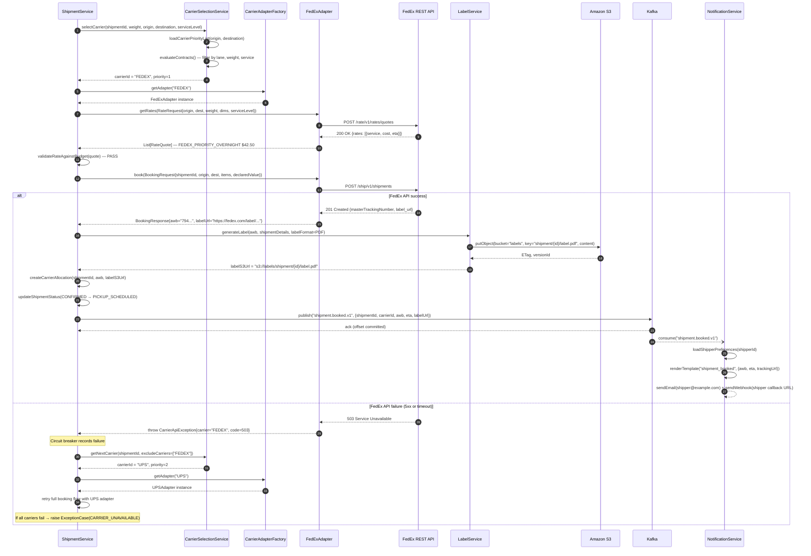
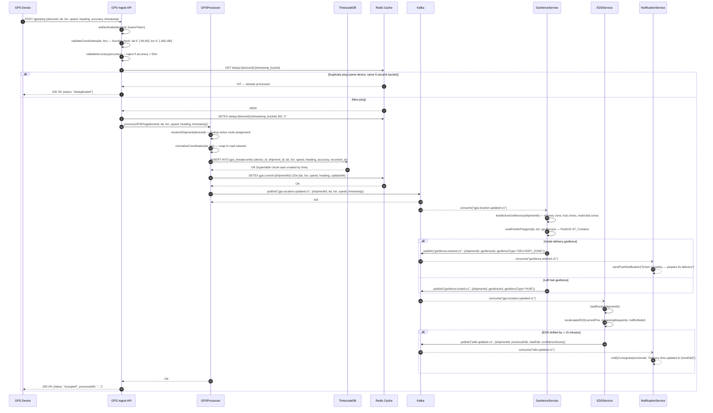
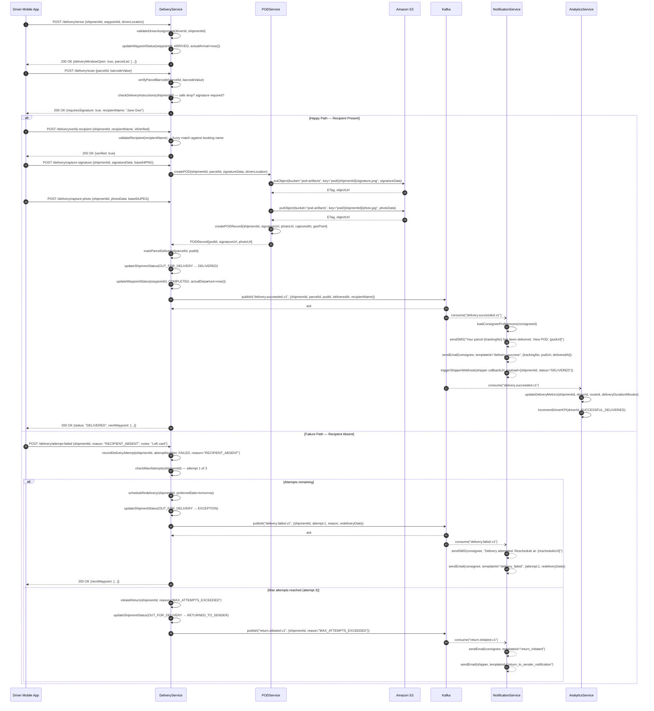
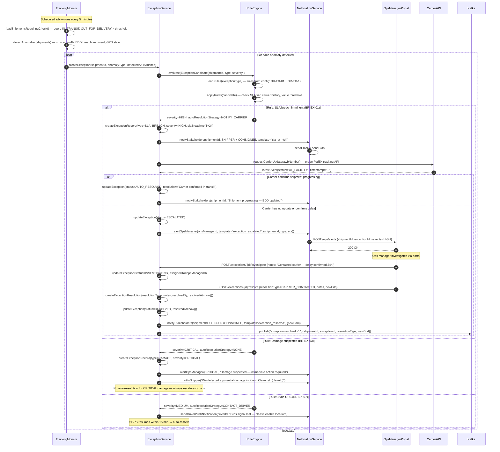

# Sequence Diagram

This document contains detailed interaction sequence diagrams for the Logistics Tracking System's four most critical flows. Each diagram models the exact message exchanges, error paths, and asynchronous events between services and external systems.

---

## Sequence 1: Carrier Allocation Process

Triggered when a confirmed shipment needs to be booked with a carrier. The `ShipmentService` delegates carrier selection and booking, with automatic fallback to the next carrier on failure.

### Carrier Allocation — Notes

| Step | Detail |
|---|---|
| Carrier priority list | Loaded from `carrier_lane_contracts` table; ordered by cost ASC, SLA compliance DESC |
| Rate validation | Budget policy checked: `allocatedRate ≤ declaredValue × 0.15` (configurable per tenant) |
| Label storage | Labels stored in S3 with server-side encryption; URL signed on demand with 1-hour expiry for driver app |
| Circuit breaker | Per-carrier Resilience4j circuit; opens after 5 failures in 60s; half-open probe every 30s |
| Fallback chain | FedEx → UPS → DHL → USPS → manual exception queue |

---

## Sequence 2: GPS Update Processing

High-throughput path for raw GPS pings from driver devices. Designed for 10,000+ pings/second with deduplication, geofence evaluation, and EDD recalculation.

### GPS Processing — Notes

| Concern | Implementation |
|---|---|
| Deduplication | Redis key: `dedup:{deviceId}:{floor(timestamp/5)}` — 5-second buckets, 30s TTL |
| TimescaleDB hypertable | Partitioned by `recorded_at` (1-day chunks); compression after 7 days; continuous aggregate for hourly summaries |
| Redis TTL on current position | 120s — if no ping for 2 min, current position is stale; UI shows "last known" label |
| EDD recalculation threshold | 15-minute shift to avoid notification fatigue; configurable per service level |
| Coordinate validation | `lat ∈ [-90, 90]` and `lon ∈ [-180, 180]`; accuracy > 50m rejected; speed > 200 km/h flagged |
| Kafka topic throughput | `gps.location.updated.v1` — 64 partitions, keyed by `shipmentId` for ordered processing |

---

## Sequence 3: Delivery Attempt with POD Capture

The last-mile delivery flow, covering both the happy path (successful delivery with signature/photo) and the failure path (recipient absent, multiple attempts, return initiation).

### POD Capture — Notes

| Step | Detail |
|---|---|
| Signature storage | PNG encoded as base64 in app; decoded server-side; stored in S3 `pod-artifacts` bucket with AES-256 |
| Photo storage | JPEG, max 5 MB; resized to 1024×768 on upload; original retained for 90 days then purged |
| Recipient verification | Fuzzy match using Levenshtein distance ≤ 2; override allowed by dispatcher with audit log |
| Max delivery attempts | Default 3; configurable per service level (OVERNIGHT = 1 attempt, ECONOMY = 3) |
| POD URL access | Pre-signed S3 URL, 7-day expiry; shipper portal generates fresh URL on demand |
| Safe-drop rules | If `safeDropAllowed=true` and no signature required → contactless delivery; photo mandatory |

---

## Sequence 4: Exception Detection and Auto-Resolution

The monitoring loop that detects SLA breaches, damage reports, and stale scan events, then attempts automated resolution before escalating to the operations team.

### Exception Handling — Business Rules Reference

| Rule ID | Trigger Condition | Severity | Auto-Resolution |
|---|---|---|---|
| BR-EX-01 | No carrier scan for > 4h while IN_TRANSIT | HIGH | Probe carrier API, notify if progressing |
| BR-EX-02 | Delivery EDD breached with no OUT_FOR_DELIVERY scan | HIGH | Escalate to ops, notify shipper |
| BR-EX-03 | Carrier reports damage event | CRITICAL | None — immediate ops escalation |
| BR-EX-04 | Address validation failed at delivery | MEDIUM | Request shipper address correction |
| BR-EX-05 | Customs hold flag from carrier | HIGH | Notify customs broker, hold shipment |
| BR-EX-06 | 3rd delivery attempt failed | HIGH | Initiate return, notify both parties |
| BR-EX-07 | GPS stale > 30 min during active route | MEDIUM | Push notification to driver |
| BR-EX-08 | Shipment weight exceeds booked weight by > 10% | LOW | Flag for billing correction |
| BR-EX-09 | Carrier AWB cancelled externally | CRITICAL | Rebook with alternate carrier |
| BR-EX-10 | Temperature excursion on refrigerated shipment | CRITICAL | Immediate ops + shipper alert |
| BR-EX-11 | Vehicle breakdown event from driver app | HIGH | Reassign parcels to alternate driver |
| BR-EX-12 | Auto-escalation timeout — exception open > 4h | HIGH | Auto-escalate to ops manager |

---

## Integration Retry and Idempotency

- **Event publishing:** Outbox pattern — mutations and outbox records committed atomically; relay publishes with exponential backoff (`base=500ms`, `factor=2`, `max=5m`, jitter=±20%).
- **Deduplication:** `event_id` is a UUID; consumers persist `(event_id, consumer_group, processed_at)` before executing side-effects.
- **API idempotency:** All mutating endpoints require `Idempotency-Key` header; scoped by `(tenantId, route, key)`; 24-hour retention.
- **Webhook retries:** 3 fast retries (5s, 15s, 30s) + 8 slow retries (5m, 15m, 30m…); HMAC-signed payloads; exhausted → DLQ with replay tooling.
- **GPS ingest:** Fire-and-forget with 200 OK acknowledgement; no back-pressure to device; TimescaleDB and Redis writes are async.

