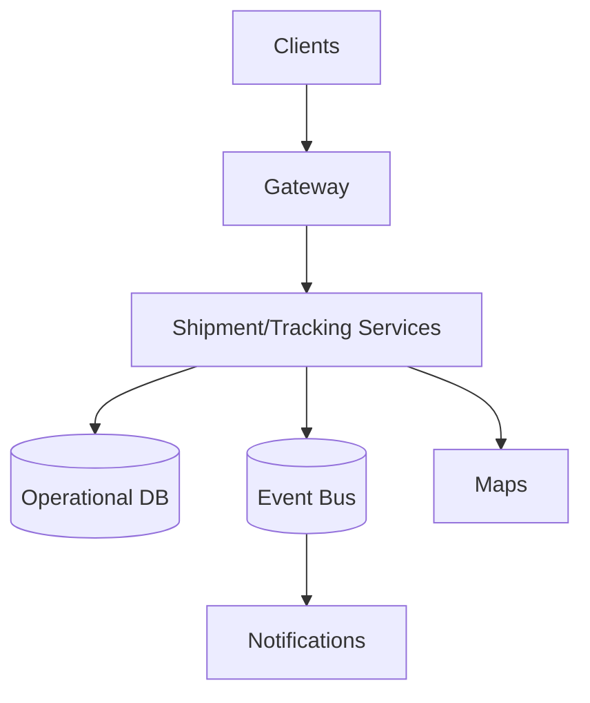

# Architecture Diagram

```mermaid
flowchart TB
  Clients --> Gateway --> Core[Shipment/Tracking Services]
  Core --> DB[(Operational DB)]
  Core --> MQ[(Event Bus)]
  MQ --> Notifications
  Core --> Maps
```
