# Architecture Diagram

## 1. Architecture Overview

The Logistics Tracking System is built as an **event-driven microservices architecture** deployed on **Kubernetes**. Each service owns its own data store and communicates through either synchronous REST/gRPC calls (for low-latency, user-facing reads) or asynchronous Kafka events (for all domain state changes). This separation ensures that a downstream service failure never blocks the critical path of shipment creation or GPS ingest.

Key architectural properties:
- **Polyglot persistence** — each service picks the storage engine that matches its access pattern (relational, time-series, document, cache).
- **Event sourcing lite** — the Kafka topic log is the canonical record of all tracking events; services rebuild read models by replaying topics.
- **Outbox pattern** — every service that publishes to Kafka does so via a transactional outbox table to guarantee at-least-once delivery without distributed transactions.
- **CQRS at service boundaries** — write paths (commands) are separated from read paths (queries) at the API level; high-read services (Tracking, GPS) expose dedicated read replicas.
- **Horizontal scale by default** — stateless services scale via Kubernetes HPA on CPU/memory; stateful consumers scale by Kafka partition count.

---

## 2. Full System Architecture Diagram

```mermaid
flowchart TB
  %% ── External actors ──────────────────────────────────────────────
  subgraph External["External Systems & Actors"]
    direction TB
    ShipperCli["Shipper\n(Web / API Client)"]
    ConsigneeCli["Consignee\n(Tracking Page)"]
    DriverApp["Driver\n(Mobile App)"]
    OpsUI["Operations Manager\n(Dashboard)"]
    CarrierAPIs["Carrier APIs\n(FedEx / UPS / DHL / USPS)"]
    GPSDevices["GPS / Telematics\nDevices"]
    MapsAPI["Maps API\n(Google / HERE)"]
    EmailSMS["Notification Providers\n(SendGrid / Twilio / FCM)"]
    CustomsGov["Customs Authority\n(Gov APIs)"]
  end

  %% ── Edge layer ───────────────────────────────────────────────────
  subgraph Edge["Edge Layer"]
    CDN["CDN\n(Public Tracking Page)"]
    GW["API Gateway\n(Kong / nginx)"]
  end

  %% ── Application microservices ────────────────────────────────────
  subgraph Services["Application Microservices"]
    direction TB
    ShipSvc["Shipment Service\n(Node.js)"]
    TrackSvc["Tracking Service\n(Go)"]
    CarrierSvc["Carrier Integration Service\n(Node.js)"]
    RouteSvc["Route Optimization Service\n(Python)"]
    NotifSvc["Notification Service\n(Node.js)"]
    CustomsSvc["Customs Service\n(Node.js)"]
    ReturnsSvc["Returns Service\n(Node.js)"]
    AnalyticsSvc["Analytics Service\n(Python)"]
    GPSSvc["GPS Processing Service\n(Go)"]
    LabelSvc["Label Service\n(Node.js)"]
  end

  %% ── Messaging backbone ───────────────────────────────────────────
  subgraph Messaging["Messaging Backbone"]
    Kafka["Apache Kafka\n(Event Bus)"]
    DLQ["Dead-Letter Queue\n(Kafka DLQ topics)"]
    Outbox["Outbox Relay\n(Debezium CDC)"]
  end

  %% ── Data stores ──────────────────────────────────────────────────
  subgraph DataStores["Data Stores"]
    PG[("PostgreSQL\n(Transactional DB)")]
    TSDB[("TimescaleDB\n(GPS Time-Series)")]
    Redis[("Redis Cluster\n(Cache + Sessions + Rate-Limit)")]
    ES[("Elasticsearch\n(Tracking Search)")]
    S3["S3-Compatible Store\n(Labels + POD Photos)"]
  end

  %% ── Edge connections ─────────────────────────────────────────────
  ShipperCli -->|"HTTPS REST"| GW
  ConsigneeCli -->|"HTTPS"| CDN
  CDN -->|"cache miss"| GW
  DriverApp -->|"HTTPS REST / WebSocket"| GW
  OpsUI -->|"HTTPS REST"| GW

  %% ── Gateway to services ──────────────────────────────────────────
  GW -->|"REST"| ShipSvc
  GW -->|"REST"| TrackSvc
  GW -->|"REST"| RouteSvc
  GW -->|"REST"| ReturnsSvc
  GW -->|"REST"| AnalyticsSvc
  GW -->|"UDP / HTTP"| GPSSvc

  %% ── Service to data stores ───────────────────────────────────────
  ShipSvc -->|"read/write"| PG
  TrackSvc -->|"read"| ES
  TrackSvc -->|"read"| Redis
  CarrierSvc -->|"read/write"| PG
  RouteSvc -->|"read/write"| PG
  RouteSvc -->|"read"| Redis
  NotifSvc -->|"read"| PG
  CustomsSvc -->|"read/write"| PG
  ReturnsSvc -->|"read/write"| PG
  AnalyticsSvc -->|"read"| PG
  AnalyticsSvc -->|"read"| TSDB
  GPSSvc -->|"write"| TSDB
  GPSSvc -->|"write"| Redis
  LabelSvc -->|"write"| S3

  %% ── Outbox / Kafka ───────────────────────────────────────────────
  PG -->|"CDC"| Outbox
  Outbox -->|"publish"| Kafka
  GPSSvc -->|"publish"| Kafka
  Kafka -->|"consume"| TrackSvc
  Kafka -->|"consume"| CarrierSvc
  Kafka -->|"consume"| RouteSvc
  Kafka -->|"consume"| NotifSvc
  Kafka -->|"consume"| CustomsSvc
  Kafka -->|"consume"| ReturnsSvc
  Kafka -->|"consume"| AnalyticsSvc
  Kafka -->|"consume"| LabelSvc
  Kafka -->|"failed msgs"| DLQ

  %% ── External integrations ────────────────────────────────────────
  CarrierSvc -->|"REST/SOAP"| CarrierAPIs
  GPSDevices -->|"UDP / MQTT"| GPSSvc
  RouteSvc -->|"REST"| MapsAPI
  NotifSvc -->|"REST"| EmailSMS
  CustomsSvc -->|"REST"| CustomsGov

  %% ── Search indexing ──────────────────────────────────────────────
  TrackSvc -->|"index events"| ES
```



---

## 3. Technology Decisions

| Technology | Role in System | Key Rationale |
|---|---|---|
| **Apache Kafka** | Central event bus for all domain events | High-throughput (millions of events/day), ordered delivery per partition, consumer-group replay for new service onboarding, durable log retention for audit |
| **TimescaleDB** | GPS and telemetry time-series storage | Automatic hypertable partitioning by `recorded_at`, native time-series SQL functions (`time_bucket`, `first`, `last`), 10–100× faster than plain PostgreSQL for range queries on timestamped rows |
| **Redis Cluster** | Latest GPS position cache, session store, rate limiter | Sub-millisecond reads for live tracking map, atomic `SETEX` for TTL-based position expiry, Redis Sorted Sets for driver leaderboard, built-in sliding-window rate limiting via Lua scripts |
| **Elasticsearch** | Full-text and faceted search on tracking events and shipment history | Inverted index enables instant keyword search across millions of tracking events; geo-distance queries for "shipments near hub"; aggregations for ops dashboards |
| **PostgreSQL** | Canonical transactional store for shipments, carriers, routes, drivers | ACID guarantees for financial-grade shipment records, foreign-key referential integrity, row-level locking for allocation, JSONB for flexible carrier-specific metadata |
| **Go (GPS Processing, Tracking)** | High-throughput stream processing services | Near-C performance with safe concurrency via goroutines; ideal for processing thousands of GPS pings/sec and fan-out event publication |
| **Node.js (Shipment, Carrier, Notification)** | Business-logic services with heavy I/O | Non-blocking I/O suits services that orchestrate multiple downstream calls; rich npm ecosystem for carrier SDK wrappers |
| **Python (Route Optimization, Analytics)** | ML/algorithm-heavy workloads | NumPy/SciPy for VRP solver; pandas + SQLAlchemy for analytics ETL; OR-Tools for constraint-based route planning |
| **Kong API Gateway** | Edge routing, auth, rate limiting | Plugin ecosystem (JWT, OAuth2, rate-limit, request-transformer); declarative config via CRDs on Kubernetes |
| **Kubernetes** | Container orchestration | HPA for CPU/memory-based auto-scaling; PodDisruptionBudgets for zero-downtime deploys; namespace isolation per environment |
| **Debezium (Outbox Relay)** | Change-Data-Capture from PostgreSQL to Kafka | Guarantees exactly-once outbox relay without polling; reads WAL directly; no application-level polling loop |
| **S3-Compatible Object Store** | Shipping label PDFs and POD photos | Immutable object storage with lifecycle policies for archival; pre-signed URLs for secure direct browser download |
| **CDN** | Public shipment tracking page assets | Edge-cached HTML/JS reduces origin load; geographic proximity reduces TTFB for consignees globally |

---

## 4. Microservices Responsibility Matrix

| Service | Responsibility | Language | Primary DB | Topics Published | Topics Consumed | Scale Strategy |
|---|---|---|---|---|---|---|
| **API Gateway** | Routing, AuthN/AuthZ, rate limiting, TLS termination | Kong (Lua) | — (stateless) | — | — | Horizontal replicas behind LB |
| **Shipment Service** | Create/update/cancel shipments; owns shipment aggregate | Node.js | PostgreSQL | `shipment.created.v1`, `shipment.updated.v1`, `shipment.cancelled.v1` | `carrier.booked.v1`, `label.generated.v1` | HPA on CPU; read replica for queries |
| **Tracking Service** | Ingest and serve tracking events; update shipment status | Go | Elasticsearch + Redis | `tracking.event.recorded.v1` | `gps.location.updated.v1`, `carrier.scan.received.v1` | HPA on Kafka consumer lag |
| **Carrier Integration Service** | Communicate with FedEx/UPS/DHL/USPS APIs; manage AWB allocation | Node.js | PostgreSQL | `carrier.booked.v1`, `carrier.scan.received.v1` | `shipment.created.v1`, `shipment.cancelled.v1` | HPA on queue depth; per-carrier circuit breakers |
| **GPS Processing Service** | Ingest raw GPS pings; validate, normalize, store; detect geofence events | Go | TimescaleDB + Redis | `gps.location.updated.v1`, `geofence.entered.v1`, `geofence.exited.v1` | — | HPA on UDP/MQTT ingest rate |
| **Route Optimization Service** | Plan last-mile delivery routes; compute EDD; sequence waypoints | Python | PostgreSQL + Redis | `route.planned.v1`, `edd.updated.v1` | `shipment.created.v1`, `gps.location.updated.v1` | Scale on batch route-planning jobs |
| **Notification Service** | Dispatch push, email, and SMS notifications on trigger events | Node.js | PostgreSQL | `notification.sent.v1` | `shipment.created.v1`, `tracking.event.recorded.v1`, `edd.updated.v1`, `exception.raised.v1` | HPA on Kafka consumer lag |
| **Customs Service** | Manage customs declarations; interface with government APIs | Node.js | PostgreSQL | `customs.cleared.v1`, `customs.held.v1` | `shipment.created.v1` | Low replica count; scale on international shipment volume |
| **Returns Service** | Initiate and track reverse-logistics flows | Node.js | PostgreSQL | `return.initiated.v1`, `return.received.v1` | `shipment.delivered.v1`, `exception.raised.v1` | HPA on return request rate |
| **Analytics Service** | Aggregate delivery metrics; feed BI dashboards; detect anomalies | Python | PostgreSQL + TimescaleDB (read) | `analytics.kpi.updated.v1` | All domain events | Batch-scheduled jobs + streaming micro-aggregations |
| **Label Service** | Generate shipping label PDFs; store to S3; produce label URL | Node.js | S3 | `label.generated.v1` | `carrier.booked.v1` | HPA on label generation queue depth |

---

## 5. Communication Patterns

### 5.1 Synchronous REST (User-Facing APIs)
All external-facing operations use synchronous REST over HTTPS routed through the API Gateway. This includes:
- `POST /shipments` — create shipment (idempotency-key required)
- `GET /shipments/{id}/tracking` — fetch tracking timeline
- `GET /tracking/{trackingNumber}` — public consignee tracking page
- `POST /returns` — initiate return

REST is chosen here for predictable request/response semantics, easy debuggability, and standard HTTP caching headers for the CDN.

### 5.2 Asynchronous Kafka Events (Domain Events)
All cross-service domain state propagation uses Kafka. Events are partitioned by `shipment_id` to preserve ordering within a shipment's lifecycle. Consumers use consumer groups for parallel processing and offset commits for at-least-once delivery. Each service publishes events only after successfully committing its own transaction (via Outbox/Debezium).

### 5.3 gRPC (Internal High-Frequency Service-to-Service)
High-frequency, low-latency internal calls use gRPC with Protocol Buffers:
- **GPS Processing Service → Tracking Service**: real-time position fan-out (thousands/sec)
- **Route Optimization Service → Tracking Service**: EDD push on route recalculation
- **Carrier Integration Service → Shipment Service**: synchronous AWB confirmation

gRPC is chosen for binary efficiency, strongly-typed contracts, and bi-directional streaming support.

---

## 6. Data Flow Summary for Key Paths

### 6.1 Shipment Booking Flow
```
Shipper → API Gateway → Shipment Service
  → validate address, weight, SLA class
  → write shipment + outbox record (single transaction, PostgreSQL)
  → Debezium CDC → Kafka [shipment.created.v1]
  → Carrier Integration Service consumes → calls FedEx/UPS/DHL REST API
  → writes CarrierAllocation + outbox [carrier.booked.v1]
  → Label Service consumes → generates PDF → stores S3 → publishes [label.generated.v1]
  → Notification Service consumes → sends booking confirmation email/SMS to shipper
```

### 6.2 GPS Tracking Update Flow
```
GPS Device (MQTT/UDP) → GPS Processing Service
  → validate coordinates (bounding box, speed sanity check)
  → normalize to internal GPSCoordinate value object
  → write to TimescaleDB hypertable
  → SETEX latest position in Redis (TTL 5 min)
  → publish [gps.location.updated.v1] to Kafka
    ├─ Tracking Service: geofence intersection check → may publish [geofence.entered.v1]
    ├─ Route Service: recalculate EDD if driver deviated → publish [edd.updated.v1]
    └─ Notification Service: send ETA-change alert to consignee if Δ > threshold
```

### 6.3 Last-Mile Delivery Flow
```
Route Optimization Service → sequence waypoints → publish [route.planned.v1]
Driver App receives route → navigates → arrives at stop
  → scans parcel barcode → POST /delivery-attempts
  → Delivery Service records attempt → outcome: SUCCESS
  → Driver captures signature/photo → POST /pod
  → POD Service validates + stores S3 → publish [delivery.succeeded.v1] (with pod_url)
  → Notification Service → sends "Your parcel has been delivered" to consignee
  → Analytics Service → increments first-attempt-delivery-rate metric
```

---

## 7. Shipment State Machine

| State | Entry Criteria | Allowed Next States | Exit Event | Operational Notes |
|---|---|---|---|---|
| `Draft` | Shipment request created but not committed | `Confirmed`, `Cancelled` | `shipment.confirmed.v1` | No external notifications before confirmation. |
| `Confirmed` | Capacity and address validation passed | `PickupScheduled`, `Cancelled` | `shipment.pickup_scheduled.v1` | SLA clock starts. Carrier booking initiated. |
| `PickupScheduled` | Pickup slot assigned and carrier booked | `PickedUp`, `Exception`, `Cancelled` | `shipment.picked_up.v1` | Missed pickup auto-raises exception after threshold. |
| `PickedUp` | Driver/hub scan confirms custody | `InTransit`, `Exception` | `shipment.in_transit.v1` | Chain-of-custody records required. |
| `InTransit` | Shipment moving between hubs/line-haul legs | `OutForDelivery`, `Exception`, `Lost` | `shipment.out_for_delivery.v1` | GPS telemetry cadence must remain within SLA. |
| `OutForDelivery` | Last-mile route assigned and driver en route | `Delivered`, `Exception`, `ReturnedToSender` | `shipment.delivered.v1` | Customer contact window and POD policy enforced. |
| `Exception` | Delay/damage/address/customs issue detected | `InTransit`, `OutForDelivery`, `ReturnedToSender`, `Cancelled`, `Lost` | `shipment.exception_resolved.v1` | Every exception requires owner + ETA to resolution. |
| `Delivered` | Proof of delivery accepted | *(terminal)* | `shipment.closed.v1` | Immutable except audit annotations. |
| `ReturnedToSender` | Return workflow completed | *(terminal)* | `shipment.closed.v1` | Financial settlement rules apply. |
| `Cancelled` | Shipment cancelled prior to completion | *(terminal)* | `shipment.closed.v1` | Cancellation reason required for analytics. |
| `Lost` | Investigation concludes unrecoverable loss | *(terminal)* | `shipment.closed.v1` | Claims and compliance path triggered. |

---

## 8. Integration Reliability Specification

- **Publish reliability:** Command-handling transactions persist domain mutations and outbox records atomically via a single PostgreSQL transaction. Debezium reads the WAL and publishes to Kafka with exponential backoff (`base=500ms`, `factor=2`, `max=5m`) and jitter on failure.
- **Deduplication contract:** `event_id` (UUID v4) is globally unique. Consumers persist `(event_id, consumer_group, processed_at, outcome_hash)` to an idempotency table before executing side-effects.
- **API idempotency:** All mutating HTTP endpoints require an `Idempotency-Key` header. Keys are scoped by `(tenant_id, route, key)` and stored for 24 hours. Duplicate requests return the original response.
- **Carrier API resilience:** Carrier Integration Service uses per-carrier circuit breakers (Hystrix/Resilience4j pattern) with a fallback to "pending" allocation state and a retry queue.
- **Webhook retries:** 3 fast retries (1s, 5s, 30s) + 8 slow retries (5m, 30m, 1h, 2h × 5) with HMAC-signed payload replay protection. After exhaustion, messages are routed to the DLQ with a replay tooling interface.
- **Replay safety:** Backfills run via replay jobs that attach a `replay_batch_id` metadata field, suppress duplicate notifications and billing triggers, and emit `replay.processed.v1` audit events.

---

## 9. Monitoring, SLOs, and Alerting

### Golden Signals

| Signal | Measurement Point | Target |
|---|---|---|
| GPS ping ingest latency | UDP receipt → TimescaleDB write | P95 < 200ms |
| Scan-to-visibility latency | `scan_received` → Elasticsearch indexed | P95 < 60s |
| Commit-to-publish latency | Outbox record written → Kafka broker ack | P95 < 5s |
| Consumer lag | Per consumer group, per partition | < 10,000 msgs |
| Exception detection to notification | Exception event → customer SMS/push | P95 < 3 min |
| DLQ depth | Total unprocessed messages in DLQ topics | < 100 msgs |
| Carrier API error rate | 5xx responses from carrier APIs | < 1% per carrier |
| Delivery first-attempt success rate | Successful deliveries / total attempts | > 90% |

### Alert Severity Policy

- **SEV-1 (page on-call immediately):** Kafka broker unavailable; GPS ingest pipeline stopped; Outbox relay stalled > 5 min; PostgreSQL primary unreachable.
- **SEV-2 (notify team within 15 min):** DLQ depth growing > 500 msgs for 15 min; ETA model stale > 10 min; carrier API circuit breaker open; webhook failure burst > 5% for 10 min.
- **SEV-3 (ticket, resolve within business hours):** Schema drift warnings from Kafka Schema Registry; duplicate event spike; non-critical integration flapping; Redis memory > 80%.

### Runbook Requirements
Every alert must link to: owning team, Grafana dashboard, triage checklist, step-by-step mitigation steps, replay command (e.g., `kafka-replay-tool --topic shipment.created.v1 --from-offset X`), and a stakeholder communications template.

