# Domain Model

## 1. Domain Model Overview

The Logistics Tracking System is decomposed into **eight bounded contexts**, each owning a distinct part of the domain vocabulary and lifecycle. Cross-context communication happens exclusively through published domain events consumed asynchronously — never through shared database tables or direct service calls for state mutation.

| Bounded Context | Core Concern | Aggregate Roots |
|---|---|---|
| **Shipment Context** | The commercial contract to move goods from origin to destination | `Shipment` |
| **Carrier Context** | The relationship with an external carrier and the booking of capacity | `CarrierAllocation` |
| **Tracking Context** | The real-time and historical position and status of a shipment | `TrackingEvent`, `Geofence` |
| **Delivery Context** | The last-mile execution: routes, drivers, vehicles, and delivery attempts | `Route` |
| **POD Context** | Proof that delivery occurred (signature, photo, OTP) | `ProofOfDelivery` |
| **Exception Context** | Any deviation from the expected journey requiring investigation | `Exception` |
| **Compliance Context** | Customs declarations and hazardous-material certifications | `CustomsDeclaration` |
| **Returns Context** | Reverse-logistics flows initiated by consignee or exception | `ReturnShipment` |

---

## 2. Domain Class Diagram

```mermaid
classDiagram
  %% ── Value Objects ────────────────────────────────────────────────
  class Address {
    +String street
    +String city
    +String state
    +String postalCode
    +String countryCode
    +validate() Boolean
    +toGeocodeQuery() String
  }
  class Money {
    +Decimal amount
    +String currencyCode
    +add(Money) Money
    +subtract(Money) Money
  }
  class Dimensions {
    +Decimal lengthCm
    +Decimal widthCm
    +Decimal heightCm
    +Decimal weightKg
    +volumetricWeight() Decimal
  }
  class GPSCoordinate {
    +Float latitude
    +Float longitude
    +Float altitudeM
    +Float accuracyM
    +distanceTo(GPSCoordinate) Float
  }

  %% ── Shipment Context ─────────────────────────────────────────────
  class Shipment {
    <<AggregateRoot>>
    +UUID id
    +String trackingNumber
    +ShipmentStatus status
    +Address originAddress
    +Address destinationAddress
    +DateTime slaDeadline
    +String serviceClass
    +confirm() void
    +schedulePickup(slot) void
    +markPickedUp(scanData) void
    +markInTransit(hubCode) void
    +markOutForDelivery(routeId) void
    +markDelivered(podId) void
    +raiseException(reason) void
    +cancel(reason) void
  }
  class ShipmentItem {
    +UUID id
    +String sku
    +String description
    +Integer quantity
    +Money declaredValue
    +Boolean isHazmat
  }
  class Parcel {
    +UUID id
    +String barcode
    +Dimensions dimensions
    +String labelUrl
    +ParcelStatus status
  }

  %% ── Carrier Context ──────────────────────────────────────────────
  class CarrierAllocation {
    <<AggregateRoot>>
    +UUID id
    +UUID shipmentId
    +String carrierId
    +String awbNumber
    +String serviceCode
    +Money freightCost
    +AllocationStatus status
    +confirmBooking(awb) void
    +cancel(reason) void
  }
  class Carrier {
    +String id
    +String name
    +String[] supportedCountries
    +Boolean isActive
  }
  class CarrierService {
    +String code
    +String name
    +Integer maxWeightKg
    +Integer transitDays
    +Money baseRate
  }

  %% ── Tracking Context ─────────────────────────────────────────────
  class TrackingEvent {
    <<AggregateRoot>>
    +UUID id
    +UUID shipmentId
    +String eventCode
    +String description
    +GPSCoordinate location
    +String facilityCode
    +DateTime recordedAt
    +String source
  }
  class GPSBreadcrumb {
    +UUID id
    +UUID driverId
    +GPSCoordinate position
    +Float speedKmh
    +Float headingDeg
    +DateTime recordedAt
  }
  class Geofence {
    <<AggregateRoot>>
    +UUID id
    +String name
    +String type
    +GPSCoordinate center
    +Float radiusMeters
    +String[] linkedShipmentIds
    +contains(GPSCoordinate) Boolean
  }

  %% ── Delivery Context ─────────────────────────────────────────────
  class Route {
    <<AggregateRoot>>
    +UUID id
    +UUID driverId
    +UUID vehicleId
    +Date routeDate
    +RouteStatus status
    +DateTime estimatedStart
    +plan(stops) void
    +start() void
    +complete() void
    +recalculateEDD() void
  }
  class Waypoint {
    +Integer sequence
    +UUID shipmentId
    +Address address
    +DateTime eddArrival
    +DateTime actualArrival
    +WaypointStatus status
  }
  class Driver {
    +UUID id
    +String name
    +String licenseNumber
    +String mobileNumber
    +DriverStatus status
  }
  class Vehicle {
    +UUID id
    +String licensePlate
    +String type
    +Decimal maxPayloadKg
    +Decimal maxVolumeM3
  }
  class DeliveryAttempt {
    +UUID id
    +UUID shipmentId
    +UUID driverId
    +Integer attemptNumber
    +DateTime attemptedAt
    +AttemptOutcome outcome
    +String failureReason
    +GPSCoordinate location
  }

  %% ── POD Context ──────────────────────────────────────────────────
  class ProofOfDelivery {
    +UUID id
    +UUID shipmentId
    +UUID deliveryAttemptId
    +String recipientName
    +DateTime capturedAt
    +String podType
  }
  class SignatureCapture {
    +String signatureImageUrl
    +String signerName
    +DateTime capturedAt
  }
  class PhotoCapture {
    +String photoUrl
    +GPSCoordinate takenAt
    +DateTime capturedAt
  }

  %% ── Exception Context ────────────────────────────────────────────
  class Exception {
    <<AggregateRoot>>
    +UUID id
    +UUID shipmentId
    +ExceptionType type
    +ExceptionSeverity severity
    +ExceptionStatus status
    +String ownerId
    +DateTime detectedAt
    +DateTime slaDeadline
    +raise(reason) void
    +assign(ownerId) void
    +resolve(resolution) void
    +escalate() void
  }
  class ExceptionResolution {
    +UUID id
    +String resolutionCode
    +String notes
    +DateTime resolvedAt
    +String resolvedBy
  }

  %% ── Compliance Context ───────────────────────────────────────────
  class CustomsDeclaration {
    +UUID id
    +UUID shipmentId
    +String declarationNumber
    +Money declaredValue
    +String harmonicCode
    +DeclarationStatus status
    +submit() void
    +markCleared() void
    +markHeld(reason) void
  }
  class HazmatDeclaration {
    +UUID id
    +UUID shipmentId
    +String unNumber
    +String hazmatClass
    +String packingGroup
    +String emergencyContact
  }

  %% ── Returns Context ──────────────────────────────────────────────
  class ReturnShipment {
    +UUID id
    +UUID originalShipmentId
    +ReturnReason reason
    +ReturnStatus status
    +String returnTrackingNumber
    +Address pickupAddress
    +initiate(reason) void
    +schedulePickup(slot) void
    +markReceived() void
    +processRefund() void
  }

  %% ── Relationships ────────────────────────────────────────────────
  Shipment "1" *-- "1..*" ShipmentItem : contains
  Shipment "1" *-- "1..*" Parcel : contains
  Shipment "1" --> "0..1" CarrierAllocation : booked via
  Shipment "1" --> "0..*" TrackingEvent : tracked by
  Shipment "1" --> "0..*" DeliveryAttempt : attempted via
  Shipment "1" --> "0..1" ProofOfDelivery : proven by
  Shipment "1" --> "0..*" Exception : may raise
  Shipment "1" --> "0..1" CustomsDeclaration : declared via
  Shipment "1" --> "0..1" ReturnShipment : reversed by
  CarrierAllocation "1" --> "1" Carrier : uses
  Carrier "1" *-- "1..*" CarrierService : offers
  CarrierAllocation "1" --> "1" CarrierService : booked on
  Route "1" *-- "1..*" Waypoint : sequences
  Route "1" --> "1" Driver : assigned to
  Route "1" --> "1" Vehicle : uses
  Route "1" --> "0..*" DeliveryAttempt : produces
  ProofOfDelivery "1" *-- "0..1" SignatureCapture : may include
  ProofOfDelivery "1" *-- "0..1" PhotoCapture : may include
  Exception "1" *-- "0..*" ExceptionResolution : resolved via
  CustomsDeclaration "1" --> "0..1" HazmatDeclaration : may accompany
  GPSBreadcrumb "0..*" --> "1" Driver : belongs to
  Geofence "1" ..> "0..*" TrackingEvent : triggers
```

---

## 3. Aggregate Boundaries

### 3.1 Shipment Aggregate
**Root:** `Shipment`
**Owned Entities:** `ShipmentItem`, `Parcel`

The Shipment aggregate is the central unit of work in the system. It owns the commercial intent (what is being shipped, from where, to where, under what SLA) and its collection of physical parcels. All state transitions happen through public methods on `Shipment`, never by directly mutating child entities from outside.

- `ShipmentItem` represents a line item on the commercial invoice — it cannot exist without its parent Shipment.
- `Parcel` represents a physical package with a scannable barcode and label. A single shipment may contain multiple parcels.

**Invariants:**
- A Shipment cannot be confirmed without a valid origin and destination address.
- Total declared value across all ShipmentItems must be positive if customs declaration is required.
- A Parcel's weight must not exceed the carrier service's maximum payload.
- State transitions must follow the allowed state machine paths; invalid transitions throw a `ShipmentInvalidTransitionException`.

### 3.2 CarrierAllocation Aggregate
**Root:** `CarrierAllocation`

Encapsulates a single booking with an external carrier for a specific Shipment. It is a separate aggregate because carrier booking is an eventually-consistent, external-system-dependent operation. The Shipment does not directly own the allocation — it references it by ID.

- `AllocationStatus`: `PENDING` → `CONFIRMED` → `CANCELLED`
- Once `CONFIRMED`, the AWB number is immutable.

**Invariants:**
- An allocation can only be confirmed if the carrier API has returned an AWB number.
- Cancellation of a confirmed allocation requires a carrier-specific reason code.

### 3.3 Route Aggregate
**Root:** `Route`
**Owned Entities:** `Waypoint`

Represents a single driver's delivery run for a day. Waypoints are ordered by sequence and hold the per-stop EDD. The Route aggregate manages its own state machine:
`DRAFT` → `PLANNED` → `IN_PROGRESS` → `COMPLETED` / `INCOMPLETE`.

**Invariants:**
- A Route must have at least one Waypoint before it can be moved to `PLANNED`.
- The assigned Driver must have an active license and be available on the route date.
- Vehicle payload capacity must not be exceeded by the sum of all parcel weights on the route.

### 3.4 Exception Aggregate
**Root:** `Exception`
**Owned Entities:** `ExceptionResolution`

Represents a detected deviation requiring human or automated intervention. Once raised, it cannot be deleted — only resolved. Each resolution attempt is recorded.

**Invariants:**
- An Exception must have an owner assigned within 30 minutes of being raised (SLA monitored).
- An Exception can only transition to `RESOLVED` if at least one `ExceptionResolution` exists.
- A `CRITICAL` severity exception triggers an immediate SEV-2 alert.

---

## 4. Domain Events

| Aggregate | Event | Payload Highlights | Consumers |
|---|---|---|---|
| `Shipment` | `shipment.created.v1` | shipmentId, origin, destination, slaDeadline, serviceClass | Carrier Integration, Customs, Analytics |
| `Shipment` | `shipment.confirmed.v1` | shipmentId, confirmedAt | Notification |
| `Shipment` | `shipment.picked_up.v1` | shipmentId, driverId, facilityCode, scannedAt | Tracking, Analytics |
| `Shipment` | `shipment.in_transit.v1` | shipmentId, hubCode, departedAt | Tracking, Notification |
| `Shipment` | `shipment.out_for_delivery.v1` | shipmentId, routeId, driverId, edd | Notification |
| `Shipment` | `shipment.delivered.v1` | shipmentId, podId, deliveredAt | Notification, Analytics, Returns |
| `Shipment` | `shipment.cancelled.v1` | shipmentId, reason, cancelledAt | Carrier Integration, Notification, Analytics |
| `CarrierAllocation` | `carrier.booked.v1` | allocationId, shipmentId, carrierId, awbNumber | Label Service, Shipment Service |
| `CarrierAllocation` | `carrier.scan_received.v1` | shipmentId, awbNumber, eventCode, facilityCode | Tracking Service |
| `Route` | `route.planned.v1` | routeId, driverId, waypointCount, estimatedStart | Driver App, Notification |
| `Route` | `edd.updated.v1` | shipmentId, oldEdd, newEdd, reason | Notification, Analytics |
| `TrackingEvent` | `tracking.event.recorded.v1` | shipmentId, eventCode, location, recordedAt | Analytics, Notification |
| `GPSBreadcrumb` | `gps.location.updated.v1` | driverId, shipmentId, coordinate, speedKmh | Tracking, Route, Notification |
| `Geofence` | `geofence.entered.v1` | geofenceId, driverId, shipmentId, enteredAt | Tracking, Notification |
| `Exception` | `exception.raised.v1` | exceptionId, shipmentId, type, severity, detectedAt | Notification, Analytics, Ops Dashboard |
| `Exception` | `exception.resolved.v1` | exceptionId, shipmentId, resolutionCode, resolvedAt | Notification, Analytics |
| `CustomsDeclaration` | `customs.cleared.v1` | declarationId, shipmentId, clearedAt | Shipment Service |
| `CustomsDeclaration` | `customs.held.v1` | declarationId, shipmentId, holdReason | Notification, Exception |
| `ProofOfDelivery` | `pod.captured.v1` | podId, shipmentId, podType, capturedAt, podUrl | Shipment Service, Notification |
| `ReturnShipment` | `return.initiated.v1` | returnId, originalShipmentId, reason | Carrier Integration, Notification |
| `ReturnShipment` | `return.received.v1` | returnId, originalShipmentId, receivedAt | Analytics, Finance |

---

## 5. Invariants and Constraints Summary

| Context | Invariant | Enforcement Layer |
|---|---|---|
| Shipment | State can only advance via allowed transitions | Domain method guard + unit test |
| Shipment | Cannot cancel after `Delivered` or `Lost` | Domain method guard |
| Shipment | At least one parcel required before confirmation | Domain method guard |
| CarrierAllocation | AWB number is immutable once set | DB unique constraint + domain guard |
| Route | Driver availability checked before assignment | Route Service pre-condition |
| Route | Vehicle payload not exceeded | Route Service invariant check |
| Exception | Owner must be assigned within SLA threshold | Exception aging job + alert |
| CustomsDeclaration | Declared value matches ShipmentItem total | Service-level validation |
| ProofOfDelivery | Exactly one POD per delivered parcel | DB unique constraint |
| GPSBreadcrumb | Coordinates within Earth bounding box | GPS Processing Service validation |
| GPSBreadcrumb | Speed < 300 km/h (sanity check) | GPS Processing Service validation |

---

## 6. Architectural Decision Constraints

- **Prefer asynchronous integration between bounded contexts.** No context queries another's database directly.
- **Keep state transitions in one authoritative domain service.** The Shipment Service owns the shipment state machine; no other service mutates shipment status directly.
- **Protect downstream services from duplicate and out-of-order events.** All consumers implement idempotency using `event_id` deduplication tables.
- **Value objects are immutable.** `Address`, `Money`, `Dimensions`, and `GPSCoordinate` are never mutated after creation — new instances replace old ones.
- **Aggregate roots are the only entry points.** External services never manipulate child entities directly; all commands go through the aggregate root's public methods.
