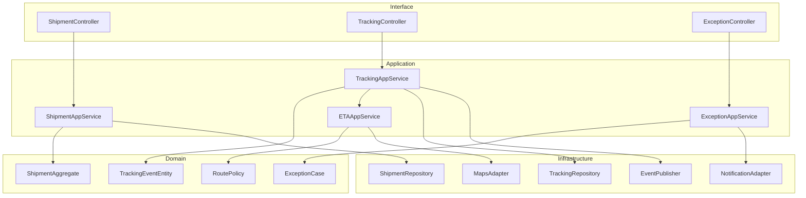
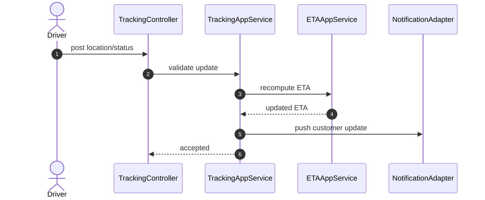

# C4 Code Diagram

This document provides a code-level map for shipment lifecycle and tracking event processing.

## Code-Level Structure

## Critical Runtime Sequence: Tracking Update

## Notes
- Preserve immutable tracking history for audit and dispute handling.
- Recompute ETA asynchronously on bursty update streams when needed.
