# C4 Code Diagram

This document contains C4 Level 4 (Code) diagrams showing the internal class structure of the two most critical paths in the Logistics Tracking System: the GPS ingest path in `tracking-service` and the carrier allocation path in `shipment-service`.

---

## Code Diagram 1: Tracking Service — GPS Ingest Path

This diagram shows the classes involved when a GPS device submits a location update. The path goes from HTTP ingestion → validation → deduplication → batch write → geofence evaluation → cache update → event publication.

```mermaid
classDiagram
    class GPSIngestController {
        -GPSValidator validator
        -BreadcrumbWriter writer
        -GeofenceEvaluator geofenceEvaluator
        -RedisGPSCache cache
        -KafkaEventPublisher publisher
        +handleGPSUpdate(GPSUpdateRequest request) ResponseEntity
        -toGPSBreadcrumb(GPSUpdateRequest req) GPSBreadcrumb
    }

    class GPSUpdateRequest {
        +String deviceId
        +String vehicleId
        +double latitude
        +double longitude
        +double speedKmh
        +int headingDegrees
        +Instant recordedAt
        +String tenantId
    }

    class ValidationResult {
        +boolean valid
        +List~String~ errors
        +static ValidationResult ok() ValidationResult
        +static ValidationResult fail(List~String~ errors) ValidationResult
    }

    class GPSValidator {
        -RedisGPSCache cache
        +validate(GPSUpdateRequest request) ValidationResult
        +isDuplicate(String vehicleId, double lat, double lon, Instant time) boolean
        -isValidCoordinate(double lat, double lon) boolean
        -isOutlier(GPSPosition prev, double lat, double lon, Instant time) boolean
    }

    class GPSBreadcrumb {
        +UUID id
        +String vehicleId
        +String tenantId
        +double latitude
        +double longitude
        +double speedKmh
        +int headingDegrees
        +Instant recordedAt
        +Instant ingestedAt
    }

    class BreadcrumbWriter {
        -TimescaleDBRepository repository
        -List~GPSBreadcrumb~ buffer
        -ScheduledExecutorService flushScheduler
        +write(GPSBreadcrumb breadcrumb) void
        +writeBatch(List~GPSBreadcrumb~ breadcrumbs) void
        -flush() void
    }

    class TimescaleDBRepository {
        -DataSource dataSource
        +insert(GPSBreadcrumb breadcrumb) void
        +insertBatch(List~GPSBreadcrumb~ breadcrumbs) void
        +findByVehicle(String vehicleId, Instant from, Instant to) List~GPSBreadcrumb~
        +findLatestByVehicle(String vehicleId) Optional~GPSBreadcrumb~
    }

    class GeofenceEvaluator {
        -GeofenceRepository geofenceRepo
        +checkGeofences(String vehicleId, double lat, double lon) List~GeofenceEvent~
        -isInsidePolygon(List~Coordinate~ polygon, double lat, double lon) boolean
        -wasInsidePreviously(String vehicleId, String geofenceId) boolean
    }

    class GeofenceEvent {
        +String vehicleId
        +String geofenceId
        +GeofenceEventType type
        +double latitude
        +double longitude
        +Instant occurredAt
    }

    class GPSPosition {
        +String vehicleId
        +double latitude
        +double longitude
        +double speedKmh
        +int headingDegrees
        +Instant recordedAt
    }

    class RedisGPSCache {
        -RedisTemplate redisTemplate
        -Duration ttl
        +updatePosition(String vehicleId, GPSPosition position) void
        +getPosition(String vehicleId) Optional~GPSPosition~
        +evict(String vehicleId) void
    }

    class KafkaEventPublisher {
        -KafkaTemplate kafkaTemplate
        +publishGPSUpdated(GPSLocationUpdated event) void
        +publishGeofenceEvent(GeofenceEvent event) void
        -buildGPSLocationUpdatedEvent(GPSBreadcrumb crumb) GPSLocationUpdated
    }

    class GPSLocationUpdated {
        +String eventId
        +String vehicleId
        +String tenantId
        +double latitude
        +double longitude
        +double speedKmh
        +Instant recordedAt
        +Instant publishedAt
    }

    GPSIngestController --> GPSValidator : validates with
    GPSIngestController --> BreadcrumbWriter : writes to
    GPSIngestController --> GeofenceEvaluator : checks geofences
    GPSIngestController --> RedisGPSCache : updates cache
    GPSIngestController --> KafkaEventPublisher : publishes events
    GPSIngestController ..> GPSUpdateRequest : receives
    GPSIngestController ..> GPSBreadcrumb : creates

    GPSValidator --> RedisGPSCache : reads last position
    GPSValidator ..> ValidationResult : returns
    GPSValidator ..> GPSPosition : reads

    BreadcrumbWriter --> TimescaleDBRepository : persists batches
    BreadcrumbWriter ..> GPSBreadcrumb : buffers

    GeofenceEvaluator ..> GeofenceEvent : emits
    KafkaEventPublisher ..> GPSLocationUpdated : publishes
    KafkaEventPublisher ..> GeofenceEvent : publishes
```

---

## Code Diagram 2: Shipment Service — Carrier Allocation Path

This diagram shows the classes involved when a `BookShipmentCommand` is handled: carrier selection, adapter creation, booking execution, label generation, and outbox event persistence.

```mermaid
classDiagram
    class ShipmentBookingCommandHandler {
        -CarrierSelectionService carrierSelectionService
        -CarrierAdapterFactory adapterFactory
        -AllocationRepository allocationRepository
        -LabelService labelService
        -OutboxRepository outboxRepository
        +handle(BookShipmentCommand command) BookingResult
        -persistAllocationAndOutboxEvent(CarrierAllocation allocation) void
    }

    class BookShipmentCommand {
        +UUID shipmentId
        +UUID tenantId
        +Address origin
        +Address destination
        +double weightKg
        +Dimensions dimensions
        +String serviceClass
        +List~String~ preferredCarriers
        +Instant requestedAt
    }

    class BookingResult {
        +boolean success
        +String awbNumber
        +String carrierId
        +Instant estimatedDelivery
        +String labelUrl
        +String errorCode
        +static BookingResult success(String awb, String carrierId, Instant edd, String labelUrl) BookingResult
        +static BookingResult failure(String errorCode) BookingResult
    }

    class CarrierSelectionService {
        -List~ICarrierAdapter~ adapters
        -CarrierRateRepository rateRepository
        +selectBestCarrier(BookShipmentCommand command) Carrier
        +getAvailableCarriers(Address origin, Address dest, double weightKg) List~Carrier~
        -scoreCarrier(Carrier carrier, BookShipmentCommand command) double
    }

    class Carrier {
        +String carrierId
        +String displayName
        +List~String~ supportedServiceClasses
        +boolean active
        +int priorityScore
    }

    class CarrierAdapterFactory {
        -Map~String, ICarrierAdapter~ adapters
        +create(String carrierId) ICarrierAdapter
        +register(String carrierId, ICarrierAdapter adapter) void
    }

    class ICarrierAdapter {
        <<interface>>
        +book(BookingRequest request) BookingResponse
        +cancelBooking(String awb) void
        +getTrackingStatus(String awb) TrackingStatusResponse
        +getLabel(String awb, LabelFormat format) LabelData
        +getEstimatedDelivery(Address origin, Address dest, String serviceCode) Instant
    }

    class FedExAdapter {
        -FedExRestClient client
        -CircuitBreaker circuitBreaker
        -RetryPolicy retryPolicy
        +book(BookingRequest request) BookingResponse
        +cancelBooking(String awb) void
        +getTrackingStatus(String awb) TrackingStatusResponse
        +getLabel(String awb, LabelFormat format) LabelData
        +getEstimatedDelivery(Address origin, Address dest, String serviceCode) Instant
        -mapToFedExRequest(BookingRequest req) FedExShipRequest
        -mapFromFedExResponse(FedExShipResponse res) BookingResponse
    }

    class UPSAdapter {
        -UPSRestClient client
        -CircuitBreaker circuitBreaker
        +book(BookingRequest request) BookingResponse
        +cancelBooking(String awb) void
        +getTrackingStatus(String awb) TrackingStatusResponse
        +getLabel(String awb, LabelFormat format) LabelData
        +getEstimatedDelivery(Address origin, Address dest, String serviceCode) Instant
    }

    class BookingRequest {
        +String idempotencyKey
        +Address origin
        +Address destination
        +double weightKg
        +Dimensions dimensions
        +String serviceCode
        +String tenantId
        +String shipmentId
    }

    class BookingResponse {
        +String awbNumber
        +String trackingNumber
        +Instant estimatedDelivery
        +String carrierReference
    }

    class CarrierAllocation {
        +UUID id
        +UUID shipmentId
        +String carrierId
        +String awbNumber
        +String trackingNumber
        +Instant allocatedAt
        +AllocationStatus status
    }

    class AllocationRepository {
        -DataSource dataSource
        +save(CarrierAllocation allocation) void
        +findByShipment(UUID shipmentId) Optional~CarrierAllocation~
        +findByAwb(String awb) Optional~CarrierAllocation~
        +updateStatus(UUID id, AllocationStatus status) void
    }

    class LabelService {
        -CarrierAdapterFactory adapterFactory
        -S3Client s3Client
        +generateLabel(String awb, String carrierId, Shipment shipment) LabelDocument
        +uploadToS3(LabelDocument label) String
        -buildS3Key(String awb, LabelFormat format) String
    }

    class LabelDocument {
        +String awb
        +byte[] content
        +LabelFormat format
        +String mimeType
        +Instant generatedAt
    }

    class OutboxRepository {
        -DataSource dataSource
        +save(OutboxEvent event) void
        +findUnpublished(int limit) List~OutboxEvent~
        +markPublished(UUID eventId) void
    }

    class OutboxEvent {
        +UUID id
        +String topic
        +String key
        +String payload
        +String eventType
        +Instant createdAt
        +boolean published
    }

    ShipmentBookingCommandHandler --> CarrierSelectionService : selects carrier
    ShipmentBookingCommandHandler --> CarrierAdapterFactory : gets adapter
    ShipmentBookingCommandHandler --> AllocationRepository : persists allocation
    ShipmentBookingCommandHandler --> LabelService : generates label
    ShipmentBookingCommandHandler --> OutboxRepository : saves outbox event
    ShipmentBookingCommandHandler ..> BookShipmentCommand : handles
    ShipmentBookingCommandHandler ..> BookingResult : returns

    CarrierSelectionService ..> Carrier : returns
    CarrierAdapterFactory --> ICarrierAdapter : creates
    FedExAdapter ..|> ICarrierAdapter : implements
    UPSAdapter ..|> ICarrierAdapter : implements
    FedExAdapter ..> BookingRequest : consumes
    FedExAdapter ..> BookingResponse : produces
    LabelService ..> LabelDocument : creates
    AllocationRepository ..> CarrierAllocation : persists
    OutboxRepository ..> OutboxEvent : persists
```

---

## Key Design Decisions

### GPS Ingest Path
- `BreadcrumbWriter` uses a **buffered batch write** pattern (100 items or 500ms, whichever comes first) to reduce TimescaleDB write amplification.
- `GPSValidator.isDuplicate()` reads from Redis (in-memory) rather than TimescaleDB to keep validation latency under 5ms.
- `GeofenceEvaluator` uses **point-in-polygon** (ray casting algorithm) for arbitrary polygon geofences. Circular geofences use Haversine distance comparison.
- The controller does **not** wait for Kafka publish confirmation before returning HTTP 202 to the GPS device — the Kafka publish is fire-and-forget after the TimescaleDB write succeeds.

### Carrier Allocation Path
- `CarrierSelectionService.scoreCarrier()` weighs four factors: price (40%), SLA compliance rate (30%), transit time (20%), carrier preference rules (10%).
- `FedExAdapter` and `UPSAdapter` each have their own circuit breaker instance; a FedEx outage does not prevent UPS bookings.
- `ShipmentBookingCommandHandler.persistAllocationAndOutboxEvent()` writes the `CarrierAllocation` row and the `OutboxEvent` row in a **single database transaction** (transactional outbox pattern).
- `LabelService.uploadToS3()` is called **after** the transaction commits — if S3 upload fails, the booking is still recorded and a background job retries label upload.

