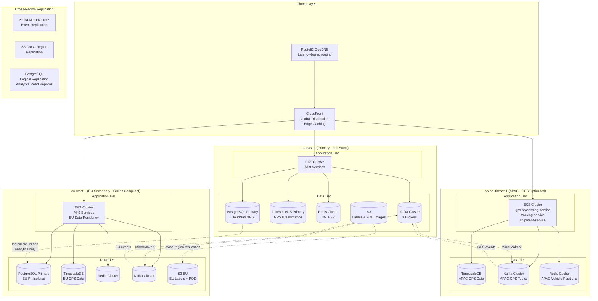

# Cloud Architecture

## Multi-Region Strategy

The Logistics Tracking System is deployed across three AWS regions to meet latency, regulatory, and resilience requirements:

| Region | Role | Rationale |
|---|---|---|
| `us-east-1` (N. Virginia) | **Primary** | Lowest AWS service coverage; US carrier API endpoints are geographically closest |
| `eu-west-1` (Ireland) | **EU Secondary** | GDPR compliance — EU consignee PII must not leave the EU region |
| `ap-southeast-1` (Singapore) | **APAC Secondary** | GPS processing optimised for APAC delivery networks; sub-100ms GPS ingest |

Global traffic routing is handled by Route53 GeoDNS: EU-origin requests route to `eu-west-1`, APAC requests route to `ap-southeast-1`, and all other regions default to `us-east-1`.

---

## Multi-Region Architecture Diagram



---

## Data Sovereignty and GDPR Compliance

EU customer data (consignee name, address, contact details) must remain within `eu-west-1` at all times per GDPR Article 44. Implementation details:

- **EU shipments are created in `eu-west-1`** via GeoDNS routing for EU-origin requests.
- **PII fields are never replicated to `us-east-1`.** Kafka MirrorMaker2 is configured with a transform that redacts PII fields (`consignee_name`, `consignee_address`, `consignee_phone`) before cross-region replication. The primary region receives only operational data (shipment ID, status, timestamps, dimensions).
- **S3 label storage:** EU labels are stored in `s3://logistics-labels-eu-west-1` with S3 Object Lock (WORM) for regulatory compliance. Cross-region replication is **disabled** for EU label buckets.
- **Audit logs** are retained in EU CloudWatch Logs with a 7-year retention policy per GDPR record-keeping requirements.

---

## Edge Computing for GPS Processing

GPS devices (vehicle trackers, driver phones) send location pings at 1 Hz. At 10,000 active vehicles, this generates 10,000 events/second. Regional GPS processing reduces end-to-end latency to under 100ms:

```
GPS Device (APAC)
  → ap-southeast-1 GPS Ingest Endpoint (Route53 latency routing)
  → APAC gps-processing-service (validate, deduplicate, geofence)
  → APAC TimescaleDB (persisted <50ms)
  → APAC Kafka logistics.gps.location.v1
  → Kafka MirrorMaker2 (async replication to us-east-1)
  → us-east-1 tracking-service (aggregated view)
```

**Latency budget:**
- GPS device → APAC endpoint: ~20ms (regional routing)
- APAC GPS processing + TimescaleDB write: ~30ms
- Total GPS-to-persisted: **< 50ms** in APAC (vs ~150ms if routed to us-east-1)

Vehicle current-position (Redis cache) is also maintained per region, so tracking queries from APAC customers read from the local Redis cluster.

---

## Disaster Recovery

### RTO / RPO Targets

| Scenario | RTO | RPO | Strategy |
|---|---|---|---|
| Primary region (`us-east-1`) complete failure | 4 hours | 15 minutes | Promote `eu-west-1` to primary; redirect US traffic |
| Single AZ failure within `us-east-1` | 5 minutes | 0 (synchronous) | EKS multi-AZ scheduling; CloudNativePG synchronous replica |
| Single database node failure | 2 minutes | 0 (synchronous) | CloudNativePG automatic failover |
| Kafka broker failure | < 1 minute | 0 | Kafka ISR replication; partition leader re-election |

### DR Runbook Summary

1. **Detect:** Route53 health checks fail for `us-east-1` ALB for 2 consecutive 10-second checks.
2. **Alert:** PagerDuty SEV-1 page to on-call SRE within 30 seconds.
3. **Assess (0–15 min):** SRE validates failure scope via CloudWatch dashboard. If region-wide, proceed to step 4.
4. **Promote EU (15–60 min):**
   - Scale `eu-west-1` EKS cluster from steady-state (50% capacity) to full capacity via `eksctl scale nodegroup`.
   - Promote `eu-west-1` PostgreSQL replica to primary: `kubectl cnpg promote postgresql-eu -n infra`.
   - Update Route53 weighted records: set `us-east-1` weight to 0, `eu-west-1` weight to 100.
5. **Validate (60–90 min):** Run smoke tests against `eu-west-1` endpoints; confirm GPS pipeline flowing.
6. **Communicate (continuous):** Status page updated every 15 minutes; enterprise customers notified via account management.
7. **Restore (2–4 hrs):** Once `us-east-1` recovers, replay missed events from `eu-west-1` Kafka via MirrorMaker2 before switching traffic back.

---

## Cloud Services Mapping

| Component | AWS Service | Rationale |
|---|---|---|
| Container orchestration | EKS (Kubernetes 1.29) | Industry standard; rich ecosystem; Helm chart availability |
| PostgreSQL | CloudNativePG on EKS | Kubernetes-native operator; automatic failover; better than RDS for fine-grained config |
| GPS time-series storage | TimescaleDB on EKS (EC2) | Native Postgres extension; hypertable chunking for GPS data; chunk compression |
| Cache | Amazon ElastiCache (Redis 7) | Managed Redis cluster; Multi-AZ with automatic failover |
| Message streaming | Amazon MSK (Kafka 3.6) | Managed Kafka; integrates with IAM for auth; CloudWatch metrics built-in |
| Object storage (labels, POD) | Amazon S3 | Durable; S3 Object Lock for WORM compliance; lifecycle policies for tiering |
| CDN | CloudFlare (not CloudFront) | Superior DDoS protection; better edge caching for public tracking API |
| DNS | Amazon Route53 | GeoDNS for multi-region; health checks for automated failover |
| Load balancing | AWS ALB | Path-based routing; WAF integration; TLS offload |
| API Gateway | Kong (self-hosted on EKS) | Plugin ecosystem (JWT, rate-limit, transform); vendor independence |
| Secrets management | AWS Secrets Manager | Automatic rotation; Kubernetes External Secrets Operator for pod injection |
| Log aggregation | Amazon CloudWatch Logs | Native AWS integration; 7-year retention for compliance |
| Metrics | Prometheus + Amazon Managed Prometheus | Self-hosted Prometheus for scraping; AMP for long-term storage |
| Distributed tracing | AWS X-Ray + Jaeger | X-Ray for Lambda/ALB traces; Jaeger for Kubernetes service mesh traces |
| CI/CD | GitHub Actions + ArgoCD | GitOps via ArgoCD; GitHub Actions for build/test pipeline |
| Image registry | Amazon ECR | Native EKS auth; vulnerability scanning built-in |
| Certificate management | AWS ACM + cert-manager | ACM for ALB; cert-manager + Let's Encrypt for internal services |

---

## Cost Optimisation

| Strategy | Applies To | Estimated Saving |
|---|---|---|
| **Spot instances** for batch analytics workers | `analytics-service`, `route-optimization-service` off-peak | ~60% vs on-demand |
| **Reserved instances** (1-year) for stateful workloads | PostgreSQL, TimescaleDB, Redis EC2 instances | ~35% vs on-demand |
| **Savings Plans** for steady-state EKS worker nodes | Core `logistics-prod` worker node group | ~25% vs on-demand |
| **S3 Intelligent Tiering** for labels/POD older than 90 days | S3 buckets for label PDFs and POD images | ~40% storage cost |
| **TimescaleDB columnar compression** | `gps_breadcrumbs` chunks older than 24 hours | ~10x storage reduction |
| **CloudFront/CloudFlare caching** for public tracking API | `/v1/track/*` responses | Reduces origin requests ~80% |

