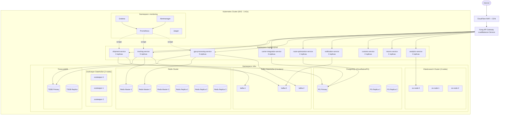

# Deployment Diagram

## Overview

The Logistics Tracking System runs on a multi-zone Kubernetes cluster (EKS on AWS) spanning three availability zones within the primary region. All application workloads are deployed as Kubernetes `Deployment` objects with replica counts tuned to steady-state load and burst capacity. Stateful components (Kafka, ZooKeeper, databases) run as `StatefulSet` objects backed by persistent volumes provisioned from `gp3` EBS. The cluster is divided into four namespaces to enforce isolation, resource quotas, and network policies.

| Namespace | Purpose |
|---|---|
| `logistics-prod` | All production application services |
| `logistics-staging` | Staging replicas for pre-production validation |
| `monitoring` | Prometheus, Grafana, Alertmanager, Jaeger |
| `infra` | Kafka, ZooKeeper, Redis, Elasticsearch, databases |

---

## Kubernetes Deployment Topology



---

## Service Resource Specifications

| Service | CPU Request | CPU Limit | Memory Request | Memory Limit | Replicas (min/max) |
|---|---|---|---|---|---|
| shipment-service | 250m | 1000m | 512Mi | 1Gi | 3 / 8 |
| tracking-service | 500m | 2000m | 1Gi | 2Gi | 5 / 20 |
| carrier-integration-service | 250m | 500m | 512Mi | 1Gi | 3 / 6 |
| gps-processing-service | 500m | 1500m | 512Mi | 1.5Gi | 5 / 15 |
| route-optimization-service | 1000m | 4000m | 2Gi | 4Gi | 2 / 4 |
| notification-service | 100m | 500m | 256Mi | 512Mi | 3 / 10 |
| customs-service | 250m | 500m | 512Mi | 1Gi | 2 / 4 |
| returns-service | 250m | 500m | 512Mi | 1Gi | 2 / 4 |
| analytics-service | 500m | 2000m | 1Gi | 4Gi | 2 / 6 |

---

## Horizontal Pod Autoscaler (HPA) Configuration

### tracking-service HPA
Scales based on Kafka consumer group lag for the `logistics.gps.location.v1` topic. If lag exceeds 50,000 messages across the consumer group, new pods are added.

```yaml
apiVersion: autoscaling/v2
kind: HorizontalPodAutoscaler
metadata:
  name: tracking-service-hpa
  namespace: logistics-prod
spec:
  scaleTargetRef:
    apiVersion: apps/v1
    kind: Deployment
    name: tracking-service
  minReplicas: 5
  maxReplicas: 20
  metrics:
    - type: External
      external:
        metric:
          name: kafka_consumer_group_lag
          selector:
            matchLabels:
              topic: logistics.gps.location.v1
              group: tracking-service-consumer
        target:
          type: AverageValue
          averageValue: "10000"
  behavior:
    scaleUp:
      stabilizationWindowSeconds: 60
      policies:
        - type: Pods
          value: 3
          periodSeconds: 60
    scaleDown:
      stabilizationWindowSeconds: 300
```

### gps-processing-service HPA
Scales on CPU utilisation. GPS ingest is CPU-bound (coordinate validation, geofence evaluation, deduplication).

```yaml
apiVersion: autoscaling/v2
kind: HorizontalPodAutoscaler
metadata:
  name: gps-processing-service-hpa
  namespace: logistics-prod
spec:
  scaleTargetRef:
    apiVersion: apps/v1
    kind: Deployment
    name: gps-processing-service
  minReplicas: 5
  maxReplicas: 15
  metrics:
    - type: Resource
      resource:
        name: cpu
        target:
          type: Utilization
          averageUtilization: 65
```

---

## TimescaleDB Configuration

The `gps_breadcrumbs` table is the highest-volume table in the system, receiving up to 10,000 GPS pings per second at peak.

```sql
-- Create hypertable with 1-hour chunks to match GPS ingest cadence
SELECT create_hypertable(
  'gps_breadcrumbs',
  'recorded_at',
  chunk_time_interval => INTERVAL '1 hour'
);

-- Compress chunks older than 24 hours (columnar compression reduces storage 10x)
SELECT add_compression_policy('gps_breadcrumbs', INTERVAL '24 hours');

-- Drop chunks older than 90 days (regulatory minimum is 30 days; 90 days retained for analytics)
SELECT add_retention_policy('gps_breadcrumbs', INTERVAL '90 days');

-- Continuous aggregate for hourly vehicle summaries (used by analytics-service)
CREATE MATERIALIZED VIEW vehicle_hourly_summary
WITH (timescaledb.continuous) AS
SELECT
  vehicle_id,
  time_bucket('1 hour', recorded_at) AS hour,
  COUNT(*)                            AS ping_count,
  MAX(speed_kmh)                      AS max_speed_kmh,
  SUM(distance_meters)                AS total_distance_m
FROM gps_breadcrumbs
GROUP BY vehicle_id, hour;

SELECT add_continuous_aggregate_policy(
  'vehicle_hourly_summary',
  start_offset  => INTERVAL '2 hours',
  end_offset    => INTERVAL '1 hour',
  schedule_interval => INTERVAL '30 minutes'
);
```

---

## Kafka Topic Configuration

| Topic | Partitions | Replication Factor | Retention | Notes |
|---|---|---|---|---|
| `logistics.shipment.created.v1` | 3 | 3 | 7 days | Low volume, high importance |
| `logistics.shipment.status.v1` | 3 | 3 | 7 days | All state transitions |
| `logistics.shipment.exception.v1` | 3 | 3 | 30 days | Long retention for audits |
| `logistics.gps.location.v1` | 10 | 3 | 24 hours | High throughput; short retention |
| `logistics.gps.geofence.v1` | 5 | 3 | 3 days | Geofence entry/exit events |
| `logistics.carrier.webhook.v1` | 6 | 3 | 7 days | Inbound carrier status pushes |
| `logistics.notification.outbound.v1` | 3 | 3 | 3 days | SMS/email/push dispatch |
| `logistics.analytics.events.v1` | 5 | 3 | 14 days | Analytics ingestion pipeline |

> **High-throughput GPS topics** (`logistics.gps.*`) use 10 partitions and `acks=all` with `linger.ms=5` for batching. Producer batch size is set to 64 KB to maximise broker throughput.

---

## Persistent Volume Specifications

| StatefulSet | Storage Class | Volume Size | Access Mode | Notes |
|---|---|---|---|---|
| kafka-0/1/2 | `gp3` | 500 Gi each | ReadWriteOnce | Log segments; throughput 500 MB/s |
| zookeeper-0/1/2 | `gp3` | 20 Gi each | ReadWriteOnce | Coordination metadata only |
| postgres-primary | `io2` | 500 Gi | ReadWriteOnce | 10,000 IOPS provisioned |
| postgres-replica-1/2 | `gp3` | 500 Gi each | ReadWriteOnce | Read replicas |
| timescaledb-primary | `io2` | 2 Ti | ReadWriteOnce | GPS breadcrumb storage |
| timescaledb-replica | `gp3` | 2 Ti | ReadWriteOnce | Read replica for analytics |
| elasticsearch-0/1/2 | `gp3` | 200 Gi each | ReadWriteOnce | Shipment search index |

---

## Health Check Endpoints

Every service exposes standardised health endpoints on port `8080` (or `8081` for admin). These are wired into Kubernetes `livenessProbe` and `readinessProbe`.

| Service | Liveness | Readiness | Startup | Notes |
|---|---|---|---|---|
| shipment-service | `GET /health/live` | `GET /health/ready` | `GET /health/startup` | Ready checks DB + Kafka connectivity |
| tracking-service | `GET /health/live` | `GET /health/ready` | `GET /health/startup` | Ready checks TimescaleDB + Redis |
| carrier-integration-service | `GET /health/live` | `GET /health/ready` | — | Liveness includes circuit breaker state |
| gps-processing-service | `GET /health/live` | `GET /health/ready` | `GET /health/startup` | Ready checks Kafka consumer assignment |
| route-optimization-service | `GET /health/live` | `GET /health/ready` | — | Startup grace 60s (model load) |
| notification-service | `GET /health/live` | `GET /health/ready` | — | Ready checks SMTP/SMS gateway |
| customs-service | `GET /health/live` | `GET /health/ready` | — | — |
| returns-service | `GET /health/live` | `GET /health/ready` | — | — |
| analytics-service | `GET /health/live` | `GET /health/ready` | — | Ready checks Elasticsearch |

---

## Integration Retry and Idempotency Specification

- **Publish reliability:** Command-handling transactions persist domain mutations and outbox records atomically. Relay workers publish with exponential backoff (`base=500ms`, `factor=2`, `max=5m`) and jitter.
- **Deduping contract:** `event_id` is globally unique; consumers persist `(event_id, consumer_name, processed_at, outcome_hash)` before side-effects.
- **API idempotency:** Mutating endpoints require `Idempotency-Key` scoped by `(tenant_id, route, key)`. Duplicate requests return prior status/body.
- **Webhook retries:** 3 fast retries + 8 slow retries with signed payload replay protection; exhausted events route to DLQ.
- **Replay safety:** Backfill jobs mark `replay_batch_id`, disable duplicate notifications/billing, and emit audit events.

---

## Monitoring, SLOs, and Alerting

### SLO Targets
- P95 GPS ping-to-TimescaleDB write: **< 500ms**
- P95 scan-to-customer-visibility: **< 60 seconds**
- P95 commit-to-publish (outbox relay): **< 5 seconds**
- P95 exception-detection-to-notification: **< 3 minutes**
- GPS Kafka consumer lag: **< 30 seconds** of event backlog

### Alert Policy
- **SEV-1:** GPS pipeline lag > 5 minutes, Kafka broker unavailable, PostgreSQL primary down, TimescaleDB write failures.
- **SEV-2:** HPA at `maxReplicas` for > 10 minutes, Redis cluster degraded, Elasticsearch yellow status.
- **SEV-3:** Schema drift warnings, duplicate event spikes, non-critical carrier webhook failures.

