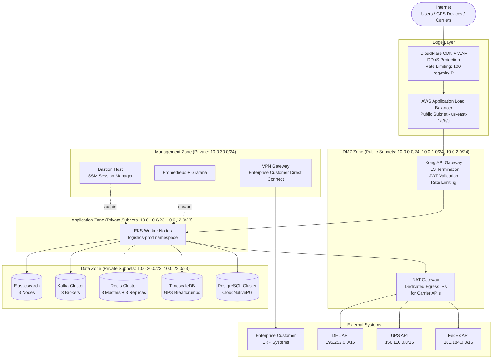

# Network Infrastructure

## Overview

The Logistics Tracking System uses a defence-in-depth network architecture with four distinct security zones. Public GPS tracking APIs are fronted by CloudFlare CDN for caching and DDoS protection. All internal service communication flows over private subnets and is governed by Kubernetes `NetworkPolicy` objects. Carrier API egress uses dedicated NAT IPs that are whitelisted with each carrier partner to prevent IP spoofing.

---

## Network Topology Diagram



---

## Security Zones

| Zone | CIDR | Components | Allowed Inbound | Allowed Outbound | Notes |
|---|---|---|---|---|---|
| Edge / DMZ | `10.0.0.0/22` | ALB, Kong API Gateway, NAT Gateway | Internet (443, 80) | Application Zone (8080, 8443) | TLS terminated at ALB; HTTP → HTTPS redirect enforced |
| Application Zone | `10.0.10.0/22` | EKS worker nodes, all microservices | DMZ (8080) only | Data Zone (5432, 6379, 9092, 9200), NAT (443) | No direct internet access; all egress via NAT |
| Data Zone | `10.0.20.0/22` | PostgreSQL, TimescaleDB, Redis, Kafka, ES | Application Zone only | S3 VPC Endpoint (HTTPS) | No internet access; storage accessed via VPC endpoints |
| Management Zone | `10.0.30.0/24` | Bastion, Prometheus, VPN | VPN (IPSec), SSM | All zones (read-only) | Accessed only via AWS SSM Session Manager; no SSH keys |

---

## CDN Configuration (CloudFlare)

The public shipment tracking endpoint (`GET /v1/track/{trackingNumber}`) is served through CloudFlare with aggressive edge caching to absorb burst traffic during high-demand periods (holidays, Black Friday).

### Cache Rules

| Path Pattern | Cache TTL | Cache Behaviour | Notes |
|---|---|---|---|
| `/v1/track/*` | 60 seconds | Cache with `trackingNumber` as cache key | Tracking status refreshes every minute |
| `/v1/public/carriers` | 3600 seconds | Cache static carrier list | Invalidated on carrier config change |
| `/v1/labels/*` | No cache | Bypass | Labels are private, auth required |
| `/v1/admin/*` | No cache | Bypass | Admin endpoints always bypass CDN |

### Rate Limiting (CloudFlare Rules)

| Tier | Limit | Window | Action | Notes |
|---|---|---|---|---|
| Public tracking (unauthenticated) | 100 req/min | Per IP | HTTP 429 + `Retry-After` | Protects against scraping |
| Authenticated API (JWT) | 1,000 req/min | Per tenant | HTTP 429 | Tenant-level throttle |
| GPS ingest (device tokens) | 10,000 req/min | Per device group | HTTP 429 | GPS devices send at 1 Hz |
| Carrier webhooks | 500 req/min | Per carrier IP range | HTTP 429 | Carrier IP ranges pre-whitelisted |

### DDoS Protection

CloudFlare Magic Transit is enabled with HTTP DDoS Attack Protection at sensitivity level `High`. Layer 7 attacks (HTTP floods, slowloris) are mitigated at the edge before reaching the ALB. Captcha challenges are issued for anomalous traffic patterns.

---

## DNS Architecture (Route53)

| Record | Type | Routing Policy | Target | TTL |
|---|---|---|---|---|
| `api.logistics.example.com` | A | Latency-based | ALB per region | 60s |
| `track.logistics.example.com` | CNAME | Latency-based | CloudFlare proxy | 300s |
| `gps-ingest.logistics.example.com` | A | Latency-based | Regional GPS endpoint | 30s |
| `admin.logistics.example.com` | A | Simple | Primary region ALB | 60s |

Health checks are configured for each `api.logistics.example.com` record. Route53 performs HTTPS health checks every 10 seconds from three global checking locations. If a region fails two consecutive checks, Route53 automatically routes traffic to the next healthy region within the TTL window.

---

## TLS Configuration

| Setting | Value | Notes |
|---|---|---|
| Minimum TLS version | TLS 1.2 | TLS 1.0/1.1 disabled at ALB and CloudFlare |
| Preferred TLS version | TLS 1.3 | Supported by all modern clients |
| Certificate Authority | AWS ACM + Let's Encrypt | ACM for ALB; LE for internal services via cert-manager |
| Certificate rotation | Automatic (ACM) | ACM auto-rotates 30 days before expiry |
| HSTS | `max-age=31536000; includeSubDomains; preload` | Enforced at CloudFlare edge |
| Cipher suites | ECDHE-RSA-AES256-GCM-SHA384 preferred | PFS required; RC4 and 3DES disabled |
| Internal mTLS | Istio sidecar-injected | All service-to-service calls use mTLS within EKS |

---

## Kubernetes Network Policies

All inter-service communication is locked down with `NetworkPolicy` objects. Default-deny rules block all traffic; specific policies allow only required flows.

### tracking-service Policy
```yaml
apiVersion: networking.k8s.io/v1
kind: NetworkPolicy
metadata:
  name: tracking-service-netpol
  namespace: logistics-prod
spec:
  podSelector:
    matchLabels:
      app: tracking-service
  policyTypes:
    - Ingress
    - Egress
  ingress:
    - from:
        - podSelector:
            matchLabels:
              app: kong-api-gateway
        - podSelector:
            matchLabels:
              app: gps-processing-service
      ports:
        - port: 8080
  egress:
    - to:
        - namespaceSelector:
            matchLabels:
              name: infra
      ports:
        - port: 5432   # TimescaleDB
        - port: 6379   # Redis
        - port: 9092   # Kafka
```

### Database Network Policy
```yaml
apiVersion: networking.k8s.io/v1
kind: NetworkPolicy
metadata:
  name: postgres-netpol
  namespace: infra
spec:
  podSelector:
    matchLabels:
      app: postgresql
  policyTypes:
    - Ingress
  ingress:
    - from:
        - namespaceSelector:
            matchLabels:
              name: logistics-prod
      ports:
        - port: 5432
```

---

## Firewall Rules (AWS Security Groups)

| Security Group | Rule Direction | Source / Destination | Port | Protocol | Notes |
|---|---|---|---|---|---|
| `sg-alb-public` | Inbound | `0.0.0.0/0` | 443 | TCP | HTTPS only; HTTP redirected |
| `sg-alb-public` | Inbound | `0.0.0.0/0` | 80 | TCP | Redirect to 443 only |
| `sg-kong-gateway` | Inbound | `sg-alb-public` | 8443 | TCP | Kong listener |
| `sg-eks-workers` | Inbound | `sg-kong-gateway` | 8080 | TCP | App port |
| `sg-eks-workers` | Inbound | `sg-eks-workers` | All | TCP | Pod-to-pod (controlled by NetworkPolicy) |
| `sg-rds-postgres` | Inbound | `sg-eks-workers` | 5432 | TCP | DB access from app nodes only |
| `sg-redis-cluster` | Inbound | `sg-eks-workers` | 6379-6384 | TCP | Redis cluster ports |
| `sg-kafka` | Inbound | `sg-eks-workers` | 9092, 9093 | TCP | Kafka plaintext + TLS |
| `sg-elasticsearch` | Inbound | `sg-eks-workers` | 9200, 9300 | TCP | ES REST + transport |
| `sg-nat-gateway` | Outbound | FedEx/UPS/DHL IP ranges | 443 | TCP | Carrier API egress |

---

## Carrier API Egress

Outbound calls to carrier APIs are routed through dedicated NAT Gateway Elastic IPs. These IPs are registered with each carrier as whitelisted source addresses:

| Carrier | Whitelisted NAT IP | API Base URL | Notes |
|---|---|---|---|
| FedEx | `52.23.100.10` | `https://apis.fedex.com` | Registered in FedEx Developer Portal |
| UPS | `52.23.100.11` | `https://onlinetools.ups.com` | Registered in UPS Developer Kit |
| DHL | `52.23.100.12` | `https://express.api.dhl.com` | Registered in DHL Developer Portal |
| BlueDart | `52.23.100.13` | `https://api.bluedart.com` | India region only |

Using dedicated IPs per carrier (rather than a shared NAT pool) ensures that a block by one carrier does not affect egress to others. IPs are provisioned as static Elastic IPs and rotate only with a planned change window.

---

## VPN / Direct Connect for Enterprise Customers

Enterprise customers with high shipment volumes can connect via:

1. **AWS Site-to-Site VPN:** IPSec tunnel from customer data centre to the VPN Gateway in the Management Zone. BGP routing advertises `10.0.10.0/22` (Application Zone) to the customer network. Used for real-time order injection via EDI.

2. **AWS Direct Connect:** 1 Gbps dedicated connection for customers shipping > 50,000 shipments/day. Provides consistent sub-10ms latency for bulk API calls. Traffic traverses the Direct Connect Gateway and connects to the Management Zone VPN Gateway.

Both options terminate in the Management Zone, isolated from the public internet path through CloudFlare.

