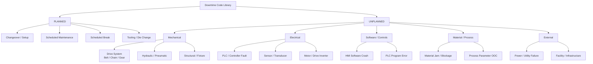

# Activity Diagrams

## Overview

This document presents three detailed activity diagrams for critical business processes in the Manufacturing Execution System (MES). Each diagram models the complete end-to-end flow including decision points, parallel execution tracks, error handling paths, and system/actor handoffs. The diagrams use Mermaid `flowchart TD` syntax and are supplemented by step-by-step narrative explanations.

---

## Diagram 1: Production Order Execution Flow

### Description

This activity diagram covers the complete lifecycle of a production order from receipt of the ERP trigger through to the final ERP confirmation. It spans five distinct phases:

1. **Order Receipt & Validation** — MES receives the order from SAP ERP and validates all master data prerequisites.
2. **Scheduling** — The MES scheduling engine assigns operations to work centers based on available capacity and priority.
3. **Shop Floor Execution** — Operators execute each operation in sequence; material consumption and quality checks run in parallel.
4. **Quality Release** — Completed lots undergo final quality inspection and disposition.
5. **ERP Confirmation** — Upon technical completion, MES posts production and material confirmations back to SAP.

The diagram includes all decision branches, parallel tracks, and error paths including material shortage handling, quality failures, and ERP integration errors.

```mermaid
flowchart TD
    A([🟢 START:\nERP Releases Production Order]) --> B[SAP posts order via\nREST API / RFC to MES]
    B --> C{Payload schema\nvalidation}
    C -- Invalid --> D[Write to integration\nerror queue]
    D --> E[Alert integration admin\nand SAP team]
    E --> F([🔴 END: Order rejected\n— manual intervention required])
    C -- Valid --> G[MES creates Production Order\nStatus: CREATED\nAssigns PO number]
    G --> H[Load BOM revision\nfrom MES master data]
    H --> I{BOM and routing\nexist and approved?}
    I -- No --> J[Flag order: MASTER DATA ERROR\nNotify master data admin]
    J --> K([🔴 END: Blocked — awaiting\nmaster data correction])
    I -- Yes --> L[Soft-reserve components\nin MES material ledger]
    L --> M{Sufficient stock\navailable?}
    M -- Shortage --> N[Create material shortage alert\nNotify production supervisor\nand WMS for staging]
    N --> O{Supervisor decision}
    O -- Hold order --> P([⏸️ Order on HOLD:\nAwaiting material])
    O -- Proceed anyway --> Q[Flag work orders as\nMATERIAL SHORTAGE WARNING]
    M -- Sufficient --> Q
    Q --> R[Scheduling engine runs:\nAssign operations to\nwork centers — finite capacity]
    R --> S{Capacity conflict\ndetected?}
    S -- Conflict --> T[Display conflict to supervisor\nPropose alternative dates]
    T --> U{Supervisor resolves?}
    U -- Override --> V[Record override reason\nProceed with conflict flag]
    U -- Reschedule --> R
    S -- No conflict --> W[Set order status: SCHEDULED\nGenerate work orders per routing step]
    V --> W
    W --> X[Supervisor reviews\nand approves release]
    X --> Y{Release approved?}
    Y -- Rejected --> Z[Return to scheduler\nfor revision]
    Z --> R
    Y -- Approved --> AA[Set order status: RELEASED\nHard-reserve materials\nPush WOs to HMI queues]
    AA --> AB[/Operator receives work order\non HMI terminal/]

    subgraph ExecLoop ["🔄  Operation Execution Loop (repeat per routing step)"]
        AB --> AC[Operator acknowledges\nwork instructions]
        AC --> AD{Instructions\nacknowledged?}
        AD -- Not acknowledged --> AE[Block start —\nremind operator]
        AE --> AD
        AD -- Acknowledged --> AF[Operator clicks\nSTART OPERATION]
        AF --> AG[MES records actual\nstart time — UTC]
        AG --> AH[SCADA streams\nmachine telemetry to MES\nOPC-UA subscription active]
        AH --> AI{Machine downtime\ndetected?}
        AI -- Downtime detected --> AJ[Work order → INTERRUPTED\nRecord downtime start]
        AJ --> AK[Operator classifies\ndowntime code]
        AK --> AL[Notify maintenance team]
        AL --> AM{Machine\nrestored?}
        AM -- Not restored → > 30 min --> AN[Auto-create maintenance\nwork order]
        AN --> AM
        AM -- Restored --> AO[Record downtime end\nUpdate OEE availability]
        AO --> AH
        AI -- No downtime --> AP[Operator completes\nphysical operation]
        AP --> AQ[Operator enters yield\nand scrap quantities]
        AQ --> AR{Yield + scrap within\norder qty tolerance?}
        AR -- Out of tolerance --> AS[Error: quantity mismatch\nOperator must correct]
        AS --> AQ
        AR -- Within tolerance --> AT[/Parallel execution begins/]

        subgraph Parallel ["⚡ Parallel Tracks"]
            direction LR
            AT --> AU[Track A:\nRecord material consumption\nper BOM coefficients]
            AT --> AV[Track B:\nTrigger quality inspection\nif mandatory for this operation]
        end

        AU --> AW[Backflush goods issue\nto MES material ledger]
        AV --> AX{Inspection plan\nexists for operation?}
        AX -- No --> AY[Skip inspection\nlog: no plan defined]
        AX -- Yes --> AZ[Quality Inspector receives\ninspection trigger notification]
        AZ --> BA[Inspector performs\nmeasurements per plan]
        BA --> BB{All measurements\nwithin spec?}
        BB -- Fail → critical char --> BC[Initiate QUALITY HOLD\nBlock lot from further processing]
        BC --> BD[Supervisor notified\nDisposition review required]
        BD --> BE{Disposition\ndecision}
        BE -- Rework --> BF[Create rework work order\nRe-inspect after rework]
        BF --> BB
        BE -- Scrap --> BG[Post scrap movement\nUpdate ERP reservation]
        BE -- Release waiver --> BH[Record waiver approval\nRelease lot conditionally]
        BB -- Pass or waiver --> BI[Update SPC control charts\nInspection lot: PASSED]

        AW --> BJ[/Sync parallel tracks/]
        AY --> BJ
        BI --> BJ
        BJ --> BK{Last operation\nin routing?}
        BK -- No → more ops --> BL[Set current WO: COMPLETED\nNext operation WO → READY\nIn next work center queue]
        BL --> AB
    end

    BK -- Yes: last operation --> BM[Set all WOs: COMPLETED\nProduction order → PENDING QUALITY RELEASE]
    BM --> BN{Final inspection\nrequired?}
    BN -- Yes --> BO[Final quality inspection\nper product inspection plan]
    BO --> BP{Final inspection\npassed?}
    BP -- Fail --> BC
    BP -- Pass --> BQ[Set order status:\nTECHNICALLY COMPLETE]
    BN -- No --> BQ
    BQ --> BR[Calculate production summary:\nActual yield vs plan\nScrap % / Cycle time variance\nOEE metrics]
    BR --> BS[Construct ERP confirmation payload:\nOrder no, yield qty, scrap\nActivity times, component consumption]
    BS --> BT[POST to SAP ERP:\nProduction confirmation\nGoods receipt\nGoods issue]
    BT --> BU{ERP acknowledges\nsuccessfully?}
    BU -- Failure: transient --> BV[Queue for automatic retry\nup to 3 retries at 5-min intervals]
    BV --> BW{Retry\nsucceeded?}
    BW -- Yes --> BX[Record ERP document numbers\nMES order: CONFIRMED IN ERP]
    BW -- No after 3 tries --> BY[Critical alert: integration admin\nManual ERP posting required]
    BY --> BZ([⏸️ Order: PENDING MANUAL ERP POSTING])
    BU -- Success --> BX
    BX --> CA[Archive production order record\nLock all associated data]
    CA --> CB([🟢 END: Production order\ncomplete and confirmed in ERP])
```



---

### Step Narrative — Production Order Execution

| Phase | Key Steps | Actors | System Actions |
|---|---|---|---|
| **Order Receipt** | ERP posts order → schema validation → BOM lookup → component reservation | ERP System, MES | Payload parsing, master data lookup, soft reservation |
| **Scheduling** | Finite capacity scheduling → conflict detection → supervisor approval → work order generation | Production Supervisor, MES | Scheduling algorithm, Gantt update, WO creation |
| **Execution Loop** | Operator acknowledge → start → telemetry collection → downtime handling → complete → parallel: consumption + quality | Machine Operator, Quality Inspector, Maintenance Technician, MES, SCADA | Real-time OPC-UA, SPC analysis, backflush |
| **Quality Release** | Final inspection → disposition → lot release or hold/scrap | Quality Inspector, Production Supervisor | Inspection lot management, ERP block/unblock |
| **ERP Confirmation** | Summary calculation → confirmation payload → ERP post → archive | MES, ERP System | BAPI call, document archival |

---

## Diagram 2: Quality Inspection Flow

### Description

This activity diagram covers the complete quality inspection lifecycle triggered by an operation completion event. It models in-process inspection, statistical process control analysis, lot disposition, and CAPA initiation. Key decision points include SPC control limit evaluation (using Western Electric rules), critical vs. non-critical characteristic fail logic, and the re-inspection pathway.

```mermaid
flowchart TD
    A([🟢 TRIGGER:\nOperation completion event\nor periodic inspection schedule]) --> B{Inspection trigger\ntype?}
    B -- Operation completion --> C[MES generates\ninspection lot ID\nLinked to work order and production order]
    B -- Periodic/scheduled --> D[Scheduler generates\nperiodic inspection lot\nBased on control plan frequency]
    B -- SPC out-of-control signal --> E[Auto-inspection lot:\nSTATUS = URGENT\nSupervisor alerted immediately]
    C --> F[Load inspection plan:\nMaterial × Operation × Version]
    D --> F
    E --> F
    F --> G{Active inspection plan\nfound?}
    G -- Not found --> H[Log: NO PLAN\nInspector prompted for\nfree-form entry]
    H --> I[Supervisor co-sign required\nbefore results can be submitted]
    G -- Found --> J[Display inspection plan\nto Quality Inspector:\nCharacteristics list / Sample size\nMeasurement methods / Spec limits]
    I --> J
    J --> K[Quality Inspector assigned\nfrom QA work queue]
    K --> L{Measuring equipment\ncalibration current?}
    L -- Expired calibration --> M[Block inspection\nAlert calibration lab\nLog equipment out-of-service]
    M --> N([🔴 END: Inspection blocked —\ncalibration renewal required])
    L -- Calibration current --> O[Inspector connects measuring device\nor prepares manual entry form]
    O --> P[/Characteristic measurement loop\nRepeat for each characteristic in plan/]

    subgraph MeasLoop ["🔄  Per-Characteristic Measurement Loop"]
        P --> Q[Select next characteristic\nDisplay: name, method, LSL, USL, target, unit]
        Q --> R{Entry method?}
        R -- Device interface --> S[Receive value from\nconnected instrument\nauto-populated in field]
        R -- Manual entry --> T[Inspector types value\nusing numeric keypad]
        S --> U[System validates value:\nCheck numeric range\nCheck units match]
        T --> U
        U --> V{Value within\nspecification limits?}
        V -- Within LSL–USL --> W[Mark characteristic: ✅ PASS\nAdd to SPC dataset]
        V -- Outside spec → non-critical char --> X[Mark characteristic: ⚠️ WARNING\nNote deviation amount\nFlag for conditional review]
        V -- Outside spec → critical char --> Y[Mark characteristic: ❌ FAIL — CRITICAL\nRecord deviation\nFlag lot for hold]
        W --> Z[Run SPC analysis:\nPlot on control chart\nApply Western Electric rules]
        X --> Z
        Y --> Z
        Z --> AA{SPC rule\nviolation detected?}
        AA -- Control limits breached\nor trend pattern --> AB[Flag SPC alert:\nIdentify specific rule violated\ne.g. Rule 1: 1 point beyond 3σ\nRule 2: 9 consecutive on one side]
        AB --> AC[Send SPC alert to\nProduction Supervisor and\nProcess Engineer]
        AC --> AD[Increase inspection frequency:\nAQL step up per BR-008\nRemaining lots in run]
        AA -- In control --> AE[/Continue to next characteristic/]
        AD --> AE
        AE --> AF{More characteristics\nremaining?}
        AF -- Yes --> Q
    end

    AF -- No: all chars measured --> AG[Calculate overall\nlot disposition score]
    AG --> AH{Any CRITICAL\ncharacteristic FAIL?}
    AH -- Yes → at least one critical fail --> AI[Lot disposition: FAIL\nMandatory quality hold]
    AH -- No critical fails → any non-critical warnings? --> AJ{Any non-critical\ncharacteristic warnings?}
    AJ -- Yes --> AK[Lot disposition: CONDITIONAL\nRequires supervisor review]
    AJ -- No → all pass --> AL[Lot disposition: PASS\nAuto-release lot]
    AI --> AM[Initiate QUALITY HOLD on lot\nStatus: ON HOLD\nNotify: Supervisor, Operator, ERP block-stock]
    AK --> AN[Supervisor reviews conditional result\nwithin defined SLA: 2 hours]
    AN --> AO{Supervisor\ndecision}
    AO -- Approve conditional release --> AL
    AO -- Reject → treat as fail --> AI
    AL --> AP[Update inspection lot: RELEASED\nUpdate work order: INSPECTION PASSED\nERP stock unblocked if applicable]
    AP --> AQ{Re-inspection\nrequired per plan?}
    AQ -- Yes: e.g. first article inspection --> AR[Schedule follow-up\nre-inspection lot]
    AR --> A
    AQ -- No --> AS[Record and close\ninspection lot]

    AM --> AT{Disposition\nreview meeting held}
    AT --> AU{Disposition\ndecision}
    AU -- Release with waiver --> AV[Record waiver:\nJustification text\nApprover name and signature\nSupervisor + QA Manager sign-off]
    AV --> AP
    AU -- Rework --> AW[Create rework work order\nLinked to original production order\nDefine rework operation steps]
    AW --> AX[Operator executes\nrework operations]
    AX --> AY[Re-inspection triggered\nautomatically on rework completion]
    AY --> A
    AU -- Scrap --> AZ[Record scrap quantity\nand scrap reason code]
    AZ --> BA[Post scrap movement to ERP:\nGoods issue reversal\nScrap cost posting]
    BA --> BB[Update production order:\nAdjust actual yield downward\nUpdate scrap % KPI]

    AS --> BC{SPC out-of-control\nor multiple recent fails?}
    BC -- Yes: systemic issue suspected --> BD[Initiate CAPA workflow:\nNC description\nRoot cause analysis assignment\nContainment actions]
    BD --> BE[CAPA record created\nLinked to inspection lot\nLinked to production order]
    BE --> BF([🟢 END: Inspection closed\nCAPAopened for follow-up])
    BC -- No: isolated event --> BG[Record closed\nNo further action]
    BG --> BF
    BB --> BH([🟢 END: Lot scrapped\nProduction order adjusted])
```



---

### Statistical Decision Logic

| SPC Rule | Violation Pattern | MES Action |
|---|---|---|
| **Rule 1** | 1 point beyond 3σ control limit | Immediate inspector alert; auto-increase next 5 lots to 100% inspection |
| **Rule 2** | 9 consecutive points on same side of center line | Process shift alert to Process Engineer; inspection frequency +2 AQL steps |
| **Rule 3** | 6 consecutive points trending up or down | Trend alert; maintenance check on equipment calibration drift |
| **Rule 4** | 14 alternating points up-down | Stratification alert; review sample collection method |
| **Rule 5** | 2 of 3 consecutive points beyond 2σ | Warning alert; Production Supervisor review |
| **Rule 6** | 4 of 5 consecutive points beyond 1σ | Warning alert; process parameter review |

---

## Diagram 3: Machine Downtime Reporting Flow

### Description

This diagram covers the complete machine downtime management process from the initial detection of a stoppage (either operator-reported or SCADA-detected) through classification, maintenance response, root-cause analysis, repair verification, and OEE update. The flow includes the automatic maintenance work order creation threshold (30 minutes), escalation paths, and post-repair restart verification.

```mermaid
flowchart TD
    A([🟢 TRIGGER:\nMachine stops or\ndowntime condition identified]) --> B{Detection\nmethod?}
    B -- Operator observes and\nreports manually --> C[Operator presses\nREPORT DOWNTIME\non HMI terminal]
    B -- SCADA detects PLC\nfault or stop signal --> D[SCADA pushes fault event\nto MES via OPC-UA\nFault code + timestamp]
    D --> E[MES auto-creates\ndowntime event\nStatus: PENDING CLASSIFICATION]
    E --> F[HMI pop-up to operator:\n"Downtime detected by SCADA.\nPlease classify."]
    C --> G[MES records downtime\nstart timestamp UTC\nWork center status → DOWNTIME]
    F --> G
    G --> H{Active work order\non this work center?}
    H -- Yes → WO in progress --> I[Work order status → INTERRUPTED\nStop accumulating\nproductive runtime]
    H -- No → no active WO --> J[Record as\nstandalone downtime event\nnot linked to work order]
    I --> K[/Downtime classification screen displayed/]
    J --> K
    K --> L{Downtime type\nselection}
    L -- PLANNED --> M[Classify as PLANNED DOWNTIME\nCategory: Changeover / Scheduled Maint\n/ Break / Tooling Change]
    L -- UNPLANNED --> N[Classify as UNPLANNED DOWNTIME\nSelect category: Mechanical\nElectrical / Software / Material\nProcess / External]
    M --> O[Select specific\ndowntime code\nfrom hierarchical code tree]
    N --> O
    O --> P[Operator adds optional\nfree-text description]
    P --> Q{Downtime code\nentered within 10 min?}
    Q -- Timeout: >10 min\nno code entered --> R[Escalation alert to\nProduction Supervisor:\n"Unclassified downtime >10 min\nat work center [WC]"]
    R --> S[Downtime accumulates under\nUNCLASSIFIED bucket\nin OEE calculation]
    S --> Q
    Q -- Code entered --> T{PLANNED or\nUNPLANNED?}
    T -- PLANNED: changeover / break --> U[Log planned downtime\nNo maintenance alert sent\nOEE → Planned Downtime bucket]
    T -- UNPLANNED: equipment failure --> V[System sends MAINTENANCE ALERT\nto technician work queue\nwith work center, fault description,\npriority classification]
    U --> W[/Start downtime duration timer\nDisplayed on HMI and\nSupervisor dashboard/]
    V --> W
    W --> X{Maintenance technician\nacknowledges alert?}
    X -- Not acknowledged within\nconfigured SLA --> Y[Escalate to Maintenance Supervisor\nand Plant Manager]
    Y --> X
    X -- Acknowledged --> Z[Technician travels to\nwork center\nMES records response time]
    Z --> AA[Technician performs\ninitial diagnosis]
    AA --> AB{Can machine be\nrestored immediately?}
    AB -- Yes: quick fix\nminor adjustment --> AC[Technician performs\nimmediate repair\nRecords: quick-fix code]
    AB -- No: complex repair\nparts required --> AD[Technician creates\ndetailed repair plan\nRequests spare parts from stores]
    AD --> AE{Spare parts\navailable?}
    AE -- Parts in stock --> AF[Parts issued from CMMS/WMS\nDelivered to work center]
    AE -- Parts not in stock --> AG[Emergency procurement initiated\nEstimated arrival time communicated\nto Supervisor]
    AG --> AH([⏸️ Extended downtime:\nProduction order rescheduled\nby Supervisor])
    AF --> AI[Technician executes repair\nReplaces / adjusts\nfailed components]
    AC --> AJ[/Downtime duration check/]
    AI --> AJ
    AJ --> AK{Downtime duration\n≥ 30 minutes?}
    AK -- Yes: extended downtime --> AL[AUTO-CREATE Maintenance\nWork Order in CMMS\nLinked to downtime event\nBR-010 threshold triggered]
    AL --> AM[Maintenance WO includes:\nWork center / equipment ID\nDowntime event reference\nTechnician ID\nParts used\nEstimated vs actual repair time]
    AM --> AN{Root cause\nanalysis required?}
    AN -- Yes: first occurrence\nor repeat failure --> AO[Technician logs root-cause\nusing 5-Why or Ishikawa method\nin MES Maintenance module]
    AN -- No: known minor issue --> AP[/Proceed to restart verification/]
    AO --> AP
    AK -- No: < 30 min --> AP
    AP --> AQ[Technician performs\npre-startup checks:\nSafety interlock verification\nLubrication check\nTool / fixture check]
    AQ --> AR{Pre-startup checks\npassed?}
    AR -- Fail: safety issue --> AS[Work center remains DOWN\nSafety team notified\nCreates safety action item]
    AS --> AT([🔴 HOLD: Work center locked\nAwaiting safety clearance])
    AR -- Pass: all checks clear --> AU[Technician clicks\nMACHINE READY on MES\nWork center status → AVAILABLE]
    AU --> AV[MES records downtime\nend timestamp\nCalculates actual downtime duration]
    AV --> AW[Update OEE metrics:\nAvailability loss = downtime duration\n÷ planned production time\nOEE dashboard refreshed]
    AW --> AX{Downtime event\nfully classified?}
    AX -- Classification incomplete --> AY[Prompt technician to\ncomplete all mandatory fields\nbefore closing event]
    AY --> AX
    AX -- Complete --> AZ[Close downtime event\nStatus: RESOLVED\nAll fields locked for audit]
    AZ --> BA{Repeat failure?\nSame work center\nSame failure code\nwithin last 30 days}
    BA -- Yes: 3 or more occurrences --> BB[Flag as REPEAT FAILURE\nTrigger reliability engineer review\nPropose predictive maintenance\nschedule enhancement]
    BB --> BC[Create reliability\nimprovement action item\nLinked to CAPA workflow]
    BC --> BD([🟢 END: Downtime closed\nReliability review initiated])
    BA -- No: isolated event --> BE[Normal close\nKPI updated]
    BE --> BF{Active work order\nwas interrupted?}
    BF -- Yes --> BG[Work order status\nresumes: IN PROGRESS\nOperator receives HMI notification:\n"Machine available — resume work order"]
    BF -- No --> BH([🟢 END: Downtime closed\nWork center available])
    BG --> BI[Operator acknowledges\nresume notification]
    BI --> BJ[Production resumes\nActual runtime continues\nOEE performance timer active]
    BJ --> BK([🟢 END: Production resumed\nDowntime event closed])
```

---

### OEE Loss Attribution Model

| Downtime Category | OEE Component Affected | ERP Impact | Examples |
|---|---|---|---|
| Unplanned mechanical | Availability ↓ | Actual machine time reduced | Belt failure, motor fault, bearing seizure |
| Unplanned electrical | Availability ↓ | Actual machine time reduced | PLC fault, sensor failure, power interruption |
| Planned maintenance | Planned Downtime (excluded from OEE base) | No availability loss charged | Scheduled PM, calibration |
| Changeover / Setup | Availability ↓ | Actual machine time reduced | Product changeover, tooling change |
| Material shortage | Availability ↓ | No machine cost; WIP delay | Waiting for components from WMS |
| Quality hold stoppage | Availability ↓ | Quality cost posting | Process stopped for quality investigation |
| Operator break | Planned Downtime | No availability loss | Scheduled break, shift change |
| External — utility | Availability ↓ | No machine cost | Power outage, compressed air failure |

---

### Downtime Code Hierarchy (Sample)



---

## Cross-Diagram Reference

| Diagram | Triggers | Triggered Processes |
|---|---|---|
| Production Order Execution | ERP order release | Quality Inspection Flow (on operation completion) |
| Production Order Execution | Machine fault detected | Machine Downtime Reporting Flow |
| Quality Inspection Flow | Operation completion event | Production Order Execution (resumes after quality pass) |
| Quality Inspection Flow | SPC out-of-control | Machine Downtime Reporting Flow (process stop) |
| Machine Downtime Reporting | Operator button press or SCADA event | Production Order Execution (interrupts active work order) |
| Machine Downtime Reporting | 30-min threshold | Maintenance Work Order (CMMS/SAP PM integration) |
