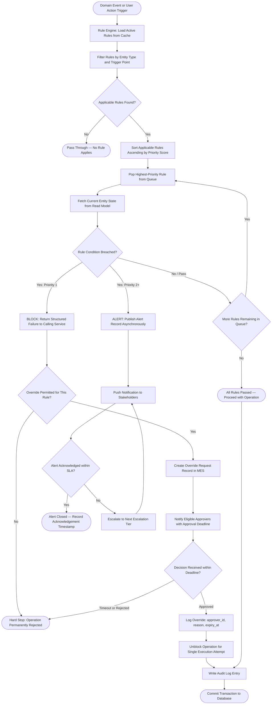

# Manufacturing Execution System — Business Rules

**Domain:** Discrete Manufacturing MES
**Version:** 1.0
**Scope:** Production Lifecycle, Material Management, Quality Management, OEE, ERP Integration, Shift Operations, Traceability
**Maintained by:** MES Platform Team / Manufacturing Systems Architecture
**Classification:** Internal — Controlled Document
**Last reviewed:** 2025-01

---

Business rules in this MES enforce operational discipline, data integrity, and regulatory compliance across the discrete manufacturing production lifecycle. Rules are evaluated at defined system trigger points by the MES Rule Engine and are classified by domain and priority. All changes to active rules require peer review and sign-off by the Plant Manager and MES Architect before deployment to production.

---

## Enforceable Rules

Rules with **Priority 1** are **blocking** — they halt the triggering operation until the condition is resolved or formally overridden. Rules with **Priority 2** are **alerting** — they permit the operation to continue but generate notifications and log entries for immediate follow-up. All rules produce an immutable evaluation record in the `rule_evaluation_log` table.

| Rule ID | Name | Description | Trigger | Action | Priority |
|---|---|---|---|---|---|
| BR-001 | Production Order Release Validation | A production order may only be released when materials are staged, routing is complete, work center capacity is available in the scheduled window, and an ERP planned order reference is confirmed open. | Release action on a DRAFT ProductionOrder | Block release; enumerate failed conditions; notify planner | 1 |
| BR-002 | Material Availability Check | All BOM-required components must have available quantity ≥ required at the operation's staging storage location. Batch-managed components must carry RELEASED batch status. | Operator triggers Start Operation on a shop-floor terminal | Block operation start; generate material shortage list; alert warehouse and shift supervisor | 1 |
| BR-003 | OEE Threshold Alert | When the rolling 60-minute OEE for a work center falls more than 10 percentage points below the configured `oee_target`, an alert is raised and escalated if unacknowledged within 15 minutes. | OEE recalculation job (every 5 minutes per active work center) | Create OEE alert record; push notification to supervisor; escalate and log to CI backlog if unresolved | 2 |
| BR-004 | Quality Hold on Defect Rate | If the order-level defect rate (defect qty / produced qty) exceeds 5%, or any CRITICAL defect is recorded, a quality hold is immediately placed on all associated batches and production is suspended. | DefectRecorded event published to event bus | Set linked batches to QUARANTINE; suspend IN_PROGRESS operations; auto-generate NCR; alert Quality Manager | 1 |
| BR-005 | Work Center Capacity Enforcement | Total planned production time for all RELEASED and IN_PROGRESS orders at a work center in any 8-hour shift window must not exceed net available capacity adjusted by the efficiency rate. | Production order scheduling or reschedule event | Reject schedule; display capacity gap in minutes; suggest earliest available slot | 2 |
| BR-006 | ERP Sync Validation | All production confirmations and goods movements written to SAP must pass pre-flight validation: the ERP order is open, confirmation quantity does not exceed remaining open quantity, and the FI posting period is open. | OperationCompleted or ProductionOrderCompleted event | Halt SAP posting; create SyncFailure record; alert integration team; queue for retry | 2 |
| BR-007 | Shift Handover Completeness | At shift end, the outgoing supervisor must complete a 100% digital handover checklist covering open orders, active machine downtimes, quality holds, open NCRs, and safety observations before shift closure. | Shift end time reached (scheduled trigger) | Block shift closure; remind supervisor; escalate to Plant Manager after 30 minutes | 2 |
| BR-008 | Traceability Record Integrity | A finished goods batch may only transition to RELEASED status if all consumed component batches are genealogically linked, all operations carry operator and timestamp, and at least one PASSED final inspection exists. | Batch status change request to RELEASED | Block RELEASED transition; enumerate missing records; alert quality team and production planner | 1 |

---

### BR-001 — Production Order Release Validation

A ProductionOrder in DRAFT status may only transition to RELEASED after all preconditions are verified in the MES. Premature releases create expediting crises, machine idle time, and material shortages on the shop floor. This rule is the primary gate preventing under-planned work from entering the active production schedule.

**Preconditions evaluated:**
- All BOM positions have confirmed available stock or a confirmed inbound delivery within the scheduled start window
- The target work center has sufficient available capacity in the scheduled time window without violating BR-005
- The manufacturing routing is fully defined with at least one Operation record in PENDING status
- A valid `erp_order_id` reference is confirmed OPEN via real-time ERP API call at the moment of release
- Scheduled start date falls within the active planning horizon (≤ 30 calendar days from release date)
- No existing RELEASED or IN_PROGRESS order exists for the same item at the same work center in the overlapping time window without explicit capacity allocation

**Trigger:** User selects "Release Order" on a DRAFT ProductionOrder record in the MES UI or via API
**Action on breach:** Release blocked; field-level validation summary returned; production planner notified with detail
**Override policy:** Production Planner may override with documented justification valid for one shift; Shift Supervisor co-approval required

---

### BR-002 — Material Availability Check

Before any Operation transitions to IN_PROGRESS, the MES verifies that all BOM-required materials for that specific operation are physically present and available at the designated staging location. Operators starting work without confirmed material availability is the leading cause of mid-operation stoppages, inflated setup times, and WIP lock.

**Preconditions evaluated:**
- For each BOM component assigned to the operation: `available_qty ≥ required_qty` at the operation's `storage_location` in the MES inventory ledger
- Batch-managed components: the system-allocated or operator-selected batch must have `status = RELEASED` in the Batch entity
- Serial-managed components: the serial number must be registered with `status = AVAILABLE`
- Hazardous materials: a valid handling authorisation must exist for the assigned operator's skill profile
- No existing QUARANTINE or REJECTED batch has been inadvertently selected for the operation

**Trigger:** Operator triggers "Start Operation" via shop-floor terminal; also re-evaluated on each batch substitution
**Action on breach:** Operation start blocked; per-material shortage list generated; warehouse pick alert created; shift supervisor notified
**Override policy:** Shift Supervisor may override for the duration of a single operation; interim supply arrangement must be documented

---

### BR-003 — OEE Threshold Alert

OEE (Overall Equipment Effectiveness) is the primary production performance KPI, calculated as the product of Availability, Performance, and Quality rates. A sustained drop below threshold represents measurable value loss and, if unaddressed, signals impending schedule deviation or quality risk. This rule ensures rapid human response before losses accumulate.

**OEE component definitions:**
- Availability = (Net Available Time − Unplanned Downtime) ÷ Net Available Time
- Performance = (Actual Output × Ideal Cycle Time) ÷ Net Available Time
- Quality = Good Output ÷ Total Output
- OEE = Availability × Performance × Quality

**Threshold logic:** Rolling 60-minute OEE < (`oee_target` − 10 percentage points) for the work center

**Alert escalation tiers:**
- T+0: Push notification to shift supervisor with OEE breakdown by component
- T+15 min (unacknowledged): Escalation push to production manager
- T+30 min (unresolved): Entry created in continuous improvement backlog with automatic priority flag

**Trigger:** OEE calculation job running every 5 minutes per active work center
**Action on breach:** OEE alert record created; notifications dispatched per escalation tier
**Override policy:** Not applicable — this is an alerting rule; no operation is blocked

---

### BR-004 — Quality Hold on Defect Rate

Quality holds protect downstream customers and the supply chain from receiving non-conforming product. The rule fires automatically without requiring manual quality intervention, ensuring that response time is not gated by staffing availability. Speed of hold placement is critical in high-volume discrete manufacturing to limit the escape quantity.

**Trigger conditions (either condition independently fires the rule):**
- Order-level defect rate = (cumulative defect quantity ÷ cumulative produced quantity) > 5%
- Any single Defect record with `defect_category = CRITICAL` is created against the order

**Actions executed atomically on breach:**
- All Batch records linked to the production order are set to `status = QUARANTINE`
- All IN_PROGRESS Operation records on the order receive status `INTERRUPTED`
- An NCR record is auto-generated with a sequenced `ncr_number` and linked to the triggering defect
- Quality Manager and Shift Supervisor receive push notification with order summary, defect rate, and NCR number
- ERP integration layer is notified to block goods movement postings for the affected order until hold is lifted

**Trigger:** DefectRecorded event published to the `mes.events.quality.defect-recorded` Kafka topic
**Action on breach:** Batch quarantine, operation suspension, NCR creation, stakeholder notification (all atomic)
**Override policy:** Quality Engineer may lift the hold with mandatory NCR reference; override valid until NCR is formally closed

---

### BR-005 — Work Center Capacity Enforcement

Capacity discipline prevents over-scheduling that leads to overtime, quality shortcuts, and missed delivery dates. This rule is evaluated at the scheduling tier before a production order is committed to a work center, ensuring that no shift window is loaded beyond its realistic achievable capacity. Preventive maintenance windows are excluded from available capacity.

**Capacity calculation:**
- Available capacity (min) = `net_available_mins` × (`efficiency_rate` ÷ 100)
- PM deduction (min) = sum of all scheduled maintenance window durations in the shift
- Effective available capacity = Available capacity − PM deduction
- Committed load (min) = Σ(`planned_run_mins` + `planned_setup_mins`) for all RELEASED and IN_PROGRESS orders in the shift window

**Breach condition:** Committed load after adding the new order > Effective available capacity

**Trigger:** Production order scheduling request; any reschedule, re-assignment, or shift window modification
**Action on breach:** Scheduling rejected; capacity gap displayed in minutes; earliest available slot with sufficient capacity calculated and surfaced to the planner
**Override policy:** Plant Manager may authorise over-scheduling for one shift with an overtime/resource plan justification

---

### BR-006 — ERP Sync Validation

Integration with SAP S/4HANA is a critical interface for financial visibility, material ledger accuracy, and supply chain alignment. All data posted to SAP must pass pre-flight validation to prevent creating inconsistencies that would require costly manual correction transactions (COGI, MR11, etc.) by the finance and planning teams.

**Validation checks executed before each SAP posting:**
- SAP production order status is not TECO (technically complete) or CLSD (closed)
- Confirmation quantity ≤ remaining open order quantity held in SAP PP
- Material document posting period is open in SAP FI (verified via period status API)
- Movement type (e.g. 261 for goods issue, 101 for goods receipt) is valid for the material and plant combination
- All mandatory batch classification characteristics are populated for batch-managed materials going to SAP
- The ERP system's health check endpoint returns HTTP 200 within the 5-second timeout

**Trigger:** OperationCompleted event or ProductionOrderCompleted event consumed by the `sap-integration-adapter`
**Action on breach:** SAP posting halted; SyncFailure record created with failure code and detail; integration operations team alerted; retry queued with 15-minute exponential backoff (max 3 attempts before manual escalation)
**Override policy:** MES Integration Admin may force a single retry attempt with an incident ticket reference as mandatory justification

---

### BR-007 — Shift Handover Completeness

Shift handovers are among the highest-risk transitions in continuous discrete manufacturing. Incomplete handovers result in the incoming shift being unaware of active quality holds, unresolved machine faults, or critical production deviations from the outgoing shift. The digital handover checklist enforces structured, time-stamped, and auditable information transfer.

**Required checklist sections (all must reach 100% completion):**
- Status summary of all open production orders assigned to the work center: status, quantity produced, deviations
- All active machine downtime events: machine ID, start time, root cause code, estimated resolution time
- All open quality holds: batch numbers, NCR references, disposition pending decisions
- All open non-conformance reports and their current disposition status
- Safety observations, near-misses, and incidents from the shift with corrective action taken
- Tool and fixture condition status for the next shift's planned operations
- Handover acknowledgement signature from the incoming shift supervisor

**Trigger:** Shift end time reached as a scheduled MES system event
**Action on breach:** Shift closure blocked; outgoing supervisor notified via push and on-screen alert; Plant Manager alerted after 30 minutes of non-completion
**Override policy:** Not permitted. Shift cannot be officially closed until checklist completion reaches 100%.

---

### BR-008 — Traceability Record Integrity

Complete and unbroken traceability is both a regulatory requirement and a customer contractual obligation in discrete manufacturing sectors including automotive (IATF 16949), aerospace (AS9100D), and medical devices (ISO 13485). This rule enforces completeness at the batch release gate, serving as the final verification that the traceability chain is intact before product leaves the MES control boundary.

**Completeness checks executed:**
- All BOM-listed component batches are recorded as consumed via MaterialConsumed events and linked in the batch `traceability_data` genealogy
- Every Operation on the production order carries a recorded `start_time`, `end_time`, and `operator_id` — no NULL fields permitted
- At least one QualityInspection with `inspection_type = FINAL` and `status = PASSED` is linked to the batch
- No Defect record linked to the batch or order has `disposition = NULL` — all defects must carry a disposition decision
- No linked component Batch record is in QUARANTINE or REJECTED status at the time of release
- The batch's `certificate_of_analysis` link is populated where required by the material's inspection plan

**Trigger:** Any request to update a Batch record's `status` to RELEASED
**Action on breach:** Status transition blocked; enumerated list of incomplete record IDs returned in the error response; quality team and production planner notified
**Override policy:** Not permitted. All completeness checks must pass. Manual intervention by a Quality Engineer to resolve each gap is the only path to RELEASED status.

---

### Rule Dependency Matrix

Certain rules interact: a breach of one rule may trigger evaluation of another, or the resolution of one rule may be a prerequisite for another to pass. Understanding these dependencies is essential for diagnosing cascading rule failures and sequencing override requests correctly.

| Rule | Depends On | Triggers | Blocked By |
|---|---|---|---|
| BR-001 | BR-005 (capacity must pass before release) | BR-002 (material check at first operation) | BR-005 breach prevents release |
| BR-002 | BR-001 (order must be RELEASED) | BR-004 (if batch status invalid, defect logic may engage) | BR-001 not met; batch in QUARANTINE |
| BR-003 | OperationStarted event (requires active operations) | None (alerting only) | None |
| BR-004 | DefectRecorded event; order in IN_PROGRESS | BR-006 (ERP sync blocked on quarantined order) | None — fires automatically |
| BR-005 | Work center `net_available_mins` and `efficiency_rate` populated | BR-001 (capacity check prerequisite for release) | None |
| BR-006 | BR-008 not yet triggered (batch not in QUARANTINE) | None | BR-004 (quarantine blocks goods movement posting) |
| BR-007 | Shift end time reached | None | None |
| BR-008 | BR-004 not active (no open quality hold on batch) | None | BR-004 active hold prevents RELEASED status |

**Cascade example:** A single CRITICAL defect record triggers BR-004, which quarantines the batch. The quarantined batch then causes BR-006 to fail on the next ERP sync attempt (goods receipt blocked for quarantined material). Simultaneously, BR-008 blocks the batch from reaching RELEASED status until the NCR created by BR-004 is formally closed by a Quality Engineer and the hold is lifted.

---

## Rule Evaluation Pipeline

The MES Rule Engine is a stateless microservice (`mes-rule-engine`) that subscribes to all domain events on the `mes.events.*` Kafka topic namespace. Priority 1 rules are evaluated **synchronously** within the calling service's database transaction, blocking the operation at the API layer. Priority 2 rules are evaluated **asynchronously** in a dedicated consumer group without blocking the originating transaction.

**Pipeline technical notes:**
- Synchronous evaluation (Priority 1) is part of the calling service's database transaction. A breach triggers a transaction rollback and returns a structured `RuleBreachError` with `rule_id`, `breach_details`, and `override_request_url`.
- Asynchronous evaluation (Priority 2+) is handled in a separate Kafka consumer group. Results do not affect the originating transaction latency.
- Rule definitions are stored in the `business_rules` table and loaded into an in-memory cache with a 60-second TTL. A `RuleConfigUpdated` event triggers immediate cache invalidation across all rule engine instances.
- Idempotency is enforced by keying each evaluation on `{rule_id, entity_id, trigger_event_id}` to prevent duplicate alerts on Kafka consumer retry.
- Every evaluation outcome — pass or fail — is written to the `rule_evaluation_log` table with: `rule_id`, `entity_id`, `entity_type`, `trigger_event_id`, `result`, `evaluated_at`, `evaluator_version`.

---

## Exception and Override Handling

Manufacturing environments require controlled flexibility to handle exceptional circumstances without halting production. The MES override mechanism provides a structured, time-bounded, and fully auditable path for authorised personnel to proceed past a blocking rule when operational conditions justify it. Override capability is a privilege, not an entitlement — all overrides are reviewed in the weekly continuous improvement meeting.

### Override Eligibility Matrix

| Rule ID | Override Permitted | Minimum Approver Role | Approval Deadline | Reason Required | Expiry |
|---|---|---|---|---|---|
| BR-001 | Yes | Production Planner | 4 hours | Yes — specific supply and capacity detail | 1 shift |
| BR-002 | Yes | Shift Supervisor | 30 minutes | Yes — interim material supply arrangement | Duration of operation |
| BR-003 | No (alert only) | N/A | N/A | N/A | N/A |
| BR-004 | Yes | Quality Engineer | 2 hours | Yes — NCR number is mandatory | Until NCR formally closed |
| BR-005 | Yes | Plant Manager | 8 hours | Yes — overtime and resource plan detail | 1 shift |
| BR-006 | Yes | MES Integration Admin | 24 hours | Yes — incident ticket reference | Single retry attempt |
| BR-007 | No | N/A | N/A | N/A | N/A |
| BR-008 | No | N/A | N/A | N/A | N/A |

### Override Workflow Steps

1. **Initiation** — The blocked operation surfaces an in-app override request form. The requester must select the rule being overridden, provide a free-text justification of at least 50 characters, attach supporting evidence (photo, document hyperlink, or SAP message screenshot), and nominate an eligible approver by employee number.

2. **Notification** — The nominated approver receives an immediate push notification and email with a deep link to the approval screen. For all Priority 1 rule overrides, a copy is automatically sent to the Plant Manager as a visibility notification.

3. **Time-Bounded Review** — The approver must act within the approval deadline specified in the eligibility matrix. If no action is taken within the deadline, the override request is automatically rejected and the operation remains blocked. The requester is notified of the timeout expiry.

4. **Approval Decision** — Approval requires the approver to enter their employee PIN (or biometric authentication on supported terminals) as a digital e-signature, providing legal non-repudiation. Rejection requires a mandatory reason field that is conveyed to the requester with guidance for resolution.

5. **Audit Persistence** — Whether approved or rejected, the full override record is written immutably to the `override_audit_log` table: `rule_id`, `entity_id`, `entity_type`, `requested_by`, `approved_by`, `request_reason`, `approval_reason`, `requested_at`, `decided_at`, `outcome`, `expiry_at`, `single_use_token`.

6. **Post-Override Monitoring** — A single-use override token is issued; the operation is unblocked for exactly one execution. Subsequent attempts at the same operation require a new override cycle. Three or more overrides of the same rule within a calendar month trigger an automatic root cause review ticket in the continuous improvement system.

### Standing Exceptions

Where a standing exception to a rule is required for a specific entity (e.g., a legacy work center with a permanently constrained capacity model), a `rule_exception` record may be registered by the MES Architect with joint Plant Manager authorisation. Standing exceptions require:
- A written justification narrative referencing the business or technical constraint
- A defined expiry date (maximum 90 calendar days from registration)
- Quarterly review and explicit renewal with fresh authorisation
- Monthly reporting in the MES governance forum with trend analysis

Standing exceptions are scoped to a single `{rule_id, entity_id}` pair and do not constitute a blanket waiver of the rule for other entities. Expired exceptions are automatically re-enabled; re-registration is required to extend them. All standing exception records are permanently retained in `rule_exceptions` and are included in external quality audit evidence packages.

### Escalation Tiers

| Tier | Audience | Activation Condition | Channel | Response SLA |
|---|---|---|---|---|
| Tier 1 | Shift Supervisor | Any Priority 1 rule breach or OEE alert | MES push notification | 15 minutes |
| Tier 2 | Production Manager | Tier 1 unacknowledged > 15 min; or > 3 Priority 1 overrides in a shift | Email and SMS | 30 minutes |
| Tier 3 | Plant Manager | Tier 2 unacknowledged > 30 min; or production stopped > 60 continuous minutes | Phone escalation | Immediate |
| Tier 4 | VP Manufacturing | Plant Manager unresponsive; or production stopped > 4 hours | Emergency contact protocol | Immediate |

Escalation tier assignments and contact details are maintained in the `escalation_contacts` table and reviewed quarterly alongside the rules governance cycle.
