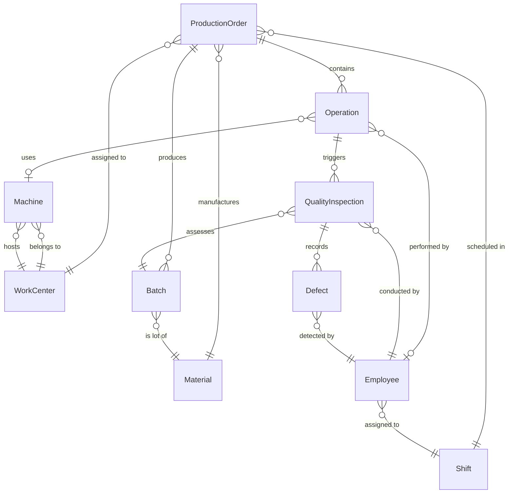

# Manufacturing Execution System — Data Dictionary

**Domain:** Discrete Manufacturing MES
**Version:** 1.0
**Scope:** Production Orders, Work Centers, OEE, Quality Management, Material Tracking, IoT/SCADA Integration, ERP (SAP) Integration, Traceability
**Maintained by:** MES Platform Team
**Standard:** ISA-95 / IEC 62264 Level 3
**Last reviewed:** 2025-01

---

This data dictionary defines the canonical data model for the Manufacturing Execution System serving discrete manufacturing operations. Entities are aligned with ISA-95 Level 3 standards and integrate with upstream ERP (SAP S/4HANA) and downstream IoT/SCADA layers.

Field types follow PostgreSQL conventions. UUIDs are version 4. All timestamps are stored in UTC. Enumerated values are enforced at the application layer with database-level `CHECK` constraints as a secondary guard. All entities participate in the immutable audit trail and must not be hard-deleted.

---

## Core Entities

### ProductionOrder

A ProductionOrder is the primary unit of work in the MES, representing a manufacturing instruction to produce a defined quantity of a finished or semi-finished item within a scheduled time window. Orders originate from SAP PP planned orders, drive downstream scheduling, material staging, and quality inspection activities, and are the root anchor for traceability trees.

| Field | Type | Constraints | Description |
|---|---|---|---|
| production_order_id | UUID | PK, NOT NULL | Surrogate primary key |
| order_number | VARCHAR(20) | UNIQUE, NOT NULL | Human-readable order identifier, e.g. MO-2025-00412 |
| erp_order_id | VARCHAR(20) | UNIQUE | SAP production order number for ERP sync |
| item_code | VARCHAR(50) | FK → Material, NOT NULL | Finished or semi-finished item being produced |
| bill_of_material_version | VARCHAR(10) | NOT NULL | BOM version active at order release |
| routing_version | VARCHAR(10) | NOT NULL | Routing version used for operation scheduling |
| planned_quantity | DECIMAL(12,3) | > 0, NOT NULL | Authorised quantity to manufacture |
| actual_quantity | DECIMAL(12,3) | >= 0, DEFAULT 0 | Cumulative good quantity confirmed at operations |
| scrap_quantity | DECIMAL(12,3) | >= 0, DEFAULT 0 | Total scrapped quantity across all operations |
| unit_of_measure | VARCHAR(10) | NOT NULL | Base unit (EA, KG, M, etc.) |
| status | VARCHAR(25) | CHECK IN (DRAFT, RELEASED, IN_PROGRESS, COMPLETED, PARTIALLY_COMPLETED, CANCELLED) | Lifecycle state |
| priority | SMALLINT | BETWEEN 1 AND 10, DEFAULT 5 | Scheduling priority; 1 is highest |
| scheduled_start | TIMESTAMPTZ | NOT NULL | ERP-derived planned start date/time |
| scheduled_end | TIMESTAMPTZ | > scheduled_start, NOT NULL | ERP-derived planned end date/time |
| actual_start | TIMESTAMPTZ | | Recorded when first operation begins |
| actual_end | TIMESTAMPTZ | > actual_start | Recorded when final operation closes |
| work_center_id | UUID | FK → WorkCenter | Primary work center assigned to the order |
| shift_id | UUID | FK → Shift | Active shift at order release |
| created_by | UUID | FK → Employee, NOT NULL | Employee who released the order in MES |
| created_at | TIMESTAMPTZ | DEFAULT NOW(), NOT NULL | Record creation timestamp |
| updated_at | TIMESTAMPTZ | NOT NULL | Last modification timestamp |

---

### WorkCenter

A WorkCenter is a logical or physical production resource capable of executing one or more manufacturing operations. It maps directly to the SAP work center (CR) object and represents a grouping of machines, labour, and tooling sharing a common capacity pool and OEE reporting boundary.

| Field | Type | Constraints | Description |
|---|---|---|---|
| work_center_id | UUID | PK, NOT NULL | Surrogate primary key |
| work_center_code | VARCHAR(20) | UNIQUE, NOT NULL | Short operational code, e.g. WC-STAMP-01 |
| name | VARCHAR(100) | NOT NULL | Descriptive name |
| department | VARCHAR(50) | NOT NULL | Owning department (Fabrication, Assembly, Paint) |
| plant_code | VARCHAR(10) | NOT NULL | SAP plant identifier |
| erp_work_center_id | VARCHAR(20) | UNIQUE | SAP work center ID for master data sync |
| rated_capacity_hours | DECIMAL(6,2) | > 0 | Available production hours per shift |
| capacity_uom | VARCHAR(10) | NOT NULL | Capacity unit (HOURS, PIECES, KG) |
| efficiency_rate | DECIMAL(5,2) | BETWEEN 0 AND 100 | Standard efficiency percentage applied to capacity |
| oee_target | DECIMAL(5,2) | BETWEEN 0 AND 100 | Target OEE percentage, typically 65–85% |
| availability_target | DECIMAL(5,2) | BETWEEN 0 AND 100 | Planned availability component of OEE |
| performance_target | DECIMAL(5,2) | BETWEEN 0 AND 100 | Planned performance component of OEE |
| quality_target | DECIMAL(5,2) | BETWEEN 0 AND 100 | Planned quality component of OEE |
| cost_centre | VARCHAR(20) | | SAP cost centre for labour and overhead allocation |
| status | VARCHAR(20) | CHECK IN (ACTIVE, INACTIVE, MAINTENANCE, DECOMMISSIONED) | Operational state |
| created_at | TIMESTAMPTZ | DEFAULT NOW() | Record creation timestamp |
| updated_at | TIMESTAMPTZ | NOT NULL | Last modification timestamp |

---

### Operation

An Operation is a discrete step within a production routing that must be executed at a designated work center. Operations are sequence-ordered, may have predecessor dependencies, and capture actual labour and machine time for variance analysis against routing standards.

| Field | Type | Constraints | Description |
|---|---|---|---|
| operation_id | UUID | PK, NOT NULL | Surrogate primary key |
| production_order_id | UUID | FK → ProductionOrder, NOT NULL | Parent production order |
| work_center_id | UUID | FK → WorkCenter, NOT NULL | Assigned work center |
| machine_id | UUID | FK → Machine | Specific machine if required by routing |
| operator_id | UUID | FK → Employee | Assigned operator at execution time |
| operation_code | VARCHAR(20) | NOT NULL | Routing operation code, e.g. 0010, 0020 |
| description | VARCHAR(200) | NOT NULL | Human-readable operation description |
| sequence_number | SMALLINT | NOT NULL, > 0 | Execution order within the routing |
| planned_setup_mins | DECIMAL(8,2) | >= 0 | Standard setup time from routing |
| actual_setup_mins | DECIMAL(8,2) | >= 0 | Recorded setup time |
| planned_run_mins | DECIMAL(8,2) | > 0 | Standard production run time from routing |
| actual_run_mins | DECIMAL(8,2) | >= 0 | Recorded production run time |
| status | VARCHAR(20) | CHECK IN (PENDING, SETUP, IN_PROGRESS, INTERRUPTED, COMPLETED, SKIPPED) | Lifecycle state |
| yield_quantity | DECIMAL(12,3) | >= 0 | Accepted output quantity at this operation |
| scrap_quantity | DECIMAL(12,3) | >= 0, DEFAULT 0 | Scrapped quantity at this operation |
| start_time | TIMESTAMPTZ | | Actual operation start timestamp |
| end_time | TIMESTAMPTZ | > start_time | Actual operation end timestamp |
| nc_disposition | VARCHAR(20) | CHECK IN (NONE, REWORK, SCRAP, MRB) | Non-conformance disposition code |
| created_at | TIMESTAMPTZ | DEFAULT NOW() | Record creation timestamp |

---

### Material

A Material represents any raw material, purchased component, consumable, semi-finished assembly, or finished good tracked within the MES. Material master data is mastered in SAP and replicated to MES via the integration layer. Batch and serial number management flags govern downstream traceability requirements.

| Field | Type | Constraints | Description |
|---|---|---|---|
| material_id | UUID | PK, NOT NULL | Surrogate primary key |
| material_code | VARCHAR(50) | UNIQUE, NOT NULL | SAP material number |
| description | VARCHAR(200) | NOT NULL | Material description |
| material_type | VARCHAR(20) | CHECK IN (RAW, SEMI_FINISHED, FINISHED, CONSUMABLE, SPARE_PART, PACKAGING) | Classification |
| industry_sector | VARCHAR(5) | | SAP industry sector code |
| unit_of_measure | VARCHAR(10) | NOT NULL | Base unit of measure |
| alternative_uom | JSONB | | Array of alternate UOM conversion factors |
| batch_managed | BOOLEAN | DEFAULT FALSE, NOT NULL | Whether batch tracking is required |
| serial_managed | BOOLEAN | DEFAULT FALSE, NOT NULL | Whether serial number tracking is required |
| shelf_life_days | INTEGER | > 0 | Maximum shelf life; NULL if not applicable |
| safety_stock_qty | DECIMAL(12,3) | >= 0 | Minimum on-hand quantity threshold |
| erp_material_id | VARCHAR(20) | UNIQUE, NOT NULL | SAP material ID for master data sync |
| storage_conditions | VARCHAR(100) | | Temperature, humidity, and handling notes |
| hazardous_material | BOOLEAN | DEFAULT FALSE, NOT NULL | Flag for MSDS/SDS regulatory requirements |
| created_at | TIMESTAMPTZ | DEFAULT NOW() | Record creation timestamp |
| updated_at | TIMESTAMPTZ | NOT NULL | Last modification timestamp |

---

### QualityInspection

A QualityInspection captures the formal assessment of product conformance at a defined checkpoint in the production process. Inspections are triggered automatically by control plans at key operations or manually by quality personnel. Results feed SPC charts and drive disposition decisions on associated batches.

| Field | Type | Constraints | Description |
|---|---|---|---|
| inspection_id | UUID | PK, NOT NULL | Surrogate primary key |
| inspection_number | VARCHAR(25) | UNIQUE, NOT NULL | Human-readable ID, e.g. QI-2025-004712 |
| production_order_id | UUID | FK → ProductionOrder, NOT NULL | Associated production order |
| operation_id | UUID | FK → Operation | Specific operation at which inspection occurs |
| batch_id | UUID | FK → Batch | Batch lot under inspection |
| inspection_type | VARCHAR(20) | CHECK IN (INCOMING, IN_PROCESS, FINAL, PATROL, AUDIT) | Inspection classification |
| control_plan_id | VARCHAR(50) | | Reference to the governing control plan document |
| inspector_id | UUID | FK → Employee, NOT NULL | Employee conducting the inspection |
| inspection_date | TIMESTAMPTZ | NOT NULL | Date and time inspection was performed |
| sample_size | INTEGER | > 0, NOT NULL | Number of units sampled |
| sample_method | VARCHAR(20) | CHECK IN (AQL, 100_PCT, SKIP_LOT, STATISTICAL) | Sampling methodology |
| status | VARCHAR(25) | CHECK IN (PENDING, IN_PROGRESS, PASSED, FAILED, CONDITIONALLY_PASSED, VOIDED) | Inspection result status |
| disposition | VARCHAR(20) | CHECK IN (ACCEPT, REJECT, REWORK, SCRAP, MRB, HOLD) | Final lot disposition |
| spc_chart_reference | VARCHAR(50) | | SPC chart identifier for statistical tracking |
| notes | TEXT | | Inspector observations and ancillary findings |
| created_at | TIMESTAMPTZ | DEFAULT NOW() | Record creation timestamp |

---

### Defect

A Defect records a specific non-conformance identified during or after production. Defects are categorised by severity, linked to inspection and operation records, and trigger corrective action workflows. Defect data drives SPC out-of-control signals, first-pass yield metrics, and Pareto analysis for continuous improvement programmes.

| Field | Type | Constraints | Description |
|---|---|---|---|
| defect_id | UUID | PK, NOT NULL | Surrogate primary key |
| defect_code | VARCHAR(20) | NOT NULL | Standardised defect code from the defect catalogue |
| inspection_id | UUID | FK → QualityInspection | Originating inspection record |
| operation_id | UUID | FK → Operation | Operation where defect was detected |
| defect_category | VARCHAR(10) | CHECK IN (CRITICAL, MAJOR, MINOR, COSMETIC) | Severity classification |
| defect_type | VARCHAR(50) | NOT NULL | Type label, e.g. Dimensional, Porosity, Burr, Delamination |
| defect_quantity | INTEGER | >= 1, NOT NULL | Number of non-conforming units |
| defect_description | TEXT | NOT NULL | Detailed description of the non-conformance |
| root_cause_code | VARCHAR(20) | | Ishikawa/5M root cause classification code |
| root_cause_description | TEXT | | Narrative root cause analysis |
| corrective_action | TEXT | | Immediate corrective action taken |
| detected_by | UUID | FK → Employee, NOT NULL | Employee who identified the defect |
| detected_at | TIMESTAMPTZ | NOT NULL | Timestamp of defect detection |
| disposition | VARCHAR(20) | CHECK IN (SCRAP, REWORK, USE_AS_IS, RETURN_TO_SUPPLIER, MRB) | Defect disposition decision |
| ncr_number | VARCHAR(25) | UNIQUE | Non-conformance report number |
| created_at | TIMESTAMPTZ | DEFAULT NOW() | Record creation timestamp |

---

### Employee

An Employee record represents a production workforce member authorised to interact with the MES. Records govern access control, skill-based work assignment, digital signature capture for critical operations, and shift-based time tracking. Synchronised from HR master data in SAP HCM.

| Field | Type | Constraints | Description |
|---|---|---|---|
| employee_id | UUID | PK, NOT NULL | Surrogate primary key |
| employee_number | VARCHAR(20) | UNIQUE, NOT NULL | SAP personnel number |
| first_name | VARCHAR(50) | NOT NULL | Given name |
| last_name | VARCHAR(50) | NOT NULL | Family name |
| department | VARCHAR(50) | NOT NULL | Organisational unit |
| job_title | VARCHAR(100) | | Position title |
| role | VARCHAR(50) | CHECK IN (OPERATOR, TEAM_LEADER, SUPERVISOR, QUALITY_INSPECTOR, MAINTENANCE, PLANNER, ADMIN) | MES role governing permissions |
| shift_id | UUID | FK → Shift | Default assigned shift |
| skill_certifications | JSONB | | Array of {skill_code, certified_date, expiry_date} |
| work_center_authorisations | JSONB | | Array of work_center_ids the employee may operate |
| active | BOOLEAN | DEFAULT TRUE, NOT NULL | Whether the record is currently active |
| erp_employee_id | VARCHAR(20) | UNIQUE | SAP HCM employee ID |
| pin_hash | VARCHAR(256) | | bcrypt-hashed PIN for shop-floor terminal authentication |
| created_at | TIMESTAMPTZ | DEFAULT NOW() | Record creation timestamp |
| updated_at | TIMESTAMPTZ | NOT NULL | Last modification timestamp |

---

### Machine

A Machine represents a physical production asset assigned to a work center. Records capture nameplate data, maintenance schedules, IoT/SCADA integration endpoints, and real-time status for OEE calculation. Machine status changes from connected devices are ingested via the IoT gateway and applied through event-driven state transitions.

| Field | Type | Constraints | Description |
|---|---|---|---|
| machine_id | UUID | PK, NOT NULL | Surrogate primary key |
| machine_code | VARCHAR(20) | UNIQUE, NOT NULL | Internal asset tag, e.g. MCH-CNC-042 |
| name | VARCHAR(100) | NOT NULL | Descriptive machine name |
| work_center_id | UUID | FK → WorkCenter, NOT NULL | Assigned work center |
| machine_type | VARCHAR(50) | NOT NULL | Classification: CNC Lathe, Press, Welder, Robot, etc. |
| manufacturer | VARCHAR(100) | | OEM manufacturer name |
| model_number | VARCHAR(50) | | OEM model designation |
| serial_number | VARCHAR(50) | UNIQUE | Manufacturer serial number |
| installation_date | DATE | | Date asset was commissioned |
| last_maintenance_date | DATE | | Most recent PM completion date |
| next_maintenance_date | DATE | > last_maintenance_date | Scheduled next PM date |
| status | VARCHAR(20) | CHECK IN (RUNNING, IDLE, SETUP, MAINTENANCE, BREAKDOWN, OFFLINE) | Current operational state |
| scada_device_id | VARCHAR(100) | UNIQUE | SCADA/PLC device identifier |
| iot_gateway_id | VARCHAR(100) | | IoT edge gateway device ID |
| opc_ua_endpoint | VARCHAR(255) | | OPC-UA server connection string |
| availability_target | DECIMAL(5,2) | BETWEEN 0 AND 100 | Machine-level availability target percentage |
| created_at | TIMESTAMPTZ | DEFAULT NOW() | Record creation timestamp |
| updated_at | TIMESTAMPTZ | NOT NULL | Last modification timestamp |

---

### Shift

A Shift defines the scheduled working period for production personnel and machines at a work center. Shift records govern capacity calculations, scheduled downtime exclusions, and handover workflows. Multiple shifts may be active simultaneously across different work centers in a multi-plant environment.

| Field | Type | Constraints | Description |
|---|---|---|---|
| shift_id | UUID | PK, NOT NULL | Surrogate primary key |
| shift_code | VARCHAR(20) | UNIQUE, NOT NULL | Short identifier, e.g. SHF-DAY-A |
| shift_name | VARCHAR(50) | NOT NULL | Descriptive name, e.g. Day Shift A, Night Shift |
| start_time | TIME | NOT NULL | Scheduled start time in plant-local time |
| end_time | TIME | NOT NULL | Scheduled end time in plant-local time |
| planned_duration_hours | DECIMAL(4,2) | > 0, NOT NULL | Total shift hours including breaks |
| break_duration_mins | INTEGER | >= 0, NOT NULL | Total planned break time excluded from OEE calculation |
| net_available_mins | INTEGER | > 0, NOT NULL | Planned production time (duration minus breaks) |
| active_days | VARCHAR(7) | NOT NULL | Day-of-week bitmask, e.g. MTWTF__ |
| supervisor_id | UUID | FK → Employee | Assigned shift supervisor |
| work_center_id | UUID | FK → WorkCenter | Applicable work center; NULL means plant-wide |
| handover_required | BOOLEAN | DEFAULT TRUE, NOT NULL | Whether digital handover checklist is mandatory |
| created_at | TIMESTAMPTZ | DEFAULT NOW() | Record creation timestamp |
| updated_at | TIMESTAMPTZ | NOT NULL | Last modification timestamp |

---

### Batch

A Batch represents a traceable lot of material produced or consumed during manufacturing. Batch records are the cornerstone of end-to-end traceability, linking raw material inputs to finished goods shipments. For batch-managed materials, every material movement, quality inspection, and operation execution is linked to a batch record.

| Field | Type | Constraints | Description |
|---|---|---|---|
| batch_id | UUID | PK, NOT NULL | Surrogate primary key |
| batch_number | VARCHAR(50) | UNIQUE, NOT NULL | Lot/batch identifier aligned with SAP batch number |
| material_id | UUID | FK → Material, NOT NULL | Material this batch is a lot of |
| production_order_id | UUID | FK → ProductionOrder | Originating production order; NULL for purchased material |
| quantity | DECIMAL(12,3) | > 0, NOT NULL | Initial batch quantity |
| remaining_quantity | DECIMAL(12,3) | >= 0, NOT NULL | Current available quantity after consumption |
| unit_of_measure | VARCHAR(10) | NOT NULL | Unit of measure |
| status | VARCHAR(20) | CHECK IN (IN_PROCESS, QUARANTINE, RELEASED, REJECTED, CONSUMED, SHIPPED, EXPIRED) | Batch lifecycle state |
| manufactured_date | DATE | | Date batch was produced; NULL for purchased material |
| expiry_date | DATE | > manufactured_date | Shelf-life expiry date |
| storage_location | VARCHAR(50) | | Current storage bin or location code |
| supplier_batch_number | VARCHAR(50) | | External supplier batch reference |
| erp_batch_id | VARCHAR(20) | | SAP batch number for ERP alignment |
| traceability_data | JSONB | | Extended genealogy: {parent_batches, serial_numbers, component_lots} |
| certificate_of_analysis | VARCHAR(255) | | Link to CoA document in document management store |
| created_at | TIMESTAMPTZ | DEFAULT NOW() | Record creation timestamp |
| updated_at | TIMESTAMPTZ | NOT NULL | Last modification timestamp |

---

## Canonical Relationship Diagram

The entity relationship diagram below represents the primary associations between MES core entities. Cardinality follows crow's foot notation. All foreign key relationships are enforced at the database level with `ON DELETE RESTRICT` semantics to preserve audit and traceability chains.

**Key relationship semantics:**

- A **ProductionOrder** contains one or more **Operations** sequenced according to the manufacturing routing. The order is the root of the traceability tree.
- Each **Operation** is assigned to a **WorkCenter** and optionally to a specific **Machine** within that work center, capturing both resource planning and actual utilisation.
- **QualityInspections** are linked to both the triggering **Operation** and the **Batch** under assessment, enabling lot-level disposition decisions that cascade to material movements.
- **Defects** are children of **QualityInspection** records and carry independent dispositions, allowing partial lot acceptance or selective rework at the defect level.
- **Batches** trace lineage to a **ProductionOrder** for manufactured goods, or directly to a **Material** for purchased components, supporting complete genealogy trees required by IATF 16949, AS9100, and ISO 13485.
- **Employee** records link to a default **Shift** for scheduling but are independently recorded on each **Operation** at actual execution time, supporting cross-shift traceability.
- The **Machine** to **WorkCenter** relationship governs OEE roll-up: machine-level availability, performance, and quality metrics aggregate upward to the work center reporting boundary.

---

## Data Quality Controls

Data quality enforcement operates at three layers: application-layer validation (pre-persistence), database constraint enforcement (post-submission), and integration-layer reconciliation (ERP/IoT sync). Violations at any layer produce structured error responses, alert records, and immutable audit entries.

### Validation Rules

| Rule | Entity | Condition | Action |
|---|---|---|---|
| DQC-001 | ProductionOrder | `scheduled_end` must be after `scheduled_start` | Reject save; return HTTP 422 with field-level error |
| DQC-002 | ProductionOrder | `actual_quantity` + `scrap_quantity` must not exceed `planned_quantity` × 1.10 | Warn supervisor; allow save with approval override |
| DQC-003 | ProductionOrder | Status transition must follow the allowed state machine: DRAFT→RELEASED→IN_PROGRESS→COMPLETED | Reject invalid transition; log attempt to audit trail |
| DQC-004 | Operation | `end_time` must be after `start_time` | Reject save; return field-level validation error |
| DQC-005 | Operation | `scrap_quantity` + `yield_quantity` must not exceed parent order remaining planned quantity | Reject; require supervisor confirmation to override |
| DQC-006 | Operation | Operator must hold a valid skill certification for the operation's work center type | Warn operator; require supervisor e-signature to proceed |
| DQC-007 | QualityInspection | `sample_size` must be > 0 and ≤ batch `quantity` | Reject if sample_size exceeds batch quantity |
| DQC-008 | QualityInspection | Disposition must be set before status transitions to PASSED or FAILED | Block status update; return validation error |
| DQC-009 | Defect | `defect_quantity` must be >= 1 | Reject save with validation error |
| DQC-010 | Defect | CRITICAL defect must have `root_cause_code` populated within 4 hours of detection | Automated escalation alert to Quality Manager at T+4h |
| DQC-011 | Batch | `expiry_date` must be after `manufactured_date` | Reject save; return validation error |
| DQC-012 | Batch | Status cannot transition from RELEASED back to IN_PROCESS | Reject invalid transition; log attempt to audit trail |
| DQC-013 | Batch | `remaining_quantity` must not fall below 0 | Reject material consumption transaction; alert planner |
| DQC-014 | Machine | `next_maintenance_date` must be after `last_maintenance_date` | Reject save with validation error |
| DQC-015 | Machine | Status change to RUNNING requires an active production order at its work center | Warn operator; allow override with team leader signature |
| DQC-016 | Employee | `pin_hash` must conform to bcrypt 60-character format | Reject non-conformant hash at persistence layer |
| DQC-017 | Employee | Employee must have at least one work center authorisation before `role = OPERATOR` is assigned | Reject role assignment; return guidance message |
| DQC-018 | Shift | `net_available_mins` must equal `planned_duration_hours × 60 − break_duration_mins` | Auto-recalculate on save; log discrepancy if manually overridden |
| DQC-019 | WorkCenter | `oee_target` must be ≤ `availability_target × performance_target × quality_target / 10000` | Warn planner of mathematically inconsistent OEE targets |
| DQC-020 | Material | `erp_material_id` must resolve to a confirmed SAP material in the integration sync reference table | Reject if ERP cross-reference not found; route to data steward |

### Referential Integrity Policy

All foreign key relationships shown in the canonical relationship diagram are enforced at the database level with `ON DELETE RESTRICT` semantics. Cascading deletes are prohibited for all entities in this model. Logical deletion using `status = CANCELLED` or `active = FALSE` is the required pattern to preserve audit history and traceability chains.

### Audit Trail Requirements

Every INSERT and UPDATE on `ProductionOrder`, `Operation`, `QualityInspection`, `Defect`, and `Batch` must be recorded in the `audit_log` table with: `entity_type`, `entity_id`, `action`, `changed_by`, `changed_at`, `previous_value (JSONB)`, `new_value (JSONB)`. This supports 21 CFR Part 11, IATF 16949 traceability, and GS1 batch genealogy obligations. Audit log records are immutable and subject to a minimum 7-year retention policy.
