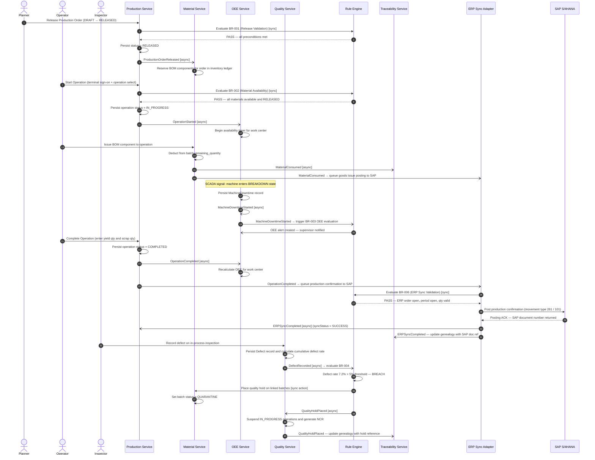

# Manufacturing Execution System — Event Catalog

**Domain:** Discrete Manufacturing MES
**Version:** 1.0
**Scope:** Production Events, Quality Events, Material Events, Machine Events, ERP Integration Events
**Maintained by:** MES Platform Team / Integration Architecture
**Event Bus:** Apache Kafka 3.x
**Specification Compliance:** CloudEvents 1.0
**Schema Registry:** Confluent Schema Registry (Avro)
**Last reviewed:** 2025-01

---

This catalog defines all domain events produced and consumed within the MES event-driven architecture. Events are the primary mechanism for inter-service communication, ERP integration triggers, IoT/SCADA data ingestion, and audit trail propagation across the discrete manufacturing production lifecycle. All events conform to the CloudEvents 1.0 specification and are governed by a schema registry to enforce backward and forward compatibility contracts between producers and consumers.

---

## Contract Conventions

### Event Envelope Schema

Every event published from the MES platform conforms to the [CloudEvents 1.0 specification](https://cloudevents.io). The envelope carries standard contextual attributes alongside a typed `data` payload specific to the event domain. Consumers must tolerate unknown envelope extension attributes to remain compatible with future envelope revisions.

**Standard CloudEvents attributes (required on all events):**

| Attribute | Type | Required | Description |
|---|---|---|---|
| specversion | String | Yes | Fixed value `"1.0"` |
| id | String (UUID v4) | Yes | Globally unique event identifier; used for consumer-side deduplication |
| source | URI | Yes | Originating service URI, e.g. `//mes.plant-01.acme.com/production-orders` |
| type | String | Yes | Reverse-DNS namespaced event type, e.g. `com.acme.mes.production-order.released` |
| datacontenttype | String | Yes | Always `"application/json"` |
| dataschema | URI | Yes | Confluent Schema Registry URI for the `data` payload, including schema version |
| time | Timestamp (RFC 3339) | Yes | Event creation timestamp in UTC; set by the producer at the moment of publish |
| subject | String | Yes | Primary entity identifier relevant to the event, e.g. the production order UUID |

**MES-specific CloudEvents extension attributes:**

| Attribute | Type | Required | Description |
|---|---|---|---|
| mes-plantcode | String | Yes | SAP plant code (e.g. `1001`) for multi-plant topic routing |
| mes-correlationid | String (UUID v4) | Yes | Distributed trace correlation ID; propagated unchanged across all downstream service calls |
| mes-schemaversion | String (SemVer) | Yes | Payload schema version, e.g. `2.1.0`; must match the version registered in the schema registry |
| mes-environment | String | Yes | Deployment environment tag: `production`, `staging`, or `development` |
| mes-triggeredby | String | Conditional | Employee ID or service name that initiated the business action causing the event |
| mes-erporderid | String | Conditional | SAP production order number for events with an ERP linkage |
| mes-partitionkey | String | Recommended | Kafka partition key; defaults to the primary entity UUID for ordering guarantees |

### Versioning Policy

Event payload schemas follow **Semantic Versioning (SemVer)** with the following change classifications:

- **Patch (x.x.Z):** Non-breaking additions of optional fields with sensible defaults. Consumers must follow the robustness principle and tolerate unknown fields without error.
- **Minor (x.Y.0):** Addition of new fields that are required by new consumers but carry defaults that do not break existing consumers. Existing consumer contracts are maintained.
- **Major (X.0.0):** Incompatible breaking changes, such as renaming or removing fields, changing field types, or altering event semantics. A new versioned Kafka topic is created (e.g. `mes.events.v2.*`). The old topic continues to receive events for 90 days with a published deprecation notice. Consumer migration must be completed before the sunset date.

Schema evolution is governed by the Confluent Schema Registry with **`BACKWARD_TRANSITIVE`** compatibility mode enforced on all subjects. Every schema change requires: a schema compatibility check run in CI/CD, peer review by the MES Integration Architect, and a registered changelog entry in the `schema_registry_changelog` table before merge to the main branch.

### Dead Letter Queue Handling

Events that fail consumer processing after exhausting all configured retries are forwarded to the dead letter topic: `mes.events.dlq`. DLQ events preserve the original CloudEvents envelope and payload in full, enriched with additional metadata: `mes-dlq-attempt-count`, `mes-dlq-last-error-code`, `mes-dlq-last-error-message`, `mes-dlq-last-attempt-at`, and `mes-dlq-source-topic`. The MES operations team monitors DLQ depth via a Grafana alert. DLQ events are replayed after root cause resolution using the MES event replay CLI tool, which re-publishes events to their originating topics with a new `id` and an `mes-replayed-from` extension attribute for traceability.

### Topic Naming and Partitioning Conventions

Kafka topics follow the pattern: `mes.events.{domain}.{event-type-kebab-case}`. All topics are prefixed with `mes.events.` to enable wildcard subscriptions for cross-cutting consumers such as the audit service and the traceability service.

Examples:
- `mes.events.production-orders.released`
- `mes.events.operations.started`
- `mes.events.operations.completed`
- `mes.events.quality.defect-recorded`
- `mes.events.quality.hold-placed`
- `mes.events.materials.consumed`
- `mes.events.machines.downtime-started`
- `mes.events.erp.sync-completed`

Default partition count is 12 per topic for operations-critical topics and 6 for lower-volume topics. Replication factor is 3 in production across availability zones. Topic-level retention is configured per domain as documented in the event table below.

---

## Domain Events

The following table defines all domain events in the MES event catalog. Each entry specifies the authoritative producer service, registered consumer services, typed payload schema name, the business action that triggers the event, configured Kafka retention, and the end-to-end latency SLO.

| Event Name | Producer | Consumers | Payload Schema | Trigger | Retention | SLO |
|---|---|---|---|---|---|---|
| ProductionOrderReleased | `mes-production-service` | `mes-scheduling-service`, `mes-material-service`, `mes-notification-service`, `sap-integration-adapter` | `ProductionOrderReleasedV1` | Production order status transitions from DRAFT to RELEASED after passing BR-001 | 90 days | < 500 ms p99 |
| OperationStarted | `mes-production-service` | `mes-oee-service`, `mes-material-service`, `mes-traceability-service`, `scada-adapter` | `OperationStartedV1` | Operator confirms operation start on a shop-floor terminal after passing BR-002 | 90 days | < 300 ms p99 |
| OperationCompleted | `mes-production-service` | `mes-oee-service`, `mes-erp-sync-service`, `mes-quality-service`, `mes-traceability-service` | `OperationCompletedV1` | Operator confirms operation completion, entering yield and scrap quantities | 90 days | < 500 ms p99 |
| DefectRecorded | `mes-quality-service` | `mes-rule-engine`, `mes-notification-service`, `mes-spc-service`, `mes-traceability-service` | `DefectRecordedV1` | Quality inspector submits a defect entry linked to an active inspection record | 365 days | < 300 ms p99 |
| MaterialConsumed | `mes-material-service` | `mes-inventory-service`, `mes-traceability-service`, `sap-integration-adapter`, `mes-oee-service` | `MaterialConsumedV1` | BOM component is issued from stock to a production order operation | 365 days | < 500 ms p99 |
| MachineDowntimeStarted | `mes-oee-service` | `mes-maintenance-service`, `mes-notification-service`, `mes-scheduling-service`, `mes-rule-engine` | `MachineDowntimeStartedV1` | Machine transitions to BREAKDOWN or MAINTENANCE status via SCADA signal or manual entry | 365 days | < 200 ms p99 |
| QualityHoldPlaced | `mes-rule-engine` | `mes-inventory-service`, `mes-notification-service`, `mes-erp-sync-service`, `mes-traceability-service` | `QualityHoldPlacedV1` | Rule BR-004 fires: defect rate exceeds 5% or a CRITICAL defect is recorded | 365 days | < 500 ms p99 |
| ERPSyncCompleted | `sap-integration-adapter` | `mes-production-service`, `mes-notification-service`, `mes-audit-service` | `ERPSyncCompletedV1` | SAP posting attempt completes (success or failure) for a production confirmation or goods movement | 180 days | < 2000 ms p99 |

### Payload Schemas

#### ProductionOrderReleasedV1

```json
{
  "productionOrderId": "uuid",
  "orderNumber": "string",
  "erpOrderId": "string",
  "itemCode": "string",
  "itemDescription": "string",
  "plannedQuantity": "number",
  "unitOfMeasure": "string",
  "workCenterId": "uuid",
  "workCenterCode": "string",
  "shiftId": "uuid",
  "scheduledStart": "datetime (ISO 8601)",
  "scheduledEnd": "datetime (ISO 8601)",
  "priority": "integer (1–10)",
  "billOfMaterialVersion": "string",
  "routingVersion": "string",
  "releasedBy": "uuid (employee_id)",
  "releasedAt": "datetime (ISO 8601)"
}
```

#### OperationStartedV1

```json
{
  "operationId": "uuid",
  "productionOrderId": "uuid",
  "orderNumber": "string",
  "workCenterId": "uuid",
  "machineId": "uuid | null",
  "machineCode": "string | null",
  "operatorId": "uuid",
  "operationCode": "string",
  "operationDescription": "string",
  "sequenceNumber": "integer",
  "startTime": "datetime (ISO 8601)",
  "plannedRunMins": "number",
  "plannedSetupMins": "number",
  "batchIds": ["uuid"]
}
```

#### OperationCompletedV1

```json
{
  "operationId": "uuid",
  "productionOrderId": "uuid",
  "workCenterId": "uuid",
  "machineId": "uuid | null",
  "operatorId": "uuid",
  "operationCode": "string",
  "yieldQuantity": "number",
  "scrapQuantity": "number",
  "actualSetupMins": "number",
  "actualRunMins": "number",
  "startTime": "datetime (ISO 8601)",
  "endTime": "datetime (ISO 8601)",
  "ncDisposition": "NONE | REWORK | SCRAP | MRB",
  "batchIds": ["uuid"]
}
```

#### DefectRecordedV1

```json
{
  "defectId": "uuid",
  "ncrNumber": "string | null",
  "defectCode": "string",
  "inspectionId": "uuid",
  "operationId": "uuid",
  "productionOrderId": "uuid",
  "batchId": "uuid",
  "defectCategory": "CRITICAL | MAJOR | MINOR | COSMETIC",
  "defectType": "string",
  "defectQuantity": "integer",
  "defectRate": "number (0–1)",
  "cumulativeOrderDefectRate": "number (0–1)",
  "detectedBy": "uuid",
  "detectedAt": "datetime (ISO 8601)"
}
```

#### MaterialConsumedV1

```json
{
  "consumptionId": "uuid",
  "productionOrderId": "uuid",
  "operationId": "uuid",
  "materialId": "uuid",
  "materialCode": "string",
  "batchId": "uuid | null",
  "batchNumber": "string | null",
  "serialNumber": "string | null",
  "quantityConsumed": "number",
  "unitOfMeasure": "string",
  "storageLocation": "string",
  "consumedAt": "datetime (ISO 8601)",
  "consumedBy": "uuid",
  "sapGoodsMovementRef": "string | null"
}
```

#### MachineDowntimeStartedV1

```json
{
  "downtimeId": "uuid",
  "machineId": "uuid",
  "machineCode": "string",
  "workCenterId": "uuid",
  "downtimeStartedAt": "datetime (ISO 8601)",
  "previousStatus": "RUNNING | IDLE | SETUP",
  "newStatus": "BREAKDOWN | MAINTENANCE",
  "triggerSource": "SCADA | MANUAL | SCHEDULED",
  "downtimeCategory": "UNPLANNED | PLANNED | SCHEDULED_PM",
  "reasonCode": "string | null",
  "scadaDeviceId": "string | null",
  "activeProductionOrderId": "uuid | null",
  "reportedBy": "uuid | null"
}
```

#### QualityHoldPlacedV1

```json
{
  "holdId": "uuid",
  "productionOrderId": "uuid",
  "orderNumber": "string",
  "triggeringDefectId": "uuid",
  "triggeringDefectCategory": "CRITICAL | MAJOR | MINOR",
  "orderDefectRate": "number (0–1)",
  "ncrNumber": "string",
  "affectedBatchIds": ["uuid"],
  "affectedBatchNumbers": ["string"],
  "suspendedOperationIds": ["uuid"],
  "placedBy": "string (system: mes-rule-engine)",
  "placedAt": "datetime (ISO 8601)",
  "qualityManagerNotified": "boolean"
}
```

#### ERPSyncCompletedV1

```json
{
  "syncId": "uuid",
  "syncType": "PRODUCTION_CONFIRMATION | GOODS_ISSUE | GOODS_RECEIPT | QUALITY_NOTIFICATION",
  "erpOrderId": "string",
  "productionOrderId": "uuid",
  "operationId": "uuid | null",
  "batchId": "uuid | null",
  "syncStatus": "SUCCESS | FAILURE",
  "sapDocumentNumber": "string | null",
  "sapPostingDate": "date | null",
  "failureCode": "string | null",
  "failureDescription": "string | null",
  "retryCount": "integer",
  "syncAttemptedAt": "datetime (ISO 8601)",
  "syncCompletedAt": "datetime (ISO 8601)"
}
```

---

## Publish and Consumption Sequence

The sequence diagram below illustrates the end-to-end event flow for a complete production execution cycle: production order release, operation start, material consumption, machine downtime, operation completion, ERP synchronisation, defect recording, and quality hold placement. Events marked `[async]` are published to Kafka and processed independently of the publisher's transaction.



**Sequence notes:**
- All `[async]` events are published to Kafka after the producer's database transaction commits. Consumers process them independently; consumer failures do not roll back the producer's state.
- The Rule Engine evaluates Priority 1 rules synchronously as part of the calling service's request-response cycle. The caller receives a structured pass or fail response before proceeding.
- `ERPSyncCompleted` carries `syncStatus: SUCCESS | FAILURE`. On `FAILURE`, downstream consumers suppress dependent workflows (e.g., the traceability service defers the genealogy update) until a successful retry event is received.
- `MachineDowntimeStarted` events originating from SCADA are normalised by the OEE Service from raw OPC-UA tag change events before being published to the MES event bus. Raw telemetry is stored in the time-series store (InfluxDB) and is not republished as-is.
- The `MaterialConsumed` event carries both the batch genealogy link and the planned SAP goods movement reference, allowing the traceability service to enrich genealogy records without additional lookups.
- `QualityHoldPlaced` is a system-originated event produced exclusively by the Rule Engine. No human action directly produces this event — it is always the result of an evaluated rule breach.

---

## Operational SLOs

Service Level Objectives define performance and reliability commitments for each event in the production environment. Latency is measured as the p99 delta between the event `time` attribute (set at publish) and the last registered consumer's acknowledgement timestamp. SLO violations are tracked in Grafana and feed the MES reliability review held every two weeks.

### Event SLO Table

| Event | Max Latency (p99) | Min Throughput | Error Budget (30-day) | Kafka Partitions | Retention |
|---|---|---|---|---|---|
| ProductionOrderReleased | 500 ms | 50 events/min peak | 99.5% (3.6 h/month) | 6 | 90 days |
| OperationStarted | 300 ms | 500 events/min peak | 99.9% (43 min/month) | 12 | 90 days |
| OperationCompleted | 500 ms | 500 events/min peak | 99.9% (43 min/month) | 12 | 90 days |
| DefectRecorded | 300 ms | 100 events/min peak | 99.9% (43 min/month) | 6 | 365 days |
| MaterialConsumed | 500 ms | 1000 events/min peak | 99.9% (43 min/month) | 12 | 365 days |
| MachineDowntimeStarted | 200 ms | 50 events/min peak | 99.99% (4.3 min/month) | 6 | 365 days |
| QualityHoldPlaced | 500 ms | 20 events/min peak | 99.9% (43 min/month) | 6 | 365 days |
| ERPSyncCompleted | 2000 ms | 200 events/min peak | 99.5% (3.6 h/month) | 12 | 180 days |

**Rationale for key SLO values:**
- `MachineDowntimeStarted` carries the tightest latency (200 ms) and highest availability (99.99%) because downstream scheduling and maintenance dispatch services must react within seconds to minimize production loss. A delayed downtime event directly delays the OEE calculation and supervisor alert.
- `ERPSyncCompleted` has the most relaxed latency (2000 ms) because SAP postings involve external network calls to the ERP system and are inherently higher-latency operations. The error budget reflects the higher incidence of transient ERP system windows.
- `MaterialConsumed` carries the highest throughput target (1000 events/min) to accommodate high-volume pick-and-issue operations at large-capacity assembly work centers with many concurrent operators.

### SLO Measurement Methodology

Latency SLOs are measured at the **p99 percentile** over a rolling 5-minute window using the `mes_event_consumer_latency_seconds` Prometheus histogram metric. Transient spikes above threshold lasting fewer than 30 consecutive seconds are classified as noise and do not count against the error budget.

Throughput SLOs are measured as the maximum sustained consumer processing rate over any 60-second window. A throughput breach is declared when the consumer processing rate falls below the minimum threshold for more than 5 consecutive minutes, indicating persistent consumer lag rather than a transient backlog.

Error budget burn rate is calculated as: `(1 − current_availability) ÷ (1 − SLO_target)`. A burn rate > 1.0 means the budget is being consumed faster than it replenishes.

### Error Budget Burn Rate Alerts

| Alert Level | Condition | Notification Channel |
|---|---|---|
| Warning | Error budget burn rate > 2× for 1 hour | Slack `#mes-ops` channel |
| Critical | Error budget > 50% consumed within 24 hours | PagerDuty — MES On-Call rotation |
| Exhausted | Error budget fully consumed before month end | Incident bridge; escalation to MES Platform Lead; freeze on non-critical deployments |

### Consumer Retry Policy

| Scenario | Retry Strategy | DLQ Behaviour |
|---|---|---|
| Transient processing error (timeout, connection reset) | 3 retries with exponential backoff: 1 s, 5 s, 30 s | Forwarded to DLQ after 3rd failure; tagged `transient-error` |
| Schema validation failure (incompatible payload) | No retry; immediate DLQ routing | Tagged `schema-error`; schema registry alert raised |
| Downstream dependency unavailable (DB, cache) | Retry with backoff for 10 minutes; circuit breaker opens at 5 consecutive failures | Circuit breaker open triggers `mes-ops` Slack alert |
| Duplicate event (idempotency key match) | Silently discarded; deduplication counter incremented | Not sent to DLQ; logged as `duplicate-suppressed` |
| Poison pill (malformed JSON, null required field) | No retry; immediate DLQ routing | Tagged `poison-pill`; engineering alert for schema regression investigation |

### Monitoring and Observability

All MES events are traced end-to-end using **OpenTelemetry**. The `mes-correlationid` extension attribute is propagated as the W3C TraceContext `traceparent` header across all inter-service calls, enabling full distributed trace reconstruction in Jaeger. Consumer lag per topic-partition is exposed as the `mes_consumer_lag_records` Prometheus gauge and visualised on the MES Operations Grafana dashboard.

Key Prometheus metrics collected per event type:

| Metric | Type | Description |
|---|---|---|
| `mes_event_published_total` | Counter | Total events published, labelled by event type and status |
| `mes_event_consumer_latency_seconds` | Histogram | End-to-end consumer latency, labelled by event type and consumer group |
| `mes_consumer_lag_records` | Gauge | Current consumer lag in records per topic-partition |
| `mes_dlq_depth_total` | Gauge | Current depth of the dead letter queue per source topic |
| `mes_event_schema_violations_total` | Counter | Schema validation failures, labelled by event type and schema version |
| `mes_erp_sync_duration_seconds` | Histogram | Duration of SAP posting calls from the integration adapter |
