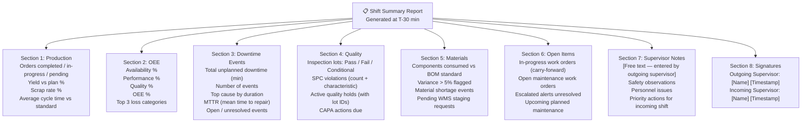

# Swimlane Diagrams

## Overview

This document presents two detailed swimlane diagrams for key cross-functional processes in the Manufacturing Execution System (MES). Swimlane diagrams make actor responsibilities and system handoffs explicit — each lane represents a single actor or system, and transitions between lanes represent information or control handoffs. The diagrams use Mermaid `flowchart TD` with `subgraph` blocks for lanes.

---

## Diagram 1: Work Order Execution Process

### Description

This swimlane covers the complete work order execution cycle from the moment a Production Supervisor releases a production order to the point where the completed production confirmation is sent to SAP ERP. Five lanes are shown:

- **Production Supervisor** — initiates and oversees the process; makes exception decisions
- **Machine Operator** — performs all shop-floor execution steps at the HMI terminal
- **Quality Inspector** — executes in-process and final quality inspections
- **MES System** — the orchestrating platform, recording all state transitions and enforcing business rules
- **ERP System (SAP)** — receives completion confirmations and posts financial and inventory documents

```mermaid
flowchart TD
    %% ─────────────────────────────────────────────────────────────────────
    %% LANE: Production Supervisor
    %% ─────────────────────────────────────────────────────────────────────
    subgraph LANE_PS ["👔  Production Supervisor"]
        PS1([Supervisor reviews\nproduction schedule\nand pending orders])
        PS2[Supervisor selects order\nand clicks RELEASE]
        PS3{Review pre-release\nvalidation results}
        PS4[Supervisor overrides\ncapacity conflict\nwith justification]
        PS5[Supervisor confirms release]
        PS6[Supervisor monitors\nproduction dashboard:\nOEE, yield, cycle time]
        PS7{Exception:\nMaterial shortage alert}
        PS8[Supervisor contacts WMS\nto expedite staging]
        PS9{Exception:\nDowntime alert received}
        PS10[Supervisor assesses\nproduction impact\nReschedule if needed]
        PS11[Supervisor reviews\ncompleted order summary:\nyield, scrap, variances]
        PS12[Supervisor approves\norder for ERP confirmation]
        PS13{Quality hold\ndecision required?}
        PS14[Supervisor reviews\nQA hold report\nand makes disposition]
        PS15[Rework decision:\nCreate rework order]
        PS16[Scrap decision:\nConfirm scrap write-off]
        PS17[Supervisor accepts\nERP confirmation receipt\nOrder archived]
    end

    %% ─────────────────────────────────────────────────────────────────────
    %% LANE: Machine Operator
    %% ─────────────────────────────────────────────────────────────────────
    subgraph LANE_MO ["👷  Machine Operator"]
        MO1[Operator logs in\nto HMI with badge scan]
        MO2[Operator views\nwork order queue on HMI\nSorted by priority]
        MO3[Operator selects\nwork order\nReviews details]
        MO4[Operator opens and reads\nwork instructions document\nSigns acknowledgement]
        MO5{Work instructions\nclear and complete?}
        MO6[Operator contacts supervisor\nfor clarification]
        MO7[Operator clicks\nSTART OPERATION\non HMI]
        MO8[Operator executes\nphysical manufacturing step:\nAssembly / Machining / Mixing]
        MO9[Operator scans\ncomponent barcodes\nfor material consumption]
        MO10{Machine downtime\noccurs?}
        MO11[Operator presses\nREPORT DOWNTIME\nClassifies downtime code]
        MO12[Operator waits for\nmaintenance to restore machine]
        MO13[Operator resumes operation\nafter machine ready signal]
        MO14[Operator enters\nyield and scrap quantities]
        MO15[Operator clicks\nCOMPLETE OPERATION\non HMI]
        MO16[Operator proceeds to\nnext work order in queue]
        MO17{Quality hold pop-up\nreceived on HMI?}
        MO18[Operator stops processing\naffected lot material]
        MO19[Operator waits for\ndisposition instruction]
        MO20[Operator executes\nrework per rework WO\nor disposes scrap]
    end

    %% ─────────────────────────────────────────────────────────────────────
    %% LANE: Quality Inspector
    %% ─────────────────────────────────────────────────────────────────────
    subgraph LANE_QI ["🔬  Quality Inspector"]
        QI1[Inspector receives\ninspection trigger notification\nIn QA work queue]
        QI2[Inspector retrieves\ninspection plan:\nCharacteristics / Sample size / Limits]
        QI3{Calibrated measuring\nequipment available?}
        QI4[Inspector arranges\ncalibration / replacement equipment]
        QI5[Inspector collects\nrandom sample from lot\nper sampling plan]
        QI6[Inspector measures each\ncharacteristic using\nspecified method and instrument]
        QI7[Inspector enters measurements\nin MES quality form\nor via instrument interface]
        QI8[Inspector reviews SPC chart:\nnew data point plotted\nControl limits visible]
        QI9{SPC out-of-control\nsignal detected?}
        QI10[Inspector notifies\nProduction Supervisor\nof SPC condition]
        QI11{All characteristics\nwithin specification?}
        QI12[Inspector initiates\nQUALITY HOLD\nRecords NCR]
        QI13[Inspector signs off:\nInspection lot PASSED\nLot released]
        QI14[Inspector performs\nre-inspection on reworked lot]
        QI15[Inspector closes\ninspection lot record]
    end

    %% ─────────────────────────────────────────────────────────────────────
    %% LANE: MES System
    %% ─────────────────────────────────────────────────────────────────────
    subgraph LANE_MES ["🖥️  MES System"]
        MES1[MES validates production order:\nBOM integrity\nRouting completeness\nCapacity availability]
        MES2{Validation\nresult?}
        MES3[MES blocks release:\nDisplays specific errors to supervisor]
        MES4[MES generates work orders\nper routing step\nAssigns to work centers]
        MES5[MES hard-reserves materials\nin material ledger]
        MES6[MES pushes work orders\nto HMI operator queues]
        MES7[MES records work instruction\nacknowledgement with:\nOperator ID + timestamp + version]
        MES8[MES records operation start:\nWork order → IN PROGRESS\nTimestamp + Operator ID + Work center]
        MES9[MES receives SCADA telemetry\nvia OPC-UA at 1 Hz\nRecords: speed, temp, pressure]
        MES10[MES validates scanned\ncomponent against BOM:\nMaterial / lot / quantity check]
        MES11{BOM validation\nresult?}
        MES12[MES alerts operator:\nWrong material scanned\nDo not consume]
        MES13[MES records goods issue:\nComponent consumption\nAgainst production order BOM]
        MES14[MES records operation completion:\nActual yield / scrap\nCycle time calculated]
        MES15[MES triggers quality inspection\nCreates inspection lot\nNotifies QA queue]
        MES16[MES runs SPC analysis:\nPlots measurement on chart\nApplies Western Electric rules]
        MES17[MES updates OEE dashboard:\nAvailability / Performance / Quality]
        MES18{Inspection\nresult?}
        MES19[MES sets lot: QUALITY HOLD\nSends block-stock to ERP\nNotifies HMIs — stop processing lot]
        MES20[MES updates work order: COMPLETED\nTriggered next operation WO if applicable]
        MES21[MES sets production order:\nTECHNICALLY COMPLETE\nCalculates production summary]
        MES22[MES constructs ERP payload:\nConfirmation + GR + GI + activity times]
        MES23{ERP posting\nsucceeds?}
        MES24[MES queues for retry:\nUp to 3 attempts at 5-min intervals]
        MES25[MES records ERP doc numbers\nArchives production order record]
    end

    %% ─────────────────────────────────────────────────────────────────────
    %% LANE: ERP System (SAP)
    %% ─────────────────────────────────────────────────────────────────────
    subgraph LANE_ERP ["🏢  ERP System — SAP"]
        ERP1[ERP releases production order\nPosts to MES via REST API]
        ERP2[ERP receives release status update\nfrom MES: Order RELEASED]
        ERP3[ERP receives production\nconfirmation from MES:\nCO_SE_BACKFLUSH_GOODSMOV]
        ERP4[ERP posts goods receipt:\nFinished product to stock\nMIGO_GR movement type 101]
        ERP5[ERP posts goods issues:\nComponent consumption\nMovement type 261]
        ERP6[ERP posts activity confirmation:\nActual labor + machine time\nCost collector updated]
        ERP7[ERP sends acknowledgement:\nDocument numbers to MES]
        ERP8[ERP receives hold-stock notification\nBlocks batch in QM\nMovement type 344]
        ERP9[ERP receives scrap posting:\nReverses component reservation\nPosts quality cost]
    end

    %% ─────────────────────────────────────────────────────────────────────
    %% FLOW CONNECTIONS
    %% ─────────────────────────────────────────────────────────────────────

    %% ERP → MES order creation
    ERP1 --> MES1

    %% MES validation → Supervisor
    MES1 --> MES2
    MES2 -- Errors found --> MES3
    MES3 --> PS3
    PS3 -- Blocking errors --> PS2
    PS3 -- Capacity conflict only --> PS4
    PS4 --> PS5
    MES2 -- All valid --> MES4

    %% Supervisor release flow
    PS2 --> MES1
    PS5 --> MES4
    MES4 --> MES5
    MES5 --> MES6
    MES6 --> ERP2

    %% MES notifies ERP of release
    ERP2 --> PS6

    %% Operator execution
    MES6 --> MO1
    MO1 --> MO2
    MO2 --> MO3
    MO3 --> MO4
    MO4 --> MO5
    MO5 -- Unclear --> MO6
    MO6 --> PS6
    MO5 -- Clear --> MES7
    MES7 --> MO7
    MO7 --> MES8
    MES8 --> MO8
    MES8 --> MES9

    %% Material scan
    MO8 --> MO9
    MO9 --> MES10
    MES10 --> MES11
    MES11 -- Wrong material --> MES12
    MES12 --> MO9
    MES11 -- Validated --> MES13

    %% Material shortage escalation
    MES13 --> PS7
    PS7 -- Shortage --> PS8
    PS8 --> MO8

    %% Downtime path
    MO8 --> MO10
    MO10 -- Downtime occurs --> MO11
    MO11 --> PS9
    PS9 --> PS10
    MO11 --> MO12
    MO12 --> MO13
    MO13 --> MO8

    %% Operation completion
    MO10 -- No downtime --> MO14
    MO14 --> MO15
    MO15 --> MES14
    MES14 --> MES15
    MES15 --> MES17

    %% Quality inspection
    MES15 --> QI1
    QI1 --> QI2
    QI2 --> QI3
    QI3 -- Not calibrated --> QI4
    QI4 --> QI3
    QI3 -- Calibrated --> QI5
    QI5 --> QI6
    QI6 --> QI7
    QI7 --> MES16
    MES16 --> QI8
    QI8 --> QI9
    QI9 -- Out of control --> QI10
    QI10 --> PS6
    QI9 -- In control --> QI11

    %% Inspection outcome
    QI11 -- Fail → critical char --> QI12
    QI12 --> MES18
    MES18 -- FAIL --> MES19
    MES19 --> ERP8
    MES19 --> MO17
    MO17 -- Hold alert --> MO18
    MO18 --> MO19
    MES19 --> PS13
    PS13 -- Review required --> PS14
    PS14 -- Rework --> PS15
    PS15 --> MO20
    MO20 --> QI14
    QI14 --> QI7
    PS14 -- Scrap --> PS16
    PS16 --> ERP9
    PS16 --> MES25

    %% Pass path
    QI11 -- Pass: all in spec --> QI13
    QI13 --> MES18
    MES18 -- PASS --> MES20
    MES20 --> QI15
    QI15 --> MO16
    MO16 --> MO2

    %% Final completion
    MES20 --> MES21
    MES21 --> PS11
    PS11 --> PS12
    PS12 --> MES22
    MES22 --> MES23
    MES23 -- Failure --> MES24
    MES24 --> MES23
    MES23 -- Success --> ERP3
    ERP3 --> ERP4
    ERP4 --> ERP5
    ERP5 --> ERP6
    ERP6 --> ERP7
    ERP7 --> MES25
    MES25 --> PS17
```



---

### Handoff Summary — Diagram 1

| Step | From | To | Information Transferred |
|---|---|---|---|
| Order release trigger | ERP System | MES System | Production order, BOM, routing, planned dates |
| Release approval | MES System | Production Supervisor | Validation results, capacity conflict details |
| Work order dispatch | MES System | Machine Operator (HMI) | Work order details, work instructions, material list |
| Instruction acknowledgement | Machine Operator | MES System | Digital signature, timestamp, WI version |
| Material scan | Machine Operator | MES System | Barcode data for BOM validation |
| Operation completion | Machine Operator | MES System | Yield qty, scrap qty |
| Inspection trigger | MES System | Quality Inspector | Inspection lot, inspection plan, sample size |
| Measurement data | Quality Inspector | MES System | Measurement values per characteristic |
| SPC alert | MES System | Production Supervisor | Out-of-control rule, characteristic, lot ID |
| Quality hold | MES System | ERP System | Block-stock message, batch number |
| Quality hold | MES System | Machine Operator (HMI) | Stop-processing alert pop-up |
| Disposition decision | Production Supervisor | Machine Operator | Rework or scrap instruction |
| ERP confirmation | MES System | ERP System | Yield, scrap, activity times, consumption |
| Document confirmation | ERP System | MES System | GR document number, GI document number |

---

## Diagram 2: Shift Handover Process

### Description

This swimlane covers the end-of-shift transition process, from the automatic system-generated shift summary through the formal bilateral sign-off and into the start of the new shift. Four lanes are shown:

- **Outgoing Supervisor** — reviews shift performance, documents issues, hands over formal responsibility
- **MES System** — auto-generates the shift summary, manages the sign-off workflow, opens the new shift
- **Incoming Supervisor** — reviews the handover report, acknowledges, and briefs the team
- **Machine Operators** — are notified of the shift change and briefed on any priority items

```mermaid
flowchart TD
    %% ─────────────────────────────────────────────────────────────────────
    %% LANE: Outgoing Supervisor
    %% ─────────────────────────────────────────────────────────────────────
    subgraph LANE_OS ["🚪  Outgoing Supervisor"]
        OS1([Outgoing Supervisor\napproaches end of shift\n30 min before shift end])
        OS2[Supervisor opens\nShift Handover module\nfrom MES dashboard]
        OS3[Supervisor reviews\nauto-generated shift summary]
        OS4{Any outstanding\nexceptions to document?}
        OS5[Supervisor adds manual notes:\nDefects observed\nEquipment concerns\nPersonnel issues\nPending actions]
        OS6[Supervisor reviews and\nconfirms each section:\nProduction / Quality\nDowntime / Materials / Safety]
        OS7{All mandatory sections\ncompleted?}
        OS8[System prompts:\nComplete missing required fields]
        OS9[Supervisor digitally signs\nHandover Report\nTimestamp + User ID recorded]
        OS10[Supervisor attends\nphysical handover briefing\nwith incoming supervisor]
        OS11[Outgoing supervisor\nassists incoming with\nopen issues walkthrough]
        OS12([Outgoing Supervisor\nshift officially ended\nLogged out of MES])
    end

    %% ─────────────────────────────────────────────────────────────────────
    %% LANE: MES System
    %% ─────────────────────────────────────────────────────────────────────
    subgraph LANE_MES2 ["🖥️  MES System"]
        MES_SH1[T-30 min trigger:\nAuto-generate Shift Summary]
        MES_SH2[Compile shift metrics:\nProduction orders completed\nOEE: Availability ×\nPerformance × Quality\nYield vs target\nScrap kg / units]
        MES_SH3[Compile downtime events:\nTotal downtime minutes\nTop 3 causes by duration\nMTTR for the shift\nAll unclassified events flagged]
        MES_SH4[Compile quality data:\nInspection lots opened\nPass / Fail / Conditional counts\nSPC violations detected\nActive quality holds]
        MES_SH5[Compile material status:\nComponents consumed vs BOM\nMaterial shortages\nBackflush discrepancies\nPending WMS staging requests]
        MES_SH6[Compile open items:\nIn-progress work orders\nInterrupted operations\nOpen maintenance work orders\nUnresolved alerts]
        MES_SH7[Publish shift summary\nto Outgoing Supervisor dashboard\nand Incoming Supervisor inbox]
        MES_SH8[Lock shift metrics:\nAll KPIs for outgoing shift\nbecomes read-only snapshot]
        MES_SH9[Send notification to\nIncoming Supervisor:\n"Handover report ready for review"]
        MES_SH10[Await dual signature:\nOutgoing + Incoming Supervisor\nSLA: 15 minutes from shift start]
        MES_SH11{Both signatures\nreceived?}
        MES_SH12[Escalate to Plant Manager:\n"Shift handover overdue"\nBR-009 SLA breached]
        MES_SH13[Process handover sign-off:\nClose outgoing shift record\nOpen new shift record]
        MES_SH14[Transfer open work orders\nto incoming shift context:\nShift ID updated on all active WOs]
        MES_SH15[Transfer open quality holds\nto incoming shift responsibility]
        MES_SH16[Transfer open maintenance WOs\nto incoming shift awareness]
        MES_SH17[Publish new shift KPI baseline:\nReset current-shift OEE counters\nCarry-forward open items]
        MES_SH18[Broadcast operator notification\nto all work center HMIs:\n"Shift [X] started — review updates"]
        MES_SH19[Archive outgoing shift record:\nImmutable for audit\nRetained per data policy: 5 years online]
    end

    %% ─────────────────────────────────────────────────────────────────────
    %% LANE: Incoming Supervisor
    %% ─────────────────────────────────────────────────────────────────────
    subgraph LANE_IS ["🚶  Incoming Supervisor"]
        IS1([Incoming Supervisor\narrives at plant\nLogs in to MES])
        IS2[Incoming Supervisor\nopens handover report\nfrom MES notification]
        IS3[Incoming Supervisor reviews\nproduction section:\nCompleted orders / In-progress\nYield vs target performance]
        IS4[Incoming Supervisor reviews\ndowntime section:\nActive downtimes / Resolved events\nEquipment at risk]
        IS5[Incoming Supervisor reviews\nquality section:\nActive holds / SPC violations\nInspections due this shift]
        IS6[Incoming Supervisor reviews\nmaterial section:\nShortage alerts / Pending stagings]
        IS7[Incoming Supervisor reviews\nopen items list:\nPriority actions for this shift]
        IS8{Any items requiring\nimmediate attention?}
        IS9[Incoming Supervisor contacts\nrelevant support:\nMaintenance / QA / WMS]
        IS10[Incoming Supervisor attends\nphysical handover briefing\nwith outgoing supervisor]
        IS11[Incoming Supervisor adds\nacknowledgement notes:\nAccepted items / Raised concerns]
        IS12[Incoming Supervisor digitally\nsigns Handover Report\nTimestamp + User ID recorded]
        IS13[Incoming Supervisor proceeds\nto plant floor walkthrough\nVerifies physical state]
        IS14[Incoming Supervisor confirms\nwork center readiness:\nEquipment / Staffing / Materials]
        IS15[Incoming Supervisor begins\nnew shift management:\nMonitors dashboard / Resolves issues]
    end

    %% ─────────────────────────────────────────────────────────────────────
    %% LANE: Machine Operators
    %% ─────────────────────────────────────────────────────────────────────
    subgraph LANE_OPS ["👷  Machine Operators"]
        OPS1([End-of-shift operators\ncontinue work on active WOs\nuntil shift transition])
        OPS2[Outgoing operators\ncomplete current operations\nor safely pause active work orders]
        OPS3[Outgoing operators\nlog out of HMI terminals\nShift association ends]
        OPS4([Incoming operators\nlog in to HMI terminals\nwith badge scan])
        OPS5[Operators receive HMI notification:\n"Shift [X] started\nReview shift notes"]
        OPS6[Operators view any\npriority messages from\nIncoming Supervisor]
        OPS7{Any updated work\ninstructions or alerts?}
        OPS8[Operators acknowledge\nnew work instructions\nbefore starting operations]
        OPS9[Operators check material\nstaging at work center:\nConfirm correct materials staged]
        OPS10[Operators resume or begin\nwork orders per new shift queue]
        OPS11[Operators report any\nmachine concerns to\nIncoming Supervisor during walkthrough]
        OPS12([Production resumes\nunder new shift\nAll transactions attributed to new shift])
    end

    %% ─────────────────────────────────────────────────────────────────────
    %% FLOW CONNECTIONS
    %% ─────────────────────────────────────────────────────────────────────

    %% Auto-generation chain
    OS1 --> MES_SH1
    MES_SH1 --> MES_SH2
    MES_SH2 --> MES_SH3
    MES_SH3 --> MES_SH4
    MES_SH4 --> MES_SH5
    MES_SH5 --> MES_SH6
    MES_SH6 --> MES_SH7
    MES_SH7 --> OS2
    MES_SH7 --> MES_SH8
    MES_SH8 --> MES_SH9
    MES_SH9 --> IS1

    %% Outgoing Supervisor review
    OS2 --> OS3
    OS3 --> OS4
    OS4 -- Yes: exceptions to add --> OS5
    OS5 --> OS6
    OS4 -- No: nothing to add --> OS6
    OS6 --> OS7
    OS7 -- Incomplete --> OS8
    OS8 --> OS6
    OS7 -- Complete --> OS9
    OS9 --> OS10

    %% Incoming Supervisor review
    IS1 --> IS2
    IS2 --> IS3
    IS3 --> IS4
    IS4 --> IS5
    IS5 --> IS6
    IS6 --> IS7
    IS7 --> IS8
    IS8 -- Yes: urgent items --> IS9
    IS9 --> IS10
    IS8 -- No: all acceptable --> IS10
    IS10 --> OS10
    OS10 --> OS11
    OS11 --> IS11
    IS11 --> IS12

    %% Dual signature processing
    OS9 --> MES_SH10
    IS12 --> MES_SH10
    MES_SH10 --> MES_SH11
    MES_SH11 -- Timeout: missing signature --> MES_SH12
    MES_SH12 --> MES_SH11
    MES_SH11 -- Both signed --> MES_SH13
    MES_SH13 --> MES_SH14
    MES_SH14 --> MES_SH15
    MES_SH15 --> MES_SH16
    MES_SH16 --> MES_SH17
    MES_SH17 --> MES_SH18
    MES_SH18 --> MES_SH19

    %% Operator shift transition
    OPS1 --> OPS2
    OPS2 --> OPS3
    OPS3 --> OPS4
    OPS4 --> OPS5
    MES_SH18 --> OPS5
    OPS5 --> OPS6
    OPS6 --> OPS7
    OPS7 -- Updated instructions --> OPS8
    OPS8 --> OPS9
    OPS7 -- No updates --> OPS9
    OPS9 --> OPS10

    %% Supervisor walkthrough connects to operators
    IS13 --> IS14
    IS14 --> OPS11
    OPS11 --> IS15
    OPS10 --> OPS12
    IS15 --> OS12
    MES_SH19 --> IS15
```

---

### Shift Summary Report Structure

The MES auto-generates the following structured shift summary:



---

### Handoff Summary — Diagram 2

| Step | From | To | Information Transferred |
|---|---|---|---|
| T-30 min trigger | MES System | Outgoing Supervisor | Auto-generated shift summary (all KPIs) |
| Shift summary | MES System | Incoming Supervisor | Notification + full handover report |
| Manual notes | Outgoing Supervisor | MES System | Exception descriptions, priority items, safety notes |
| Outgoing signature | Outgoing Supervisor | MES System | Digital signature + timestamp |
| Incoming signature | Incoming Supervisor | MES System | Digital signature + timestamp + acknowledgement notes |
| Open WO transfer | MES System | Incoming Shift Context | All in-progress work orders re-attributed to new shift |
| HMI broadcast | MES System | All Operators | Shift-change notification + supervisor notes |
| Physical walkthrough | Incoming Supervisor | Machine Operators | Verbal briefing on priorities, safety items, schedule |
| Machine concerns | Machine Operators | Incoming Supervisor | Equipment status, material readiness, outstanding issues |
| Shift record archive | MES System | Audit Archive | Immutable shift record locked for compliance |

---

## Comparing the Two Diagrams

| Dimension | Work Order Execution | Shift Handover |
|---|---|---|
| **Frequency** | 200–2,000 times per shift | 2–3 times per day |
| **Duration** | Minutes to hours per work order | 30–60 minutes |
| **Primary actor** | Machine Operator | Production Supervisors (both) |
| **System criticality** | Real-time production state management | Knowledge transfer and accountability |
| **Failure mode** | Quality defect, material shortage, downtime | Missing information, responsibility gap |
| **Compliance driver** | ISO 9001, GMP traceability | ISO 9001, labor regulations, shift accountability |
| **Key data outputs** | OEE data, yield, material consumption, quality records | Shift KPI snapshot, open item register, dual-signed record |
| **Integration touchpoints** | SCADA (telemetry), ERP (confirmation), LIMS (quality) | MES internal only (no external integrations triggered) |
