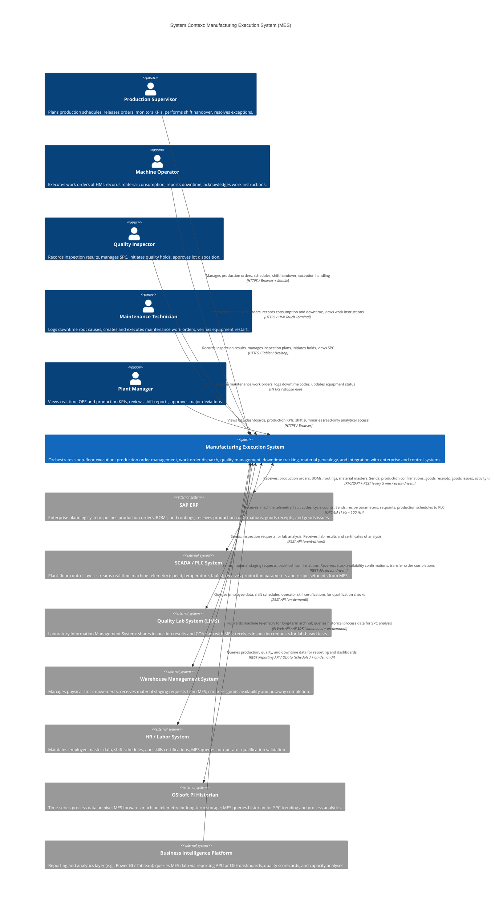
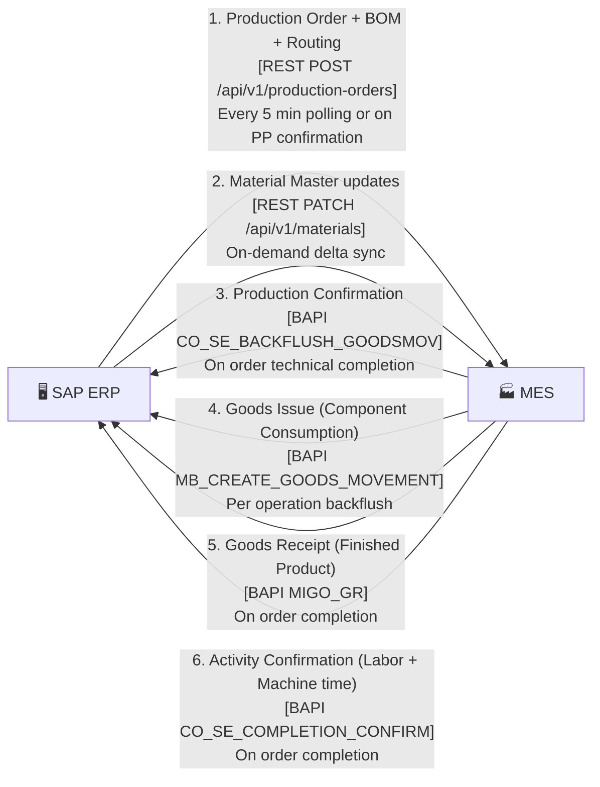
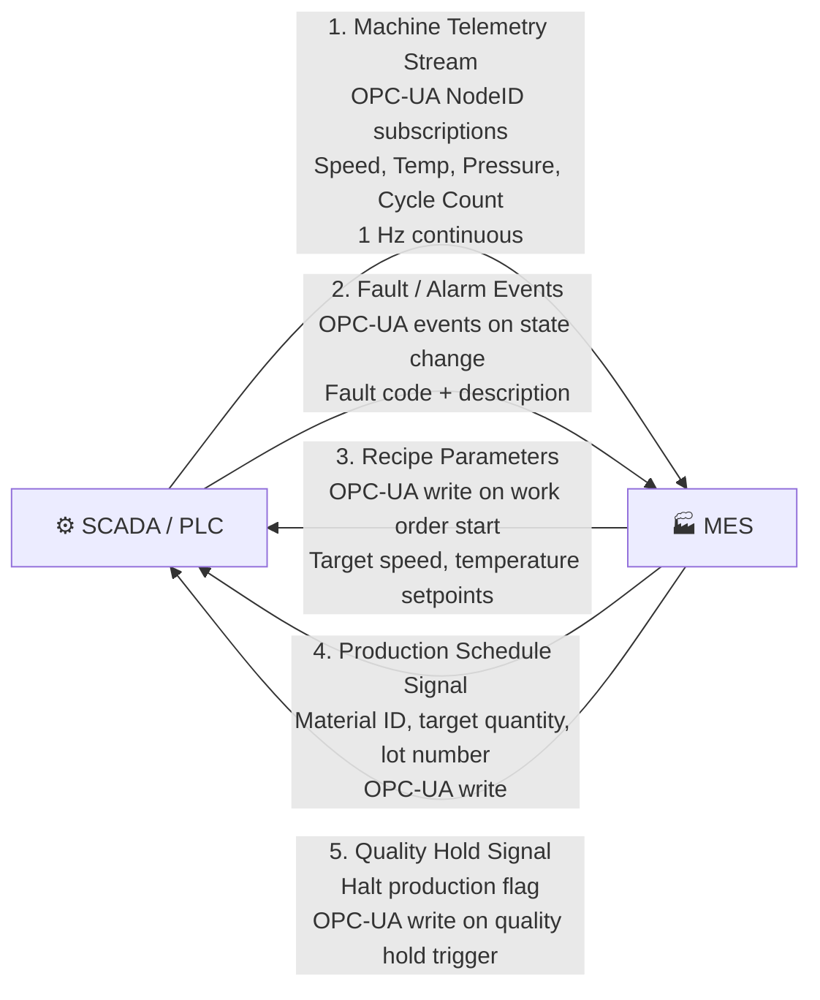
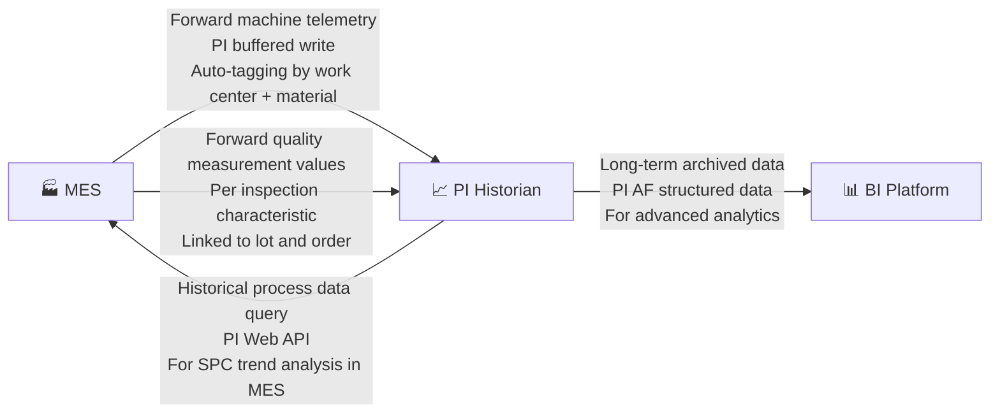
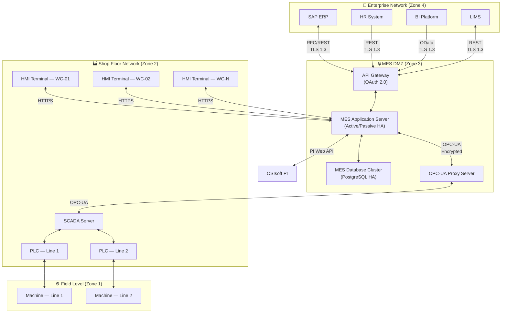
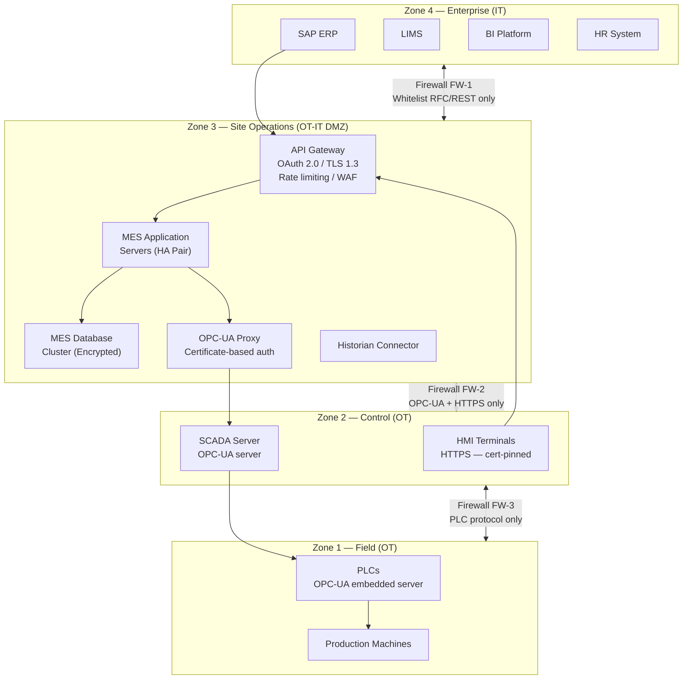
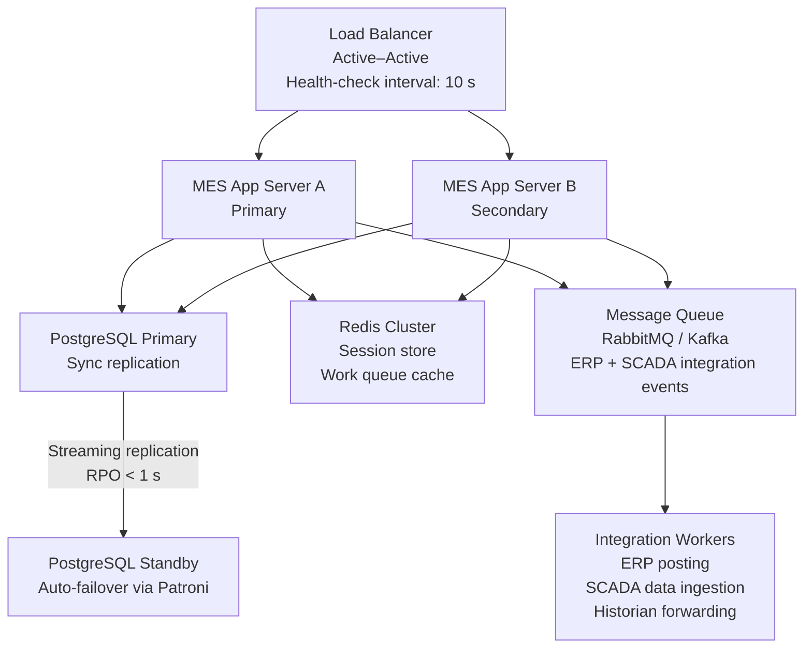
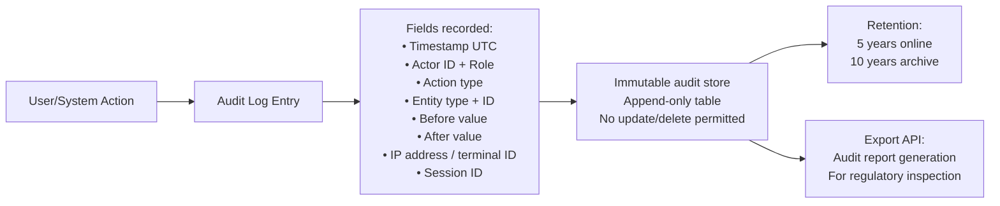

# System Context Diagram

## Overview

This document presents the C4 Model Level-1 (Context) view of the **Manufacturing Execution System (MES)**. The context diagram establishes the system boundary and illustrates every significant human and system interaction. It is the highest-level architectural view, deliberately abstract — focusing on *who* uses the MES and *which external systems* it communicates with, without exposing internal components.

The MES is the central digital nervous system of the production plant, bridging the enterprise layer (ERP) with the shop-floor control layer (SCADA/PLC) and providing a single source of truth for all manufacturing execution activities — production order management, work order execution, quality management, downtime tracking, and genealogy/traceability.

---

## C4 Context Diagram

---

## System Boundary Definition

### In Scope (MES Responsibilities)

| Capability | Description |
|---|---|
| Production Order Management | Receive, validate, schedule, and track production orders from creation through technical completion |
| Work Order Dispatch | Generate and assign operation-level work orders to work centers and operators |
| Shop Floor Execution | Support operator start/complete transactions, material scanning, work instruction display |
| Quality Management | Inspection plan management, in-process and final inspection recording, SPC charting, lot disposition |
| Downtime Management | Downtime event recording, classification, OEE calculation, maintenance work order generation |
| Material Genealogy & Traceability | Lot and serial number tracking through every operation; full forward and backward traceability |
| Shift Management | Shift scheduling, shift handover workflows, per-shift KPI reporting |
| ERP Integration | Bidirectional data exchange with SAP for orders, confirmations, and material movements |
| SCADA Integration | OPC-UA data collection from PLCs; recipe/setpoint delivery to machine controllers |
| Reporting & Analytics API | Expose aggregated production, quality, and OEE data to BI platforms |

### Out of Scope (Handled by Adjacent Systems)

| Capability | Handled By |
|---|---|
| Demand planning and production scheduling beyond 1-week horizon | SAP PP (Production Planning) |
| Physical lab analysis and certificate of analysis generation | LIMS |
| Warehouse slotting, pick-path optimization, forklift management | WMS |
| Preventive maintenance scheduling and asset management | CMMS (SAP PM) |
| Payroll and workforce scheduling | HR System |
| Long-term process data archival (> 3 months) | OSIsoft PI Historian |
| Financial accounting and cost center management | SAP FI/CO |
| Quality management system (CAPA, audit management, document control) | eQMS |

---

## Integration Points Detail

| System | Protocol | Direction | Data Exchanged | Frequency | Authentication |
|---|---|---|---|---|---|
| SAP ERP | RFC/BAPI + REST | Bidirectional | **In:** Production orders, BOMs, routings, material masters, customer orders. **Out:** Production confirmations, goods receipts, goods issues, activity confirmations | Every 5 min (batch) + event-driven on completion | OAuth 2.0 (client credentials) + TLS 1.3 |
| SCADA/PLC | OPC-UA | Bidirectional | **In:** Machine telemetry (speed RPM, temperature °C, pressure bar, cycle count, fault codes). **Out:** Recipe parameters, target setpoints, production parameters, material IDs | 1 Hz (telemetry) up to 100 Hz (high-speed signals) | OPC-UA security policy: Sign & Encrypt, X.509 certificates |
| LIMS | REST API (JSON) | Bidirectional | **In:** Lab test results (CoA), analytical measurement data. **Out:** Inspection requests, sample metadata, test specifications | Event-driven (on inspection trigger) | API key + TLS 1.3 |
| WMS | REST API (JSON) | Bidirectional | **In:** Stock availability confirmation, transfer order status. **Out:** Material staging requests, backflush goods-issue confirmations | Event-driven | OAuth 2.0 + TLS 1.3 |
| HR / Labor System | REST API (JSON) | Read-only (MES reads) | Employee IDs, roles, shift assignments, skill/qualification records, certifications | On-demand (at login, operator assignment) | Service account + TLS 1.3 |
| OSIsoft PI Historian | PI Web API / AF SDK | Bidirectional | **To PI:** Machine telemetry forwarding, process parameter values. **From PI:** Historical data queries for SPC trend analysis | Continuous write; on-demand read | Kerberos / integrated Windows authentication |
| BI Platform | OData / REST Read-only API | Read-only (BI reads MES) | Production KPIs, OEE metrics, downtime events, quality summaries, order status | Scheduled (hourly) + on-demand | OAuth 2.0 bearer token |

---

## Data Flow Descriptions

### SAP ERP ↔ MES

### SCADA/PLC ↔ MES

### MES → OSIsoft PI Historian

---

## Key Architectural Constraints

| Constraint | Description | Impact |
|---|---|---|
| **Real-time OEE** | OEE must be updated within 30 seconds of any machine state change (SCADA event). | MES must maintain a persistent OPC-UA subscription and process events asynchronously without blocking the main transaction pipeline. |
| **ERP as System of Record** | SAP ERP remains the system of record for production orders, material masters, and BOMs. MES holds a synchronized replica. | MES must handle ERP data conflicts gracefully; order of precedence is always ERP > MES for master data. |
| **Offline capability** | HMI terminals at work centers must continue to accept start/complete transactions for up to 30 minutes during network outage. | MES HMI layer requires a local transaction buffer with sync-on-reconnect capability. |
| **Data retention** | Production records must be retained in MES for a minimum of 5 years online (queryable) and 10 years archived. | Database partitioning strategy required; archival tier must support query-by-lot-number and query-by-date. |
| **Security zones** | SCADA/PLC network and enterprise network are in separate security zones (ISA/IEC 62443 compliant). MES acts as a DMZ system with controlled communication paths. | Network segmentation required; all SCADA communication via a dedicated OPC-UA server in the MES DMZ. |
| **Multi-plant capability** | MES must support multiple production plants under a single instance (multi-tenant data model). | All data entities are plant-scoped; users are assigned to one or more plants; reporting can aggregate cross-plant. |

---

## Deployment Context

---

## Assumptions and Dependencies

| ID | Assumption / Dependency | Risk if Not Met |
|---|---|---|
| DEP-01 | SAP ERP production planning runs at least once per day to push new production orders. | MES will have stale or missing order data; production supervisor must create orders manually. |
| DEP-02 | All production machines have PLC controllers with OPC-UA server capability (or classic OPC bridged via gateway). | Without SCADA integration, OEE machine availability data must be entered manually — significant data quality risk. |
| DEP-03 | LIMS is capable of receiving inspection requests via REST API and returning structured result payloads. | Lab results must be manually transcribed into MES — slower cycle time and transcription error risk. |
| DEP-04 | WMS maintains real-time stock availability and can respond to staging requests within 5 minutes. | Material shortages will not be detected until the operator attempts to scan materials at the work center. |
| DEP-05 | HR system provides a REST API for employee and skills data queries. | MES cannot validate operator qualifications; work center assignment becomes a purely manual process. |
| DEP-06 | Network connectivity between MES DMZ and shop floor network is high-reliability (dual links, <10 ms latency). | HMI responsiveness degrades; offline buffer scenarios become more frequent. |

---

## Security Architecture

The MES spans multiple ISA/IEC 62443 security zones and must enforce strict access controls both internally and at integration boundaries.

### Security Zone Model

### Authentication and Authorization Matrix

| Actor / System | Authentication Method | Session Management | Authorization Model |
|---|---|---|---|
| Production Supervisor | SSO (SAML 2.0) + MFA | 8-hour session, idle lock at 15 min | RBAC — `PROD_SUPERVISOR` role |
| Machine Operator | Badge scan (RFID) + PIN | 4-hour session, idle lock at 5 min | RBAC — `OPERATOR` role, work-center scoped |
| Quality Inspector | SSO (SAML 2.0) + MFA | 8-hour session | RBAC — `QA_INSPECTOR` role |
| Maintenance Technician | Mobile app + SSO | 4-hour session, idle lock at 10 min | RBAC — `MAINTENANCE_TECH` role |
| Plant Manager | SSO (SAML 2.0) + MFA | 8-hour session | RBAC — `PLANT_MANAGER` read-only role |
| SAP ERP | OAuth 2.0 client credentials | Token refresh every 3,600 s | Service account — `ERP_INTEGRATION` scope |
| SCADA/PLC | OPC-UA X.509 certificate | Certificate validity 1 year | OPC-UA security policy: Sign & Encrypt |
| LIMS | API key in header | Stateless | IP whitelist + API key |
| BI Platform | OAuth 2.0 bearer token | Token TTL 3,600 s | Read-only `REPORTING_API` scope |

---

## Scalability and High-Availability Design

| HA Requirement | Target | Mechanism |
|---|---|---|
| Application uptime | 99.9% (scheduled hours) | Active–Active app servers behind load balancer |
| Database RPO | < 1 second | PostgreSQL synchronous streaming replication |
| Database RTO | < 2 minutes | Patroni auto-failover |
| HMI offline resilience | 30 minutes local buffering | IndexedDB local transaction buffer in HMI browser app |
| ERP integration retry | Up to 3 retries at 5-minute intervals | Dead letter queue for failed ERP postings |
| OPC-UA subscription recovery | Automatic reconnect within 30 seconds | OPC-UA client session watchdog |

---

## Regulatory and Compliance Context

The MES must satisfy the following regulatory frameworks depending on the industry vertical:

| Framework | Applicability | MES-Specific Requirements |
|---|---|---|
| **ISO 9001:2015** | All manufacturing industries | Quality management records, inspection traceability, CAPA linkage |
| **FDA 21 CFR Part 11** | Pharmaceutical / medical device manufacturing | Electronic records, audit trail, electronic signatures for quality disposition |
| **EU GMP Annex 11** | Pharmaceutical EU operations | Computer system validation, backup/recovery, audit trail completeness |
| **ISA/IEC 62443** | All OT/IT environments | Security zone segregation, access control, patch management |
| **ISO 22400** | KPI standardization | OEE calculation methodology, KPI definitions aligned with standard |
| **IATF 16949** | Automotive manufacturing | PPAP integration, SPC requirements, process traceability |

### Audit Trail Requirements

