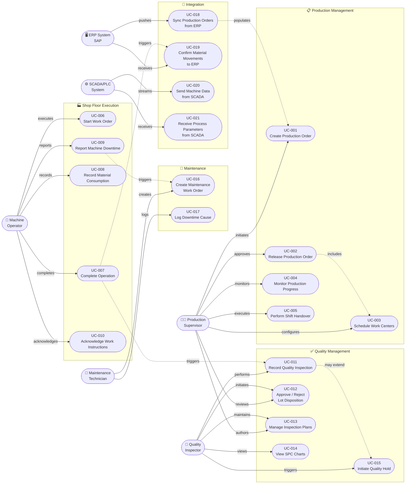
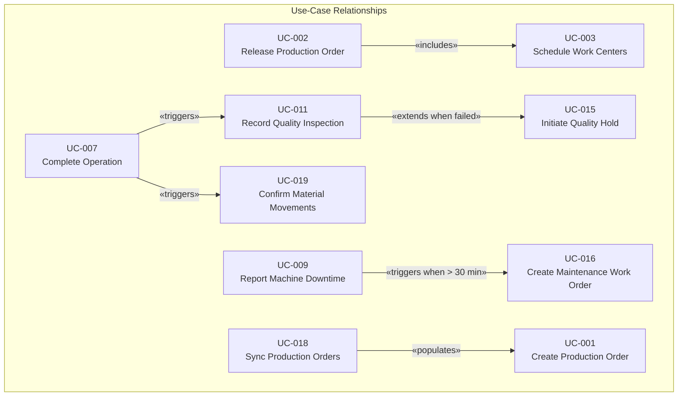

# Use-Case Diagram

## Overview

This document presents the complete use-case model for the **Manufacturing Execution System (MES)**. The MES sits at the intersection of the shop floor and enterprise systems, orchestrating production execution from order release through completion and ERP confirmation. Six principal actor types interact with the system: human roles spanning supervisory, operational, quality, and maintenance disciplines, as well as two external automated systems — the SAP ERP back-end and the SCADA/PLC layer that interfaces directly with production machinery. Together these actors drive twenty-two use cases organized across five functional subsystems.

---

## Actor Definitions

| Actor ID | Actor Name | Type | Description |
|---|---|---|---|
| A-01 | Production Supervisor | Human – Primary | Plans and releases production orders, monitors progress across work centers, performs shift handover, and approves deviations. Has write access across all Production Management use cases. |
| A-02 | Machine Operator | Human – Primary | Executes work orders at the HMI terminal: acknowledges work instructions, starts and completes operations, scans materials, and reports machine downtime. Primary user of Shop Floor Execution use cases. |
| A-03 | Quality Inspector | Human – Primary | Carries out in-process and final inspections against defined inspection plans. Records measurements, evaluates SPC charts, and initiates lot disposition decisions including quality holds. |
| A-04 | Maintenance Technician | Human – Primary | Receives downtime notifications, creates and executes maintenance work orders, logs root-cause codes, and verifies equipment restart. Primary user of Maintenance use cases. |
| A-05 | ERP System (SAP) | External System | Pushes production orders and BOMs into MES; receives goods-issue confirmations, production confirmations, and material movement postings. Communicates via RFC/BAPI and REST APIs. |
| A-06 | SCADA/PLC System | External System | Streams machine telemetry (speed, temperature, pressure, cycle counts) to MES; receives production parameters and recipe setpoints from MES. Communicates via OPC-UA. |

---

## Use-Case Diagram

---

## Subsystem Descriptions

### 1. Production Management
Covers the lifecycle of a production order from initial creation (driven by demand signals from SAP) through scheduling and supervisory monitoring. The shift handover use case ensures continuity between operating shifts without loss of state.

### 2. Shop Floor Execution
The operator-facing core of the MES. Operators interact via HMI terminals mounted at work centers. All shop-floor transactions are timestamped and linked to the active production context (order, operation, work center, shift, operator ID).

### 3. Quality Management
Encompasses in-process inspection, statistical process control, and disposition workflows. Inspection plans are versioned and linked to product/process combinations. SPC control charts are rendered in real time from historian data.

### 4. Maintenance
Downtime events generate maintenance work orders that flow into the CMMS module. Root-cause logging enables OEE loss analysis and feeds the continuous improvement program.

### 5. Integration
Bidirectional data flows with SAP ERP (production orders in, confirmations out) and the SCADA/PLC layer (machine data in, recipe parameters out) ensure the MES is always synchronized with both enterprise and plant-floor reality.

---

## Use-Case Summary Table

| Use Case ID | Use Case Name | Primary Actor | Secondary Actor(s) | Frequency | Subsystem |
|---|---|---|---|---|---|
| UC-001 | Create Production Order | Production Supervisor | ERP System | 50–200 / day | Production Mgmt |
| UC-002 | Release Production Order | Production Supervisor | — | 50–200 / day | Production Mgmt |
| UC-003 | Schedule Work Centers | Production Supervisor | — | 10–30 / day | Production Mgmt |
| UC-004 | Monitor Production Progress | Production Supervisor | SCADA/PLC | Continuous | Production Mgmt |
| UC-005 | Perform Shift Handover | Production Supervisor | All operators | 2–3 / day | Production Mgmt |
| UC-006 | Start Work Order | Machine Operator | MES System | 200–500 / day | Shop Floor Exec |
| UC-007 | Complete Operation | Machine Operator | MES System | 500–2000 / day | Shop Floor Exec |
| UC-008 | Record Material Consumption | Machine Operator | ERP System | 200–500 / day | Shop Floor Exec |
| UC-009 | Report Machine Downtime | Machine Operator | Maintenance Tech | 5–50 / day | Shop Floor Exec |
| UC-010 | Acknowledge Work Instructions | Machine Operator | — | 200–500 / day | Shop Floor Exec |
| UC-011 | Record Quality Inspection | Quality Inspector | MES System | 100–300 / day | Quality Mgmt |
| UC-012 | Approve / Reject Lot Disposition | Quality Inspector | Prod. Supervisor | 20–80 / day | Quality Mgmt |
| UC-013 | Manage Inspection Plans | Quality Inspector | Prod. Supervisor | 2–10 / week | Quality Mgmt |
| UC-014 | View SPC Charts | Quality Inspector | — | 50–200 / day | Quality Mgmt |
| UC-015 | Initiate Quality Hold | Quality Inspector | Prod. Supervisor | 1–10 / day | Quality Mgmt |
| UC-016 | Create Maintenance Work Order | Maintenance Tech | Prod. Supervisor | 5–30 / day | Maintenance |
| UC-017 | Log Downtime Cause | Maintenance Tech | Machine Operator | 5–50 / day | Maintenance |
| UC-018 | Sync Production Orders from ERP | ERP System | MES System | Every 5 min | Integration |
| UC-019 | Confirm Material Movements to ERP | ERP System | MES System | Per operation | Integration |
| UC-020 | Send Machine Data from SCADA | SCADA/PLC System | MES System | 1 Hz – 100 Hz | Integration |
| UC-021 | Receive Process Parameters from SCADA | SCADA/PLC System | MES System | On recipe change | Integration |

---

## Business Rules Summary

| Rule ID | Description | Applicable Use Cases |
|---|---|---|
| BR-001 | A production order may only be released if a valid routing and BOM exist in MES | UC-002 |
| BR-002 | Operators must acknowledge work instructions before starting an operation | UC-006, UC-010 |
| BR-003 | Material consumption may not exceed BOM quantity by more than the allowed scrap percentage | UC-008 |
| BR-004 | An operation cannot be completed if a mandatory quality inspection is open | UC-007, UC-011 |
| BR-005 | Machine downtime events must be classified within 10 minutes of occurrence | UC-009, UC-017 |
| BR-006 | A lot under quality hold cannot be processed further until disposition is approved | UC-012, UC-015 |
| BR-007 | ERP production confirmations are sent only upon full completion of a production order | UC-019 |
| BR-008 | SPC out-of-control signals automatically elevate inspection frequency | UC-011, UC-014 |
| BR-009 | Shift handover must be acknowledged by both outgoing and incoming supervisors | UC-005 |
| BR-010 | Maintenance work orders >30 min unplanned downtime require root-cause category | UC-016, UC-017 |

---

## Extend and Include Relationships

---

## Glossary

| Term | Definition |
|---|---|
| BOM | Bill of Materials — list of components and quantities required for a production order |
| Routing | Sequence of manufacturing operations with work center assignments and standard times |
| Work Order | A shop-floor instruction derived from a production order for a specific work center |
| HMI | Human–Machine Interface — the operator terminal at a work center |
| SPC | Statistical Process Control — real-time monitoring of process parameters against control limits |
| OEE | Overall Equipment Effectiveness — composite metric of Availability × Performance × Quality |
| CAPA | Corrective and Preventive Action — formal quality improvement workflow |
| Lot Disposition | Decision to release, rework, or scrap a production lot after quality inspection |
| RFC/BAPI | SAP Remote Function Call / Business API — integration technology for ERP communication |
| OPC-UA | Open Platform Communications Unified Architecture — industrial IoT communication standard |
| CMMS | Computerized Maintenance Management System |
| LIMS | Laboratory Information Management System |
| OSIsoft PI | Industry-standard process data historian |

---

## Business Rules Index

The following business rules govern use-case behavior across the MES. Each rule is referenced in the relevant use-case descriptions (`use-case-descriptions.md`).

| Rule ID | Description | Enforced In |
|---|---|---|
| BR-001 | BOM and routing must be in APPROVED status before a production order can be created or released | UC-001, UC-002 |
| BR-002 | Operators must acknowledge work instructions before starting an operation | UC-003, UC-010 |
| BR-003 | Material consumption may not exceed BOM qty by more than the allowed scrap percentage | UC-008 |
| BR-004 | An operation cannot be completed if a mandatory quality inspection is open | UC-003, UC-004 |
| BR-005 | Machine downtime events must be classified within 10 minutes of occurrence | UC-005, UC-017 |
| BR-006 | A lot under quality hold cannot be processed further until disposition is approved | UC-009, UC-012, UC-015 |
| BR-007 | ERP production confirmations are sent only upon full completion of a production order | UC-006, UC-019 |
| BR-008 | SPC out-of-control signals automatically elevate inspection frequency per AQL table | UC-004, UC-014 |
| BR-009 | Shift handover requires digital co-signature by both outgoing and incoming supervisors | UC-008 |
| BR-010 | Maintenance work orders are auto-created when unplanned downtime duration exceeds 30 minutes | UC-005, UC-016 |
| BR-011 | Order quantity must be within material min/max batch size (MBS / MXBS) | UC-001 |
| BR-012 | Production orders inherit the BOM/routing version approved at time of creation; master data changes are not retroactive | UC-001 |
| BR-013 | Hard reservation of materials occurs only on order release; soft reservation on order creation | UC-002 |
| BR-014 | Yield + scrap quantity entered at operation completion must not exceed order quantity + tolerance | UC-003 |
| BR-015 | An operator cannot start a work order on a work center that is in DOWNTIME or MAINTENANCE status | UC-003, UC-005 |
| BR-016 | A maximum of one re-inspection is permitted per lot per inspection plan; further deviations require QA Manager approval | UC-004 |
| BR-017 | SCADA-detected downtime events auto-created in MES require operator classification within 10 minutes | UC-005 |
| BR-018 | ERP confirmation is blocked if any material consumption variance exceeds the configured tolerance (default ±5%) without supervisor approval | UC-006, UC-007 |
| BR-019 | Material reconciliation runs on a 15-minute schedule; variances > tolerance generate a supervisor workflow | UC-007 |
| BR-020 | The incoming supervisor must acknowledge the shift handover within 15 minutes of shift start; overdue triggers Plant Manager escalation | UC-008 |
| BR-021 | A CAPA record is mandatory when a quality hold affects the same material/process combination more than twice in a rolling 30-day window | UC-009 |

---

## Non-Functional Requirements Summary

| NFR Category | Requirement | Target | Notes |
|---|---|---|---|
| **Performance** | HMI Start/Complete button response | < 1 second | P95 under normal load |
| **Performance** | Production order creation | < 2 seconds | P95 |
| **Performance** | SPC chart render after measurement | < 2 seconds | Interactive SVG |
| **Performance** | Bulk order release (50 orders) | < 15 seconds | P95 |
| **Performance** | Downtime start recording | < 500 ms | Safety-critical timing accuracy |
| **Availability** | Core MES (scheduled production hours) | ≥ 99.9% | Active-Active HA |
| **Availability** | HMI offline resilience | 30 minutes local buffer | IndexedDB transaction buffer |
| **Scalability** | Concurrent HMI sessions | 500+ | Horizontal app server scaling |
| **Data Retention** | Production records (online) | 5 years queryable | Partitioned by month |
| **Data Retention** | Production records (archive) | 10 years | Cold storage, query by lot/date |
| **Security** | Data at rest | AES-256 encryption | Database and backups |
| **Security** | Data in transit | TLS 1.3 minimum | All interfaces |
| **Security** | Session idle timeout — HMI | 5 minutes | Gloved-hand badge re-scan |
| **Audit** | Audit log completeness | 100% of write operations | Immutable append-only store |
| **Quality Hold propagation** | Hold status on all HMIs | < 5 seconds | Safety-critical |
| **OEE update latency** | Machine state change to dashboard update | < 30 seconds | SCADA event processing |

---

## Use-Case Prioritization (MoSCoW)

The following table prioritizes use cases for phased delivery. Phase 1 covers MVP shop-floor execution; Phase 2 adds full quality and maintenance; Phase 3 adds advanced analytics and full ERP/SCADA integration.

| Use Case | Priority | Phase | Rationale |
|---|---|---|---|
| UC-001 Create Production Order | Must Have | 1 | Core entry point for all production activity |
| UC-002 Release Production Order | Must Have | 1 | Required before any shop-floor work can start |
| UC-006 Start Work Order | Must Have | 1 | Primary operator interaction |
| UC-007 Complete Operation | Must Have | 1 | Core execution transaction |
| UC-008 Record Material Consumption | Must Have | 1 | Required for ERP backflush and cost tracking |
| UC-009 Report Machine Downtime | Must Have | 1 | Required for OEE calculation |
| UC-010 Acknowledge Work Instructions | Must Have | 1 | Safety and compliance prerequisite |
| UC-018 Sync Production Orders from ERP | Must Have | 1 | Foundational ERP integration |
| UC-004 Monitor Production Progress | Should Have | 1 | Supervisor visibility essential for operations |
| UC-005 Perform Shift Handover | Should Have | 1 | Operational continuity requirement |
| UC-011 Record Quality Inspection | Must Have | 2 | Required for lot traceability and quality gate |
| UC-012 Approve/Reject Lot Disposition | Must Have | 2 | Quality hold resolution workflow |
| UC-015 Initiate Quality Hold | Must Have | 2 | Safety and quality compliance |
| UC-019 Confirm Material Movements to ERP | Must Have | 2 | Financial posting requirement |
| UC-016 Create Maintenance Work Order | Should Have | 2 | Downtime management extension |
| UC-017 Log Downtime Cause | Should Have | 2 | Root cause and OEE analysis |
| UC-003 Schedule Work Centers | Should Have | 2 | Capacity planning optimization |
| UC-013 Manage Inspection Plans | Should Have | 2 | Quality configurability |
| UC-014 View SPC Charts | Should Have | 2 | In-process quality monitoring |
| UC-020 Send Machine Data from SCADA | Could Have | 3 | Advanced OEE automation |
| UC-021 Receive Process Parameters from SCADA | Could Have | 3 | Closed-loop process control |

