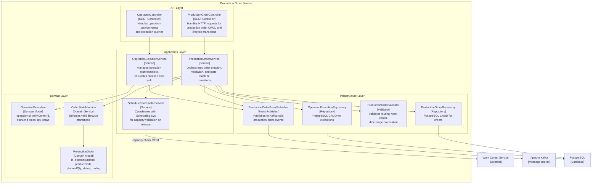
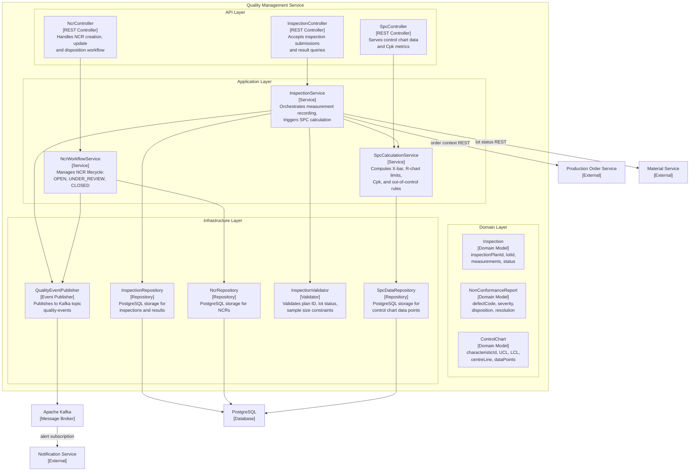
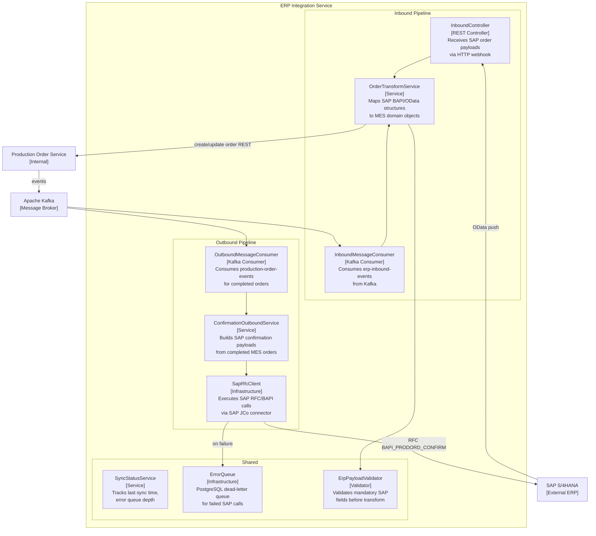
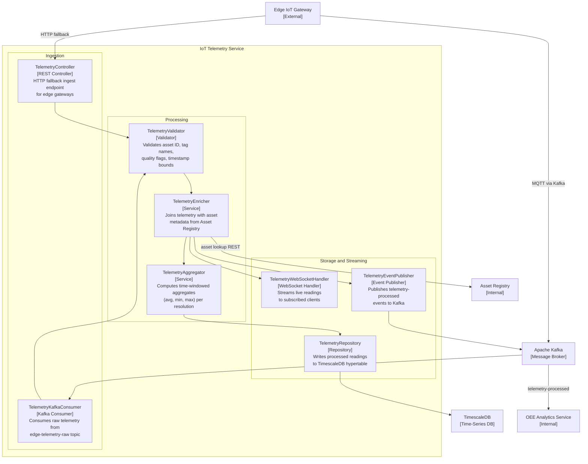
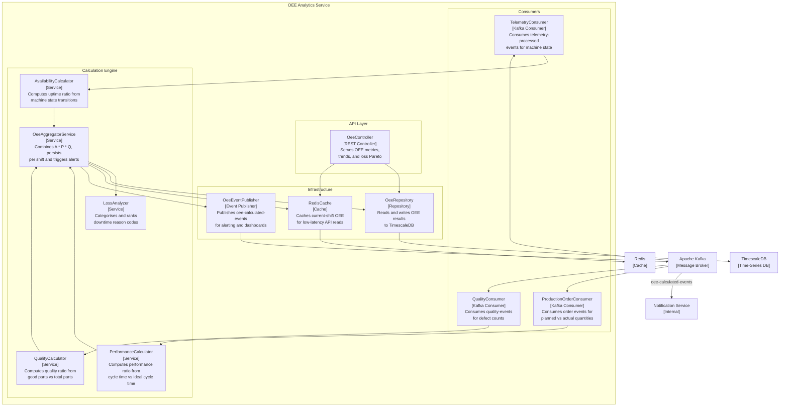
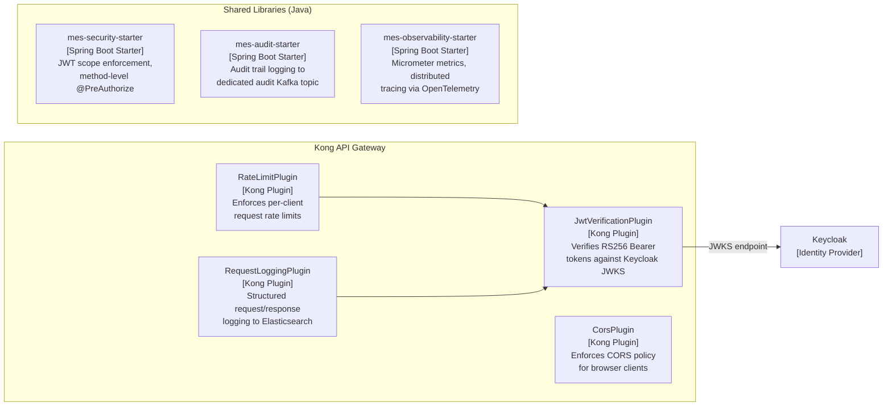
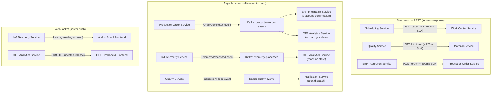

# C4 Component Diagram — Manufacturing Execution System

## Overview

This document provides C4 Model Level 3 (Component) diagrams for each microservice in the Manufacturing Execution System. Each diagram decomposes a service container into its internal components — controllers, service classes, repositories, domain models, event publishers, and validators — and shows how those components communicate with one another and with external dependencies.

Diagrams use Mermaid flowcharts to approximate C4 Component notation (which Mermaid does not natively support). Shapes and labels follow C4 conventions: components are named boxes with stereotype labels.

---

## Production Services Components

The Production Service handles the full lifecycle of production orders, operations, and work center capacity management.

### Production Service Component Responsibilities

| Component                       | Type             | Responsibility                                                                    |
|---------------------------------|------------------|-----------------------------------------------------------------------------------|
| `ProductionOrderController`     | REST Controller  | Deserialises HTTP requests, delegates to service, serialises responses            |
| `OperationController`           | REST Controller  | Handles operation start/complete/query endpoints                                  |
| `ProductionOrderService`        | Service          | Coordinates order creation, validation, and state transitions                     |
| `OperationExecutionService`     | Service          | Records operation actuals, computes yield and duration                            |
| `ScheduleCoordinatorService`    | Service          | Calls Work Center Service to validate capacity before releasing orders            |
| `ProductionOrder`               | Domain Model     | Core aggregate root; owns order status and routing reference                      |
| `OperationExecution`            | Domain Model     | Represents a single routing step execution instance                               |
| `OrderStateMachine`             | Domain Service   | Enforces the finite state machine for valid order status transitions              |
| `ProductionOrderRepository`     | Repository       | PostgreSQL persistence for production orders                                      |
| `OperationExecutionRepository`  | Repository       | PostgreSQL persistence for operation execution records                            |
| `ProductionOrderValidator`      | Validator        | Cross-field validation: routing exists, dates valid, work center registered       |
| `ProductionOrderEventPublisher` | Event Publisher  | Publishes `OrderCreated`, `OrderReleased`, `OrderCompleted` events to Kafka       |

---

## Quality Service Components

The Quality Service manages inspection plans, SPC calculations, NCR workflows, and quality disposition.

---

## Integration Service Components

The Integration Service manages bi-directional data exchange with SAP S/4HANA and provides an IoT telemetry ingestion pipeline.

---

## Analytics Service Components

The OEE Analytics Service consumes telemetry and production actuals to compute and publish OEE metrics.

---

## Cross-Cutting Components

Cross-cutting components are shared across all microservices and deployed as shared libraries or infrastructure services.

### Auth and Security Components

### Observability Components

| Component                 | Technology                     | Responsibility                                                   |
|---------------------------|--------------------------------|------------------------------------------------------------------|
| Distributed Tracing       | OpenTelemetry + Jaeger         | End-to-end trace propagation across microservices via W3C headers|
| Metrics Collection        | Micrometer + Prometheus        | JVM, HTTP, Kafka consumer lag, custom business metrics           |
| Log Aggregation           | Fluentd + Elasticsearch        | Structured JSON logs with `traceId`, `spanId`, service name      |
| Alerting                  | Grafana Alertmanager           | Threshold alerts for OEE, error rates, Kafka consumer lag        |
| Dashboards                | Grafana                        | OEE trends, API latency, queue depths, service health            |

---

## Component Communication Patterns

### Pattern Selection Rationale

| Communication Pattern | When Used                                                             | Guarantees                              |
|-----------------------|-----------------------------------------------------------------------|-----------------------------------------|
| Synchronous REST      | Strong consistency needed; caller requires immediate response         | At-most-once; circuit-breaker protected |
| Asynchronous Kafka    | Decoupled propagation; high-throughput events; multi-consumer fanout  | At-least-once; consumer offset tracking |
| WebSocket             | Real-time push to browser clients; sub-second latency needed          | Best-effort; reconnect on disconnect    |
| gRPC (future)         | High-frequency internal service calls requiring typed contracts       | At-most-once; streaming support         |

### Resilience Patterns

All synchronous REST calls between microservices are wrapped with:

- **Circuit Breaker** (Resilience4j): Opens after 5 consecutive failures; half-opens after 30 seconds.
- **Retry** (Resilience4j): 3 retries with exponential backoff (100ms → 200ms → 400ms); not applied to non-idempotent `POST` requests.
- **Timeout**: 2,000ms default for intra-service calls; 10,000ms for SAP RFC calls.
- **Bulkhead**: Separate thread pools per downstream service to prevent cascading failures.

Kafka consumers use:

- **Dead Letter Queue**: Failed messages after 3 retries are routed to `<topic>-dlq` for manual inspection.
- **Consumer Group Offset Management**: Committed only after successful processing to ensure at-least-once delivery.
- **Back-pressure**: Consumer concurrency limited per pod; Kubernetes HPA scales consumer pods based on Kafka consumer lag metric.
