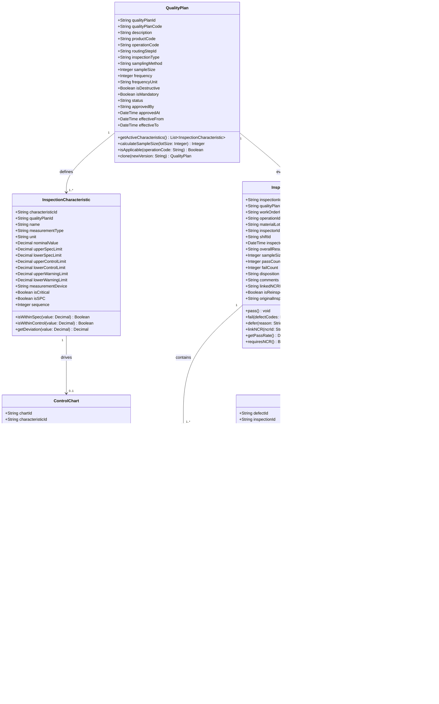
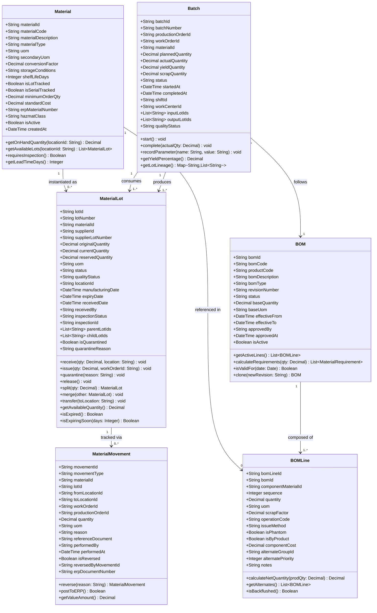
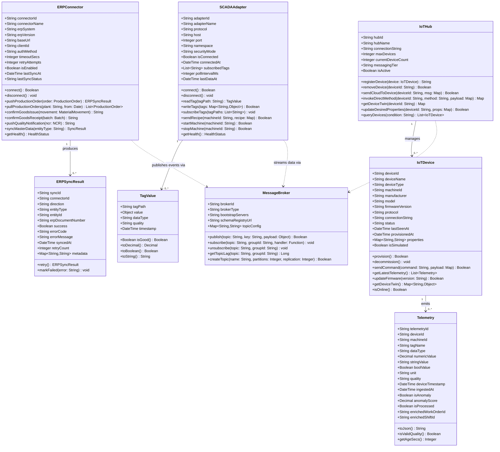
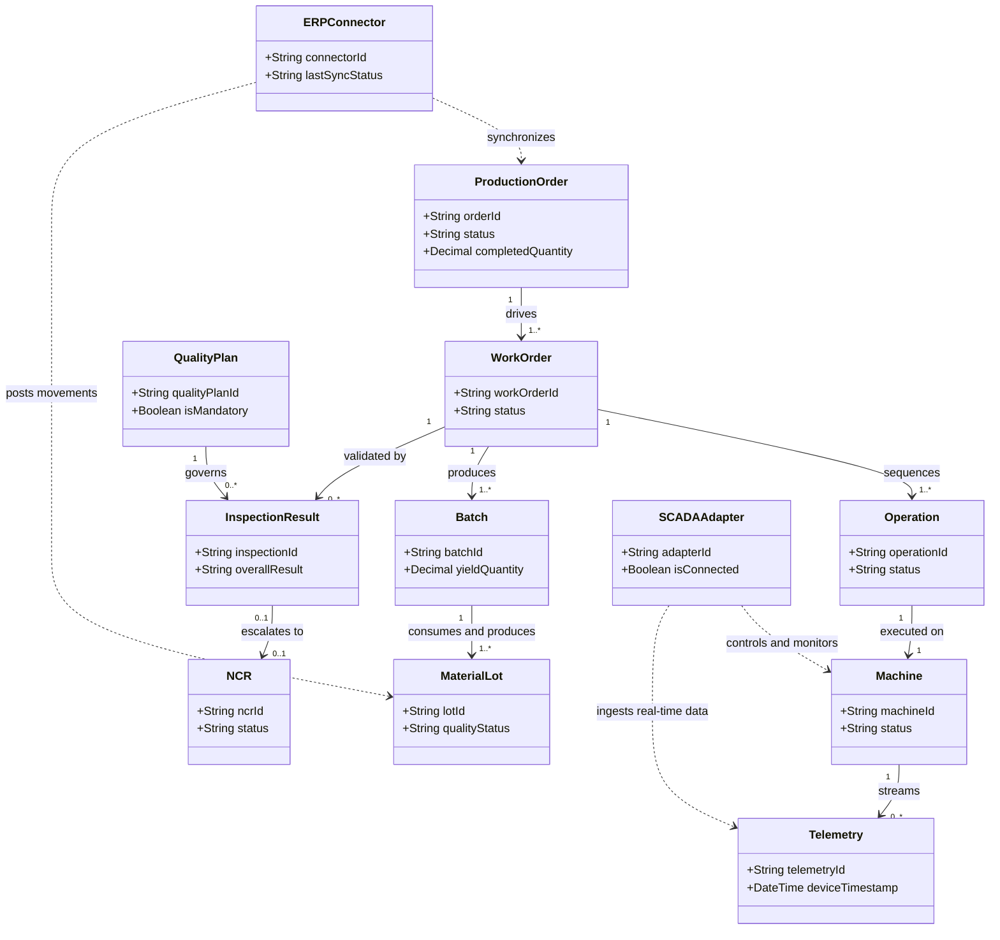

# Class Diagrams — Manufacturing Execution System

## Overview

This document presents the object-oriented domain model for the Manufacturing Execution System (MES), covering discrete manufacturing workflows for production orders, work center operations, quality management, material traceability, and external system integration. The model is organized across four cohesive subsystems: Production Management, Quality Management, Material Tracking, and Integration.

Each class diagram follows UML conventions rendered via Mermaid `classDiagram` notation. Attributes carry explicit types. Methods are shown with parameter and return types where disambiguation adds clarity. Relationships encode associations (with navigability and multiplicity), compositions (lifecycle ownership), and dependencies (loose coupling across subsystem boundaries).

Design invariants applied throughout:
- All entities use `String` UUID primary keys for distributed uniqueness
- Lifecycle status is a typed `String` attribute on the owning entity, validated against allowed transitions
- Temporal fields use `DateTime` for full audit traceability across time zones
- Methods on domain objects represent service-layer contracts and do not imply direct persistence calls

---

## Production Management Classes

The production management subsystem coordinates the lifecycle of manufacturing execution from ERP order receipt through final goods confirmation. A `ProductionOrder` is released from SAP and decomposed into `WorkOrder` records, one per `RoutingStep`. Each work order executes at a `WorkCenter` during a `Shift`, is assigned to an `Employee`, and is realized as a sequence of `Operation` instances on individual `Machine` assets.

```mermaid
classDiagram
    class ProductionOrder {
        +String orderId
        +String erpOrderNumber
        +String productCode
        +String productDescription
        +Decimal plannedQuantity
        +Decimal completedQuantity
        +Decimal scrapQuantity
        +String uom
        +DateTime plannedStartDate
        +DateTime plannedEndDate
        +DateTime actualStartDate
        +DateTime actualEndDate
        +String status
        +String priority
        +String customerId
        +String salesOrderRef
        +String routingId
        +String bomId
        +String facilityId
        +String plantCode
        +String createdBy
        +DateTime createdAt
        +DateTime updatedAt
        +release() Boolean
        +hold(reason: String) void
        +resume() void
        +close() void
        +cancel(reason: String) void
        +calculateOEE() Decimal
        +getOpenWorkOrders() List~WorkOrder~
        +getRemainingQuantity() Decimal
        +isComplete() Boolean
        +getProgress() Decimal
    }

    class WorkOrder {
        +String workOrderId
        +String productionOrderId
        +String routingStepId
        +String workCenterId
        +Integer sequenceNumber
        +Decimal plannedQuantity
        +Decimal completedQuantity
        +Decimal scrapQuantity
        +Decimal reworkQuantity
        +DateTime scheduledStart
        +DateTime scheduledEnd
        +DateTime actualStart
        +DateTime actualEnd
        +Integer plannedDurationMins
        +Integer actualDurationMins
        +String status
        +String operatorId
        +String shiftId
        +String setupPersonId
        +DateTime createdAt
        +DateTime updatedAt
        +start(operatorId: String, shiftId: String) Boolean
        +complete(qty: Decimal, scrap: Decimal) void
        +pause(reason: String) void
        +resume() void
        +abort(reason: String) void
        +reportScrap(qty: Decimal, reasonCode: String) void
        +getDowntimeMinutes() Integer
        +getEfficiency() Decimal
        +isOverdue() Boolean
    }

    class Operation {
        +String operationId
        +String workOrderId
        +String operationCode
        +String operationName
        +String operationType
        +Integer sequence
        +String status
        +String machineId
        +String operatorId
        +Decimal plannedCycleTimeSecs
        +Decimal actualCycleTimeSecs
        +Decimal setupTimeMins
        +Decimal teardownTimeMins
        +DateTime startedAt
        +DateTime completedAt
        +String instructions
        +String completionNotes
        +Map~String,String~ parameters
        +begin(machineId: String) void
        +finish(notes: String) void
        +fail(reason: String) void
        +logParameter(key: String, value: String) void
        +getDurationSecs() Integer
        +isWithinCycleTime() Boolean
    }

    class WorkCenter {
        +String workCenterId
        +String workCenterCode
        +String workCenterName
        +String workCenterType
        +String facilityId
        +String departmentId
        +String costCenterId
        +Decimal plannedCapacityHrs
        +String defaultShiftId
        +Boolean isActive
        +String locationCode
        +String supervisorId
        +DateTime createdAt
        +getAvailableMachines() List~Machine~
        +getCurrentLoad() Decimal
        +getScheduledOrders(date: Date) List~WorkOrder~
        +getOEE(from: DateTime, to: DateTime) OEESnapshot
        +isAvailable(from: DateTime, to: DateTime) Boolean
    }

    class Machine {
        +String machineId
        +String machineCode
        +String machineName
        +String machineType
        +String workCenterId
        +String manufacturer
        +String model
        +String serialNumber
        +String assetTag
        +DateTime installDate
        +DateTime lastMaintenanceDate
        +DateTime nextMaintenanceDate
        +String status
        +Decimal theoreticalCycleTimeSecs
        +String ipAddress
        +String scadaNodeId
        +String plcAddress
        +Boolean iotEnabled
        +DateTime createdAt
        +startOperation(operationId: String) Boolean
        +stopOperation(reason: String) void
        +reportDowntime(category: String, reason: String) void
        +getLastTelemetry() Telemetry
        +getDowntimeSummary(range: DateRange) Map~String,Integer~
        +isOperational() Boolean
    }

    class Shift {
        +String shiftId
        +String shiftCode
        +String shiftName
        +String facilityId
        +Time startTime
        +Time endTime
        +Integer durationMins
        +Integer plannedBreakMins
        +Boolean isActive
        +List~String~ workingDays
        +getPlannedProductionTime() Integer
        +getActiveEmployees() List~Employee~
        +getWorkOrders(date: Date) List~WorkOrder~
    }

    class Employee {
        +String employeeId
        +String employeeCode
        +String firstName
        +String lastName
        +String email
        +String badgeId
        +String departmentId
        +String jobTitle
        +String supervisorId
        +List~String~ certifications
        +List~String~ skillCodes
        +Boolean isActive
        +DateTime hiredDate
        +isAuthorizedFor(operationCode: String) Boolean
        +getCertificationExpiry(certCode: String) DateTime
        +getActiveWorkOrders() List~WorkOrder~
        +clockIn(shiftId: String) void
        +clockOut() void
    }

    class RoutingStep {
        +String routingStepId
        +String routingId
        +Integer stepSequence
        +String operationCode
        +String operationName
        +String workCenterCode
        +Decimal plannedCycleTimeSecs
        +Decimal setupTimeMins
        +Decimal teardownTimeMins
        +Boolean isMandatory
        +String qualityPlanId
        +List~String~ resourceCodes
        +String instructions
        +String predecessorStepId
        +Boolean isActive
        +getNextStep() RoutingStep
        +getPreviousStep() RoutingStep
        +requiresQualityCheck() Boolean
    }

    ProductionOrder "1" --> "1..*" WorkOrder : generates
    WorkOrder "1" --> "1..*" Operation : contains
    WorkOrder "*" --> "1" WorkCenter : executes at
    WorkOrder "*" --> "1" Shift : runs during
    WorkOrder "*" --> "1" Employee : assigned to
    Operation "*" --> "1" Machine : runs on
    WorkCenter "1" --> "1..*" Machine : contains
    ProductionOrder "1" --> "1..*" RoutingStep : follows
```

---

## Quality Management Classes

The quality subsystem governs inspection planning, SPC charting, defect recording, and non-conformance disposition. A `QualityPlan` is attached to a routing step and specifies the characteristics to be measured. `InspectionResult` aggregates operator-entered readings and evaluates pass/fail status against spec limits. SPC control is maintained through `ControlChart` objects that apply Western Electric and Nelson rules, generating `SpcViolation` records. Severe defects escalate to `NCR` records that carry a full review and disposition workflow.

---

## Material Tracking Classes

Material tracking maintains full genealogy for raw materials, components, work-in-process, and finished goods. Every physical quantity is represented as a `MaterialLot` with a unique lot number, current status, and quality disposition. A `Batch` links input lots consumed during production to the output lots generated, forming the directed acyclic graph that enables end-to-end traceability. `BOM` and `BOMLine` drive automatic material requirements calculations and backflush logic.

---

## Integration Classes

Integration classes bridge the MES with external systems including SAP ERP, SCADA platforms, and IoT device networks. The `ERPConnector` implements a bidirectional synchronization adapter for production order receipt and goods movement confirmation. The `SCADAAdapter` uses OPC-UA to read and write machine tags in real time. `IoTDevice` instances publish telemetry to an `IoTHub`, which fans messages into a `MessageBroker` (Kafka) for downstream stream processing and enrichment.

---

## Class Relationships

The cross-subsystem diagram below shows how the four domain areas interconnect, tracing the flow from ERP-originated production orders through shop-floor execution, quality validation, and material genealogy, back to integration confirmations. Integration classes are shown as dashed dependencies to emphasize their role as adapters rather than core domain participants.

