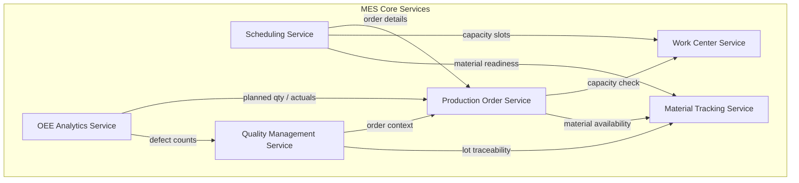
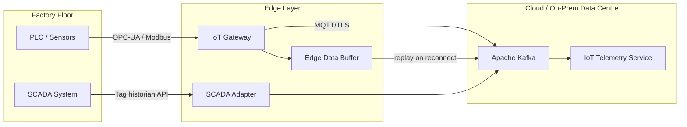
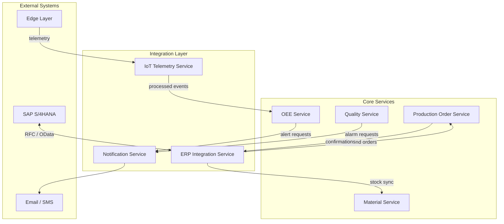
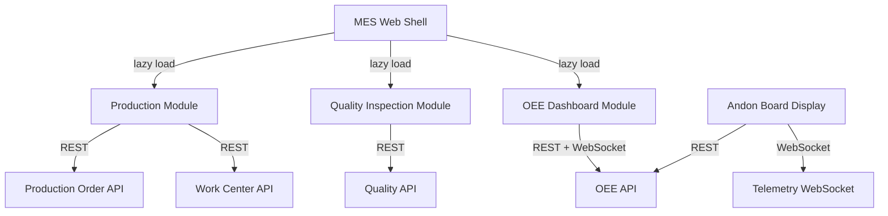
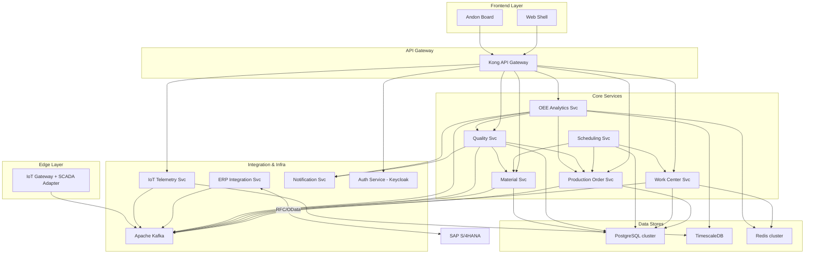

# Component Diagrams — Manufacturing Execution System

## Overview

This document provides a detailed structural decomposition of the Manufacturing Execution System (MES) into deployable components. Each component is described with its responsibilities, provided and required interfaces, technology stack, and deployment unit. Mermaid diagrams illustrate how components relate to one another across the core MES, edge layer, integration layer, and frontend.

The MES follows a domain-driven microservices architecture deployed on Kubernetes. Components communicate via synchronous REST/gRPC for request-response interactions and asynchronous event streaming via Apache Kafka for high-throughput telemetry, state change propagation, and inter-service decoupling.

---

## MES Core Components

Core components implement the primary manufacturing domain logic: production order management, work center scheduling, quality control, material tracking, and OEE analytics.

### Production Order Service

| Attribute        | Detail                                                                 |
|------------------|------------------------------------------------------------------------|
| Name             | Production Order Service                                               |
| Responsibility   | Lifecycle management of production orders (create, dispatch, complete, cancel). Tracks order status, quantity, routing, and due dates. |
| Interfaces Provided | `POST /api/v1/production-orders`, `GET /api/v1/production-orders/{id}`, `PATCH /api/v1/production-orders/{id}/status`, Kafka topic `production-order-events` |
| Interfaces Required | Work Center Service (capacity check), Material Service (availability check), ERP Integration Service (order sync) |
| Technology       | Java 21 / Spring Boot 3, PostgreSQL, Kafka                            |
| Deployment Unit  | `mes-production-order-service` (Kubernetes Deployment, 2–4 replicas)  |

### Work Center Service

| Attribute        | Detail                                                                 |
|------------------|------------------------------------------------------------------------|
| Name             | Work Center Service                                                    |
| Responsibility   | Models work centers (machines, cells, lines). Manages capacity, availability windows, shift calendars, and real-time machine states. |
| Interfaces Provided | `GET /api/v1/work-centers`, `GET /api/v1/work-centers/{id}/capacity`, Kafka topic `work-center-state-events` |
| Interfaces Required | IoT Telemetry Service (machine state), Scheduling Service (capacity reservation) |
| Technology       | Java 21 / Spring Boot 3, PostgreSQL, Redis (state cache)              |
| Deployment Unit  | `mes-work-center-service` (Kubernetes Deployment, 2 replicas)         |

### Scheduling Service

| Attribute        | Detail                                                                 |
|------------------|------------------------------------------------------------------------|
| Name             | Scheduling Service                                                     |
| Responsibility   | Finite capacity scheduling (FCS) of operations onto work centers. Supports FIFO, EDD, and priority-rule dispatching. Publishes schedule plans. |
| Interfaces Provided | `POST /api/v1/schedules/compute`, `GET /api/v1/schedules/{planId}`, Kafka topic `schedule-events` |
| Interfaces Required | Production Order Service (order details), Work Center Service (capacity), Material Service (material readiness) |
| Technology       | Python 3.12, OR-Tools (CP-SAT solver), PostgreSQL, Kafka              |
| Deployment Unit  | `mes-scheduling-service` (Kubernetes Deployment, 1–2 replicas)        |

### Quality Management Service

| Attribute        | Detail                                                                 |
|------------------|------------------------------------------------------------------------|
| Name             | Quality Management Service                                             |
| Responsibility   | Manages inspection plans, SPC control charts, inspection results, NCR (non-conformance reports), and disposition workflows. |
| Interfaces Provided | `POST /api/v1/inspections`, `GET /api/v1/spc/control-charts/{id}`, `POST /api/v1/ncr`, Kafka topic `quality-events` |
| Interfaces Required | Production Order Service (order context), Material Service (lot traceability), Notification Service (alerts) |
| Technology       | Java 21 / Spring Boot 3, PostgreSQL, Kafka                            |
| Deployment Unit  | `mes-quality-service` (Kubernetes Deployment, 2 replicas)             |

### Material Tracking Service

| Attribute        | Detail                                                                 |
|------------------|------------------------------------------------------------------------|
| Name             | Material Tracking Service                                              |
| Responsibility   | Tracks raw material lots, WIP containers, and finished goods by lot/serial. Manages GRN, consumption, and inventory movements. |
| Interfaces Provided | `POST /api/v1/materials/consume`, `GET /api/v1/materials/lots/{lotId}`, `GET /api/v1/materials/traceability/{serialNo}`, Kafka topic `material-events` |
| Interfaces Required | ERP Integration Service (stock sync), Quality Service (lot disposition), Production Order Service (BOM resolution) |
| Technology       | Java 21 / Spring Boot 3, PostgreSQL, Kafka                            |
| Deployment Unit  | `mes-material-service` (Kubernetes Deployment, 2 replicas)            |

### OEE Analytics Service

| Attribute        | Detail                                                                 |
|------------------|------------------------------------------------------------------------|
| Name             | OEE Analytics Service                                                  |
| Responsibility   | Computes Availability, Performance, and Quality metrics per work center and shift. Aggregates micro-stoppages and generates OEE trend reports. |
| Interfaces Provided | `GET /api/v1/oee/{workCenterId}`, `GET /api/v1/oee/trends`, Kafka topic `oee-calculated-events` |
| Interfaces Required | IoT Telemetry Service (machine runtime data), Production Order Service (planned vs actual), Quality Service (defect counts) |
| Technology       | Python 3.12 / FastAPI, TimescaleDB, Kafka, Redis                      |
| Deployment Unit  | `mes-oee-service` (Kubernetes Deployment, 2 replicas)                 |

---

## Edge Components

Edge components run on-premises at the factory floor, close to machines and PLCs, handling real-time data acquisition, protocol translation, and local buffering.

### IoT Gateway

| Attribute        | Detail                                                                 |
|------------------|------------------------------------------------------------------------|
| Name             | IoT Gateway                                                            |
| Responsibility   | Collects machine signals from PLCs and sensors via OPC-UA, Modbus TCP, and MQTT. Normalizes payloads and forwards to the cloud broker. |
| Interfaces Provided | MQTT broker endpoint (local), OPC-UA server (read), REST `/health` |
| Interfaces Required | Cloud Kafka broker (TLS), PLC/sensor endpoints (OPC-UA / Modbus)    |
| Technology       | Node.js 20, node-opcua, MQTT.js, Docker on industrial PC             |
| Deployment Unit  | `iot-gateway` (Docker Compose on edge node, HA pair)                  |

### SCADA Adapter

| Attribute        | Detail                                                                 |
|------------------|------------------------------------------------------------------------|
| Name             | SCADA Adapter                                                          |
| Responsibility   | Bridges the plant SCADA system (Ignition / WinCC) with the MES event bus. Translates SCADA tag changes into structured MES events. |
| Interfaces Provided | REST `POST /scada/events` (inbound from SCADA), Kafka topic `scada-raw-events` |
| Interfaces Required | SCADA historian API, Cloud Kafka broker                              |
| Technology       | Python 3.12, pyignition / pywincc SDK, Docker                        |
| Deployment Unit  | `scada-adapter` (Docker on edge DMZ server)                           |

### Edge Data Buffer

| Attribute        | Detail                                                                 |
|------------------|------------------------------------------------------------------------|
| Name             | Edge Data Buffer                                                       |
| Responsibility   | Local time-series store for telemetry during network outages. Replays buffered data to the cloud once connectivity is restored. |
| Interfaces Provided | InfluxDB line protocol (write/read), `/buffer/status` REST endpoint |
| Interfaces Required | IoT Gateway (write), Cloud Kafka (replay upload)                    |
| Technology       | InfluxDB OSS 2.x, Docker                                              |
| Deployment Unit  | `edge-buffer` (Docker on edge node, persistent volume)                |

---

## Integration Components

Integration components manage data exchange with external enterprise systems (SAP ERP) and expose MES data to downstream consumers.

### ERP Integration Service

| Attribute        | Detail                                                                 |
|------------------|------------------------------------------------------------------------|
| Name             | ERP Integration Service                                                |
| Responsibility   | Bi-directional sync with SAP S/4HANA: inbound production orders and BOMs; outbound goods movements, confirmations, and quality notifications. |
| Interfaces Provided | `POST /erp/inbound/production-orders`, `POST /erp/outbound/confirmations`, Kafka topics `erp-inbound-events`, `erp-outbound-events` |
| Interfaces Required | SAP RFC / OData APIs, Production Order Service, Material Service     |
| Technology       | Java 21 / Spring Integration, SAP JCo connector, Kafka               |
| Deployment Unit  | `mes-erp-integration` (Kubernetes Deployment, 2 replicas)             |

### IoT Telemetry Service

| Attribute        | Detail                                                                 |
|------------------|------------------------------------------------------------------------|
| Name             | IoT Telemetry Service                                                  |
| Responsibility   | Ingests raw telemetry from Kafka, validates, enriches with asset metadata, and persists to TimescaleDB. Streams processed events to downstream services. |
| Interfaces Provided | `GET /api/v1/telemetry/{assetId}`, Kafka topic `telemetry-processed`, WebSocket `wss://…/live/{assetId}` |
| Interfaces Required | Kafka (raw topics from edge), TimescaleDB, Asset Registry            |
| Technology       | Python 3.12 / FastAPI, TimescaleDB, Kafka, WebSocket                 |
| Deployment Unit  | `mes-iot-telemetry` (Kubernetes Deployment, 3–6 replicas, HPA)        |

### Notification Service

| Attribute        | Detail                                                                 |
|------------------|------------------------------------------------------------------------|
| Name             | Notification Service                                                   |
| Responsibility   | Routes OEE threshold alerts, quality alarms, and order status changes to operators via email, SMS, or push notification. |
| Interfaces Provided | `POST /api/v1/notifications`, Kafka consumer `notification-requests` |
| Interfaces Required | SMTP relay, SMS gateway (Twilio), FCM push                          |
| Technology       | Node.js 20, Kafka consumer, Nodemailer, Twilio SDK                   |
| Deployment Unit  | `mes-notification-service` (Kubernetes Deployment, 2 replicas)        |

---

## Frontend Components

Frontend components deliver operator, quality, and management interfaces via a single-page web application and operator station displays.

### MES Web Shell

| Attribute        | Detail                                                                 |
|------------------|------------------------------------------------------------------------|
| Name             | MES Web Shell                                                          |
| Responsibility   | Micro-frontend host: lazy-loads domain modules (production, quality, OEE) and provides shared navigation, auth context, and theme. |
| Interfaces Provided | Browser SPA, module federation entry points                        |
| Interfaces Required | Auth Service (OIDC/PKCE), all MES REST APIs                        |
| Technology       | React 18, Vite, Module Federation, TypeScript                        |
| Deployment Unit  | `mes-web-shell` (Nginx container, CDN-backed)                         |

### Production Floor Display

| Attribute        | Detail                                                                 |
|------------------|------------------------------------------------------------------------|
| Name             | Production Floor Display (Andon Board)                                 |
| Responsibility   | Real-time kiosk display showing current order status, target vs. actual quantities, machine state, and OEE for each work center. |
| Interfaces Provided | Full-screen browser display (TV/kiosk)                              |
| Interfaces Required | IoT Telemetry WebSocket, OEE API, Work Center API                  |
| Technology       | React 18, WebSocket client, Recharts                                  |
| Deployment Unit  | `mes-andon-display` (Nginx container, served to floor kiosks)         |

### Quality Inspection Module

| Attribute        | Detail                                                                 |
|------------------|------------------------------------------------------------------------|
| Name             | Quality Inspection Module                                              |
| Responsibility   | Touch-friendly interface for quality inspectors to record measurement results, trigger SPC calculations, and raise NCRs. |
| Interfaces Provided | Module federation remote `quality@/remoteEntry.js`                 |
| Interfaces Required | Quality Management API, Material Tracking API                      |
| Technology       | React 18, React Hook Form, Recharts (SPC charts), TypeScript         |
| Deployment Unit  | Loaded dynamically by MES Web Shell                                   |

---

## Component Dependency Graph

The following graph provides a holistic view of all component dependencies across all layers of the system.

### Dependency Summary Table

| Consumer                  | Depends On                                    | Interface Type        |
|---------------------------|-----------------------------------------------|-----------------------|
| Scheduling Service        | Production Order Svc, Work Center Svc, Material Svc | REST (sync)      |
| Quality Service           | Production Order Svc, Material Svc            | REST (sync)           |
| OEE Analytics Service     | Production Order Svc, Quality Svc, IoT Telemetry | Kafka (async)      |
| ERP Integration Service   | Production Order Svc, Material Svc            | Kafka (async) + REST  |
| IoT Telemetry Service     | Edge Gateway (via Kafka)                      | Kafka (async)         |
| Notification Service      | Quality Svc, OEE Svc (via Kafka)              | Kafka (async)         |
| MES Web Shell             | All core services                             | REST / WebSocket      |
| Andon Board               | IoT Telemetry Svc, OEE Svc                    | REST + WebSocket      |
