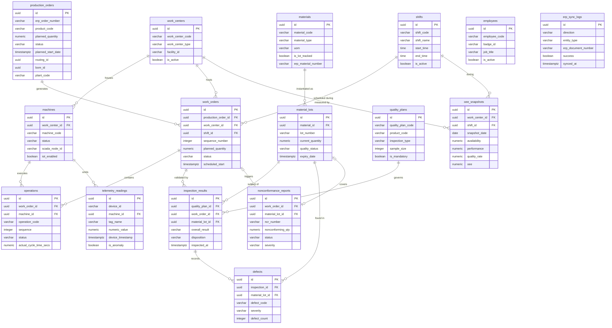

# ERD and Database Schema — Manufacturing Execution System

## Overview

This document defines the relational database schema for the Manufacturing Execution System. The schema is designed for PostgreSQL 15+ and serves as the persistent store for all MES domain entities. The design prioritizes write throughput for high-frequency telemetry ingestion, read performance for real-time OEE dashboards, and strong referential integrity for regulatory traceability requirements.

The schema spans sixteen tables organized into four logical groups:

- **Production** — `production_orders`, `work_orders`, `operations`, `work_centers`, `machines`, `shifts`, `employees`
- **Quality** — `quality_plans`, `inspection_results`, `defects`, `nonconformance_reports`
- **Materials** — `materials`, `material_lots`
- **Observability** — `telemetry_readings`, `oee_snapshots`, `erp_sync_logs`

All primary keys use `UUID` generated by `gen_random_uuid()`. All tables carry `created_at` and (where mutable) `updated_at` audit timestamps. Soft-delete patterns are not used; hard deletes are prevented by application policy and replaced by terminal status transitions.

---

## Entity Relationship Diagram



---

## Table Definitions

### Work Centers

```sql
CREATE TABLE work_centers (
    id                   UUID         PRIMARY KEY DEFAULT gen_random_uuid(),
    work_center_code     VARCHAR(20)  NOT NULL,
    work_center_name     VARCHAR(100) NOT NULL,
    work_center_type     VARCHAR(30)  NOT NULL,
    facility_id          VARCHAR(20)  NOT NULL,
    department_id        VARCHAR(30),
    cost_center_id       VARCHAR(20),
    planned_capacity_hrs NUMERIC(8,2) NOT NULL DEFAULT 0,
    default_shift_id     UUID,
    supervisor_id        UUID,
    location_code        VARCHAR(30),
    is_active            BOOLEAN      NOT NULL DEFAULT TRUE,
    created_at           TIMESTAMPTZ  NOT NULL DEFAULT NOW(),
    updated_at           TIMESTAMPTZ  NOT NULL DEFAULT NOW(),
    CONSTRAINT uq_work_center_code UNIQUE (facility_id, work_center_code),
    CONSTRAINT chk_wc_type CHECK (work_center_type IN ('MACHINING','ASSEMBLY','WELDING','PAINTING','INSPECTION','PACKAGING','OTHER'))
);
```

### Machines

```sql
CREATE TABLE machines (
    id                        UUID         PRIMARY KEY DEFAULT gen_random_uuid(),
    work_center_id            UUID         NOT NULL REFERENCES work_centers(id),
    machine_code              VARCHAR(20)  NOT NULL,
    machine_name              VARCHAR(100) NOT NULL,
    machine_type              VARCHAR(50)  NOT NULL,
    manufacturer              VARCHAR(100),
    model                     VARCHAR(100),
    serial_number             VARCHAR(50),
    asset_tag                 VARCHAR(50),
    install_date              DATE,
    last_maintenance_date     DATE,
    next_maintenance_date     DATE,
    status                    VARCHAR(25)  NOT NULL DEFAULT 'OFFLINE',
    theoretical_cycle_time_s  NUMERIC(10,3),
    ip_address                VARCHAR(45),
    scada_node_id             VARCHAR(200),
    plc_address               VARCHAR(100),
    iot_enabled               BOOLEAN      NOT NULL DEFAULT FALSE,
    is_active                 BOOLEAN      NOT NULL DEFAULT TRUE,
    created_at                TIMESTAMPTZ  NOT NULL DEFAULT NOW(),
    updated_at                TIMESTAMPTZ  NOT NULL DEFAULT NOW(),
    CONSTRAINT uq_machine_code UNIQUE (work_center_id, machine_code),
    CONSTRAINT chk_machine_status CHECK (status IN ('OFFLINE','IDLE','SETUP','RUNNING','PLANNED_DOWNTIME','UNPLANNED_DOWNTIME','BREAKDOWN','UNDER_MAINTENANCE'))
);
```

### Shifts

```sql
CREATE TABLE shifts (
    id                   UUID        PRIMARY KEY DEFAULT gen_random_uuid(),
    shift_code           VARCHAR(10) NOT NULL,
    shift_name           VARCHAR(50) NOT NULL,
    facility_id          VARCHAR(20) NOT NULL,
    start_time           TIME        NOT NULL,
    end_time             TIME        NOT NULL,
    duration_mins        INTEGER     NOT NULL,
    planned_break_mins   INTEGER     NOT NULL DEFAULT 0,
    is_active            BOOLEAN     NOT NULL DEFAULT TRUE,
    working_days         INTEGER[]   NOT NULL DEFAULT '{1,2,3,4,5}',
    created_at           TIMESTAMPTZ NOT NULL DEFAULT NOW(),
    updated_at           TIMESTAMPTZ NOT NULL DEFAULT NOW(),
    CONSTRAINT uq_shift_code UNIQUE (facility_id, shift_code),
    CONSTRAINT chk_shift_duration CHECK (duration_mins > 0 AND duration_mins <= 1440),
    CONSTRAINT chk_break_mins CHECK (planned_break_mins >= 0 AND planned_break_mins < duration_mins)
);
```

### Employees

```sql
CREATE TABLE employees (
    id              UUID         PRIMARY KEY DEFAULT gen_random_uuid(),
    employee_code   VARCHAR(20)  NOT NULL UNIQUE,
    first_name      VARCHAR(50)  NOT NULL,
    last_name       VARCHAR(50)  NOT NULL,
    email           VARCHAR(150) NOT NULL UNIQUE,
    badge_id        VARCHAR(30)  NOT NULL UNIQUE,
    department_id   VARCHAR(30),
    job_title       VARCHAR(100),
    supervisor_id   UUID         REFERENCES employees(id),
    certifications  TEXT[]       NOT NULL DEFAULT '{}',
    skill_codes     TEXT[]       NOT NULL DEFAULT '{}',
    is_active       BOOLEAN      NOT NULL DEFAULT TRUE,
    hired_date      DATE,
    created_at      TIMESTAMPTZ  NOT NULL DEFAULT NOW(),
    updated_at      TIMESTAMPTZ  NOT NULL DEFAULT NOW()
);
```

### Materials

```sql
CREATE TABLE materials (
    id                   UUID         PRIMARY KEY DEFAULT gen_random_uuid(),
    material_code        VARCHAR(40)  NOT NULL,
    material_description VARCHAR(200) NOT NULL,
    material_type        VARCHAR(30)  NOT NULL,
    uom                  VARCHAR(10)  NOT NULL,
    secondary_uom        VARCHAR(10),
    conversion_factor    NUMERIC(14,6),
    shelf_life_days      INTEGER,
    is_lot_tracked       BOOLEAN      NOT NULL DEFAULT TRUE,
    is_serial_tracked    BOOLEAN      NOT NULL DEFAULT FALSE,
    standard_cost        NUMERIC(18,4),
    erp_material_number  VARCHAR(40)  NOT NULL,
    hazmat_class         VARCHAR(20),
    storage_conditions   TEXT,
    is_active            BOOLEAN      NOT NULL DEFAULT TRUE,
    created_at           TIMESTAMPTZ  NOT NULL DEFAULT NOW(),
    updated_at           TIMESTAMPTZ  NOT NULL DEFAULT NOW(),
    CONSTRAINT uq_erp_material_number UNIQUE (erp_material_number),
    CONSTRAINT chk_material_type CHECK (material_type IN ('RAW','SEMI_FINISHED','FINISHED','CONSUMABLE','SPARE_PART','BY_PRODUCT'))
);
```

### Material Lots

```sql
CREATE TABLE material_lots (
    id                  UUID         PRIMARY KEY DEFAULT gen_random_uuid(),
    lot_number          VARCHAR(50)  NOT NULL,
    material_id         UUID         NOT NULL REFERENCES materials(id),
    supplier_id         VARCHAR(50),
    supplier_lot_number VARCHAR(50),
    original_quantity   NUMERIC(18,4) NOT NULL,
    current_quantity    NUMERIC(18,4) NOT NULL,
    reserved_quantity   NUMERIC(18,4) NOT NULL DEFAULT 0,
    uom                 VARCHAR(10)  NOT NULL,
    status              VARCHAR(25)  NOT NULL DEFAULT 'RECEIVED',
    quality_status      VARCHAR(30)  NOT NULL DEFAULT 'PENDING_INSPECTION',
    location_id         VARCHAR(30),
    sublocation_id      VARCHAR(30),
    manufacturing_date  DATE,
    expiry_date         DATE,
    received_date       DATE         NOT NULL DEFAULT CURRENT_DATE,
    received_by         UUID         REFERENCES employees(id),
    is_quarantined      BOOLEAN      NOT NULL DEFAULT FALSE,
    quarantine_reason   TEXT,
    quarantined_at      TIMESTAMPTZ,
    parent_lot_ids      UUID[]       NOT NULL DEFAULT '{}',
    created_at          TIMESTAMPTZ  NOT NULL DEFAULT NOW(),
    updated_at          TIMESTAMPTZ  NOT NULL DEFAULT NOW(),
    CONSTRAINT uq_lot_number_material UNIQUE (lot_number, material_id),
    CONSTRAINT chk_lot_status CHECK (status IN ('RECEIVED','INSPECTION_PENDING','UNDER_INSPECTION','CONDITIONAL_RELEASE','AVAILABLE','RESERVED','PARTIALLY_ISSUED','TRANSFERRED','QUARANTINED','CONSUMED','SCRAPPED')),
    CONSTRAINT chk_lot_qty CHECK (current_quantity >= 0 AND reserved_quantity >= 0 AND reserved_quantity <= current_quantity)
);
```

### Production Orders

```sql
CREATE TABLE production_orders (
    id                   UUID          PRIMARY KEY DEFAULT gen_random_uuid(),
    erp_order_number     VARCHAR(50)   NOT NULL,
    product_code         VARCHAR(50)   NOT NULL,
    product_description  TEXT,
    planned_quantity     NUMERIC(18,4) NOT NULL,
    completed_quantity   NUMERIC(18,4) NOT NULL DEFAULT 0,
    scrap_quantity       NUMERIC(18,4) NOT NULL DEFAULT 0,
    uom                  VARCHAR(10)   NOT NULL DEFAULT 'EA',
    status               VARCHAR(25)   NOT NULL DEFAULT 'CREATED',
    priority             VARCHAR(10)   NOT NULL DEFAULT 'NORMAL',
    customer_id          VARCHAR(50),
    sales_order_ref      VARCHAR(50),
    routing_id           UUID          NOT NULL,
    bom_id               UUID          NOT NULL,
    facility_id          VARCHAR(20)   NOT NULL,
    plant_code           VARCHAR(10)   NOT NULL,
    planned_start_date   TIMESTAMPTZ   NOT NULL,
    planned_end_date     TIMESTAMPTZ   NOT NULL,
    actual_start_date    TIMESTAMPTZ,
    actual_end_date      TIMESTAMPTZ,
    created_by           UUID          NOT NULL REFERENCES employees(id),
    created_at           TIMESTAMPTZ   NOT NULL DEFAULT NOW(),
    updated_at           TIMESTAMPTZ   NOT NULL DEFAULT NOW(),
    CONSTRAINT uq_erp_order_number UNIQUE (plant_code, erp_order_number),
    CONSTRAINT chk_po_status CHECK (status IN ('CREATED','SCHEDULED','MATERIAL_SHORTAGE','RELEASED','IN_PROGRESS','PARTIALLY_COMPLETE','ON_HOLD','COMPLETED','CLOSED','CANCELLED')),
    CONSTRAINT chk_po_dates CHECK (planned_end_date >= planned_start_date),
    CONSTRAINT chk_po_qty CHECK (planned_quantity > 0)
);
```

### Work Orders

```sql
CREATE TABLE work_orders (
    id                    UUID          PRIMARY KEY DEFAULT gen_random_uuid(),
    production_order_id   UUID          NOT NULL REFERENCES production_orders(id),
    routing_step_id       UUID          NOT NULL,
    work_center_id        UUID          NOT NULL REFERENCES work_centers(id),
    shift_id              UUID          REFERENCES shifts(id),
    operator_id           UUID          REFERENCES employees(id),
    setup_person_id       UUID          REFERENCES employees(id),
    sequence_number       INTEGER       NOT NULL,
    planned_quantity      NUMERIC(18,4) NOT NULL,
    completed_quantity    NUMERIC(18,4) NOT NULL DEFAULT 0,
    scrap_quantity        NUMERIC(18,4) NOT NULL DEFAULT 0,
    rework_quantity       NUMERIC(18,4) NOT NULL DEFAULT 0,
    planned_duration_mins INTEGER,
    actual_duration_mins  INTEGER,
    status                VARCHAR(25)   NOT NULL DEFAULT 'PENDING',
    scheduled_start       TIMESTAMPTZ,
    scheduled_end         TIMESTAMPTZ,
    actual_start          TIMESTAMPTZ,
    actual_end            TIMESTAMPTZ,
    created_at            TIMESTAMPTZ   NOT NULL DEFAULT NOW(),
    updated_at            TIMESTAMPTZ   NOT NULL DEFAULT NOW(),
    CONSTRAINT chk_wo_status CHECK (status IN ('PENDING','SCHEDULED','READY_TO_START','SETUP_IN_PROGRESS','SETUP_ON_HOLD','READY_TO_RUN','IN_PROGRESS','PAUSED','QUALITY_HOLD','PARTIAL_COMPLETE','COMPLETED','CLOSED','CANCELLED','SCRAPPED')),
    CONSTRAINT chk_wo_seq CHECK (sequence_number > 0)
);
```

### Operations

```sql
CREATE TABLE operations (
    id                      UUID          PRIMARY KEY DEFAULT gen_random_uuid(),
    work_order_id           UUID          NOT NULL REFERENCES work_orders(id),
    machine_id              UUID          REFERENCES machines(id),
    operator_id             UUID          REFERENCES employees(id),
    operation_code          VARCHAR(30)   NOT NULL,
    operation_name          VARCHAR(100)  NOT NULL,
    operation_type          VARCHAR(30)   NOT NULL DEFAULT 'PRODUCTION',
    sequence                INTEGER       NOT NULL,
    status                  VARCHAR(25)   NOT NULL DEFAULT 'PENDING',
    planned_cycle_time_secs NUMERIC(10,3),
    actual_cycle_time_secs  NUMERIC(10,3),
    setup_time_mins         NUMERIC(8,2)  DEFAULT 0,
    teardown_time_mins      NUMERIC(8,2)  DEFAULT 0,
    started_at              TIMESTAMPTZ,
    completed_at            TIMESTAMPTZ,
    instructions            TEXT,
    completion_notes        TEXT,
    parameters              JSONB         NOT NULL DEFAULT '{}',
    created_at              TIMESTAMPTZ   NOT NULL DEFAULT NOW(),
    updated_at              TIMESTAMPTZ   NOT NULL DEFAULT NOW(),
    CONSTRAINT chk_op_status CHECK (status IN ('PENDING','IN_PROGRESS','PAUSED','CYCLE_TIME_BREACHED','FAILED','COMPLETED','SKIPPED','CANCELLED')),
    CONSTRAINT chk_op_seq CHECK (sequence > 0)
);
```

### Quality Plans

```sql
CREATE TABLE quality_plans (
    id                UUID        PRIMARY KEY DEFAULT gen_random_uuid(),
    quality_plan_code VARCHAR(30) NOT NULL,
    description       TEXT,
    product_code      VARCHAR(50),
    operation_code    VARCHAR(30),
    routing_step_id   UUID,
    inspection_type   VARCHAR(30) NOT NULL DEFAULT 'INLINE',
    sampling_method   VARCHAR(20) NOT NULL DEFAULT 'FIXED',
    sample_size       INTEGER     NOT NULL DEFAULT 1,
    frequency         INTEGER     NOT NULL DEFAULT 1,
    frequency_unit    VARCHAR(20) NOT NULL DEFAULT 'PER_LOT',
    is_destructive    BOOLEAN     NOT NULL DEFAULT FALSE,
    is_mandatory      BOOLEAN     NOT NULL DEFAULT TRUE,
    status            VARCHAR(20) NOT NULL DEFAULT 'ACTIVE',
    approved_by       UUID        REFERENCES employees(id),
    approved_at       TIMESTAMPTZ,
    effective_from    DATE        NOT NULL,
    effective_to      DATE,
    created_at        TIMESTAMPTZ NOT NULL DEFAULT NOW(),
    updated_at        TIMESTAMPTZ NOT NULL DEFAULT NOW(),
    CONSTRAINT uq_quality_plan_code UNIQUE (quality_plan_code),
    CONSTRAINT chk_qp_status CHECK (status IN ('DRAFT','ACTIVE','SUPERSEDED','OBSOLETE')),
    CONSTRAINT chk_qp_sample CHECK (sample_size > 0)
);
```

### Inspection Results

```sql
CREATE TABLE inspection_results (
    id                    UUID        PRIMARY KEY DEFAULT gen_random_uuid(),
    quality_plan_id       UUID        NOT NULL REFERENCES quality_plans(id),
    work_order_id         UUID        NOT NULL REFERENCES work_orders(id),
    operation_id          UUID        REFERENCES operations(id),
    material_lot_id       UUID        REFERENCES material_lots(id),
    inspector_id          UUID        NOT NULL REFERENCES employees(id),
    shift_id              UUID        REFERENCES shifts(id),
    overall_result        VARCHAR(20) NOT NULL,
    sample_size           INTEGER     NOT NULL,
    pass_count            INTEGER     NOT NULL DEFAULT 0,
    fail_count            INTEGER     NOT NULL DEFAULT 0,
    disposition           VARCHAR(30),
    comments              TEXT,
    linked_ncr_id         UUID,
    is_reinspection       BOOLEAN     NOT NULL DEFAULT FALSE,
    original_inspection_id UUID       REFERENCES inspection_results(id),
    inspected_at          TIMESTAMPTZ NOT NULL DEFAULT NOW(),
    created_at            TIMESTAMPTZ NOT NULL DEFAULT NOW(),
    CONSTRAINT chk_ir_result CHECK (overall_result IN ('PASS','FAIL','CONDITIONAL','DEFERRED','PENDING')),
    CONSTRAINT chk_ir_counts CHECK (pass_count >= 0 AND fail_count >= 0 AND (pass_count + fail_count) <= sample_size)
);
```

### Defects

```sql
CREATE TABLE defects (
    id               UUID        PRIMARY KEY DEFAULT gen_random_uuid(),
    inspection_id    UUID        NOT NULL REFERENCES inspection_results(id),
    work_order_id    UUID        NOT NULL REFERENCES work_orders(id),
    operation_id     UUID        REFERENCES operations(id),
    material_lot_id  UUID        REFERENCES material_lots(id),
    defect_code      VARCHAR(20) NOT NULL,
    defect_category  VARCHAR(30) NOT NULL,
    defect_description TEXT,
    severity         VARCHAR(10) NOT NULL DEFAULT 'MINOR',
    defect_count     INTEGER     NOT NULL DEFAULT 1,
    location         VARCHAR(100),
    cause_code       VARCHAR(20),
    discovered_by    UUID        NOT NULL REFERENCES employees(id),
    discovered_at    TIMESTAMPTZ NOT NULL DEFAULT NOW(),
    disposition      VARCHAR(30),
    rework_instructions TEXT,
    is_reworked      BOOLEAN     NOT NULL DEFAULT FALSE,
    reworked_at      TIMESTAMPTZ,
    reworked_by      UUID        REFERENCES employees(id),
    created_at       TIMESTAMPTZ NOT NULL DEFAULT NOW(),
    CONSTRAINT chk_defect_severity CHECK (severity IN ('MINOR','MAJOR','CRITICAL')),
    CONSTRAINT chk_defect_count CHECK (defect_count > 0)
);
```

### Nonconformance Reports

```sql
CREATE TABLE nonconformance_reports (
    id                   UUID          PRIMARY KEY DEFAULT gen_random_uuid(),
    ncr_number           VARCHAR(30)   NOT NULL UNIQUE,
    production_order_id  UUID          REFERENCES production_orders(id),
    work_order_id        UUID          REFERENCES work_orders(id),
    material_lot_id      UUID          REFERENCES material_lots(id),
    product_code         VARCHAR(50)   NOT NULL,
    nonconforming_qty    NUMERIC(18,4) NOT NULL,
    nonconformance_type  VARCHAR(30)   NOT NULL,
    description          TEXT          NOT NULL,
    immediate_action     TEXT,
    root_cause           TEXT,
    corrective_action    TEXT,
    preventive_action    TEXT,
    disposition          VARCHAR(30),
    status               VARCHAR(25)   NOT NULL DEFAULT 'OPEN',
    severity             VARCHAR(10)   NOT NULL DEFAULT 'MINOR',
    reported_by          UUID          NOT NULL REFERENCES employees(id),
    reported_at          TIMESTAMPTZ   NOT NULL DEFAULT NOW(),
    reviewed_by          UUID          REFERENCES employees(id),
    reviewed_at          TIMESTAMPTZ,
    approved_by          UUID          REFERENCES employees(id),
    approved_at          TIMESTAMPTZ,
    due_date             DATE,
    closed_at            TIMESTAMPTZ,
    created_at           TIMESTAMPTZ   NOT NULL DEFAULT NOW(),
    updated_at           TIMESTAMPTZ   NOT NULL DEFAULT NOW(),
    CONSTRAINT chk_ncr_status CHECK (status IN ('OPEN','UNDER_REVIEW','ROOT_CAUSE_ANALYSIS','PENDING_DISPOSITION','ACCEPT_AS_IS','REWORK','SCRAP','RETURN_TO_SUPPLIER','ESCALATED','CLOSED')),
    CONSTRAINT chk_ncr_severity CHECK (severity IN ('MINOR','MAJOR','CRITICAL'))
);
```

### Telemetry Readings

```sql
CREATE TABLE telemetry_readings (
    id               UUID          PRIMARY KEY DEFAULT gen_random_uuid(),
    device_id        VARCHAR(100)  NOT NULL,
    machine_id       UUID          NOT NULL REFERENCES machines(id),
    work_order_id    UUID          REFERENCES work_orders(id),
    shift_id         UUID          REFERENCES shifts(id),
    tag_name         VARCHAR(100)  NOT NULL,
    data_type        VARCHAR(15)   NOT NULL DEFAULT 'NUMERIC',
    numeric_value    NUMERIC(22,6),
    string_value     VARCHAR(200),
    bool_value       BOOLEAN,
    unit             VARCHAR(20),
    quality          VARCHAR(20)   NOT NULL DEFAULT 'GOOD',
    device_timestamp TIMESTAMPTZ   NOT NULL,
    ingested_at      TIMESTAMPTZ   NOT NULL DEFAULT NOW(),
    is_anomaly       BOOLEAN       NOT NULL DEFAULT FALSE,
    anomaly_score    NUMERIC(8,4),
    is_processed     BOOLEAN       NOT NULL DEFAULT FALSE,
    CONSTRAINT chk_telem_data_type CHECK (data_type IN ('NUMERIC','STRING','BOOLEAN')),
    CONSTRAINT chk_telem_quality CHECK (quality IN ('GOOD','UNCERTAIN','BAD'))
) PARTITION BY RANGE (device_timestamp);

CREATE TABLE telemetry_readings_y2024m01 PARTITION OF telemetry_readings
    FOR VALUES FROM ('2024-01-01') TO ('2024-02-01');
CREATE TABLE telemetry_readings_y2024m02 PARTITION OF telemetry_readings
    FOR VALUES FROM ('2024-02-01') TO ('2024-03-01');
```

### OEE Snapshots

```sql
CREATE TABLE oee_snapshots (
    id                     UUID          PRIMARY KEY DEFAULT gen_random_uuid(),
    work_center_id         UUID          NOT NULL REFERENCES work_centers(id),
    shift_id               UUID          NOT NULL REFERENCES shifts(id),
    snapshot_date          DATE          NOT NULL,
    planned_production_mins INTEGER      NOT NULL,
    actual_production_mins  INTEGER      NOT NULL DEFAULT 0,
    downtime_planned_mins  INTEGER       NOT NULL DEFAULT 0,
    downtime_unplanned_mins INTEGER      NOT NULL DEFAULT 0,
    ideal_cycle_time_secs  NUMERIC(10,3) NOT NULL,
    total_count            INTEGER       NOT NULL DEFAULT 0,
    good_count             INTEGER       NOT NULL DEFAULT 0,
    reject_count           INTEGER       NOT NULL DEFAULT 0,
    availability           NUMERIC(6,4)  NOT NULL DEFAULT 0,
    performance            NUMERIC(6,4)  NOT NULL DEFAULT 0,
    quality_rate           NUMERIC(6,4)  NOT NULL DEFAULT 0,
    oee                    NUMERIC(6,4)  NOT NULL DEFAULT 0,
    calculated_at          TIMESTAMPTZ   NOT NULL DEFAULT NOW(),
    created_at             TIMESTAMPTZ   NOT NULL DEFAULT NOW(),
    CONSTRAINT uq_oee_snapshot UNIQUE (work_center_id, shift_id, snapshot_date),
    CONSTRAINT chk_oee_range CHECK (oee >= 0 AND oee <= 1),
    CONSTRAINT chk_availability_range CHECK (availability >= 0 AND availability <= 1),
    CONSTRAINT chk_performance_range CHECK (performance >= 0 AND performance <= 1),
    CONSTRAINT chk_quality_range CHECK (quality_rate >= 0 AND quality_rate <= 1)
);
```

### ERP Sync Logs

```sql
CREATE TABLE erp_sync_logs (
    id                  UUID        PRIMARY KEY DEFAULT gen_random_uuid(),
    connector_id        VARCHAR(50) NOT NULL,
    direction           VARCHAR(10) NOT NULL,
    entity_type         VARCHAR(50) NOT NULL,
    entity_id           UUID,
    erp_document_number VARCHAR(50),
    success             BOOLEAN     NOT NULL,
    error_code          VARCHAR(30),
    error_message       TEXT,
    payload_summary     JSONB,
    retry_count         INTEGER     NOT NULL DEFAULT 0,
    synced_at           TIMESTAMPTZ NOT NULL DEFAULT NOW(),
    created_at          TIMESTAMPTZ NOT NULL DEFAULT NOW(),
    CONSTRAINT chk_sync_direction CHECK (direction IN ('INBOUND','OUTBOUND')),
    CONSTRAINT chk_retry_count CHECK (retry_count >= 0)
);
```

---

## Indexes and Performance Considerations

The following indexes are designed to accelerate the most frequent MES query patterns: production board loads, OEE dashboard aggregations, lot traceability lookups, and telemetry ingestion status checks.

```sql
-- Production order board: filter by plant and status
CREATE INDEX idx_po_plant_status ON production_orders (plant_code, status) WHERE status NOT IN ('CLOSED','CANCELLED');

-- Work order scheduling: work center + date range
CREATE INDEX idx_wo_wc_scheduled ON work_orders (work_center_id, scheduled_start) WHERE status NOT IN ('CLOSED','CANCELLED');

-- Work order by production order (navigation)
CREATE INDEX idx_wo_production_order ON work_orders (production_order_id);

-- Operations in progress (machine monitoring)
CREATE INDEX idx_op_machine_status ON operations (machine_id, status) WHERE status = 'IN_PROGRESS';

-- Machine status dashboard
CREATE INDEX idx_machine_status ON machines (work_center_id, status);

-- Lot lookup by number and material
CREATE INDEX idx_lot_number ON material_lots (lot_number);
CREATE INDEX idx_lot_material_available ON material_lots (material_id, quality_status, expiry_date) WHERE status = 'AVAILABLE';

-- Inspection results for a work order
CREATE INDEX idx_ir_work_order ON inspection_results (work_order_id, inspected_at DESC);

-- Defect analysis: by code and time window
CREATE INDEX idx_defect_code_date ON defects (defect_code, discovered_at DESC);

-- NCR by status and due date (open items workqueue)
CREATE INDEX idx_ncr_status_due ON nonconformance_reports (status, due_date) WHERE status NOT IN ('CLOSED');

-- Telemetry: latest readings per machine and tag
CREATE INDEX idx_telem_machine_tag_ts ON telemetry_readings (machine_id, tag_name, device_timestamp DESC);

-- Telemetry anomalies (alert processing)
CREATE INDEX idx_telem_anomaly ON telemetry_readings (machine_id, device_timestamp DESC) WHERE is_anomaly = TRUE;

-- OEE snapshots: range queries for trend charts
CREATE INDEX idx_oee_wc_date ON oee_snapshots (work_center_id, snapshot_date DESC);

-- ERP sync monitoring: failed outbound syncs
CREATE INDEX idx_sync_failures ON erp_sync_logs (direction, entity_type, synced_at DESC) WHERE success = FALSE;
```

---

## Partitioning Strategy

The `telemetry_readings` table is range-partitioned by `device_timestamp` on a monthly boundary. At 10 Hz per machine across a typical shop floor of 50 IoT-enabled machines, write volume reaches approximately 30 million rows per day (2.16 billion rows per month). Monthly partitioning allows:

- **Partition pruning** in all time-bounded queries, reducing scan cost by up to two orders of magnitude
- **Parallel partition detach** for rolling archive — old partitions are detached and moved to cold storage (object store) without locking the live table
- **Independent index maintenance** per partition during off-peak windows

New partitions are created one month ahead by a scheduled maintenance job:

```sql
-- Template: create the next month's partition
CREATE TABLE telemetry_readings_y2025m06 PARTITION OF telemetry_readings
    FOR VALUES FROM ('2025-06-01') TO ('2025-07-01');

-- Archive: detach a partition older than retention threshold
ALTER TABLE telemetry_readings DETACH PARTITION telemetry_readings_y2023m12;
```

The `oee_snapshots` table is not partitioned due to its low write volume, but a covering index on `(work_center_id, snapshot_date DESC)` ensures sub-millisecond dashboard queries even at twelve months of history.

---

## Data Retention Policies

Retention schedules balance regulatory traceability requirements (ISO 9001, IATF 16949, FDA 21 CFR Part 11 where applicable) against storage cost.

| Table | Retention Period | Rationale |
|---|---|---|
| `production_orders` | 10 years | Audit trail for shipped products; customer warranty and regulatory requirement |
| `work_orders` | 10 years | Linked to production order traceability |
| `operations` | 5 years | Execution details; required for process deviation investigations |
| `material_lots` | 10 years | Full lot genealogy required for recall events |
| `inspection_results` | 10 years | Quality records required by ISO 9001 clause 8.6 |
| `defects` | 10 years | Defect history for SPC trend analysis and customer complaints |
| `nonconformance_reports` | 10 years | Corrective action evidence; CAPA records |
| `telemetry_readings` | 13 months online | High-volume; 13 months supports YoY OEE trend comparisons |
| `telemetry_readings` (archived) | 7 years in cold storage | Parquet format in object store for regulatory audit |
| `oee_snapshots` | 5 years | KPI history for production improvement programs |
| `erp_sync_logs` | 90 days | Operational debugging; older logs rolled into aggregated sync-health summaries |

Retention enforcement is implemented via a nightly PostgreSQL job that:
1. Detaches `telemetry_readings` partitions older than 13 months and exports to Parquet in cold storage
2. Deletes `erp_sync_logs` rows older than 90 days using a batched `DELETE` with a limit to avoid lock contention
3. Logs all retention actions to an immutable `retention_audit_log` table for compliance evidence
