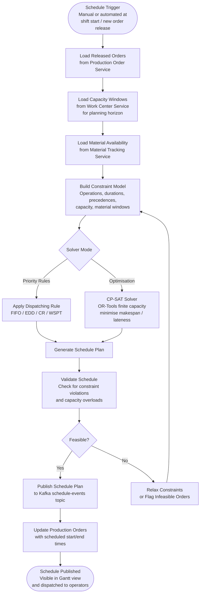
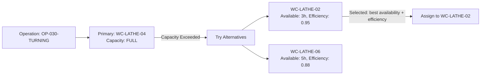
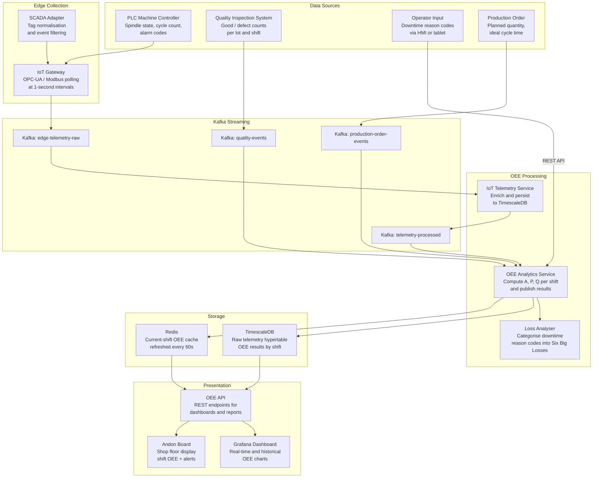
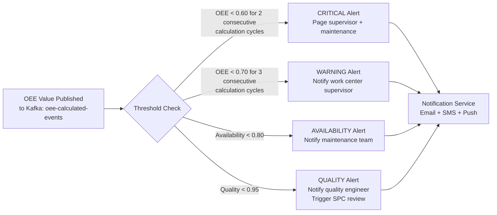
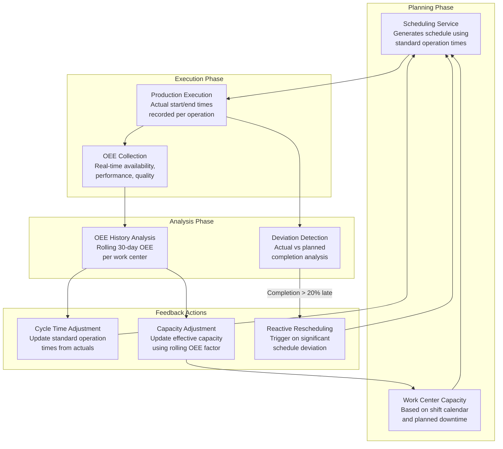
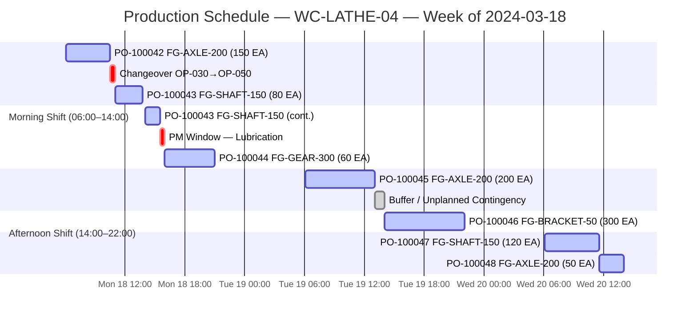

# Production Scheduling and OEE — Manufacturing Execution System

## Overview

This document describes the production scheduling algorithms, finite capacity scheduling (FCS) logic, and OEE (Overall Equipment Effectiveness) methodology used in the MES for discrete manufacturing. It covers the full pipeline from schedule computation to real-time OEE data collection, dashboard presentation, and the closed-loop feedback between schedule execution and OEE outcomes.

OEE is the primary KPI for manufacturing efficiency, measuring how effectively a work center converts planned production time into good-quality output. Scheduling decisions directly influence OEE by controlling which work is assigned where, in what sequence, and under what capacity constraints.

---

## Production Scheduling Algorithms

The MES Scheduling Service implements finite capacity scheduling using a constraint programming solver (Google OR-Tools CP-SAT). It ingests released production orders, evaluates work center capacity, and generates an optimised schedule that respects shift calendars, material availability, tooling constraints, and operator assignments.

### Scheduling Input Data Model

| Input                   | Source                        | Description                                                         |
|-------------------------|-------------------------------|---------------------------------------------------------------------|
| Production Orders       | Production Order Service      | Order IDs, routing, quantity, priority, and due dates               |
| Work Center Capacity    | Work Center Service           | Available hours per shift, shift patterns, planned downtime windows |
| Routing Steps           | Routing Master Data           | Operation sequence, standard times (setup + run), work center links |
| Material Availability   | Material Tracking Service     | Lot availability dates for raw materials and components             |
| Tool Availability       | Tool Management Master Data   | Tool type, available count, changeover time                         |
| Operator Shifts         | HR / Shift Calendar           | Operator skill-to-operation mapping, shift start/end times          |

### Scheduling Flow



---

## Schedule Optimisation

### Finite Capacity Scheduling

Finite capacity scheduling (FCS) enforces that no work center is assigned more work than its available capacity in any planning period. Each operation is modelled as an interval variable with:

- **Duration** = `setupTime + (runTimePerUnit × quantity)`
- **Earliest Start** = `max(materialReadyDate, orderReleaseDate)`
- **Latest End** = `orderDueDate` (hard or soft constraint depending on priority)
- **Resource** = work center (single or alternative)

The CP-SAT solver minimises a weighted objective function:

```
Minimise:  α × Σ(tardiness_i) + β × makespan + γ × Σ(setupChangeovers)
```

Where `α`, `β`, and `γ` are configurable weights allowing the planner to balance on-time delivery against makespan and setup efficiency.

### Dispatching Rules

For scenarios where full optimisation is too slow (large order backlogs, replanning within a shift), the scheduler falls back to priority-rule dispatching:

| Rule      | Full Name                          | Selection Criterion                                           | Best For                              |
|-----------|------------------------------------|---------------------------------------------------------------|---------------------------------------|
| FIFO      | First In, First Out                | Earliest order creation timestamp                             | General fairness, stable queues       |
| EDD       | Earliest Due Date                  | Earliest scheduled end date                                   | Minimising maximum tardiness          |
| CR        | Critical Ratio                     | `(DueDate − Now) / RemainingProcessingTime`; lowest ratio first| Balancing urgency and workload        |
| WSPT      | Weighted Shortest Processing Time  | `priority / processingTime`; highest ratio first              | High-priority, short-run orders first |
| SPT       | Shortest Processing Time           | Shortest estimated operation duration first                   | Maximising throughput on bottlenecks  |

### Alternative Work Centre Routing

When a primary work center is at full capacity or in downtime, the scheduler can assign operations to qualified alternative work centers:



---

## OEE Calculation Methodology

OEE is a standardised measure of manufacturing productivity introduced by Seiichi Nakajima as part of Total Productive Maintenance (TPM). It quantifies how effectively a work center uses its planned production time.

### OEE Formula

```
OEE = Availability × Performance × Quality
```

### Component Definitions

| Component    | Formula                                                            | Measures                                                     |
|--------------|--------------------------------------------------------------------|--------------------------------------------------------------|
| Availability | `Operating Time / Planned Production Time`                        | Time lost to unplanned and planned stoppages                 |
| Performance  | `(Ideal Cycle Time × Total Count) / Operating Time`               | Speed losses — running slower than ideal cycle time          |
| Quality      | `Good Count / Total Count`                                         | Defects, rework, and scrap reducing first-pass yield         |
| **OEE**      | `Availability × Performance × Quality`                            | **Overall ratio of good output to theoretical maximum**      |

Where:

- **Planned Production Time** = Shift Time − Planned Stops (scheduled breaks, planned maintenance)
- **Operating Time** = Planned Production Time − Unplanned Downtime (breakdowns, changeovers, material wait)
- **Ideal Cycle Time** = Theoretical minimum time to produce one unit (from engineering standard)
- **Total Count** = Total pieces produced (good + defective + rework)
- **Good Count** = Pieces meeting specification on first pass

---

## OEE Component Breakdown

### Availability Component

Availability captures the Six Big Loss categories related to **downtime**:

- **Unplanned Stoppages** — Equipment breakdowns, power failures, tooling failures
- **Setup and Changeover** — Time to switch between product variants or tooling
- **Minor Stoppages (threshold)** — Stoppages exceeding a configurable threshold (default 5 minutes) are classified as availability losses; shorter micro-stoppages are performance losses

```
Availability = Operating Time / Planned Production Time
             = (Planned Production Time − Downtime) / Planned Production Time
```

### Performance Component

Performance captures losses related to **speed**:

- **Reduced Speed** — Machine running below nameplate or standard rate
- **Minor Stoppages** — Brief interruptions (< 5 minutes) that do not require maintenance intervention
- **Idling** — Machine waiting for parts, operator, or upstream process within planned production time

```
Performance = (Ideal Cycle Time × Total Count) / Operating Time
```

Equivalently:

```
Performance = Actual Throughput Rate / Ideal Throughput Rate
```

### Quality Component

Quality captures losses from **defects**:

- **Startup Rejects** — Scrap produced during warm-up or changeover
- **Production Rejects** — Out-of-specification parts during steady-state production
- **Rework** — Parts requiring additional processing (counted as defects for OEE; may be recovered)

```
Quality = Good Count / Total Count
        = (Total Count − Defect Count) / Total Count
```

---

## OEE Calculation Examples

### Example 1 — Morning Shift, CNC Lathe

| Parameter                  | Value        | Notes                                          |
|----------------------------|--------------|------------------------------------------------|
| Shift Duration             | 480 min      | 8-hour morning shift                           |
| Planned Breaks             | 30 min       | Two 15-minute breaks                           |
| Planned Production Time    | 450 min      | 480 − 30                                       |
| Unplanned Downtime         | 38 min       | 24-min breakdown + 14-min material wait        |
| Operating Time             | 412 min      | 450 − 38                                       |
| **Availability**           | **0.916**    | 412 / 450                                      |
| Ideal Cycle Time           | 3.0 min/unit | Engineering standard for FG-AXLE-200           |
| Total Pieces Produced      | 118          | Actual count from machine counter              |
| Ideal Output at Op. Time   | 137.3 units  | 412 / 3.0                                      |
| **Performance**            | **0.860**    | (3.0 × 118) / 412                              |
| Good Pieces                | 116          | From quality inspection results                |
| Defect / Scrap Pieces      | 2            | OOS diameter, confirmed by quality             |
| **Quality**                | **0.983**    | 116 / 118                                      |
| **OEE**                    | **0.774**    | 0.916 × 0.860 × 0.983                          |

### Example 2 — Night Shift, Assembly Cell (World-Class Target)

| Parameter                  | Value        | Notes                                          |
|----------------------------|--------------|------------------------------------------------|
| Shift Duration             | 480 min      | 8-hour night shift                             |
| Planned Breaks             | 30 min       | Standard breaks                                |
| Planned Production Time    | 450 min      |                                                |
| Unplanned Downtime         | 13 min       | Single minor stoppage                          |
| Operating Time             | 437 min      | 450 − 13                                       |
| **Availability**           | **0.971**    | 437 / 450                                      |
| Ideal Cycle Time           | 4.5 min/unit | Assembly standard time                         |
| Total Pieces Produced      | 94           | Actual count                                   |
| **Performance**            | **0.968**    | (4.5 × 94) / 437                               |
| Good Pieces                | 93           | One rework identified                          |
| **Quality**                | **0.989**    | 93 / 94                                        |
| **OEE**                    | **0.929**    | 0.971 × 0.968 × 0.989                          |

### Example 3 — Low OEE Root Cause (Bottleneck Press)

| Parameter                  | Value        | Notes                                          |
|----------------------------|--------------|------------------------------------------------|
| Planned Production Time    | 450 min      |                                                |
| Unplanned Downtime         | 120 min      | 2× major hydraulic failures                   |
| Operating Time             | 330 min      |                                                |
| **Availability**           | **0.733**    | 330 / 450                                      |
| Ideal Cycle Time           | 2.0 min/unit |                                                |
| Total Pieces              | 140           | Running below standard rate                    |
| **Performance**            | **0.848**    | (2.0 × 140) / 330                              |
| Good Pieces                | 128          | High scrap due to die wear                     |
| **Quality**                | **0.914**    | 128 / 140                                      |
| **OEE**                    | **0.567**    | 0.733 × 0.848 × 0.914 — action required        |

---

## OEE Data Collection Pipeline



### Data Latency Targets

| Stage                              | Target Latency      | Mechanism                         |
|------------------------------------|---------------------|-----------------------------------|
| PLC signal to Kafka                | < 500ms             | OPC-UA polling at 1s, MQTT QoS 1  |
| Kafka to TimescaleDB               | < 2s                | Telemetry Service streaming write |
| OEE recalculation (current shift)  | Every 60 seconds    | Scheduled batch in OEE Service    |
| OEE API response (cached)          | < 50ms              | Redis cache TTL = 60s             |
| OEE API response (DB query)        | < 500ms             | TimescaleDB continuous aggregates |
| Andon Board refresh                | Every 30 seconds    | Frontend polling OEE API          |

---

## OEE Dashboards and Alerts

### Dashboard Views

| View                   | Audience       | Refresh Rate | Content                                                             |
|------------------------|----------------|--------------|---------------------------------------------------------------------|
| Current Shift OEE      | Operators       | 30s          | Live Availability, Performance, Quality gauges; current downtime    |
| Shift Summary          | Supervisors     | End of shift | OEE per work center; loss Pareto; shift comparison vs target        |
| Weekly OEE Trend       | Production Mgr  | Daily        | 7-day OEE trend per work center; world-class benchmark overlay      |
| Loss Pareto            | Maintenance     | Daily        | Top 10 downtime codes by total minutes; Six Big Loss categorisation |
| Plant OEE Heatmap      | Plant Director  | Daily        | All work centers colour-coded by OEE band                          |

### OEE Colour Bands

| OEE Range  | Status         | Colour | Action Required                                               |
|------------|----------------|--------|---------------------------------------------------------------|
| ≥ 0.85     | World Class    | Green  | Sustain; investigate further improvement opportunities        |
| 0.70–0.84  | Good           | Teal   | Monitor; target incremental improvement                       |
| 0.60–0.69  | Average        | Amber  | Investigate root causes; improvement plan required            |
| < 0.60     | Poor           | Red    | Immediate action; escalate to production manager              |

### Alert Rules



---

## Schedule-OEE Feedback Loop

The MES implements a closed-loop feedback mechanism where OEE outcomes influence future scheduling decisions. This is a critical differentiator from static scheduling tools.



### Effective Capacity Calculation

When scheduling future orders, the scheduler uses OEE-adjusted capacity rather than theoretical capacity:

```
Effective Capacity = Theoretical Capacity × Rolling OEE (30-day average)
```

For example, if WC-LATHE-04 has a theoretical capacity of 20 hours/day and a 30-day rolling OEE of 0.78:

```
Effective Capacity = 20h × 0.78 = 15.6 hours/day
```

This prevents over-scheduling that leads to chronic late completions, which in turn further degrades OEE through rushed changeovers and quality pressure.

### Sample Production Schedule — Gantt Chart



---

## Industry Benchmarks

Understanding where a plant's OEE sits relative to industry benchmarks guides improvement prioritisation and investment decisions.

### World-Class OEE Benchmarks by Sector

| Manufacturing Sector                | Typical OEE Range | World-Class Target | Primary Loss Driver             |
|-------------------------------------|-------------------|--------------------|---------------------------------|
| Automotive (discrete machining)     | 0.65 – 0.80       | ≥ 0.85             | Changeover time (Availability)  |
| Automotive (assembly)               | 0.70 – 0.85       | ≥ 0.88             | Minor stoppages (Performance)   |
| Aerospace (precision machining)     | 0.50 – 0.70       | ≥ 0.75             | Setup time, tool changes (Avail)|
| Electronics (PCB assembly)          | 0.75 – 0.88       | ≥ 0.90             | Quality / first-pass yield      |
| General discrete manufacturing      | 0.55 – 0.75       | ≥ 0.85             | Mixed                           |
| Pharmaceutical (discrete packing)   | 0.50 – 0.70       | ≥ 0.80             | Changeover and cleaning (Avail) |

> **Note:** An OEE of 0.85 is considered world-class for discrete manufacturing (Nakajima, 1988). New facilities or those early in their improvement journey typically operate at 0.55–0.65.

### OEE Component Benchmarks

| Component    | Poor       | Average    | Good       | World Class |
|--------------|------------|------------|------------|-------------|
| Availability | < 0.75     | 0.75–0.85  | 0.85–0.92  | ≥ 0.92      |
| Performance  | < 0.65     | 0.65–0.80  | 0.80–0.90  | ≥ 0.95      |
| Quality      | < 0.90     | 0.90–0.96  | 0.96–0.99  | ≥ 0.99      |
| **OEE**      | **< 0.50** | **0.50–0.65** | **0.65–0.80** | **≥ 0.85** |

### OEE Improvement Impact Model

The following table shows the theoretical additional good output achievable from individual component improvements for a single 8-hour shift producing at 3-min ideal cycle time:

| Scenario                          | Availability | Performance | Quality | OEE   | Good Units | Gain vs Baseline |
|-----------------------------------|--------------|-------------|---------|-------|------------|------------------|
| Baseline (current)                | 0.916        | 0.861       | 0.983   | 0.775 | 116        | —                |
| Eliminate changeover losses       | 0.960        | 0.861       | 0.983   | 0.812 | 122        | +6 units (+5.2%) |
| Increase to ideal speed           | 0.916        | 0.950       | 0.983   | 0.855 | 128        | +12 units (+10.3%)|
| Zero defects (first-pass yield)   | 0.916        | 0.861       | 1.000   | 0.789 | 118        | +2 units (+1.7%) |
| All three improvements combined   | 0.960        | 0.950       | 1.000   | 0.912 | 137        | +21 units (+18.1%)|

This analysis demonstrates that **Performance** is the highest-leverage improvement opportunity for the example work center, consistent with the industry observation that speed losses are frequently underestimated relative to downtime.
