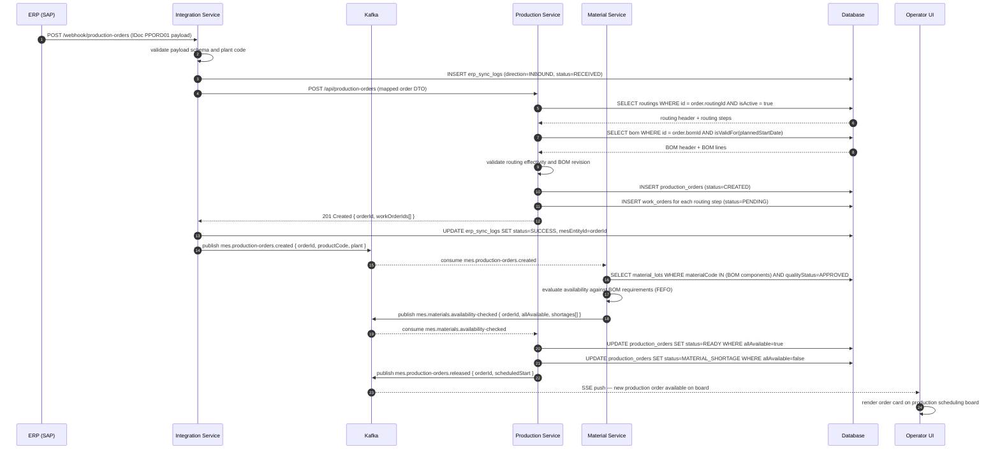
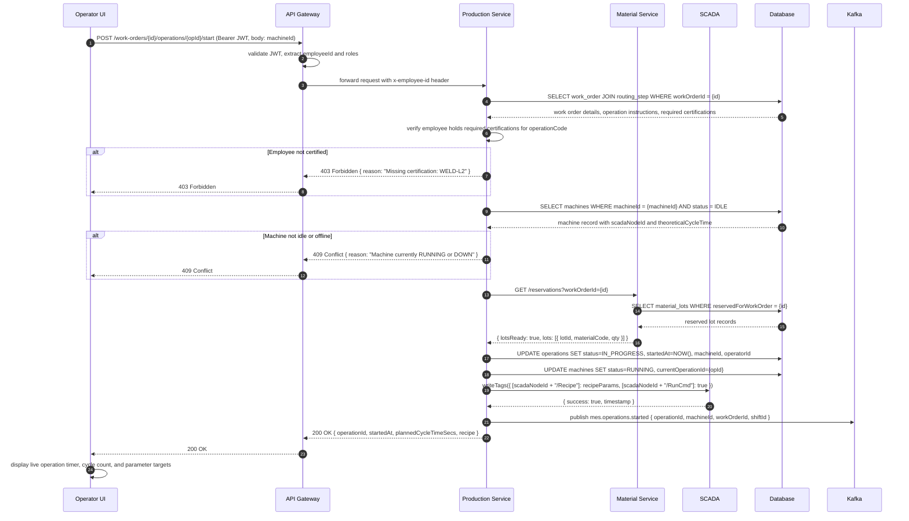
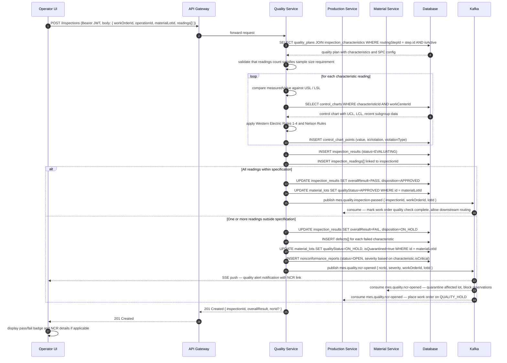
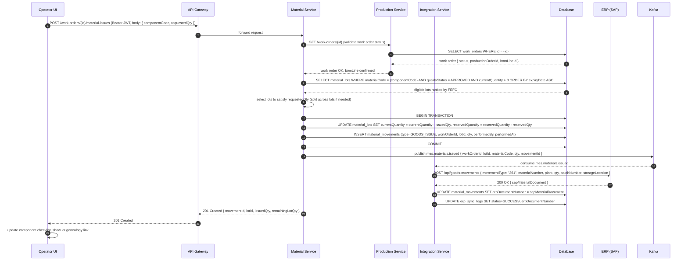
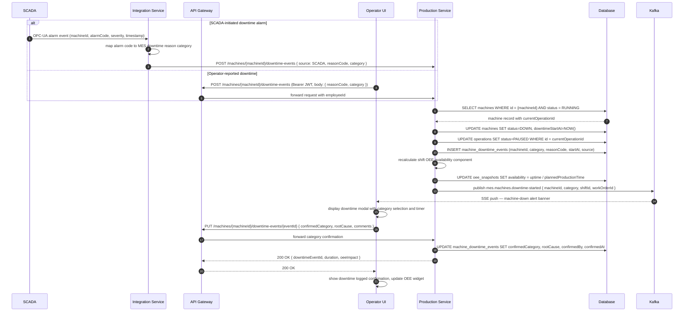
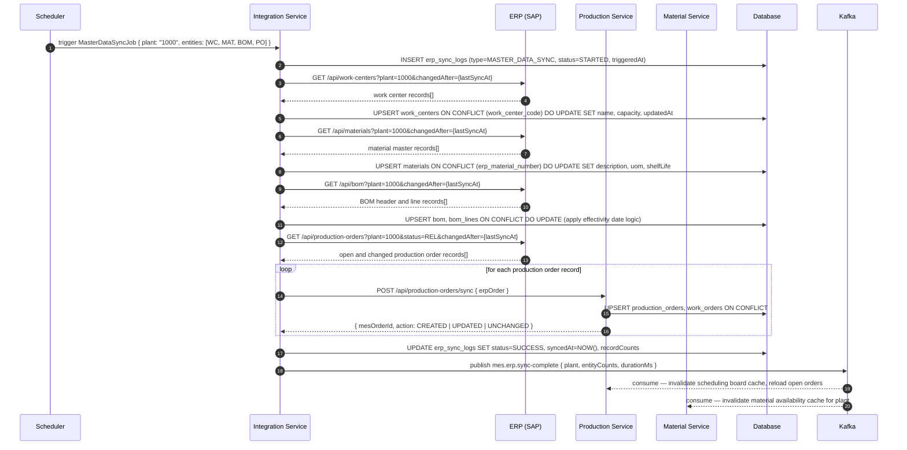
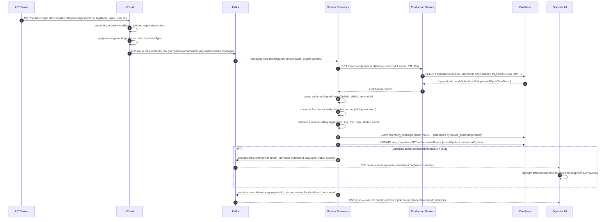

# Sequence Diagrams — Manufacturing Execution System

## Overview

This document details the interaction sequences for the Manufacturing Execution System's most critical workflows. Each diagram models the message flow between actors and services for a specific use case using UML sequence diagram notation rendered via Mermaid.

Participants across diagrams include the operator-facing UI, API Gateway (handles JWT authentication and request routing), and five backend microservices — Production Service, Quality Service, Material Service, and Integration Service. External systems include ERP (SAP), SCADA (OPC-UA server), IoT Hub (device management layer), Kafka (event streaming backbone), and Database (PostgreSQL with logical per-service schemas).

All service-to-service calls are synchronous REST unless explicitly marked as Kafka publish/subscribe. JWT tokens are propagated through the API Gateway; downstream services validate claims using a shared public key ring. All database mutations are wrapped in explicit transactions where data consistency requires it.

---

## Production Order Release Sequence

When the Integration Service receives a new production order pushed from SAP via IDoc/RFC webhook, it validates the payload, maps it to the MES domain model, invokes the Production Service to persist and decompose the order into work orders, and emits domain events that trigger downstream material availability checks.

---

## Operation Execution Sequence

The operator scans a work order barcode to begin a specific operation. The system verifies machine availability, employee authorization against required certifications, and material readiness before activating the operation. The current recipe is streamed to the PLC via the SCADA adapter, and a domain event is emitted for OEE tracking.

---

## Quality Inspection Sequence

On completing an operation that has a mandatory quality plan, the operator submits inspection readings through the UI. The Quality Service evaluates each reading against spec and control limits, updates the relevant SPC control charts, flags rule violations, and conditionally creates an NCR. Downstream services react to quality outcomes via Kafka events.

---

## Material Issue Sequence

Before production can start, components defined on the BOM are issued from inventory to the work order. The Material Service selects eligible lots using a FEFO strategy, validates quantity availability, records the movements, and triggers a goods issue confirmation to SAP via the Integration Service.

---

## Machine Downtime Reporting Sequence

A downtime event can be initiated automatically from a SCADA alarm or manually reported by an operator. In both cases the system records the event, updates machine and operation state, recalculates shift OEE availability, and notifies the production team. The operator subsequently confirms the root cause category to enable accurate loss analysis.

---

## ERP Synchronization Sequence

A scheduled job triggers incremental master data synchronization between SAP and the MES. Work center capacities, material master records, and BOM structures are synchronized first. Open production orders are then delta-synced based on the last successful sync timestamp. The integration service emits a completion event that allows dependent services to refresh their caches.

---

## IoT Data Ingestion Sequence

Telemetry streams arrive from IoT-enabled machines at high frequency (up to 1 Hz per device). The IoT Hub validates device registration and routes messages to Kafka. A stream processor enriches each reading with work order context, applies anomaly detection, computes rolling aggregates for OEE performance calculations, and persists results to the time-series database partition. Anomalies trigger real-time alerts to the operator UI.

