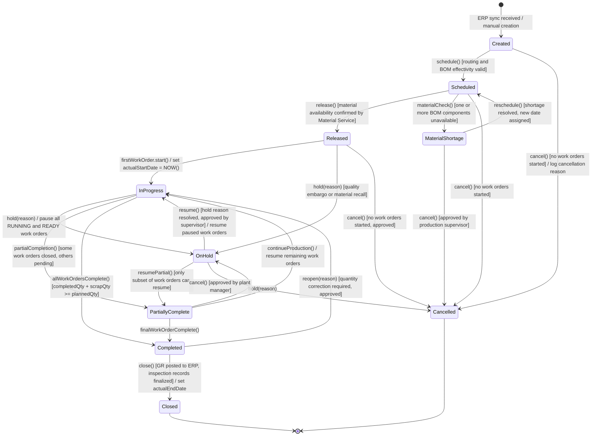
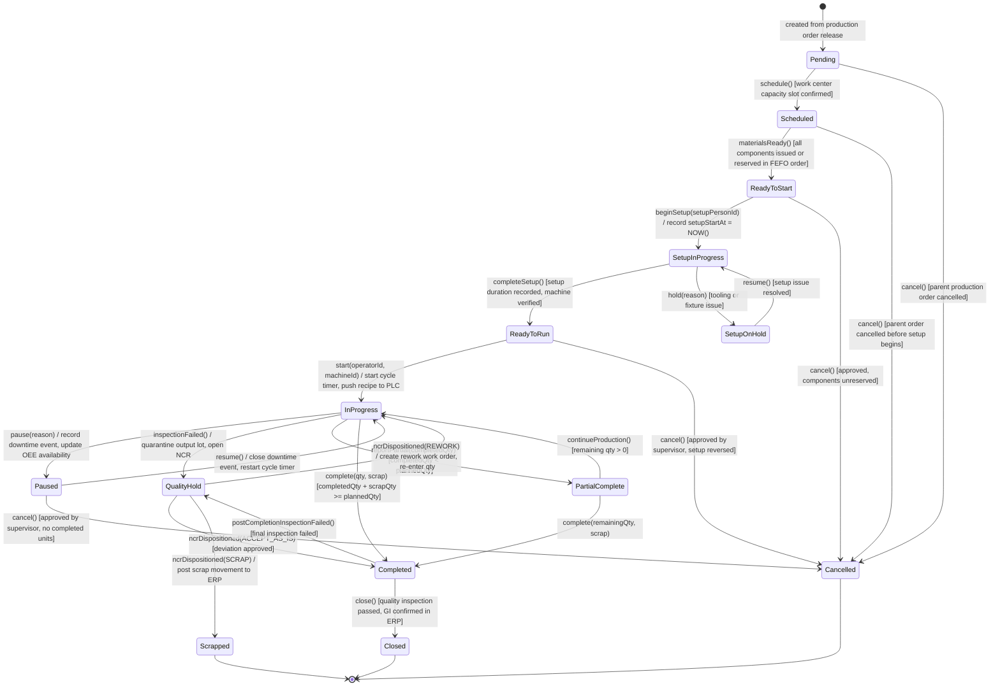
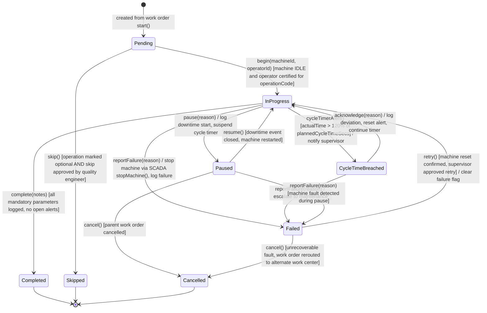
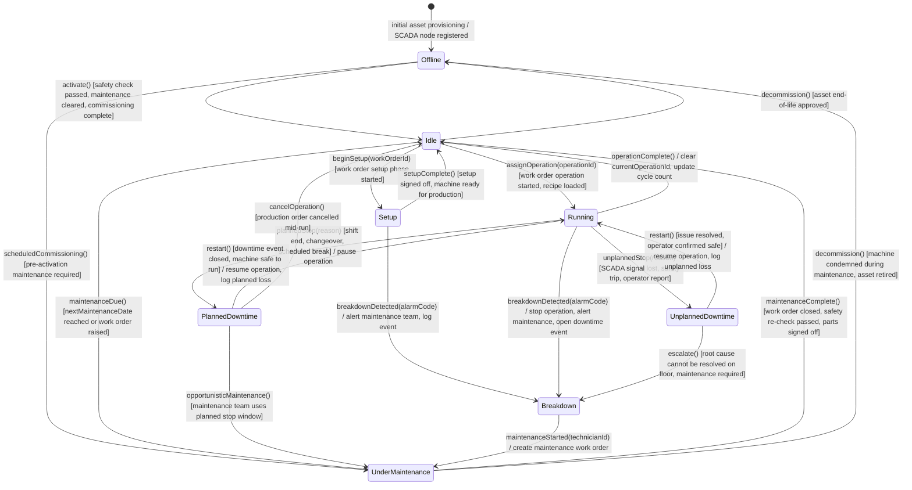
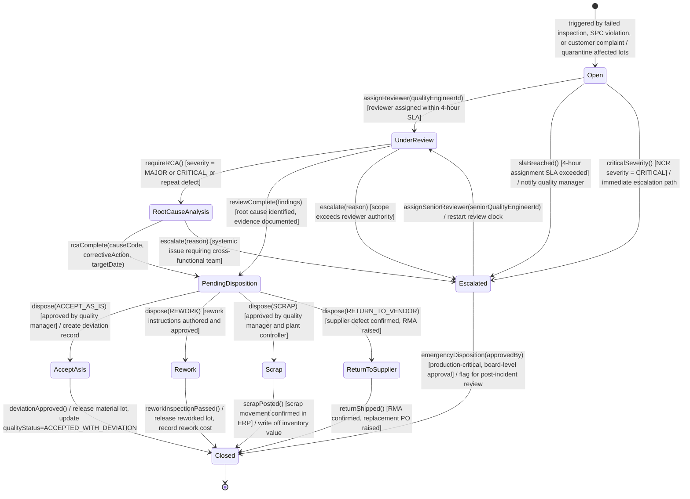
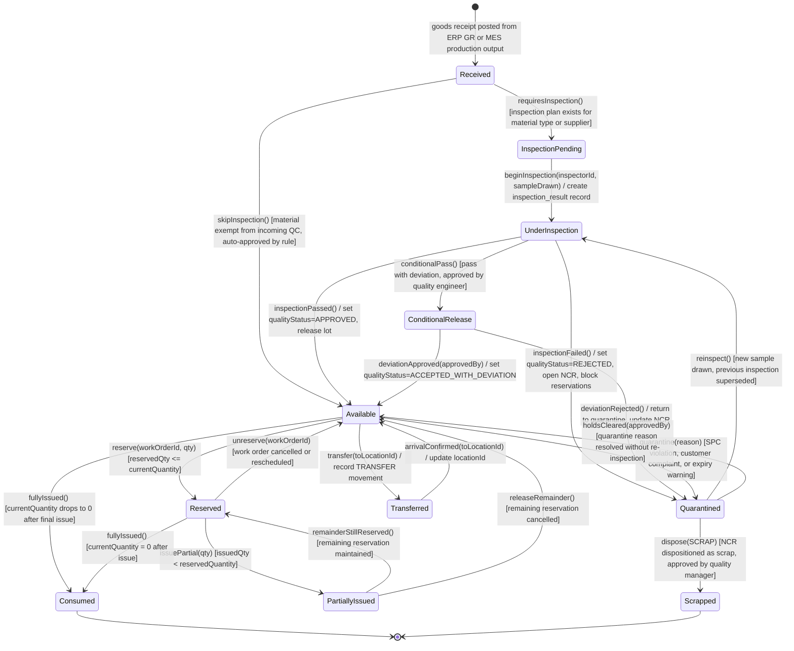

# State Machine Diagrams — Manufacturing Execution System

## Overview

This document specifies the state machines governing the lifecycle of all major MES entities. State machines are the authoritative source of truth for the `status` fields in the database schema and the transition validation logic in service layers. They enforce that entities can only move between valid states and that required side effects (guard conditions and entry actions) are satisfied before a transition is allowed.

Each diagram uses Mermaid `stateDiagram-v2` notation. Guard conditions are expressed in square brackets `[condition]`. Actions triggered on a transition are written after a forward-slash `/`. Composite states group logically related sub-states where the entity behaviour diverges into sub-workflows.

Allowed status values for each entity are derived directly from these diagrams and enforced via `CHECK` constraints in the database schema and enum validation in service request handlers.

---

## Production Order State Machine

A production order progresses from initial creation through scheduling, active execution, hold/resume cycles, and eventual closure. Cancellation is permitted only when no work orders have been started. The `PartiallyComplete` state captures the common scenario where some operations are done but others are still in progress, allowing the order to resume without a full reset.

**Status values:** `CREATED`, `SCHEDULED`, `MATERIAL_SHORTAGE`, `RELEASED`, `IN_PROGRESS`, `PARTIALLY_COMPLETE`, `ON_HOLD`, `COMPLETED`, `CLOSED`, `CANCELLED`

---

## Work Order State Machine

Work orders represent individual routing steps within a production order. They advance through scheduling, setup preparation, active execution, and completion, with provisions for rework loops initiated by failed quality inspections and quality holds placed on output material. A work order can only be cancelled while it has not yet started active production.

**Status values:** `PENDING`, `SCHEDULED`, `READY_TO_START`, `SETUP_IN_PROGRESS`, `SETUP_ON_HOLD`, `READY_TO_RUN`, `IN_PROGRESS`, `PAUSED`, `QUALITY_HOLD`, `PARTIAL_COMPLETE`, `COMPLETED`, `CLOSED`, `CANCELLED`, `SCRAPPED`

---

## Operation State Machine

Operations are the finest-grained executable units in the MES, bound to a specific machine and operator. Cycle time monitoring occurs continuously in the `InProgress` state. A cycle time breach triggers an alert sub-state that requires operator acknowledgement before production continues. Failed operations require explicit resolution before a retry is permitted to prevent repeated machine damage or scrap generation.

**Status values:** `PENDING`, `IN_PROGRESS`, `PAUSED`, `CYCLE_TIME_BREACHED`, `FAILED`, `COMPLETED`, `SKIPPED`, `CANCELLED`

---

## Machine State Machine

A machine transitions between operational modes based on production events, maintenance schedules, and SCADA signals. Accurate and timely machine state recording is the primary driver of OEE availability calculations. Breakdown detection can originate from a SCADA alarm subscription or from an operator report, triggering immediate maintenance notification.

**Status values:** `OFFLINE`, `IDLE`, `SETUP`, `RUNNING`, `PLANNED_DOWNTIME`, `UNPLANNED_DOWNTIME`, `BREAKDOWN`, `UNDER_MAINTENANCE`

---

## Quality Hold State Machine

A quality hold is placed on a production order, work order, or material lot when an inspection fails, an SPC rule violation is detected, or a customer complaint is received. The hold must pass through a formal review and disposition workflow before affected material can be released or scrapped. SLA timers govern review and disposition deadlines; breaches escalate automatically.

**Status values:** `OPEN`, `UNDER_REVIEW`, `ROOT_CAUSE_ANALYSIS`, `PENDING_DISPOSITION`, `ACCEPT_AS_IS`, `REWORK`, `SCRAP`, `RETURN_TO_SUPPLIER`, `ESCALATED`, `CLOSED`

---

## Material Lot State Machine

A material lot tracks the physical disposition of a quantity of material from initial goods receipt through consumption or final disposition. Quality status gates all consumption events. Quarantine is a reversible safety hold that can be resolved by re-inspection. Lot splits and merges generate child and sibling lots, preserving genealogy links throughout all transitions.

**Status values:** `RECEIVED`, `INSPECTION_PENDING`, `UNDER_INSPECTION`, `CONDITIONAL_RELEASE`, `AVAILABLE`, `RESERVED`, `PARTIALLY_ISSUED`, `TRANSFERRED`, `QUARANTINED`, `CONSUMED`, `SCRAPPED`
