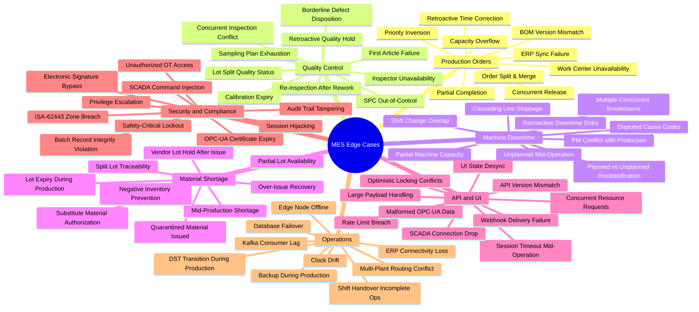
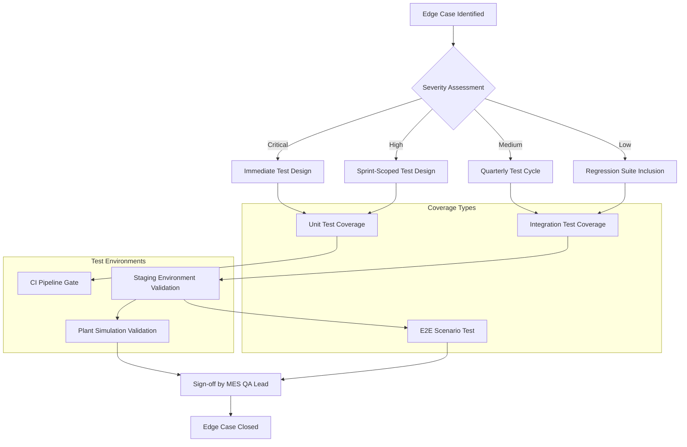
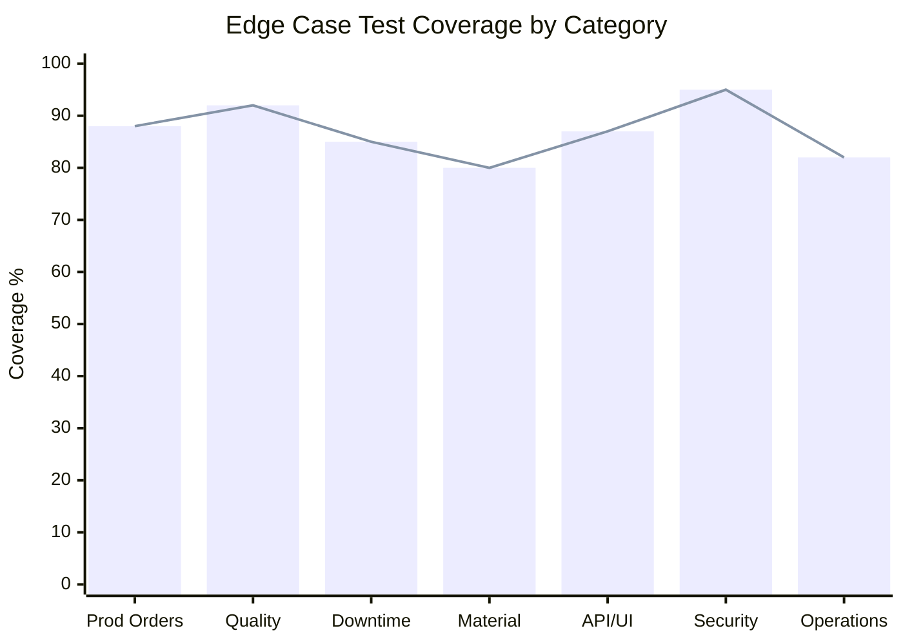

# Edge Cases — Manufacturing Execution System

## Overview

This directory contains structured edge-case documentation for the Manufacturing Execution System (MES) serving discrete manufacturing operations. Edge cases represent boundary conditions, failure modes, and exceptional states that the system must handle correctly to maintain production continuity, data integrity, regulatory compliance, and operator safety.

Each document covers a functional domain and follows a consistent structure: scenario description, trigger conditions, system behavior, expected resolution, and a test case table with pass/fail criteria. These documents serve as the authoritative reference for QA engineers, developers, and business analysts validating MES behavior under non-nominal conditions.

The MES integrates with SAP ERP, SCADA/OPC-UA systems, Kafka-based IoT event streams, edge computing nodes, and plant-floor terminals. Edge cases span all of these integration boundaries as well as core MES functions including production order management, quality control, OEE calculation, material tracking, and traceability.

---

## Edge Case Categories

---

## Testing Approach

Edge case testing for the MES follows a layered strategy that mirrors the system's integration complexity. Tests are executed at unit, integration, and end-to-end levels, with separate test environments representing the plant-floor topology.

### Testing Layers

**Unit Tests** validate individual service methods and state machine transitions in isolation using mocked dependencies. These are mandatory for all Critical and High severity edge cases.

**Integration Tests** validate behavior across service boundaries — for example, MES ↔ SAP ERP, MES ↔ OPC-UA broker, MES ↔ Kafka topics. Integration tests run in a dedicated staging environment with simulated PLC/SCADA responses.

**End-to-End Scenario Tests** exercise complete workflows from operator action through IoT signal ingestion to ERP confirmation. These are executed in a plant simulation environment with hardware-in-the-loop capability.

**Chaos and Fault Injection Tests** specifically target downtime, connectivity loss, database failover, and clock synchronization scenarios. These are run on a dedicated resilience testing schedule, not in CI pipelines.

**Compliance Tests** (FDA 21 CFR Part 11, ISA-62443) are executed against a dedicated compliance test environment and documented with audit evidence for regulatory submissions.

---

## Edge Case Severity Matrix

| Category | Severity | Business Impact | Frequency | Test Coverage |
|---|---|---|---|---|
| Production Order Management | Critical | Production stoppage, ERP data inconsistency, missed delivery commitments | Medium — occurs under high-load scheduling or ERP connectivity events | Unit + Integration + E2E |
| Quality Control | Critical | Nonconforming product shipped, regulatory non-compliance, customer escapes | Low-Medium — triggered by process variation or equipment issues | Unit + Integration + Compliance |
| Machine Downtime | High | OEE degradation, inaccurate maintenance cost allocation, shift KPI distortion | High — daily occurrence on large shop floors | Unit + Integration + E2E |
| Material Shortage | High | Production starvation, work-in-progress stranding, ERP inventory discrepancy | Medium — driven by supply chain variability | Unit + Integration |
| API and UI | High | Operator data loss, stale UI leading to incorrect decisions, integration failures with SCADA/ERP | Medium — under concurrent user load or network events | Unit + Integration + Load |
| Security and Compliance | Critical | Regulatory audit failure, OT network compromise, tampered batch records | Low — but consequences are severe and may be irreversible | Unit + Penetration + Compliance |
| Operations | High | Data loss during failover, incorrect shift metrics, production continuity under infrastructure events | Low-Medium — infrastructure and temporal edge cases | Integration + Chaos + E2E |

---

## Coverage Summary

### Documents in This Directory

| File | Domain | Edge Cases Covered |
|---|---|---|
| `production-order-management.md` | Production scheduling, ERP sync, BOM management | 9 scenarios |
| `quality-control.md` | SPC, inspection, lot disposition, calibration | 10 scenarios |
| `machine-downtime.md` | Downtime capture, OEE, maintenance integration | 9 scenarios |
| `material-shortage.md` | Inventory, lot management, material substitution | 9 scenarios |
| `api-and-ui.md` | REST API, UI state, OPC-UA, SCADA, webhooks | 10 scenarios |
| `security-and-compliance.md` | OT security, ISA-62443, FDA 21 CFR Part 11 | 10 scenarios |
| `operations.md` | Shift management, infrastructure resilience, multi-plant | 9 scenarios |

### Triage and Escalation

All newly discovered edge cases must be triaged within one business day. Critical severity issues blocking production or compliance activities escalate immediately to the MES Platform Lead and Production IT Manager. The triage process follows this path:

1. Edge case reported via internal issue tracker with domain tag
2. Severity assigned using the matrix above as a baseline
3. Assigned to owning squad (Core MES, Integration, Platform, Security)
4. Test case authored and linked to the scenario document
5. Fix verified in staging before production deployment
6. Document updated with confirmed system behavior and resolution

### Revision History

| Version | Date | Author | Changes |
|---|---|---|---|
| 1.0 | 2025-01-15 | MES Platform Team | Initial documentation for all seven edge case domains |
| 1.1 | 2025-03-10 | MES QA Lead | Added security/compliance scenarios for ISA-62443 alignment |
| 1.2 | 2025-06-01 | Integration Squad | Updated API/UI section for OPC-UA 2.0 and Kafka consumer lag scenarios |
