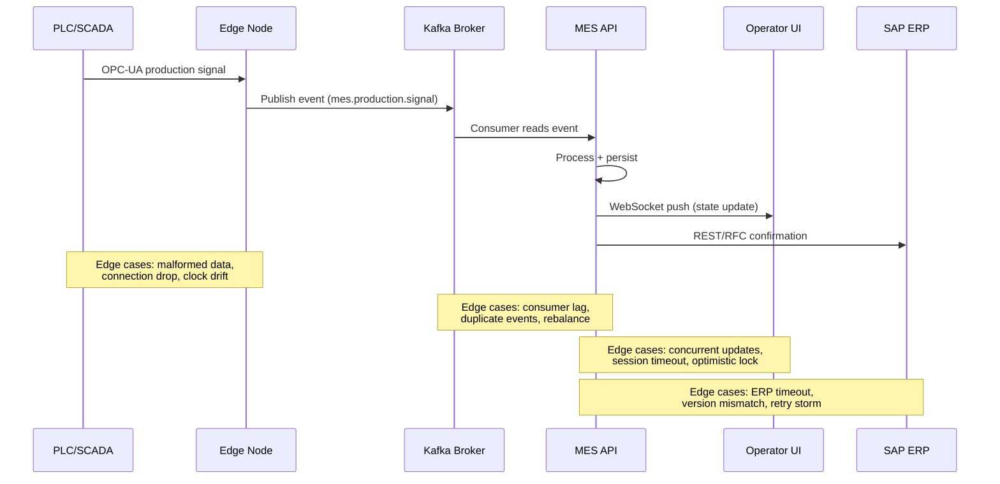

# Edge Cases — API and UI

## Overview

The MES exposes a REST API consumed by the plant-floor UI, ERP integration adapters, SCADA/OPC-UA data collection services, mobile operator apps, and third-party analytics tools. The UI is a real-time single-page application that displays live production status, operator instructions, and quality data.

Edge cases in this domain arise from the inherently concurrent, high-throughput nature of manufacturing environments — multiple operators, automated systems, and integration layers all interact with shared resources simultaneously. Reliability and data consistency under these conditions are critical: a stale OEE display or a lost production confirmation can directly impact production decisions and regulatory traceability.

---

## Edge Case Scenarios

### Concurrent API Requests for Same Resource

**Scenario Description**

Two or more API clients (operator terminals, ERP integration adapter, automated systems) submit state-changing requests to the same MES resource simultaneously — for example, two terminals both trying to start the same production order operation, or two schedulers modifying the same work center queue.

**Trigger Conditions**

- Two operators at different terminals both start the same operation within milliseconds
- ERP integration adapter retries a request that is still being processed
- Automated scheduling engine and manual scheduler both modify the same work center queue simultaneously

**System Behavior**

All mutable MES resources carry an `ETag` header (hash of the current resource version). Write requests (`PATCH`, `PUT`, `POST` for state transitions) must include an `If-Match` header with the current ETag. The server validates the ETag before applying the change. If the ETag has changed since the client read it (indicating a concurrent modification), the server returns HTTP 409 Conflict with the current resource state in the response body.

For idempotent state transitions (e.g., releasing an order that is already released), the server returns HTTP 200 with the current state rather than 409, allowing safe retries. Non-idempotent operations (operation confirmations, goods issues) require unique `X-Idempotency-Key` headers to enable safe retry without duplication.

**Expected Resolution**

Exactly one of the concurrent requests succeeds. The other(s) receive a conflict response and must re-read the resource, re-evaluate their intent, and resubmit if still valid. No data corruption, duplicate confirmations, or split-brain states occur.

**Test Cases**

| ID | Input | Expected Output | Pass/Fail Criteria |
|---|---|---|---|
| API-CON-01 | Two simultaneous `PATCH /operations/OP-001/start` from different clients | First succeeds (200); second returns 409 with current ETag | Exactly one `operation.started` event in audit log; no duplicate work center allocation |
| API-CON-02 | Client retries after 409; re-reads resource; resubmits with new ETag | Retry succeeds or client determines no action needed based on current state | No infinite retry loop; client resolves based on current state |
| API-CON-03 | Idempotent call: `PATCH /orders/ORD-001/release` on already-released order | 200 returned with current released state; no duplicate release event | No second `order.released` event; response body = current state |
| API-CON-04 | Same operation confirmation submitted twice with same idempotency key | First confirmation accepted; second returns cached 200 without reprocessing | One confirmation record in database; one ERP GR document created |

---

### Optimistic Locking Conflicts

**Scenario Description**

An operator reads production order details, spends time reviewing and editing them in the UI, then submits changes — but another user or automated process modified the same record during that review period, causing a locking conflict when the first user submits.

**Trigger Conditions**

- Operator opens a production order edit form; 5 minutes later, ERP sync updates the same record; operator submits form
- Production planner has a work center schedule open for modification while an automatic reschedule runs
- Two schedulers both open the same order for priority change at the same time

**System Behavior**

The MES UI includes the current ETag in all form state and includes it in the submit request as `If-Match`. When the server detects a version mismatch, it returns 409 with a structured conflict response body containing:
- `conflictType: VERSION_MISMATCH`
- `currentVersion`: current ETag
- `currentState`: current resource state
- `yourChanges`: the client's attempted changes
- `conflictingChanges`: the delta between the client's base version and the current version

The UI presents a diff view to the operator, highlighting the fields that changed underneath them, and offers a merge or override dialog. The operator can merge (apply their changes on top of the current state), accept the current state (discard their changes), or override (force their changes, replacing the current state with an audit record of the forced override).

**Expected Resolution**

The operator makes an informed decision about how to resolve the conflict. The resolution is applied with a full audit trail. No silent data loss or unintended overwrites occur.

**Test Cases**

| ID | Input | Expected Output | Pass/Fail Criteria |
|---|---|---|---|
| API-OLC-01 | Operator edits order priority; ERP sync updates quantity during edit | Submit returns 409; conflict diff shows quantity changed by ERP sync | UI displays diff with ERP change highlighted; operator prompted to resolve |
| API-OLC-02 | Operator selects merge (keep priority change, accept new quantity) | Merged state submitted and accepted; audit record notes merge resolution | Audit record includes original state, conflicting change, and merge decision |
| API-OLC-03 | Operator selects override (force their original changes) | Override applied; current-state fields replaced; override audit record created | Override record includes reason field (required for override); approver if required |
| API-OLC-04 | Automated scheduler conflicts with manual planner edit | Automated scheduler backs off and retries after conflict (exponential backoff) | Scheduler retry does not indefinitely conflict; eventual convergence within 5 retries |

---

### Session Timeout Mid-Operation

**Scenario Description**

An operator's UI session expires while they are mid-operation — either during active production data entry, in the middle of a quality inspection form, or while waiting for a long-running process to complete.

**Trigger Conditions**

- Operator session inactivity timeout (default: 30 minutes) triggered while form is open
- Operator forgets to log out; plant-floor terminal times out between operator shifts
- Network interruption causes session cookie to expire before reconnection

**System Behavior**

Session expiry is handled differently for passive (read-only) views and active (write) operations:

**Read-only views:** On session expiry, the UI redirects to the login page. No data loss occurs. After re-authentication, the user is redirected to their previous view.

**Active operations in progress:** If an operation has been started (status `IN_PROGRESS`) and the operator's session expires, the operation is NOT automatically stopped or cancelled. The work center remains in `IN_PROGRESS` status. A `SESSION_TIMEOUT_DURING_OPERATION` alert is sent to the production supervisor. The operation can be resumed by any authorized operator who re-authenticates on the terminal.

**Forms with unsaved data (inspections, confirmations):** The UI attempts to auto-save form state to browser localStorage on a 30-second interval. On session expiry, the saved state is presented to the operator after re-authentication, allowing them to continue without data loss. If auto-save fails (network partition), the operator is warned that unsaved data may be lost.

**Expected Resolution**

Operations in progress continue safely. The supervisor is aware of the session loss. After re-authentication, the operator either resumes using auto-saved state or re-enters data. No phantom operations or data corruption result from the timeout.

**Test Cases**

| ID | Input | Expected Output | Pass/Fail Criteria |
|---|---|---|---|
| API-STO-01 | Session expires while operation status is `IN_PROGRESS` | Operation remains `IN_PROGRESS`; supervisor alerted | Alert includes operator ID, terminal ID, operation ID, and session expiry timestamp |
| API-STO-02 | Session expires with half-completed inspection form | UI restores auto-saved form state after re-authentication | Auto-saved state loaded; `RESTORED_FROM_AUTOSAVE` indicator shown on form |
| API-STO-03 | Auto-save failed due to network partition; session times out | Warning displayed after re-auth: unsaved data lost; user must re-enter | Loss warning references specific form and last successful save timestamp |
| API-STO-04 | Different operator re-authenticates on same terminal | Operation visible to new operator; new operator can resume or escalate | Operator transition captured in operation audit trail with both user IDs |

---

### Large Payload Handling

**Scenario Description**

An API request contains an unusually large payload — for example, a bulk production order import from ERP containing thousands of orders, or a bulk operation confirmation upload from a disconnected edge device that has been offline for several hours.

**Trigger Conditions**

- ERP MRP run releases 2,000 production orders in a single batch
- Edge node reconnects after 4 hours offline and uploads 10,000 buffered operation events
- Bulk material issue upload contains 500 line items from a paper-based offline period
- Reporting API request returns a result set of 50,000 rows without pagination

**System Behavior**

The MES API enforces payload size limits per endpoint (default: 1MB for standard endpoints, 10MB for designated bulk endpoints). Requests exceeding the limit are rejected with HTTP 413 Payload Too Large, including the limit and the received size in the response.

For legitimate bulk operations, the API provides dedicated bulk endpoints that accept paginated batches (default: 500 records per batch). Bulk operations are processed asynchronously — the client receives HTTP 202 Accepted with a `bulkOperationId`. The client polls `GET /bulk-operations/{id}` to check processing status. Bulk operations are processed in transactions per batch (not one mega-transaction) to prevent a single record error from failing the entire batch. Failed records are reported individually with their error codes.

Read endpoints enforce pagination via `limit` and `cursor` parameters. Requests without pagination on large collections return a 400 error with pagination instructions.

**Expected Resolution**

Bulk operations are processed reliably without overwhelming the database or causing API timeouts. Failed individual records are identified without affecting successful records. The client receives a complete processing report.

**Test Cases**

| ID | Input | Expected Output | Pass/Fail Criteria |
|---|---|---|---|
| API-LPH-01 | Single request to create 2,000 orders as one payload | 413 if over size limit; 400 with pagination guidance if using non-bulk endpoint | Error response includes max payload size and bulk endpoint URL |
| API-LPH-02 | Bulk endpoint receives 500-order batch | 202 Accepted with `bulkOperationId`; async processing begins | Processing begins within 5 seconds; status queryable via bulk operation endpoint |
| API-LPH-03 | Bulk batch of 500; records 47 and 203 have validation errors | 497 records processed successfully; 3 reported with individual error codes | Partial success clearly reported; successful records committed; failed records not blocking |
| API-LPH-04 | Read endpoint called without pagination on 50,000 row result | 400 Bad Request with pagination instructions | Response includes `maxPageSize`, `cursorParam` name, and example request |

---

### UI State Desync from Server

**Scenario Description**

The MES operator UI displays stale data that no longer reflects the actual server state — for example, showing a production order as `IN_PROGRESS` when the server has already moved it to `COMPLETED`, or displaying incorrect OEE metrics due to a WebSocket disconnection.

**Trigger Conditions**

- WebSocket connection drops silently; UI does not detect the disconnection immediately
- Browser tab is in the background and misses push updates
- UI receives a partial WebSocket message due to a network blip
- Server restarts and clients' WebSocket connections are dropped without proper close frames

**System Behavior**

The MES UI implements a WebSocket connection health monitoring protocol:
- **Heartbeat:** Client sends a `PING` frame every 15 seconds. If no `PONG` is received within 5 seconds, the connection is considered stale.
- **Reconnect:** On detected disconnection, the UI automatically attempts reconnect with exponential backoff (1s, 2s, 4s, up to 30s max).
- **State resync:** Upon reconnect, the UI fetches the current full state of all displayed resources via REST API (not relying on the WebSocket event stream to catch up). This guarantees consistency regardless of how many events were missed.
- **Stale indicator:** If the UI detects it has been disconnected for more than 60 seconds, a `DATA_MAY_BE_STALE` banner is displayed to the operator until a successful resync is confirmed.

Critical actions (operation start/stop, quality decisions, material issue) require the UI to confirm a fresh resource state (recent REST GET) before enabling the action button, regardless of WebSocket state.

**Expected Resolution**

The UI recovers from disconnection without operator intervention. Stale states are immediately apparent through the banner. Critical actions are guarded against stale-state decisions.

**Test Cases**

| ID | Input | Expected Output | Pass/Fail Criteria |
|---|---|---|---|
| API-USD-01 | WebSocket connection drops silently for 90 seconds | `DATA_MAY_BE_STALE` banner shown after 60s; reconnect attempts in background | Banner visible within 65 seconds of disconnect; reconnect attempts logged |
| API-USD-02 | WebSocket reconnects after 90-second gap | Full REST resync performed; banner cleared after confirmed fresh data | Resync REST call made upon reconnect; banner cleared within 5 seconds of resync |
| API-USD-03 | Operator attempts to start operation while stale banner is active | Action guarded: fresh REST GET performed first; action enabled only after fresh state confirmed | No action submitted without confirming current resource state; stale-state action blocked |
| API-USD-04 | Server restarts; all WebSocket connections dropped | All clients detect disconnect via heartbeat; all reconnect automatically | No operator needs to manually refresh; reconnect within 60 seconds |

---

### Webhook Delivery Failure

**Scenario Description**

The MES sends a webhook notification to a subscribed external system (ERP, quality system, logistics platform) and the delivery fails — the target endpoint is unreachable, returns an error, or times out.

**Trigger Conditions**

- Target system is undergoing maintenance during a high-throughput production period
- Network partition between MES and the target system
- Target endpoint returns 500 Internal Server Error due to its own processing error
- Webhook payload is too large for the target endpoint's configured limit

**System Behavior**

The MES webhook delivery engine uses an outbox pattern with retry logic. On first delivery failure, the delivery is retried with exponential backoff (5s, 30s, 2m, 10m, 30m, 1h). After 6 failed delivery attempts (configurable), the webhook event is marked `DELIVERY_FAILED` and a dead-letter alert is sent to the integration team.

Each delivery attempt is logged with the HTTP status code (or connection error type), response body (up to 2KB), and delivery timestamp. The webhook event payload is stored in the outbox until either successful delivery or explicit cancellation. Failed webhooks do not block MES operations — the MES continues processing regardless of webhook delivery status.

For idempotent webhook consumers, a unique `X-Webhook-Event-ID` header is included in every delivery attempt. This allows the consumer to deduplicate retried deliveries.

**Expected Resolution**

Once the target system recovers, all pending webhook events are delivered in order. The integration team is alerted for prolonged failures. Dead-lettered events can be manually replayed from the integration monitoring dashboard.

**Test Cases**

| ID | Input | Expected Output | Pass/Fail Criteria |
|---|---|---|---|
| API-WDF-01 | Webhook delivery returns 503 Service Unavailable | Retry scheduled per backoff schedule; delivery attempt logged | First retry at 5 seconds; attempt log includes status code and response body |
| API-WDF-02 | 6 consecutive delivery failures | Event marked `DELIVERY_FAILED`; dead-letter alert sent to integration team | Alert includes event ID, event type, target URL, and all attempt timestamps |
| API-WDF-03 | Target recovers; integration team replays dead-lettered event | Event redelivered; consumer deduplicates via `X-Webhook-Event-ID` | Delivery succeeds; consumer receives event exactly once |
| API-WDF-04 | Webhook payload exceeds target size limit (413 response) | `PAYLOAD_TOO_LARGE` error logged; dead-lettered; alert includes response code | Integration team alerted to review payload size configuration |

---

### Rate Limit Breach

**Scenario Description**

An API consumer — an ERP integration adapter, a reporting tool, or a misbehaving client — sends requests at a rate that exceeds the MES API's configured rate limits, risking degraded performance for other clients including plant-floor operators.

**Trigger Conditions**

- ERP batch job sends hundreds of production order status requests in a tight loop
- Reporting tool without pagination fetches large datasets in rapid succession
- Retry loop misconfiguration causes exponential request storm on failure
- Security scanner or penetration test unexpectedly hitting production API

**System Behavior**

The MES API gateway enforces rate limits per API key (client identity) using a sliding window algorithm. Limits are configured per endpoint class:
- Plant-floor operations endpoints: 100 requests/minute (high priority, operator-facing)
- Integration endpoints (ERP, SCADA): 500 requests/minute
- Reporting endpoints: 50 requests/minute

When a client exceeds its rate limit, the API returns HTTP 429 Too Many Requests with a `Retry-After` header specifying the number of seconds until the rate window resets. The `X-RateLimit-Limit`, `X-RateLimit-Remaining`, and `X-RateLimit-Reset` headers are included in all responses.

Rate limit breaches are logged and trigger an alert to the API operations team if a client exceeds 5× its rate limit in a single window. The alert includes the client ID, request rate, and endpoint pattern. Rate-limited clients do not affect other clients' request budgets.

**Expected Resolution**

The offending client is throttled. Plant-floor operator endpoints continue serving normally. The integration team investigates the cause of the rate spike and adjusts client configuration or batch job timing.

**Test Cases**

| ID | Input | Expected Output | Pass/Fail Criteria |
|---|---|---|---|
| API-RLB-01 | ERP adapter sends 600 requests/minute to integration endpoint (limit: 500) | Requests beyond 500 receive 429 with `Retry-After` header | 429 returned for excess requests; plant-floor endpoints unaffected |
| API-RLB-02 | Rate headers checked on a normal request | `X-RateLimit-Remaining` decrements correctly per request | Headers present on all responses; values accurate |
| API-RLB-03 | Client breaches 5× rate limit (2,500 requests/minute) | Alert sent to API operations team; client ID, rate, and endpoints logged | Alert generated within 60 seconds of breach detection |
| API-RLB-04 | `Retry-After` window elapses; client retries | Requests accepted normally; rate window resets | No carry-over penalty after window reset; client resumes normal operation |

---

### Malformed OPC-UA Data

**Scenario Description**

The OPC-UA data collection service receives malformed, invalid, or unexpected data from a PLC or SCADA system — corrupted values, out-of-range measurements, null node values, or incorrect data types for monitored nodes.

**Trigger Conditions**

- PLC firmware update changes the data type of a monitored node tag (integer → float)
- Network packet corruption causes a data value to arrive with an impossible value (e.g., -9999 for temperature)
- OPC-UA server reports `Bad_NodeIdUnknown` status for a previously valid node after PLC reconfiguration
- SCADA system sends a batch of production counts with a null timestamp

**System Behavior**

The MES OPC-UA client applies a validation pipeline to all incoming data points before processing:

1. **Type validation:** Checks that the received data type matches the expected type in the node configuration. Type mismatches trigger a `NODE_TYPE_MISMATCH` alert and the value is discarded.
2. **Range validation:** Values outside the engineering range (min/max configured per node) are flagged as `OUT_OF_RANGE` and stored in a quarantine buffer, not in the main time-series.
3. **Status code check:** OPC-UA status codes other than `Good` (e.g., `Bad`, `Uncertain`) are logged with the status code and treated as missing values. Consecutive bad status codes trigger a `NODE_QUALITY_DEGRADED` alert.
4. **Timestamp validation:** Null or implausible timestamps (future > 5 minutes, past > 24 hours) are replaced with the server receipt timestamp. A `TIMESTAMP_SUBSTITUTION` flag is added to the data point.

Quarantined data points are accessible to integration engineers for review. They are never used in OEE calculations, production counts, or SPC until explicitly validated and released.

**Expected Resolution**

Malformed data is identified, quarantined, and flagged without contaminating production metrics. Alerts prompt the integration team to investigate and fix the PLC or OPC-UA configuration. Once the root cause is resolved, normal data collection resumes. Quarantined data may be reviewed and selectively released if the issue was transient.

**Test Cases**

| ID | Input | Expected Output | Pass/Fail Criteria |
|---|---|---|---|
| API-MOD-01 | OPC-UA node returns float where integer expected (type mismatch) | `NODE_TYPE_MISMATCH` alert; value discarded; not used in calculations | Alert includes node ID, expected type, received type; no processing of bad value |
| API-MOD-02 | Temperature reading of -9999°C (out of engineering range) | Value stored in quarantine buffer with `OUT_OF_RANGE` flag; OEE not updated | Quarantine entry includes raw value, node ID, and receipt timestamp |
| API-MOD-03 | 10 consecutive `Bad_NodeIdUnknown` status codes from PLC node | `NODE_QUALITY_DEGRADED` alert after 5 consecutive bad codes (configurable) | Alert includes node ID, status code, and consecutive bad count |
| API-MOD-04 | Production count event arrives with null timestamp | Value stored with server receipt timestamp; `TIMESTAMP_SUBSTITUTION` flag set | Flag visible in data point metadata; substitution logged with receipt timestamp |

---

### API Version Mismatch

**Scenario Description**

An API client (ERP adapter, third-party analytics tool, older MES UI version) sends requests using a deprecated or unsupported API version, or a client is unaware of a breaking change in a newer API version it is trying to use.

**Trigger Conditions**

- ERP integration adapter was built against MES API v1; MES has deployed v3 with breaking changes
- Client sends `Accept: application/vnd.mes.v1+json` header; v1 is deprecated
- New MES UI is deployed but some browser clients are running the cached previous version

**System Behavior**

The MES API supports multiple concurrent versions via URL versioning (`/api/v1/`, `/api/v2/`, `/api/v3/`). Version support lifecycle:
- **Active:** Full support, all features
- **Deprecated:** Supported but scheduled for removal; `Deprecation` and `Sunset` headers returned on all responses
- **Retired:** Returns 410 Gone with migration guide URL

When a deprecated version is used, the response includes:
- `Deprecation: true` header
- `Sunset: <ISO date>` header indicating when the version will be retired
- `Link: <migration-guide-url>; rel="deprecation"` header

Requests to retired version endpoints return 410 with a response body containing the migration guide URL and a summary of breaking changes. Clients using an incompatible schema version (e.g., sending v1 fields against v3 endpoint) receive 422 Unprocessable Entity with field-level validation errors.

**Expected Resolution**

Clients receive advance warning via deprecation headers. Integration teams migrate before the sunset date. Retired version traffic is identified and unblocked promptly by the integration team.

**Test Cases**

| ID | Input | Expected Output | Pass/Fail Criteria |
|---|---|---|---|
| API-AVM-01 | Request to `/api/v2/` endpoint (v2 deprecated, sunset in 30 days) | 200 OK with `Deprecation: true` and `Sunset` headers | Deprecation headers present on every v2 response; Sunset date accurate |
| API-AVM-02 | Request to `/api/v1/` endpoint (v1 retired) | 410 Gone with migration guide URL and breaking changes summary | Response body includes migration guide URL; no partial processing |
| API-AVM-03 | v1 field `workcenter_code` sent to v3 endpoint (field renamed to `work_center_id`) | 422 Unprocessable Entity with field-level error | Error response identifies unknown field `workcenter_code` and suggests `work_center_id` |
| API-AVM-04 | Client ignores deprecation warnings; v2 is retired | Client receives 410; integration team alerted via monitoring | Monitoring alert triggered when first 410 received on previously active client ID |

---

### SCADA Connection Drop During Data Collection

**Scenario Description**

The MES SCADA integration layer loses its connection to the OPC-UA server or SCADA historian during an active production run, creating a gap in the time-series production data that affects OEE calculations and production count accuracy.

**Trigger Conditions**

- OPC-UA server on the plant floor restarts for a firmware update mid-shift
- Network switch failure isolates the SCADA server from the MES application tier
- OPC-UA server certificate expires, causing the secure channel to be rejected
- SCADA historian disk fills up; OPC-UA server stops publishing

**System Behavior**

The MES OPC-UA client detects connection loss within the configured session timeout (default: 30 seconds). Upon detection:

1. The affected work centers' data collection status changes to `DATA_COLLECTION_SUSPENDED`.
2. A `SCADA_CONNECTION_LOST` alert is sent to the integration team and the shift manager.
3. The MES begins an offline data gap accumulation record, noting the start of the gap with a timestamp.
4. If the edge node has local buffering capability, it continues collecting data locally and will replay it upon reconnect (see edge-node-offline scenario in operations edge cases).
5. OEE calculations for the gap period are marked `INCOMPLETE` — they are calculated with the available data and flagged for review.

Upon reconnect, the MES client re-establishes the OPC-UA session and requests historical data for the gap period if the OPC-UA server supports HDA (Historical Data Access). Gap-filled data points are marked `BACKFILLED` in the time-series. OEE is recalculated once backfill is complete.

**Expected Resolution**

The connection is restored within the expected resolution time. Gap data is backfilled from OPC-UA HDA or edge node buffers. OEE is recalculated for the gap period. If data cannot be recovered, the gap is documented and OEE for the period is marked as based on incomplete data.

**Test Cases**

| ID | Input | Expected Output | Pass/Fail Criteria |
|---|---|---|---|
| API-SCD-01 | OPC-UA connection drops for 20 minutes | `DATA_COLLECTION_SUSPENDED` alert; data gap record created | Alert within 30 seconds; gap record includes start timestamp and affected work centers |
| API-SCD-02 | Connection restored after 20 minutes; HDA available | HDA backfill executed; gap data marked `BACKFILLED`; OEE recalculated | Recalculation triggered automatically; OEE result compared before/after backfill |
| API-SCD-03 | Connection lost due to expired OPC-UA certificate | Alert includes certificate expiry as root cause; renewal workflow initiated | Certificate expiry detected in error code; renewal alert sent to integration team |
| API-SCD-04 | HDA not available; 20-minute gap cannot be backfilled | Gap documented as unrecoverable; OEE for period flagged `INCOMPLETE_DATA` | `INCOMPLETE_DATA` flag visible in OEE report; gap start/end timestamps recorded |
